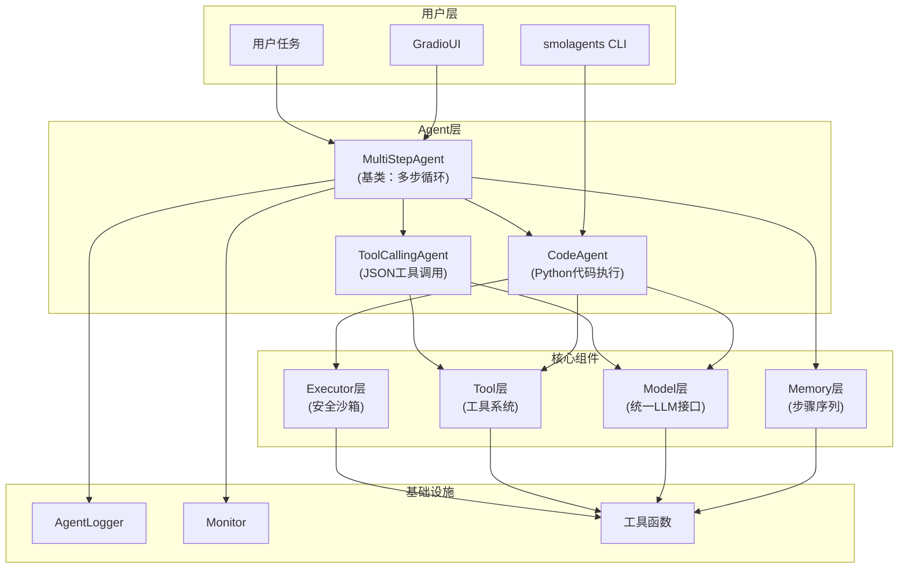

# 简介：编码式多智能体推理

## 概述

GodeAgents（包名 `codified-smolagents`，版本 `1.14.0.dev0`）是一个基于**编码式提示**（Codified Prompting）方法论的多智能体推理框架。它 fork 自 HuggingFace 的 smolagents 项目，核心思想是：不让大语言模型（LLM）输出自由文本来描述"要做什么"，而是让 LLM 直接输出**可执行的 Python 代码**或结构化的 JSON 工具调用，由安全沙箱执行后将结果反馈给模型继续推理。

框架提供两种互补的智能体范式：
- **ToolCallingAgent**：通过 LLM 原生的 function calling 机制，输出 JSON 格式的工具调用
- **CodeAgent**：让 LLM 直接编写 Python 代码块（CodeAct 范式），在 AST 安全沙箱中执行

> 事实溯源：F-001、F-013、F-032、F-039

## 核心理念：Codified Prompting

传统 ReAct 框架让 LLM 输出类似 `Thought: ... Action: search("query")` 的自然语言文本，再用正则表达式解析行动。这种方式存在三个根本性问题：

1. **表达能力受限**：自然语言难以精确表达循环、条件分支、多步计算等复杂逻辑
2. **解析脆弱**：正则表达式无法可靠处理 LLM 输出的各种变体格式
3. **Token 浪费**：用自然语言描述一个 for 循环需要数十句话，而代码只需几行

Codified Prompting 将行动"编码化"——LLM 的输出就是行动本身：
- 对 ToolCallingAgent 而言，行动是结构化 JSON（`{"name": "tool", "arguments": {...}}`）
- 对 CodeAgent 而言，行动是可执行 Python 代码（```py ... ```）

这消除了文本解析层，让行动表达更精确、Token 更高效、可控性更强。

## 双智能体范式

### ToolCallingAgent：JSON 工具调用

ToolCallingAgent 利用 LLM 的 function calling 能力，模型输出包含 `tool_calls` 的结构化响应，框架从中提取工具名和参数后执行。适合结构化操作场景：API 调用、数据库查询、搜索等。

- 默认提示模板：`toolcalling_agent.yaml`
- 模型调用时传入 `tools_to_call_from` 参数（自动生成 OpenAI function calling Schema）
- 停止序列：`["Observation:", "Calling tools:"]`

### CodeAgent：Python 代码执行（CodeAct）

CodeAgent 是框架的"杀手锏"——LLM 直接输出 Python 代码块，通过 `LocalPythonExecutor`（或远程 E2B/Docker 执行器）在安全沙箱中执行。代码可以直接调用注入到命名空间中的工具函数，支持完整的 Python 语法：循环、条件、变量、错误处理、多工具编排。

- 默认提示模板：`code_agent.yaml`
- 额外构造参数：`additional_authorized_imports`、`executor_type`（`"local"`/`"e2b"`/`"docker"`）、`executor_kwargs`、`max_print_outputs_length`
- 停止序列：`["<end_code>", "Observation:", "Calling tools:"]`
- 安全机制：AST 静态分析禁止导入 `os`/`sys`/`subprocess`/`shutil` 等危险模块，禁止调用 `eval()`/`exec()`/`compile()`/`globals()` 等危险函数

> 事实溯源：F-032~F-046、F-105~F-115

## 核心特性

| 特性 | 说明 |
|------|------|
| **多步推理循环** | `MultiStepAgent` 实现 plan-act-observe 循环，支持规划步骤（`planning_interval`） |
| **安全 Python 沙箱** | `LocalPythonExecutor` 通过 AST 遍历 + 受限命名空间执行代码，黑名单隔离危险操作 |
| **多模型后端** | 支持 8 种 Model 后端：`TransformersModel`、`HfApiModel`、`LiteLLMModel`、`OpenAIServerModel`、`AzureOpenAIServerModel`、`AmazonBedrockServerModel`、`VLLMModel`、`MLXModel` |
| **工具装饰器** | `@tool` 装饰器将普通 Python 函数（带类型注解和 Google docstring）自动转为 Tool 实例 |
| **步骤序列记忆** | `AgentMemory` 采用 MemoryStep 时序序列设计，每个 Step 自序列化 for LLM 消息 |
| **HuggingFace Hub 集成** | 支持 `save()`/`from_hub()`/`push_to_hub()` 进行智能体的序列化与分享 |
| **Gradio UI** | 内置 `GradioUI` 类，一行代码启动交互式 Web 演示界面 |
| **CLI 入口** | `smolagents` 命令行工具，支持快速运行 CodeAgent |
| **多智能体协作** | `managed_agents` 参数支持子智能体委派，父 Agent 可像调用工具一样调用子 Agent |
| **多模态支持** | `AgentImage`/`AgentText`/`AgentAudio` 类型系统，支持图像/音频输入输出 |
| **远程执行器** | 支持 `E2BExecutor`（云沙箱）和 `DockerExecutor`（容器执行），完全隔离代码运行 |

> 事实溯源：F-047~F-056、F-063~F-078、F-084~F-096、F-105~F-119、F-143~F-150

## 框架架构图



> 事实溯源：F-015、F-156~F-161

## 适用场景

GodeAgents 特别适合以下场景：

- **复杂推理任务**：需要多步 plan-act-observe 循环的问题解决（调研、对比分析、故障排查）
- **代码生成与执行**：需要 LLM 写代码并运行获取结果（数学计算、数据分析、文件处理）
- **多步工具调用**：搜索→访问网页→提取信息→总结的完整信息获取链路
- **多模态任务**：支持图像输入的视觉问答、图表理解
- **多智能体协作**：多个专业化子 Agent 分工协作完成复杂任务

## 与 smolagents 的关系

GodeAgents fork 自 HuggingFace 的 smolagents 项目，在其基础上增加了 **Codified Prompting** 方法论的系统化实践：明确区分 ToolCallingAgent（JSON 工具调用）和 CodeAgent（Python 代码执行）两种范式，强调"代码即行动"的设计哲学，并对模块结构、文档体系、API 一致性进行了重构和增强。核心运行时机制（多步循环、安全沙箱、模型后端等）与 smolagents 保持兼容。

## API 要点

最核心的导入和使用模式：

```python
from codified_smolagents import (
    # 智能体类
    CodeAgent, ToolCallingAgent, MultiStepAgent,
    # 模型类
    HfApiModel, OpenAIServerModel, LiteLLMModel, TransformersModel,
    # 工具系统
    Tool, tool,
    # 默认工具
    DuckDuckGoSearchTool, VisitWebpageTool, WikipediaSearchTool, FinalAnswerTool,
)
```

所有智能体共享统一的 `run(task, stream=False, reset=False)` 入口方法，`stream=True` 时返回生成器逐步产出 ActionStep，否则阻塞直到返回最终答案。

> 事实溯源：F-002~F-005、F-020

## 代码示例

### 最简 CodeAgent

```python
from codified_smolagents import CodeAgent, HfApiModel

# 创建模型和Agent
model = HfApiModel()
agent = CodeAgent(tools=[], model=model, additional_authorized_imports=['math'])

# 运行任务
result = agent.run("计算 2 的 20 次方是多少？请用Python代码计算。")
print(result)
```

### ToolCallingAgent 带搜索工具

```python
from codified_smolagents import ToolCallingAgent, DuckDuckGoSearchTool, HfApiModel

model = HfApiModel()
agent = ToolCallingAgent(
    tools=[DuckDuckGoSearchTool()],
    model=model,
)
result = agent.run("豹子全速奔跑通过艺术桥需要多少秒？")
print(result)
```

> 事实溯源：F-032~F-038、F-039~F-046

## 常见问题

**Q: CodeAgent 和 ToolCallingAgent 应该选哪个？**
A: 默认推荐 CodeAgent，它的表达能力更强（完整 Python 语法），安全沙箱足够可靠。仅在 LLM 不支持代码生成、或需要严格结构化 function calling 时选择 ToolCallingAgent。

**Q: 代码执行安全吗？**
A: `LocalPythonExecutor` 使用 AST 静态分析禁止导入危险模块（`os`/`subprocess`/`sys`/`shutil` 等）和调用危险函数（`eval`/`exec`/`compile`/`globals` 等），并限制操作次数防止无限循环。对于更高安全需求，可使用 `E2BExecutor` 或 `DockerExecutor` 进行完全隔离的远程执行。

**Q: 默认最大步数是多少？**
A: `max_steps=20`。复杂调研任务建议调大到 30-50 步。步数耗尽时 Agent 会调用 `provide_final_answer()` 做兜底总结，不会直接报错。

**Q: 需要手动添加 FinalAnswerTool 吗？**
A: 不需要。框架在 `_setup_tools()` 中通过 `self.tools.setdefault("final_answer", FinalAnswerTool())` 自动注入。

## 相关链接

- [快速开始](/concepts/01-getting-started.md) — 安装、配置、第一个 Agent
- [架构总览](/concepts/02-architecture-overview.md) — 模块依赖、组件详解、执行流程
- [MultiStepAgent：核心推理循环](/concepts/03-multi-step-agent.md) — run 循环、step 抽象、规划机制
- [记忆系统：步骤序列](/concepts/04-memory-system.md) — MemoryStep 体系、消息序列化
- [Agents API 参考](/references/agents-api.md) — 完整 API 文档
- [Models API 参考](/references/models-api.md) — 模型后端配置
- [Tools API 参考](/references/tools-api.md) — 工具定义与内置工具
