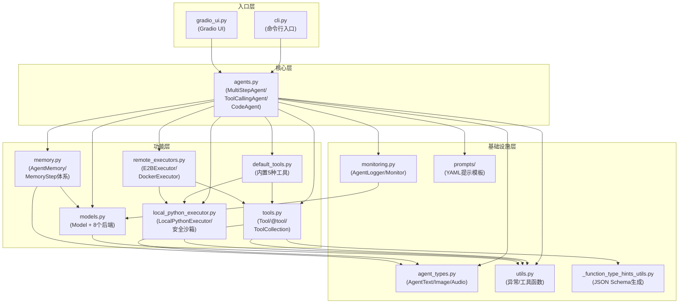

# 架构总览

## 概述

GodeAgents 采用分层架构设计，遵循"关注点分离"原则。整个框架以 `agents.py` 为核心入口，依赖模型层、工具层、记忆层、执行器层和基础设施层，形成清晰的模块依赖关系。本文从宏观视角讲解模块组织、核心组件职责、数据流和导入关系。

> 事实溯源：F-002~F-005、F-156~F-161

## 核心概念

GodeAgents 的架构由六大层次组成，自底向上分别是：基础设施层、执行层、记忆层、工具层、模型层、Agent 层。每一层只依赖其下方的层，不形成循环依赖（`agents.py` 通过 `# noqa: I001` 注释处理了 `cli.py` 的延迟导入）。

### 模块依赖图



**依赖关系总结**：
- `agents.py`（核心层）依赖 9 个内部模块：`agent_types`、`default_tools`、`local_python_executor`、`memory`、`models`、`monitoring`、`remote_executors`、`tools`、`utils`
- `tools.py` 依赖 `_function_type_hints_utils`、`agent_types`、`utils`
- `models.py` 相对独立，主要依赖第三方库
- `memory.py` 依赖 `agent_types` 和 `models`
- `local_python_executor.py` 定义 `PythonExecutor` 基类和 `LocalPythonExecutor`
- `utils.py` 是最底层工具模块，仅依赖标准库

> 事实溯源：F-156~F-161

## API 要点

### 1. Agent 层（agents.py）

Agent 层是框架的核心，实现多步推理循环。

| 类 | 职责 | 关键方法/属性 |
|---|------|-------------|
| `MultiStepAgent` | 多步推理基类（无显式基类，继承 `object`） | `run()`、`_run()`、`step()`（抽象）、`write_memory_to_messages()`、`save()`/`from_hub()`/`push_to_hub()` |
| `ToolCallingAgent(MultiStepAgent)` | JSON 工具调用智能体 | `step()` 解析 `tool_calls[0]`，`execute_tool_call()`，默认模板 `toolcalling_agent.yaml` |
| `CodeAgent(MultiStepAgent)` | Python 代码执行智能体 | `step()` 解析代码块，`python_executor` 执行代码，默认模板 `code_agent.yaml`，额外参数 `additional_authorized_imports`/`executor_type` |

**构造参数**（MultiStepAgent）：`tools`、`model`、`prompt_templates=None`、`max_steps=20`、`add_base_tools=False`、`verbosity_level=LogLevel.INFO`、`grammar=None`、`managed_agents=None`、`step_callbacks=None`、`planning_interval=None`、`name=None`、`description=None`、`provide_run_summary=False`、`final_answer_checks=None`

**实例属性**：`agent_name`、`model`、`prompt_templates`、`max_steps`、`step_number=0`、`grammar`、`planning_interval`、`state={}`、`name`、`description`、`provide_run_summary`、`final_answer_checks`、`managed_agents`(dict)、`tools`(dict, key=tool.name)、`system_prompt`、`memory=AgentMemory(system_prompt)`、`logger=AgentLogger(level=verbosity_level)`、`monitor=Monitor(model, logger)`、`step_callbacks`

> 事实溯源：F-013~F-015、F-032~F-046

### 2. 模型层（models.py）

提供统一的 LLM 调用接口，支持 8 种后端。

| 类/枚举 | 职责 |
|---------|------|
| `MessageRole` | 枚举：`USER`、`ASSISTANT`、`SYSTEM`、`TOOL_CALL`、`TOOL_RESPONSE` |
| `ChatMessage` | 数据类：`role`、`content`、`tool_calls`、`raw` |
| `Model`（基类） | 抽象方法 `__call__(messages, stop_sequences, grammar, tools_to_call_from) -> ChatMessage`；`_prepare_completion_kwargs` 统一处理消息清理和工具 Schema |
| `TransformersModel` | 本地 Transformers 模型，先尝试 `AutoModelForImageTextToText`，回退到 `AutoModelForCausalLM` |
| `HfApiModel` | HuggingFace Inference API，默认 `model_id="Qwen/Qwen2.5-Coder-32B-Instruct"` |
| `LiteLLMModel` | 通过 litellm 接入数百个 LLM 提供商，默认 `model_id="anthropic/claude-3-5-sonnet-20240620"` |
| `OpenAIServerModel` | OpenAI 兼容 API，使用 `openai.OpenAI` 客户端 |
| `AzureOpenAIServerModel` | Azure OpenAI，额外接受 `api_version`、`azure_endpoint` |
| `AmazonBedrockServerModel` | Amazon Bedrock，使用 `boto3` 客户端 |
| `VLLMModel` | vLLM 本地高吞吐量推理 |
| `MLXModel` | MLX 在 Apple Silicon 上推理 |

> 事实溯源：F-061~F-081

### 3. 工具层（tools.py + default_tools.py）

定义 Agent 与外部环境交互的接口。

| 类/装饰器 | 职责 |
|----------|------|
| `Tool`（基类） | 要求子类定义 `name(str)`、`description(str)`、`inputs(dict)`、`output_type(str)`；子类实现 `forward(*args,**kwargs)`；`__call__` 验证参数后调用 forward |
| `@tool` | 装饰器，将普通 Python 函数（带类型注解和 Google docstring）转为 Tool 实例 |
| `ToolCollection` | 工具集合管理类，支持迭代、索引、长度 |
| `PipelineTool` | 包装 Transformers pipeline 的 Tool 子类 |
| `SpaceToolWrapper` | 包装 HuggingFace Space 推理端点 |

**内置默认工具**（default_tools.py）：

| 工具类 | name | 功能 |
|--------|------|------|
| `PythonInterpreterTool` | `python_interpreter` | Python 代码解释器（仅 ToolCallingAgent 使用） |
| `FinalAnswerTool` | `final_answer` | 最终回答（自动注入所有 Agent） |
| `DuckDuckGoSearchTool` | `web_search` | DuckDuckGo 网络搜索 |
| `VisitWebpageTool` | `visit_webpage` | 访问网页并提取 Markdown |
| `WikipediaSearchTool` | `search_wikipedia` | 维基百科搜索 |

`TOOL_MAPPING` 字典：`{"python_interpreter": PythonInterpreterTool, "web_search": DuckDuckGoSearchTool, "visit_webpage": VisitWebpageTool, "search_wikipedia": WikipediaSearchTool, "final_answer": FinalAnswerTool}`

> 事实溯源：F-047~F-060、F-120~F-125

### 4. 记忆层（memory.py）

采用步骤序列设计，记录完整的交互历史。

| 类 | 职责 |
|---|------|
| `MemoryStep`（基类） | 定义 `dict()` 和 `to_messages()` 方法 |
| `SystemPromptStep` | 系统提示词，`system_prompt: str` |
| `TaskStep` | 用户任务，`task: str`、`task_images: list|None` |
| `ActionStep` | 完整一步记录：`model_input_messages`、`model_output_message`、`tool_calls`、`start_time`/`end_time`、`step_number`、`error`、`observations`、`observations_images`、`action_output` |
| `PlanningStep` | 规划输出：`model_input_messages`、`plan`、`model_output_message` |
| `FinalAnswerStep` | 最终答案：`final_answer: Any` |
| `AgentMemory` | 记忆容器：`system_prompt: SystemPromptStep`、`steps: List[...]`；方法：`reset()`、`get_succinct_steps()`、`get_full_steps()`、`replay()` |
| `ToolCall` | 数据类：`name: str`、`arguments: Any`、`id: str` |

> 事实溯源：F-082~F-096

### 5. 执行层（local_python_executor.py + remote_executors.py）

为 CodeAgent 提供安全代码执行环境。

| 类/常量 | 职责 |
|---------|------|
| `PythonExecutor`（抽象基类） | 定义 `__call__(code) -> (output, execution_logs, is_final_answer)` 接口；抽象方法 `run_code_raise_errors` |
| `LocalPythonExecutor` | AST 静态分析 + 受限命名空间本地执行；禁止 `DANGEROUS_MODULES`（os/subprocess/sys/shutil等）和 `DANGEROUS_FUNCTIONS`（eval/exec/compile/globals等） |
| `RemotePythonExecutor` | 远程执行抽象类，变量用 pickle+base64 序列化 |
| `E2BExecutor` | E2B 云沙箱执行 |
| `DockerExecutor` | Docker 容器执行（Jupyter Kernel Gateway + WebSocket） |
| `FinalAnswerException` | 通过异常实现 `final_answer()` 提前返回 |

`BASE_PYTHON_TOOLS` 字典注入安全内置函数（print、isinstance、range、类型转换、数学函数、len/sum/max/min等）。

> 事实溯源：F-105~F-119、F-148~F-150

### 6. 基础设施层

| 模块 | 核心类/函数 | 职责 |
|------|-----------|------|
| `monitoring.py` | `LogLevel`（OFF=0/ERROR=1/INFO=2/DEBUG=3）、`AgentLogger`（log/log_rule/log_task/log_markdown/log_code/log_error/visualize_agent_tree）、`Monitor`（update_metrics，__del__输出总token） | 日志与监控 |
| `agent_types.py` | `AgentType`（基类）、`AgentText`、`AgentImage`（支持PIL/字节/路径/张量）、`AgentAudio`、`handle_agent_input_types()`、`handle_agent_output_types()` | 多模态类型系统 |
| `utils.py` | 异常层次（`AgentError`→`AgentParsingError`/`AgentGenerationError`/`AgentExecutionError`/`AgentMaxStepsError`/`AgentToolCallError`/`AgentToolExecutionError`）、`parse_code_blobs()`、`truncate_content()`、`make_json_serializable()`、`is_valid_name()`、`parse_json_blob()` | 工具函数与异常 |

> 事实溯源：F-126~F-138

## 代码示例

### 查看模块结构

```python
import codified_smolagents

# 查看版本
print(codified_smolagents.__version__)  # "1.14.0.dev0"

# 查看所有公开导出的类
from codified_smolagents import (
    MultiStepAgent, ToolCallingAgent, CodeAgent,
    Model, TransformersModel, HfApiModel, LiteLLMModel,
    OpenAIServerModel, AzureOpenAIServerModel, AmazonBedrockServerModel,
    VLLMModel, MLXModel,
    Tool, tool, ToolCollection,
    AgentMemory,
    DuckDuckGoSearchTool, VisitWebpageTool, WikipediaSearchTool,
    FinalAnswerTool, PythonInterpreterTool,
    GradioUI,
)
```

### 数据流追踪示例

```python
from codified_smolagents import CodeAgent, HfApiModel

model = HfApiModel()
agent = CodeAgent(tools=[], model=model, additional_authorized_imports=['math'])

result = agent.run("2**10等于多少？")

# 执行完成后检查记忆步骤
print(f"总步数: {len(agent.memory.steps)}")
for i, step in enumerate(agent.memory.steps):
    step_type = type(step).__name__
    print(f"  Step {i}: {step_type}")

# 重放执行过程
agent.memory.replay(agent.logger, detailed=False)
```

## 常见问题/注意事项

### 模块导入顺序

`__init__.py` 按以下顺序导入模块，注意 `agents` 在 `cli` 之前导入以避免循环依赖：
`agent_types` → `agents`（# noqa: I001）→ `default_tools` → `gradio_ui` → `local_python_executor` → `memory` → `models` → `monitoring` → `remote_executors` → `tools` → `utils` → `cli`

### 外部依赖

核心外部依赖包括：`torch`、`transformers`、`jinja2`、`huggingface_hub`、`gradio`、`Pillow`、`requests`、`duckduckgo_search`。可选依赖包括：`litellm`、`openai`、`e2b-code-interpreter`、`docker`、`vllm`、`mlx-lm` 等。

### python_interpreter 工具的特殊性

`python_interpreter` 工具（PythonInterpreterTool）仅在 `ToolCallingAgent` 中使用。`CodeAgent` 内置了 Python 执行器（`LocalPythonExecutor`），不需要此工具。`_setup_tools()` 方法在 `add_base_tools=True` 时会排除 `python_interpreter`（仅 ToolCallingAgent 保留）。

### 提示模板加载

`ToolCallingAgent` 默认从 `smolagents.prompts.toolcalling_agent.yaml` 加载模板，`CodeAgent` 默认从 `smolagents.prompts.code_agent.yaml` 加载模板。两者的 YAML 结构相同（包含 `system_prompt`、`planning`、`managed_agent`、`final_answer` 四个顶层键），但 system_prompt 内容不同——前者指示 LLM 使用 JSON tool_calls，后者指示 LLM 输出 Python 代码块。

## 相关链接

- [简介：编码式多智能体推理](/concepts/00-introduction.md) — 框架概述与设计哲学
- [快速开始](/concepts/01-getting-started.md) — 安装与第一个 Agent
- [MultiStepAgent：核心推理循环](/concepts/03-multi-step-agent.md) — run 循环深度解析
- [记忆系统：步骤序列](/concepts/04-memory-system.md) — MemoryStep 体系详解
- [Agents API 参考](/references/agents-api.md) — 完整 Agent API
- [Models API 参考](/references/models-api.md) — 模型后端 API
- [Tools API 参考](/references/tools-api.md) — 工具系统 API
- [Memory API 参考](/references/memory-api.md) — 记忆系统 API
- [Executor API 参考](/references/executor-api.md) — 执行器 API
