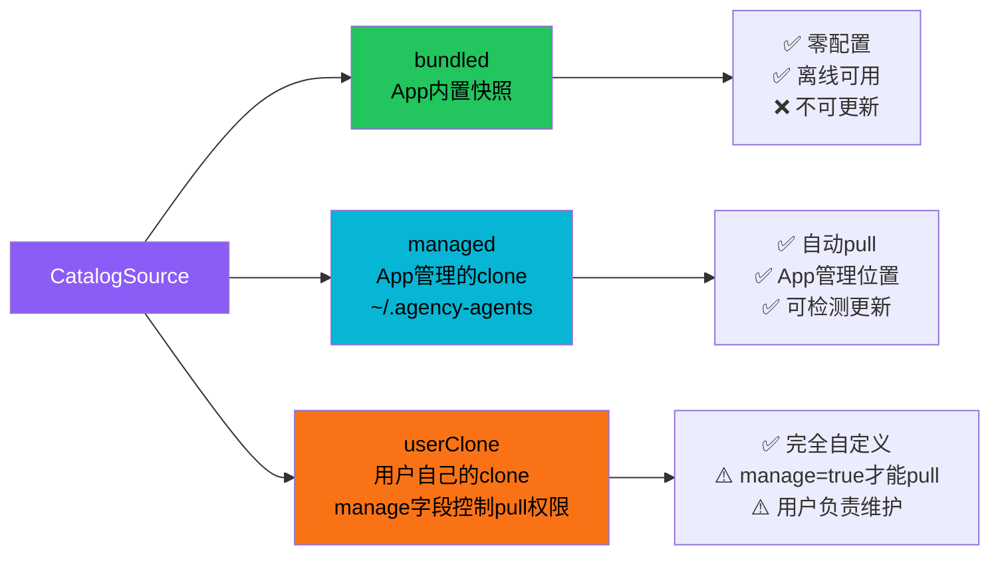
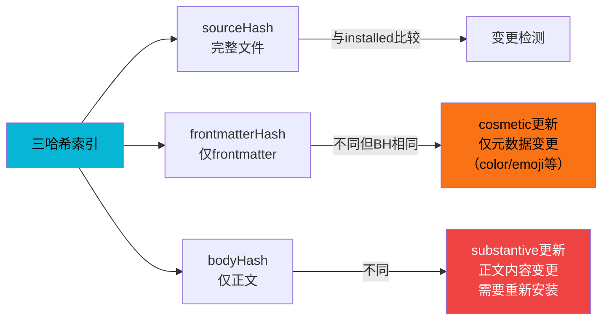
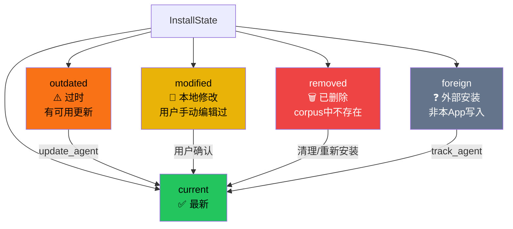

# Catalog 安装与 Store 状态管理

agency-agents-app 的数据层围绕 Catalog 源管理、Corpus 索引、安装协调三大核心 Store 构建。Catalog 支持三源切换（内置快照/管理clone/用户clone），Corpus 使用三哈希索引区分 cosmetic/substantive 更新，Install Store 通过五状态模型追踪每个 Agent 的安装状态，reconcile 机制实现模块级去重扫描。

## 设计原理

1. **三源灵活切换**：用户可选择内置快照（零配置）、App 管理 clone（自动更新）、或自己的 clone（自定义），满足不同使用场景
2. **三哈希精确追踪**：sourceHash/frontmatterHash/bodyHash 三哈希区分"仅元数据变更"和"正文变更"，避免不必要的更新提示
3. **五状态健康模型**：current/outdated/modified/removed/foreign 精确描述每个 Agent 在每个工具中的安装状态，支持外部修改检测
4. **模块级去重**：reconcile 使用 Promise 去重，并发调用共享一次扫描结果，避免重复 IO
5. **懒加载正文**：列表视图仅加载元数据，Agent 正文按需获取并缓存，降低内存占用

## Store 架构总览

```mermaid
graph TB
    STORES["Svelte 5 Runes Stores"] --> CAT["CatalogStore<br/>catalog.svelte.ts"]
    STORES --> COR["CorpusStore<br/>corpus.svelte.ts"]
    STORES --> INS["InstallStore<br/>install.svelte.ts"]
    STORES --> PRJ["ProjectsStore<br/>projects.svelte.ts"]
    STORES --> SET["SettingsStore<br/>settings.svelte.ts"]

    CAT -->|切换源触发reload| COR
    INS -->|install/uninstall后| INS_REC["reconcile()"]
    INS -->|loadTools()| TOOLS["ToolRegistry<br/>15工具定义"]
    COR -->|corpus_list/get| BE["Rust后端"]
    INS -->|install_agent/reconcile| BE
    CAT -->|catalog_*/corpus_refresh| BE

    style STORES fill:#ff3e00,color:#fff
    style CAT fill:#06b6d4,color:#000
    style COR fill:#22c55e,color:#000
    style INS fill:#8b5cf6,color:#fff
    style PRJ fill:#ec4899,color:#fff
    style SET fill:#f97316,color:#000
    style BE fill:#1e293b,color:#fff
```

## Catalog 三源模型

Agent Catalog 有三种来源，使用 `#[serde(tag = "kind")]` 判别联合表示：



### TypeScript 类型定义

```typescript
// src/lib/types.ts
type CatalogSource =
  | { kind: 'bundled' }
  | { kind: 'managed'; path: string }
  | { kind: 'userClone'; path: string; manage: boolean };
```

### CatalogStore 方法

```typescript
class CatalogStore {
  configured = $state<boolean>(false);
  source = $state<CatalogSource | null>(null);
  status = $state<CatalogStatus>('idle');

  // 核心方法
  async load(): Promise<void>;                    // 加载持久化的源配置
  async loadStatus(): Promise<GitStatus>;          // 检查本地git状态
  async checkUpdates(): Promise<UpdateCheckResult>; // git fetch + diff
  async detect(scan?: boolean): Promise<string | null>; // 扫描磁盘找已有clone
  async setSource(source: CatalogSource): Promise<void>; // 切换源
  async useBundled(): Promise<void>;               // 切换到内置快照
  async useClone(path: string, manage: boolean): Promise<void>; // 切换到用户clone
  async provisionManaged(): Promise<void>;         // 创建~/.agency-agents
  async pull(): Promise<void>;                     // git pull更新
}
```

切换源后自动调用 `corpus.reload()` 重新加载 Agent 索引。

## Corpus 三哈希索引

Corpus（Agent 全集）为每个 Agent 维护三个 SHA-256 哈希，用于精确检测变更类型：

```typescript
// src/lib/types.ts — CorpusEntry 三哈希
type CorpusEntry = {
  slug: string;
  name: string;
  description: string;
  category: string;       // 父目录名（division）
  emoji?: string;
  color?: string;
  vibe?: string;
  // 三哈希索引
  sourceHash: string;      // 完整 .md 文件哈希
  frontmatterHash: string;  // YAML frontmatter 哈希
  bodyHash: string;         // Markdown 正文哈希
};
```



### UpdateKind 分类

```typescript
// src/lib/types.ts
type UpdateKind = 'cosmetic' | 'substantive';
```

- **cosmetic**：仅 frontmatterHash 不同（如更新了 emoji、color、description 措辞），用户可选择是否更新
- **substantive**：bodyHash 不同（正文内容变更），明确提示用户更新

### CorpusStore 懒加载

```typescript
class CorpusStore {
  private listPromise: Promise<CorpusEntry[]> | null = null;
  private bodyCache = new Map<string, Agent>(); // slug → Agent（含body）

  // 首次调用时并行请求，后续返回缓存Promise
  async ensureLoaded(): Promise<void>;

  // 按需获取单个Agent的markdown body
  async get(slug: string): Promise<Agent>;

  // 清空缓存重新加载
  async reload(): Promise<void>;

  // 按分类和自由文本搜索（匹配name/description/vibe）
  filtered(categorySlug?: string, query?: string): CorpusEntry[];
}
```

列表视图（Agents 页面）只显示 CorpusEntry（不含 body），用户点击 Agent 时才通过 `corpus_get` 后端命令获取完整 Markdown 正文，并缓存在 `bodyCache` 中。

## 安装协调五状态模型

每个 Agent 在每个工具中的安装状态由 `InstallState` 枚举描述：



| 状态 | 含义 | 可执行操作 |
|------|------|-----------|
| `current` | 安装的版本与 corpus 中一致 | uninstall / track |
| `outdated` | 有更新可用（cosmetic 或 substantive） | update / uninstall |
| `modified` | 本地文件被外部修改（哈希不匹配） | diff / update（覆盖）/ uninstall |
| `removed` | 该 Agent 已从 corpus 中删除但文件仍存在 | 清理 / 忽略 |
| `foreign` | 文件存在但非本 App 安装（无 ledger 记录） | track（纳入管理）/ uninstall |

### InstallStore 核心机制

```typescript
class InstallStore {
  private reconcileInflight: Promise<void> | null = null; // 模块级去重

  // 安装/更新/卸载/追踪
  async installAgent(slug: string, toolId: string, projectPath?: string): Promise<InstallResult>;
  async updateAgent(slug: string, toolId: string, projectPath?: string): Promise<InstallResult>;
  async uninstallAgent(slug: string, toolId: string, projectPath?: string): Promise<void>;
  async trackAgent(slug: string, toolId: string, projectPath?: string): Promise<void>;

  // 协调扫描（模块级去重）
  async reconcile(): Promise<void>;

  // 批量操作
  async bulk(action: 'install'|'update'|'track'|'uninstall', targets: InstallTarget[]): Promise<{ok: number; fail: number}>;

  // 查询
  installsForAgent(slug: string): InstallRecord[];
  agentDiff(slug: string, toolId: string, projectPath?: string): DiffResult;
}
```

### reconcile 去重机制

reconcile 是 InstallStore 最关键的协调方法，负责扫描所有工具目录、对比哈希、更新安装状态：

```typescript
// 模块级Promise去重
async reconcile(): Promise<void> {
  // 如果已有reconcile在进行中，直接返回同一个Promise
  if (this.reconcileInflight) {
    return this.reconcileInflight;
  }

  this.reconcileInflight = this._doReconcile();
  try {
    await this.reconcileInflight;
  } finally {
    this.reconcileInflight = null;
  }
}
```

**触发时机**：
- 应用初始化时
- 每次 install/uninstall/update/track/bulk 操作后
- 切换 catalog 源后
- 手动刷新时

reconcile 从 localStorage 读取所有注册项目路径（key `agency-agents:projects:v1`），传给后端扫描 project-scoped 和 user-scoped 目录。

### 选中工具持久化

"Install into…" 菜单中的工具选择持久化在 localStorage（key `agency-agents:install-selection`），默认选中 Claude Code。用户选择的工具在下次打开安装菜单时保持选中状态。

### 批量操作

`bulk()` 方法支持批量 install/update/track/uninstall 四种动作，单次 reconcile 收尾：

```typescript
async bulk(
  action: 'install' | 'update' | 'track' | 'uninstall',
  targets: Array<{ slug: string; toolId: string; projectPath?: string }>
): Promise<{ ok: number; fail: number }> {
  let ok = 0, fail = 0;
  for (const target of targets) {
    try {
      await this.performAction(action, target);
      ok++;
    } catch {
      fail++;
    }
  }
  await this.reconcile(); // 单次收尾
  return { ok, fail };
}
```

## Tool Registry（工具注册表）

工具定义的唯一数据源是 `src-tauri/data/tools.json`（Rust 端），前端通过直接 import JSON 导入：

```typescript
// src/lib/data/toolRegistry.ts
import toolsData from "../../../src-tauri/data/tools.json";
```

### 15 个工具定义

| 工具 ID | 标签 | installKind | scope | 可安装* |
|---------|------|-------------|-------|--------|
| claudeCode | Claude Code | per-agent | user | ✅ identity |
| codex | Codex | per-agent | user | ✅ codex-toml |
| geminiCli | Gemini CLI | per-agent | user | ✅ gemini-md |
| githubCopilot | GitHub Copilot | per-agent | user/project | ✅ identity |
| qwenCode | Qwen Code | per-agent | user | ✅ qwen-md |
| cursor | Cursor | per-agent | project | ✅ cursor-mdc |
| opencode | OpenCode | per-agent | user | ✅ opencode-md |
| osaurus | Osaurus | per-agent | user | ❌ 未实现 |
| aider | Aider | roster | project | ❌ aider-conventions |
| antigravity | Antigravity | per-agent | user | ❌ 未实现 |
| kimi | Kimi | per-agent | user | ❌ kimi-agent |
| openclaw | OpenClaw | per-agent | user | ❌ openclaw-workspace |
| windsurf | Windsurf | roster | project | ❌ windsurf-rules |
| hermes | Hermes | plugin | user | ❌ plugin类型 |
| zcode | ZCode | per-agent | user | ✅ zcode-md |

> *可安装条件：`installKind !== "plugin"` 且 `format ∈ IMPLEMENTED_FORMATS`

### 已实现的渲染格式

```typescript
// src/lib/data/toolRegistry.ts
const IMPLEMENTED_FORMATS = new Set([
  'identity',      // 原生Markdown（Claude Code/Copilot）
  'codex-toml',    // Codex TOML格式
  'gemini-md',     // Gemini CLI Markdown
  'qwen-md',       // 通义千问Markdown
  'zcode-md',      // ZCode Markdown
  'cursor-mdc',    // Cursor .mdc规则文件
  'opencode-md',   // OpenCode Markdown
  'skill-md',      // SKILL.md标准格式
]);
```

Hermes（plugin 类型）、Aider/Windsurf（roster 类型，格式未实现）、Kimi/OpenClaw/Antigravity/Osaurus（格式未实现）当前在 UI 中标记为不可安装。

## Preset Teams（预设团队）

内置 5 个策展团队，每个团队是预定义的 Agent 组合，配合 Lucide 图标和品牌色：

```typescript
// src/lib/data/presetTeams.ts
interface PresetTeam {
  slug: string;
  name: string;
  icon: string;        // Lucide图标名
  color: string;       // 品牌色
  agents: string[];    // Agent slug列表
}
```

| 团队 Slug | 名称 | Agent 数 | 用途 |
|-----------|------|---------|------|
| `mobile-launch` | Mobile Launch | 5 | 移动应用发布（mobile-app-builder, rapid-prototyper, ui-designer, ux-researcher, app-store-optimizer） |
| `ship-web-app` | Ship It (Web) | 5 | Web 应用交付（frontend-developer, backend-architect, devops-automator, sre, api-tester） |
| `growth-squad` | Growth Squad | 5 | 增长团队（growth-hacker, content-creator, seo-specialist, tiktok-strategist, instagram-curator） |
| `product-discovery` | Product Discovery | 4 | 产品发现（sprint-prioritizer, trend-researcher, feedback-synthesizer, ux-researcher） |
| `ai-builders` | AI Builders | 4 | AI 开发（ai-engineer, prompt-engineer, data-engineer, backend-architect） |

DeployBrowser 组件中可选择预设团队进行批量安装。

## Projects Store

```typescript
class ProjectsStore {
  // 项目列表 = localStorage注册 ∪ install ledger中的projectPath（并集）
  registered = $derived(/* 并集计算 */);

  async register(path: string): Promise<void>;
  async unregister(path: string): Promise<void>;
  async addViaPicker(): Promise<void>; // 原生文件夹选择器

  // forgetProject 只删除ledger记录，不删除磁盘上的agent文件
  async forgetProject(path: string): Promise<void>;
}
```

## Settings Store 三态加载

```typescript
class SettingsStore {
  state = $state<'loading' | 'loaded' | 'corrupt'>('loading');
  data = $state<Settings | null>(null);
  corruptOnDisk = $state(false);

  // 乐观更新：先更新UI，失败回滚
  async save(partial: Partial<Settings>): Promise<void>;

  // 后端返回clamped值后同步到store
  // effective getter在data===null时返回SETTINGS_DEFAULTS
  readonly effective = $derived(this.data ?? SETTINGS_DEFAULTS);
}
```

设置文件存于 `~/Library/Application Support/com.zerologic.agency-agents-app/settings.json`（macOS）。当 `corruptOnDisk` 为 true 时 UI 显示"Reset to defaults"按钮。

## Loadout 导入导出

支持安装集的导入导出，实现团队/项目间的 Agent 配置共享：

```typescript
// 导出当前安装集到Agentfile
async loadoutExport(path: string): Promise<void>;

// 从Agentfile恢复安装
async loadoutImport(path: string): Promise<InstallRecord[]>;
```

Agentfile 是一个声明式配置文件，记录了要安装的 Agent slug、目标工具和项目路径，可版本控制共享。

## localStorage 键名约定

| Key | 用途 |
|-----|------|
| `agency-agents:projects:v1` | 注册项目路径列表 |
| `agency-agents:install-selection` | "Install into…"选中的工具 |
| UI 偏好（主题/侧边栏等） | UI Store 自行管理 |

## 相关概念

- [Tauri 后端命令系统](tauri-backend-commands.md) — Store 调用的后端命令实现
- [Svelte 5 Runes 架构](svelte5-runes-architecture.md) — Store 的 Runes 响应式基础
