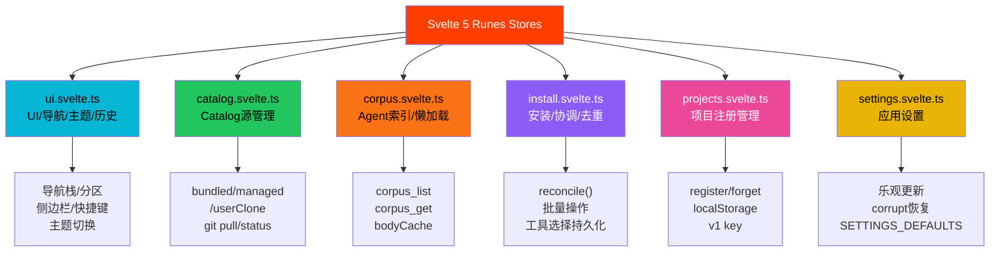
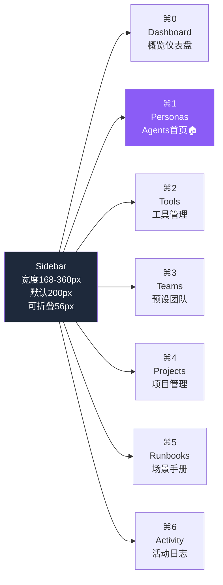
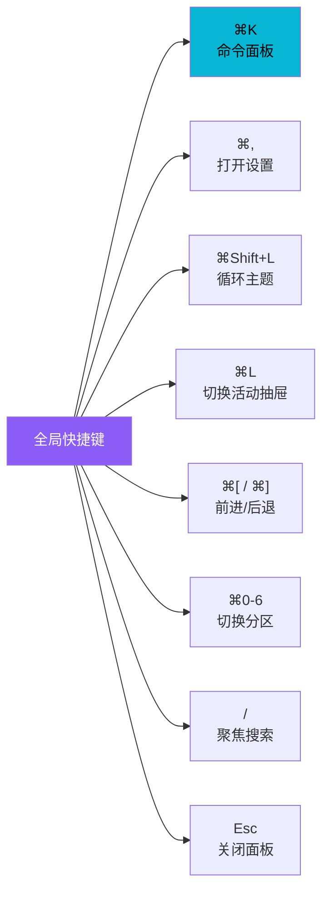
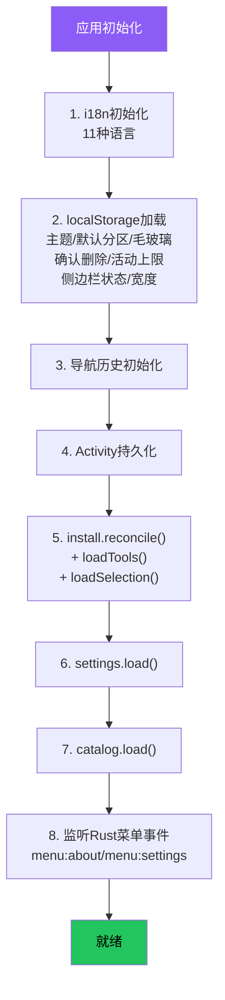
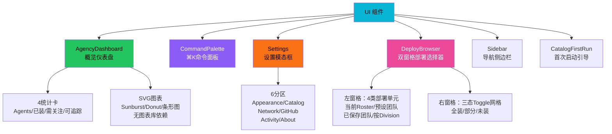

# Svelte 5 Runes 架构

agency-agents-app 前端采用 Svelte 5（Runes 模式）+ SvelteKit 2 + TypeScript + Vite 6 技术栈，以纯 SPA 模式运行（SSR 关闭）。所有状态管理通过 Svelte 5 Runes（`$state`/`$derived`/`$effect`）在 class 中实现，导出单例 Store，完全摒弃传统 Svelte store（`writable`/`readable`）。

## 设计原理

1. **Runes 原生响应式**：使用 Svelte 5 的 `$state`/`$derived`/`$effect` 替代第三方状态管理库，编译器级响应式追踪粒度更细
2. **Class-based Store**：每个 Store 是一个 class 实例（单例），封装状态和方法，通过导出实例实现全局共享
3. **SPA 模式**：Tauri 无 Node.js 服务端，SvelteKit 配置 `ssr = false` + adapter-static，纯客户端渲染
4. **导航状态模型**：UI Store 维护 navStack 导航历史栈，支持浏览器级 back/forward 和鼠标侧键
5. **Agents 为首页**：初始分区为 personas（Agents 首页），Agent catalog 是应用的 front door

## 技术栈配置

```typescript
// src/routes/+layout.ts
export const ssr = false;           // 关闭SSR
export const prerender = true;      // 预渲染为静态HTML
// 使用 adapter-static 输出纯SPA
```

前端核心依赖：
- **Svelte 5**：Runes 响应式模式（`$state`/`$derived`/`$derived.by`/`$effect`）
- **SvelteKit 2**：路由、布局、客户端导航
- **TypeScript**：全栈类型安全
- **Vite 6**：构建工具和开发服务器
- **@lucide/svelte**：Lucide 图标组件
- **Tauri API**：通过 `@tauri-apps/api` 调用后端命令

## Runes 状态管理模式

### Store 单例模式

所有 Store 采用 class-based 单例模式，使用 `$state` 声明响应式状态：

```typescript
// src/lib/stores/catalog.svelte.ts（简化示例）
class CatalogStore {
  // 响应式状态（$state）
  configured = $state<boolean>(false);
  source = $state<CatalogSource | null>(null);
  status = $state<CatalogStatus>('idle');

  // 派生状态（$derived）
  readonly isManaged = $derived(this.source?.kind === 'managed');
  readonly canPull = $derived(
    this.source?.kind === 'managed' ||
    (this.source?.kind === 'userClone' && this.source.manage)
  );

  // 方法
  async load() { /* ... */ }
  async setSource(source: CatalogSource) { /* ... */ }
  async pull() { /* ... */ }
}

// 导出单例
export const catalog = new CatalogStore();
```

### 核心 Store 清单



### Runes 对比传统 Store

| 特性 | Svelte 5 Runes | 传统 Svelte Store |
|------|---------------|-------------------|
| 声明方式 | `$state(0)` | `writable(0)` |
| 派生值 | `$derived(...)` | `derived(...)` |
| 副作用 | `$effect(...)` | 手动 subscribe |
| 编译优化 | 细粒度追踪，仅更新变化绑定 | 组件级重渲染 |
| 类型推断 | 原生 TypeScript 推断 | 需要泛型参数 |
| 模块化 | class 封装，方法和状态同处 | 分离的 store + 外部函数 |

## 七导航分区侧边栏

侧边栏提供 7 个导航分区，每个分区绑定全局快捷键：



| 快捷键 | 分区 | 说明 |
|--------|------|------|
| ⌘0 | Dashboard | 安装统计、健康环、覆盖图表 |
| ⌘1 | **Personas** | **首页（默认分区）**，Agent 浏览/搜索/安装 |
| ⌘2 | Tools | 已检测工具列表和版本 |
| ⌘3 | Teams | 5个预设策展团队 + 自定义团队 |
| ⌘4 | Projects | 已注册项目列表和安装状态 |
| ⌘5 | Runbooks | NEXUS 场景手册 |
| ⌘6 | Activity | 安装/更新活动日志 |

### 首页设计决定

应用启动时默认进入 `personas` 分区（非 Dashboard），侧边栏 brand 点击也回到 personas。这是明确的设计决定——**Agent catalog 是应用的 front door**，用户首先需要的是浏览和搜索 Agent，而非查看统计仪表盘。

### 侧边栏交互

- **折叠模式**：点击折叠按钮切换到 56px 图标模式
- **宽度拖拽**：可拖拽调整宽度（168-360px，默认 200px）
- **状态持久化**：折叠状态和宽度保存到 localStorage

## 导航历史栈

`ui` store 维护完整的导航历史，支持浏览器级前进/后退：

```typescript
// ui.svelte.ts
class UIStore {
  navStack = $state<NavLocation[]>([]);
  navIndex = $state<number>(-1);
  private readonly MAX_HISTORY = 100;

  // NavLocation 记录完整视图状态
  navigate(loc: NavLocation) {
    // 如果不在历史栈末尾，截断栈（push 新页面后 forward 历史失效）
    // 添加新位置到栈顶
    // navIndex 指向新位置
  }

  back() { /* ⌘[ / 鼠标侧键3 */ }
  forward() { /* ⌘] / 鼠标侧键4 */ }
}
```

每个 `NavLocation` 记录完整视图上下文：

```typescript
type NavLocation = {
  section: NavigationSection;        // 当前分区
  agentsCategory?: string;           // Agents 分类
  agentsLens?: AgentsLens;           // Agents 过滤器
  agentsSelected?: string;           // 选中的 Agent slug
  projectsSelected?: string;         // 选中的项目
  teamsSelected?: string;            // 选中的团队
};
```

历史上限 100 条，支持标准浏览器导航行为：
- 在历史中间位置导航新页面时，截断 forward 历史
- 鼠标侧键 3/4（back/forward）触发历史导航
- ⌘[ 和 ⌘] 键盘快捷键

## 三态主题系统

```typescript
// types.ts
type ThemePreference = "light" | "dark" | "system";
```

主题切换通过设置 `document.documentElement.dataset.theme` 实现 CSS 变量切换：

```typescript
// ui.svelte.ts 主题逻辑
function applyTheme(theme: ThemePreference) {
  const resolved = theme === 'system'
    ? window.matchMedia('(prefers-color-scheme: dark)').matches ? 'dark' : 'light'
    : theme;

  document.documentElement.dataset.theme = resolved;
}

// system 模式监听 prefers-color-scheme
$effect(() => {
  if (theme === 'system') {
    const mq = window.matchMedia('(prefers-color-scheme: dark)');
    const handler = () => applyTheme('system');
    mq.addEventListener('change', handler);
    return () => mq.removeEventListener('change', handler);
  }
});
```

**⌘Shift+L** 循环切换主题：light → dark → system → light。

## 全局快捷键

主页面 `+page.svelte` 中注册全局键盘快捷键：



| 快捷键 | 功能 |
|--------|------|
| ⌘K | 打开命令面板（Command Palette） |
| ⌘, | 打开设置模态框 |
| ⌘Shift+L | 循环切换主题（light/dark/system） |
| ⌘L | 切换右侧详情抽屉 |
| ⌘[ / ⌘] | 后退/前进导航 |
| ⌘0-6 | 快速切换到对应分区 |
| `/` | 聚焦搜索框 |
| Esc | 关闭模态面板/设置 |

## 命令面板（Command Palette）

⌘K 打开模态命令面板，当前包含 9 个命令：

```typescript
// CommandPalette 命令结构
type PaletteItem = {
  kind: "command";
  id: string;
  label: string;
  shortcut?: string;
  section?: string;
  run: () => void;
};
```

| 命令类型 | 数量 | 示例 |
|---------|------|------|
| 导航命令 | 7 | Go to Dashboard/Personas/Tools/Teams/Projects/Runbooks/Activity |
| 操作命令 | 1 | Toggle Drawer（⌘L） |
| Playbook | 1 | Open Playbook |

面板支持模糊搜索、上下键导航、Enter 执行、Esc 关闭。

## 初始化流程

`+layout.svelte` 的 `onMount` 中按顺序执行初始化：



> 注意：GitHub 登录状态不在初始化时预加载，避免触发 Keychain 授权弹窗（macOS 上访问 Keychain 会弹出权限对话框）。

### First-run 体验

当 `catalog.configured === false` 时（首次启动未选择 catalog 源），`CatalogFirstRun` 组件覆盖在应用上方，引导用户选择：
- **Bundled**：使用 app 内置快照（快速开始）
- **Clone**：使用 git clone 管理的独立目录（可更新）

## 自定义标题栏

应用使用 36px 高自定义标题栏（`data-tauri-drag-region`）：

```
┌────────────────────────────────────────────────────────────┐
│ [◀] [▶] [☰]  Page Title              [↻] [—] [□] [✕]    │  36px
├────────────────────────────────────────────────────────────┤
│                                                            │
│  Sidebar  │  Main Content                                  │
│  (200px)  │                                                │
│           │                                                │
```

- macOS 交通灯（关闭/最小化/最大化）覆盖在左上角
- 包含侧边栏折叠按钮、前进/后退按钮、页面标题、UpdateIndicator、TitlebarControls
- 标题栏起始 inset 为 36px（非 0），避免遮挡 macOS 拖拽区域

## 核心 UI 组件



### Dashboard 图表

Dashboard 所有图表使用**纯 SVG+CSS** 实现，无图表库依赖：
- **InstallSunburst**：全局 vs 项目双层环图
- **HealthDonut**：五状态健康环（current/outdated/modified/removed/foreign）
- **Coverage-by-tool**：工具覆盖条形图
- **Cross-tool coverage**：CoverageDonuts + CatalogByDivision 联动

### Settings 模态框

macOS 系统设置风格的左导航+右面板布局，6 个分区，z-index 90/91（高于命令面板的 80/81）：

| 分区 | 内容 |
|------|------|
| Appearance | 主题/毛玻璃/默认分区/确认删除/侧边栏设置 |
| Catalog | Catalog 源管理（bundled/managed/userClone） |
| Network | 离线模式/更新/缓存 TTL |
| GitHub | 登录/Star/Watch 状态 |
| Activity | 活动日志保留上限 |
| About | 版本/捐赠/鸣谢 |

## 相关概念

- [Tauri 后端命令系统](tauri-backend-commands.md) — 前端 invoke 调用的后端命令定义
- [Catalog 安装与 Store 状态管理](catalog-install-store.md) — Store 层的详细状态管理逻辑
