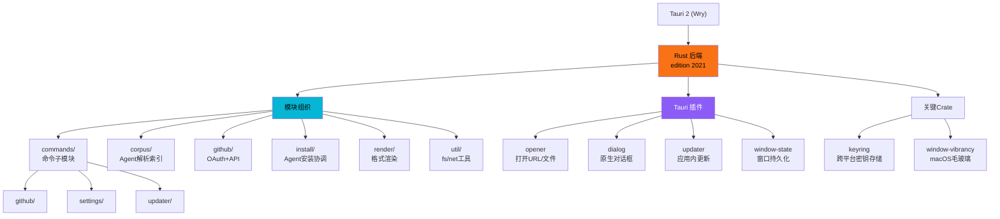
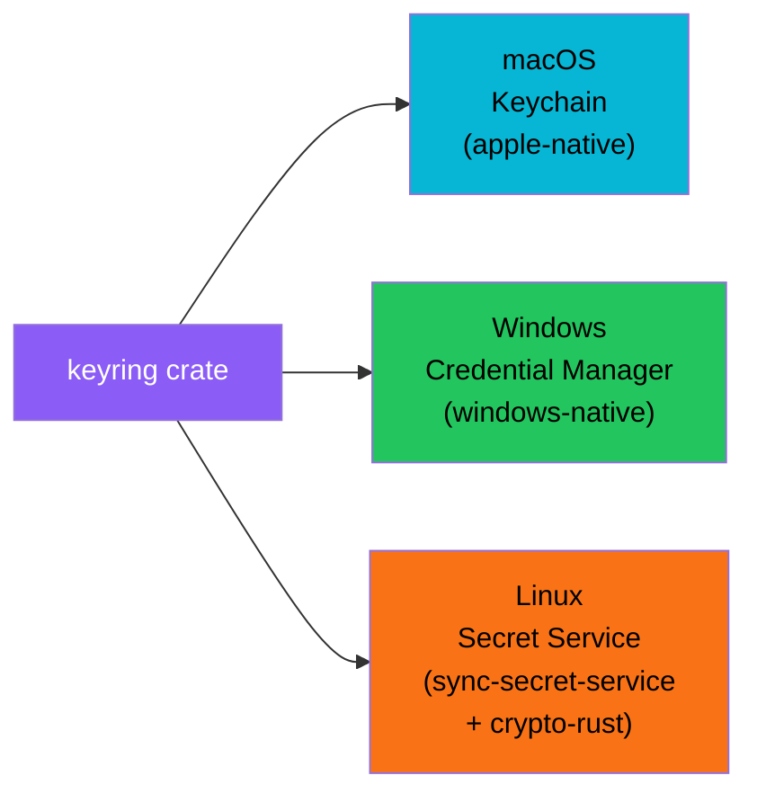
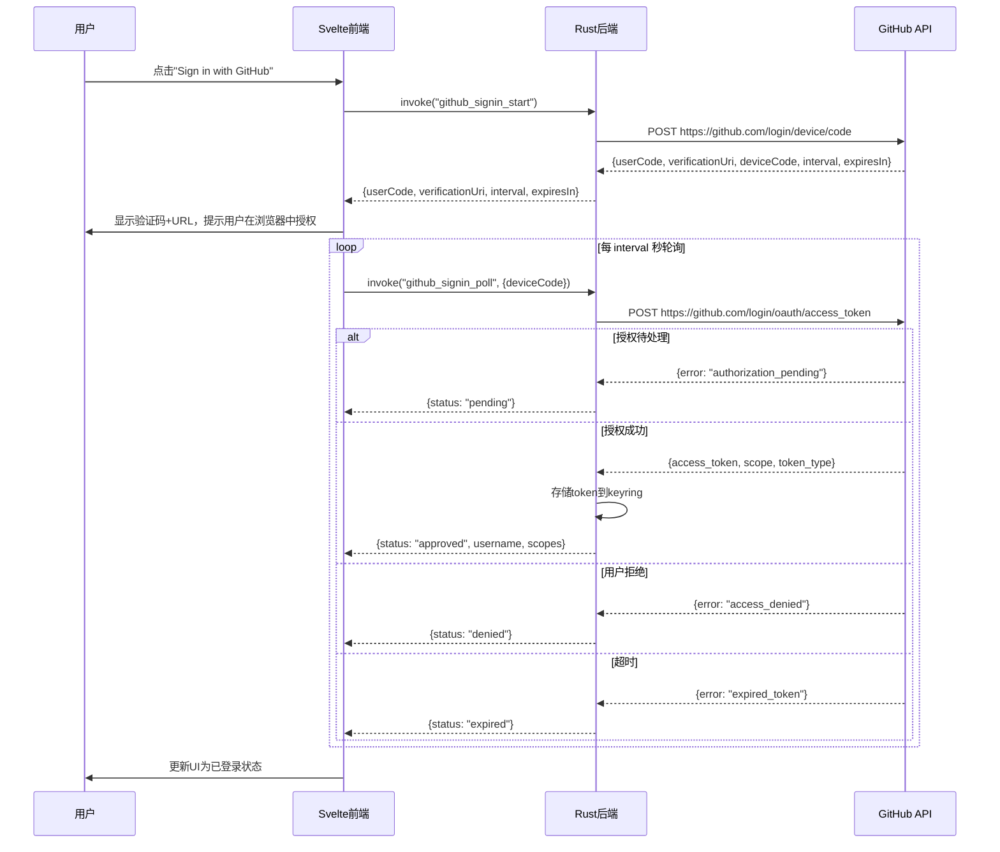

# Tauri 后端命令系统

agency-agents-app 是一个基于 Tauri 2 的原生桌面应用，Rust 后端提供约 35 个 IPC 命令供 Svelte 前端调用。后端采用模块化组织，通过 `invoke_handler` 注册所有命令，配合 Tauri 插件系统实现原生功能（对话框、更新器、窗口状态持久化）和跨平台安全存储。

## 设计原理

1. **薄后端厚前端**：Rust 后端负责原生能力（文件系统、密钥存储、Git 操作、HTTP），业务逻辑主要在 Svelte 前端 Store 中实现
2. **命令分组**：35 个命令按职责分为 5 组（基础设施/GitHub/更新/Corpus/安装协调），代码模块与命令组对应
3. **跨平台安全**：使用 `keyring` crate 实现 macOS Keychain/Windows Credential Manager/Linux Secret Service 的统一密钥存储
4. **DTO 约定**：所有 Rust DTO 使用 camelCase 序列化，TypeScript 端直接消费，有单元测试防止 snake_case 泄漏
5. **非阻塞初始化**：GitHub 登录状态不预加载（避免 Keychain 授权弹窗），菜单事件通过 Tauri 事件系统传递到前端

## 技术栈与模块结构



### 后端模块清单

| 模块 | 职责 |
|------|------|
| `commands/github/` | GitHub OAuth、Star/Watch、Issue 创建 |
| `commands/settings/` | 应用设置读写与重置 |
| `commands/updater/` | 应用更新检查、安装、跳过、重启 |
| `corpus/` | Agent Markdown 文件解析、索引、分类 |
| `github/` | GitHub API 客户端（auth/actions/stats/url） |
| `install/` | Agent 安装、卸载、跟踪、diff、reconcile |
| `render/` | 各工具格式渲染器（identity/toml/mdc/skill-md 等） |
| `util/fs/` | 文件系统工具 |
| `util/net/` | 网络工具 |
| `error.rs` | 统一错误类型 |
| `registry.rs` | 工具注册表（tools.json 解析） |
| `state.rs` | AppState 全局状态管理 |
| `types.rs` | DTO 类型与序列化 |

## 命令全景（35个命令分5组）

```mermaid
graph LR
    CMDS["Tauri Commands<br/>~35个"] --> INFRA["基础设施<br/>4个命令"]
    CMDS --> GH["GitHub集成<br/>11个命令"]
    CMDS --> UPD["更新器<br/>4个命令"]
    CMDS --> CORPUS["Corpus子系统<br/>14个命令"]
    CMDS --> INST["安装协调<br/>~14个命令"]

    INFRA --> I1["app_version"]
    INFRA --> I2["settings_get"]
    INFRA --> I3["settings_set"]
    INFRA --> I4["settings_reset"]

    GH --> G1["github_repo_stats"]
    GH --> G2["github_status"]
    GH --> G3["github_signin_start"]
    GH --> G4["github_signin_poll"]
    GH --> G5["github_signout"]
    GH --> G6["github_star"]
    GH --> G7["github_unstar"]
    GH --> G8["github_is_starred"]
    GH --> G9["github_watch"]
    GH --> G10["github_unwatch"]
    GH --> G11["github_create_issue"]

    UPD --> U1["update_check_now"]
    UPD --> U2["update_install"]
    UPD --> U3["update_skip"]
    UPD --> U4["update_relaunch"]

    CORPUS --> CO1["corpus_status"]
    CORPUS --> CO2["corpus_refresh"]
    CORPUS --> CO3["corpus_list"]
    CORPUS --> CO4["corpus_get"]
    CORPUS --> CO5["corpus_categories"]
    CORPUS --> CO6["catalog_source_get"]
    CORPUS --> CO7["catalog_configured"]
    CORPUS --> CO8["catalog_source_set"]
    CORPUS --> CO9["catalog_detect"]
    CORPUS --> CO10["catalog_provision_managed"]
    CORPUS --> CO11["catalog_pull"]
    CORPUS --> CO12["catalog_status"]
    CORPUS --> CO13["catalog_check_updates"]
    CORPUS --> CO14["runbooks_list"]

    INST --> N1["install_agent"]
    INST --> N2["update_agent"]
    INST --> N3["track_agent"]
    INST --> N4["agent_diff"]
    INST --> N5["uninstall_agent"]
    INST --> N6["project_forget"]
    INST --> N7["installs_reconcile"]
    INST --> N8["installs_for_agent"]
    INST --> N9["tools_list"]
    INST --> N10["tool_versions"]
    INST --> N11["reveal_path"]
    INST --> N12["projects_list"]
    INST --> N13["loadout_export"]
    INST --> N14["loadout_import"]

    style INFRA fill:#22c55e,color:#000
    style GH fill:#8b5cf6,color:#fff
    style UPD fill:#06b6d4,color:#000
    style CORPUS fill:#f97316,color:#000
    style INST fill:#ec4899,color:#fff
```



### 命令注册方式

所有命令通过 `invoke_handler` 在 `lib.rs` 的 `run()` 函数中注册：

```rust
// lib.rs 中的命令注册
.invoke_handler(tauri::generate_handler![
    // 基础设施
    app_version,
    settings_get,
    settings_set,
    settings_reset,
    // GitHub
    github_repo_stats,
    github_status,
    github_signin_start,
    github_signin_poll,
    github_signout,
    github_star,
    github_unstar,
    github_is_starred,
    github_watch,
    github_unwatch,
    github_create_issue,
    // 更新器
    update_check_now,
    update_install,
    update_skip,
    update_relaunch,
    // Corpus 子系统
    corpus_status,
    corpus_refresh,
    corpus_list,
    corpus_get,
    corpus_categories,
    catalog_source_get,
    catalog_configured,
    catalog_source_set,
    catalog_detect,
    catalog_provision_managed,
    catalog_pull,
    catalog_status,
    catalog_check_updates,
    runbooks_list,
    // 安装协调
    install_agent,
    update_agent,
    track_agent,
    agent_diff,
    uninstall_agent,
    project_forget,
    installs_reconcile,
    installs_for_agent,
    tools_list,
    tool_versions,
    reveal_path,
    projects_list,
    loadout_export,
    loadout_import,
])
```

## 入口点与初始化

### main.rs 极简入口

```rust
// main.rs
#![cfg_attr(not(debug_assertions), windows_subsystem = "windows")]

fn main() {
    agency_agents_lib::run();
}
```

- Windows 平台设置 `windows_subsystem = "windows"` 避免额外控制台窗口
- 实际逻辑委托给 `lib.rs` 的 `run()` 函数

### setup 钩子初始化

`run()` 函数中的 setup 钩子执行关键初始化：

```rust
// lib.rs setup 阶段
.setup(|app| {
    // 1. Linux WebKit 兼容性修复
    #[cfg(target_os = "linux")]
    {
        std::env::set_var("WEBKIT_DISABLE_DMABUF_RENDERER", "1");
    }

    // 2. macOS 毛玻璃效果
    #[cfg(target_os = "macos")]
    {
        let window = app.get_webview_window("main").unwrap();
        apply_vibrancy(&window, NSVisualEffectMaterial::HudWindow, None, None)?;
    }

    // 3. 构建原生菜单（App/Edit/Window）
    let menu = build_app_menu(app)?;
    app.set_menu(menu)?;

    // 4. 窗口位置立即保存（不仅在退出时）
    window.on_window_event(|event| {
        if let WindowEvent::Resized(_) | WindowEvent::Moved(_) = event {
            // 立即保存窗口状态
        }
    });

    // 5. 初始化 AppState
    state::initialize(app)?;

    // 6. 启动自动更新调度器
    spawn_auto_check_scheduler(app);

    Ok(())
})
```

### Linux 兼容性修复

在 Linux 平台（特别是 Arch/NVIDIA/Wayland 组合）上，自动设置 `WEBKIT_DISABLE_DMABUF_RENDERER=1` 环境变量，修复 WebView 崩溃问题。这是 Wry/WebKit2GTK 的已知兼容性问题。

## 跨平台密钥存储

使用 `keyring` crate 存储 GitHub OAuth token，自动适配各平台原生密钥系统：



Token 存储在命名 keyring entry 中，服务名为应用 bundle identifier（`com.zerologic.agency-agents-app`）。前端不接触原始 token——GitHub 登录流程中，token 不经过 IPC 传输，前端只接收 `{signedIn, username, scopes}` 状态对象。

## GitHub OAuth Device Flow

后端实现 OAuth 2.0 Device Authorization Grant（RFC 8628），避免需要回调 URL 的桌面应用限制：



### 前端调用示例

```typescript
// src/lib/api.ts
export async function githubSigninStart(): Promise<GithubSigninStart> {
  return invoke('github_signin_start');
}

export async function githubSigninPoll(deviceCode: string): Promise<GithubPollResult> {
  return invoke('github_signin_poll', { deviceCode });
}
```

轮询结果使用判别联合类型 `pending | slowDown | approved | denied | expired`，前端据此更新 UI 状态。

## 原生菜单系统

Rust 端构建 macOS 风格的三个菜单：

| 菜单 | 菜单项 | 快捷键 | 功能 |
|------|--------|--------|------|
| App | About Agency Agents | - | 发送 `menu:about` 事件 |
| App | Settings... | CmdOrCtrl+, | 发送 `menu:settings` 事件 |
| App | Hide/Hide Others/Show All | - | 原生窗口操作 |
| App | Quit | CmdOrCtrl+Q | 退出应用 |
| Edit | Cut/Copy/Paste/Select All | 标准快捷键 | 原生编辑操作 |
| Window | Minimize/Zoom/Close | 标准快捷键 | 原生窗口操作 |

菜单项点击不直接执行前端逻辑，而是通过 Tauri 事件系统发送 `menu:about` 和 `menu:settings` 事件到前端，由前端决定响应方式（显示关于对话框、打开设置模态框）。

## 更新系统

更新器命令组支持应用内自动更新流程：

1. **`update_check_now`**：立即检查更新，返回 `UpdateCheckOutcome`（`upToDate` 或 `available`）
2. **`update_install`**：下载并安装更新
3. **`update_skip`**：跳过当前版本
4. **`update_relaunch`**：重启应用应用更新

安全验证在后端插件内部完成：
- SHA-256 哈希校验
- minisign 签名验证
- 验证失败不暴露给前端（避免绕过）

自动更新调度器每 24 小时唤醒一次，在 `update_auto_check && !paranoid_mode` 条件下执行检查，失败退避策略为 1h → 6h → 24h。

## DTO 序列化约定

所有 Rust DTO 使用 `#[serde(rename_all = "camelCase")]` 确保序列化为 camelCase：

```rust
// types.rs
#[derive(Serialize, Deserialize)]
#[serde(rename_all = "camelCase")]
pub struct InstallRecord {
    pub agent_slug: String,       // → agentSlug
    pub tool_id: String,          // → toolId
    pub project_path: Option<String>, // → projectPath
    pub installed_at: String,     // → installedAt
    pub source_hash: String,      // → sourceHash
}
```

单元测试专门验证 snake_case 不会泄漏到 wire 格式：

```rust
// types.rs 测试模块
#[test]
fn test_camel_case_serialization() {
    // 验证 project_path 序列化为 projectPath
    // 验证 source_hash 序列化为 sourceHash
}
```

## 错误模型

`AppErrorPayload` 定义了 14 种错误码，覆盖所有可能的失败场景：

| 错误码 | 说明 |
|--------|------|
| `json_parse` | JSON 解析失败 |
| `io` | 文件系统 IO 错误 |
| `network` | 网络连接错误 |
| `http_status` | HTTP 错误状态码 |
| `invalid_argument` | 无效参数 |
| `internal` | 内部错误 |
| `paranoid_mode_blocked` | 离线模式阻止操作 |
| `github_rate_limited` | GitHub API 限流 |
| `keychain_unavailable` | 密钥存储不可用 |
| `auth_required` | 需要认证 |
| `scope_required` | 需要额外权限范围 |
| `hash_mismatch` | 文件哈希不匹配 |
| `signature_verification_failed` | 更新签名验证失败 |
| `downgrade_rejected` | 版本降级被拒绝 |

提供 `isAppError()` 类型守卫和 `appErrorMessage()` 人类可读消息函数。

## 相关概念

- [Svelte 5 Runes 架构](svelte5-runes-architecture.md) — 前端如何通过 invoke 调用后端命令
- [Catalog 安装与 Store 状态管理](catalog-install-store.md) — Corpus/Install Store 如何协调后端命令
