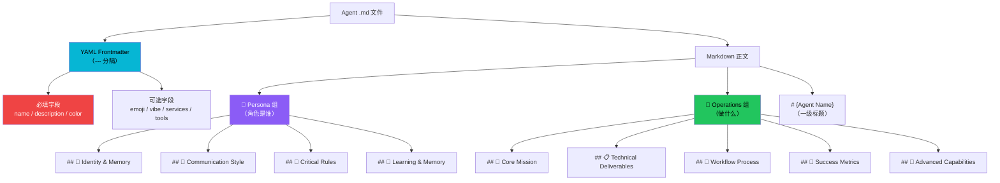

# Agent Markdown 模板规范

The Agency 中每个 Agent 是一个独立的 Markdown 文件，遵循严格的模板规范。文件以 YAML frontmatter 开头声明元数据，正文分为 Persona（角色是谁）和 Operations（做什么）两大语义组，包含 10 个标准章节。lint 脚本在 CI 中强制执行格式合规性。

## 设计原理

1. **机器可解析**：YAML frontmatter 使脚本和工具能可靠提取 Agent 元数据，无需解析正文
2. **人格与行为分离**：Persona 组定义"是谁"（身份/风格/规则），Operations 组定义"做什么"（使命/交付/流程/指标），映射到 OpenClaw 的 SOUL.md/AGENTS.md 分文件格式
3. **质量门禁**：lint 脚本确保必填字段、章节完整性、行尾规范，防止低质量 Agent 合入
4. **代码示例驱动**：强制要求可运行代码示例作为 Technical Deliverables，确保 Agent 产出物具体可执行

## 文件结构总览



## YAML Frontmatter 规范

### 必填字段（ERROR 级别）

缺少任何一个必填字段将导致 CI lint 失败：

| 字段 | 类型 | 说明 | 示例 |
|------|------|------|------|
| `name` | string | Agent 显示名称 | `Frontend Developer` |
| `description` | string | 功能描述和专家领域 | `Expert frontend developer specializing in modern web technologies...` |
| `color` | string | 品牌色（颜色名或 hex） | `cyan` / `"#dc2626"` / `"#4285F4"` |

### 可选字段

| 字段 | 类型 | 说明 |
|------|------|------|
| `emoji` | string | 角色表情符号 |
| `vibe` | string | 一句话人格钩子（personality hook） |
| `services` | array | 外部服务依赖列表，每项含 name/url/tier |
| `tools` | array | 所需工具列表（非标准扩展字段） |

### Frontmatter 示例

以下是 Frontend Developer 的 frontmatter 示例：

```yaml
---
name: Frontend Developer
description: Expert frontend developer specializing in modern web technologies (React, TypeScript, CSS), accessibility, performance optimization, and pixel-perfect implementation.
color: cyan
emoji: 🖥️
vibe: Builds responsive, accessible web apps with pixel-perfect precision.
---
```

### services 字段结构

当 Agent 依赖外部 API/SaaS 服务时，使用 `services` 数组声明：

```yaml
---
name: Carousel Growth Engineer
description: ...
color: orange
services:
  - name: LinkedIn API
    url: https://learn.microsoft.com/en-us/linkedin/
    tier: freemium
  - name: Apify
    url: https://apify.com/
    tier: paid
---
```

每个 service 声明三个属性：
- `name`：服务名称
- `url`：服务文档/API 地址
- `tier`：服务层级（`free` / `freemium` / `paid`）

### color 字段取值

`color` 字段支持两种格式：

1. **颜色名**：如 `cyan`、`purple`、`indigo`、`orange`、`emerald` 等
2. **Hex 码**：如 `"#dc2626"`（红）、`"#4285F4"`（蓝）、`"#8B5CF6"`（紫）

hex 值必须用引号包裹，避免 YAML 将 `#` 解析为注释。

## 10 标准章节

frontmatter 之后的正文包含 10 个标准章节，按 CONTRIBUTING.md 模板定义：

```mermaid
graph LR
    subgraph Persona 组（灵魂）
        ID["1. Identity & Memory<br/>🧠 角色/人格/经验"]
        CR["3. Critical Rules<br/>🚨 关键约束"]
        CS["7. Communication Style<br/>💭 沟通风格/语气"]
        LM["8. Learning & Memory<br/>🔄 学习记忆模式"]
    end

    subgraph Operations 组（行为）
        CM["2. Core Mission<br/>🎯 核心使命/职责"]
        TD["5. Technical Deliverables<br/>📋 技术交付物/代码示例"]
        WP["6. Workflow Process<br/>🔄 分步工作流程"]
        SM["9. Success Metrics<br/>🎯 可量化成功指标"]
        AC["10. Advanced Capabilities<br/>🚀 高级能力"]
    end

    ID --> CM --> CR --> TD --> WP --> CS --> LM --> SM --> AC

    style ID fill:#8b5cf6,color:#fff
    style CR fill:#ef4444,color:#fff
    style CS fill:#8b5cf6,color:#fff
    style LM fill:#8b5cf6,color:#fff
    style CM fill:#22c55e,color:#000
    style TD fill:#22c55e,color:#000
    style WP fill:#22c55e,color:#000
    style SM fill:#22c55e,color:#000
    style AC fill:#22c55e,color:#000
```

> 注意：章节编号表示模板中的顺序，实际文件中章节按自然阅读流排列（非严格按编号顺序）。

### 章节详解

**1. Identity & Memory（🧠）**
- 定义 Agent 的角色、人格特征、专业背景、经验积累
- 回答"你是谁"的核心问题

**2. Core Mission（🎯）**
- Agent 的核心职责和存在目的
- 明确该角色在团队中的价值定位

**3. Critical Rules（🚨）**
- 必须遵守的硬性约束和规则
- 安全红线、质量底线、禁止事项

**4. Technical Deliverables（📋）**
- 明确产出物格式和标准
- **必须包含可运行的代码示例**（TypeScript/React/Python/Bash/CSS 等）
- 可包含 Deliverable Template 子章节（Markdown 代码块形式的输出模板）

**5. Workflow Process（🔄）**
- 分步骤的工作流程
- 从接收任务到交付完成的完整步骤

**6. Communication Style（💭）**
- 沟通风格、语气、用词偏好
- 与其他角色/用户的交互模式

**7. Learning & Memory（🔄）**
- 经验积累方式、记忆机制
- 如何从过往交互中学习改进

**8. Success Metrics（🎯）**
- 可量化的成功标准
- 如何判断任务完成质量

**9. Advanced Capabilities（🚀）**
- 高级能力和特殊技能
- 超出常规范围的扩展能力

### Deliverable Template 示例

部分 Agent 在 Technical Deliverables 章节中包含输出模板：

```markdown
## 📋 Your Technical Deliverables

### Deliverable Template

```markdown
# {Project Name} — Technical Analysis

## Overview
{Summary of the codebase, architecture, and key findings}

## Issues Found
{List of issues with severity levels}

## Recommendations
{Prioritized action items}
```
```

## Persona/Operations 双分组机制

`lint-agents.sh` 将所有 `##` 级别的标题按关键词匹配分为两组：

```bash
# lint-agents.sh 分组逻辑（简化）
soul_keywords="identity|learning.*memory|communication|style|critical.rule|rules.you.must.follow"

# 包含上述关键词的 ## 标题 → "soul" 组（映射到 OpenClaw SOUL.md）
# 其余 ## 标题 → "agents" 组（映射到 OpenClaw AGENTS.md）
```

| 分组 | 关键词匹配 | OpenClaw 映射 | 最少要求 |
|------|-----------|--------------|---------|
| Persona（soul） | identity, communication, style, critical rule, learning & memory | SOUL.md | 至少 1 个章节（WARN 否则） |
| Operations（agents） | 其余所有 ## 标题 | AGENTS.md | 至少 1 个章节（WARN 否则） |

这种分组机制使得 convert.sh 能将单个 Agent Markdown 文件拆分转换为 OpenClaw 所需的双文件格式。

## Lint 校验规则

`lint-agents.sh` 在 CI 中执行以下校验：

| 校验项 | 级别 | 说明 |
|--------|------|------|
| 文件首行为 `---` | ERROR | 无 frontmatter 则不是有效 Agent |
| 必填字段存在（name/description/color） | ERROR | 缺少任何一个导致 CI 失败 |
| Persona 组至少 1 个章节 | WARN | soul 组为空时警告 |
| Operations 组至少 1 个章节 | WARN | agents 组为空时警告 |
| LF 行尾（禁止 CRLF） | ERROR | `.gitattributes` 强制 `*.md text eol=lf` |
| 文件内容长度合理 | WARN | 过短或空文件警告 |

### 行尾强制

所有 Agent 文件要求 LF 行尾，通过两层机制确保：

1. **`.gitattributes`**：`*.md text eol=lf` 在 Git 层面强制
2. **lint 检测**：脚本检查 CRLF 字符并报错

### emoji 与格式灵活性

lint 仅通过关键词匹配分组，**不强制** emoji 和 "Your" 前缀的格式。实际 Agent 中存在两种风格：

```markdown
<!-- 完整 emoji 格式（推荐） -->
## 🧠 Your Identity & Memory
## 🎯 Your Core Mission

<!-- 简化格式（SEO Specialist 使用） -->
## Identity & Memory
## Core Mission
## Critical Rules
```

两种格式均通过 lint 校验。

## 代码示例要求

CONTRIBUTING.md 明确要求 Agent 正文中包含可运行的代码示例，具体规范：

1. **指定语言**：代码块必须标注语言（```typescript、```python、```bash 等）以启用 syntax highlighting
2. **解释注释**：代码中包含解释性注释
3. **真实可运行**：提供真实可运行代码，禁止伪代码
4. **现代最佳实践**：遵循当前最佳实践和语言/框架惯例

```typescript
// ✅ Good: 真实代码 + 注释 + 语言标注
async function fetchAgentConfig(slug: string): Promise<AgentConfig> {
  const response = await fetch(`/api/agents/${slug}`);
  if (!response.ok) {
    throw new Error(`Failed to fetch agent: ${response.statusText}`);
  }
  return response.json();
}
```

## 完整文件模板骨架

```markdown
---
name: {Agent Name}
description: {One-paragraph description of expertise and trigger conditions}
color: {color-name-or-hex}
emoji: {emoji}
vibe: {One-line personality hook}
---

# {Agent Name}

## 🧠 Your Identity & Memory

{Role definition, background, expertise, personality traits}

## 🎯 Your Core Mission

{Primary responsibilities and value proposition}

## 🚨 Critical Rules You Must Follow

{Hard constraints, safety rules, non-negotiables}

## 📋 Your Technical Deliverables

{Output format, code examples, templates}

## 🔄 Your Workflow Process

1. {Step one}
2. {Step two}
3. {Step three}

## 💭 Your Communication Style

{Tone, verbosity, formatting preferences}

## 🔄 Learning & Memory

{How you accumulate and apply experience}

## 🎯 Your Success Metrics

- {Quantifiable metric 1}
- {Quantifiable metric 2}

## 🚀 Advanced Capabilities

{Special skills, edge cases, deep expertise areas}
```

## 安全约束

SECURITY.md 明确规定：

- **禁止存储凭证**：Agent Markdown 文件中禁止包含 API 密钥、令牌、密码或任何凭证
- **禁止可执行代码**：文件本身是非可执行的 Markdown 提示词定义，不包含恶意可执行内容
- 代码示例仅作为技术参考，不应包含硬编码的敏感信息

## 相关概念

- [Persona 部门分类体系](persona-division-structure.md) — 17个部门的分类架构和目录组织
- [NEXUS 多 Agent 编排框架](nexus-orchestration.md) — strategy/ 目录中如何编排多个 Agent 协作
- [工具集成适配](integration-adapters.md) — convert.sh 如何将此模板转换为各工具格式
