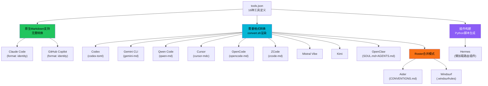
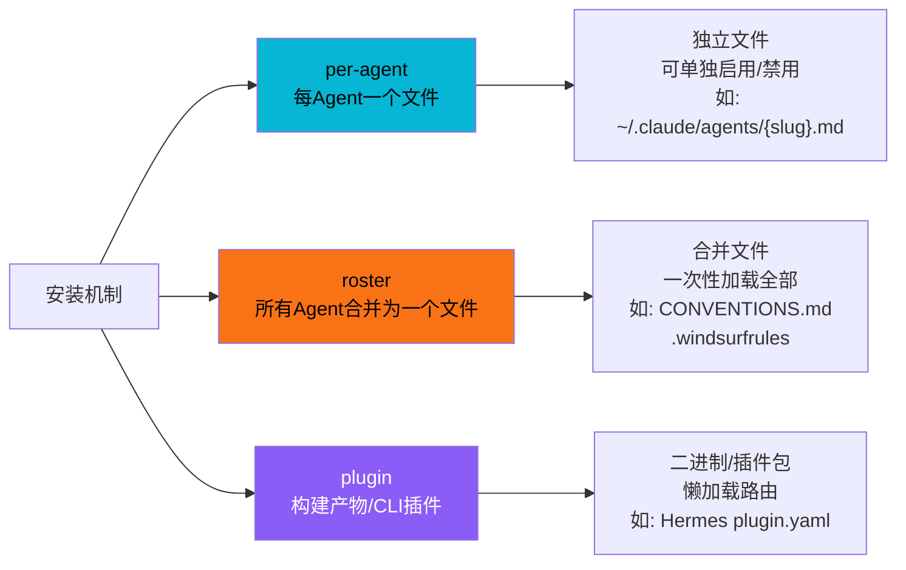
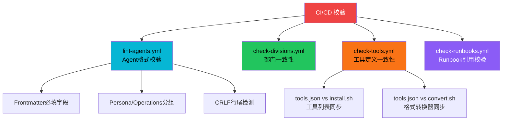

# 工具集成适配体系

The Agency 项目的核心价值之一是将约 270 个 Agent Persona 适配到多种 AI 编码工具平台。通过 `tools.json` 统一声明工具元数据，`convert.sh` 执行格式转换，`install.sh` 提供交互式安装向导，构建脚本生成特定平台插件（如 Hermes），实现"一次定义，多平台使用"的集成适配体系。

## 设计原理

1. **声明式配置**：所有工具元数据集中在 `tools.json`，脚本读取配置而非硬编码，新增工具只需修改 JSON
2. **三种安装模型**：per-agent（单文件）、roster（合并文件）、plugin（构建产物）适配不同工具的扩展机制
3. **生成文件不入库**：`integrations/` 下的转换输出由 `.gitignore` 排除，仅 README.md 被跟踪，避免生成文件污染仓库
4. **一致性校验**：`check-tools.sh` 确保 `tools.json`、`install.sh`、`convert.sh` 三者保持同步
5. **原生优先**：Claude Code 和 GitHub Copilot 原生支持 Markdown Agent 格式，无需转换直接使用

## 支持的工具矩阵

项目支持 **16 种** AI 编码工具/平台，在 `tools.json` 中统一定义：



### 工具配置字段

每个工具在 `tools.json` 中的配置包含以下字段：

| 字段 | 说明 | 示例值 |
|------|------|--------|
| `id` | 工具唯一标识 | `claude-code` |
| `label` | 显示名称 | `Claude Code` |
| `kebab` | kebab-case 名称 | `claude-code` |
| `accent` | 品牌色 | `#D97757` |
| `icon` | Lucide 图标名 | `Bot` |
| `order` | 排序权重 | `1` |
| `scope` | 安装范围 | `user` / `project` |
| `detect` | 检测目录路径 | `~/.claude` |
| `version` | 版本检测命令 | `claude --version` |
| `format` | 渲染格式 | `identity` / `codex-toml` / `skill-md` 等 |
| `installKind` | 安装机制 | `per-agent` / `roster` / `plugin` |
| `dest` | 目标路径模板 | `~/.claude/agents/{slug}.md` |

## 三种安装机制（installKind）



### per-agent 模式

每个 Agent 渲染为一个独立文件，放置在工具的 agents/skills 目录中。适用于支持多文件 Agent 加载的工具：

- Claude Code：`~/.claude/agents/{division}-{slug}.md`
- Cursor：`.cursor/rules/{slug}.mdc`
- Gemini CLI：`~/.gemini/agents/{slug}.md`
- Codex：`~/.codex/agents/{slug}.toml`

优点：可单独启用/禁用特定 Agent，按需加载；缺点：文件数量多（~270 个文件）。

### roster 模式

所有 Agent 合并为一个规则/惯例文件，适用于只支持单一配置文件的工具：

- Aider：`CONVENTIONS.md`（包含所有 Agent 定义的合并文档）
- Windsurf：`.windsurfrules`（项目级规则文件）

```markdown
<!-- CONVENTIONS.md 示例结构 -->
# Project Conventions

## Agents Available

### Frontend Developer
{Agent content...}

### Backend Architect
{Agent content...}

{... 约270个Agent ...}
```

优点：单文件管理，简单直接；缺点：文件大，上下文消耗高，无法选择性加载。

### plugin 模式

构建为工具专用插件，不通过逐 Agent 渲染。目前仅 Hermes 使用此模式：

- Hermes：由 `build-hermes-plugin.py` 生成 `plugin.yaml` + `__init__.py` + `data/agents.json`，实现懒加载路由

## convert.sh 转换引擎

`convert.sh` 是核心格式转换脚本，负责将源 Agent `.md` 文件渲染为各工具特定格式：

```bash
# convert.sh 核心流程（简化）
1. 读取 tools.json 获取目标格式列表
2. 遍历所有 division 目录下的 Agent .md 文件
3. 对每个 Agent，解析 frontmatter 提取元数据
4. 根据目标 format 渲染对应格式：
   - identity: 直接复制源 .md（Claude Code/Copilot 原生格式）
   - codex-toml: 转换为 TOML 格式的 Agent 定义
   - gemini-md: 转换为 Gemini 特定 Markdown 格式
   - cursor-mdc: 转换为 Cursor .mdc 规则文件格式
   - skill-md: 转换为 SKILL.md 标准格式
   - qwen-md/zcode-md/opencode-md: 各工具特定格式
5. 输出到 integrations/<tool>/ 目录
```

### 格式渲染逻辑

不同工具的 Agent 格式差异主要体现在：

1. **Frontmatter 格式**：YAML vs TOML vs JSON vs 无
2. **章节映射**：Persona/Operations 分组映射到工具的特定文件（如 OpenClaw 的 SOUL.md + AGENTS.md）
3. **文件命名**：`{slug}.md` vs `{division}-{slug}.md` vs `{division}_{slug}.toml`
4. **内容包裹**：部分工具要求特定 XML 标签或 Markdown 扩展语法

### OpenClaw 双文件输出

OpenClaw 需要将单个 Agent 拆分为两个文件：

| 源文件章节 | 输出文件 | 内容 |
|-----------|---------|------|
| Persona 组（soul 关键词匹配） | `SOUL.md` | Identity & Memory、Communication Style、Critical Rules、Learning & Memory |
| Operations 组（agents 关键词匹配） | `AGENTS.md` | Core Mission、Technical Deliverables、Workflow Process、Success Metrics、Advanced Capabilities |

这是 `lint-agents.sh` 中 Persona/Operations 双分组机制的实际用途——直接服务于 convert.sh 的格式拆分。

## install.sh 交互式安装向导

`install.sh` 提供 TUI（终端用户界面）安装向导，引导用户选择工具和 Agent：

```bash
# install.sh 交互流程
1. 检测已安装的 AI 工具（扫描 ~/.claude, ~/.codex, ~/.cursor 等目录）
2. 显示可用工具列表，用户选择目标工具
3. 显示部门列表，用户选择要安装的 Agent 部门
4. 或通过 agents-to-install.example 指定 Agent slug 列表
5. 调用 convert.sh 生成对应格式（如需要）
6. 将文件复制/链接到工具的配置目录
7. 设置正确的文件权限
```

### TUI 原语

`lib.sh` 提供了终端 UI 原语支持交互式体验：

```bash
# lib.sh TUI 函数
tui_begin()     # 开始 TUI 模式（保存终端状态）
tui_end()       # 结束 TUI 模式（恢复终端状态）
read_key()      # 读取单个按键（无需回车）
draw_frame()    # 绘制边框框架
```

### 无交互安装

支持通过 `agents-to-install.example` 文件指定要安装的 Agent slug 列表，实现无交互批量安装：

```bash
# agents-to-install.example 示例
engineering-frontend-developer
engineering-backend-architect
design-ui-designer
security-penetration-tester
```

## Hermes 懒加载插件构建

`build-hermes-plugin.py` 为 Hermes Agent 框架构建专用插件，实现懒加载路由：

```python
# build-hermes-plugin.py 核心逻辑
# 1. 读取 divisions.json 获取部门列表
# 2. 遍历所有 Agent .md 文件，解析 frontmatter
# 3. 仅提取 name, description, color, emoji, vibe 字段（忽略 services/tools）
# 4. 生成 agents.json 索引（供搜索/浏览）
# 5. 生成 plugin.yaml 插件声明
# 6. 生成 __init__.py，注册4个工具：
#    - search: 按关键词搜索 Agent
#    - inspect: 查看 Agent 详情（元数据）
#    - load: 按需加载 Agent 正文（懒加载）
#    - delegate: 将任务委派给指定 Agent
```

### 懒加载设计

Hermes 插件的关键设计是**懒加载**——`agents.json` 仅包含元数据索引（name/description/color/emoji），Agent 正文（body）在 `load` 工具调用时才读取文件。这避免了将 ~270 个 Agent 的完整内容一次性加载到上下文中，显著降低 token 消耗。

```python
# 插件工具签名（简化）
async def search(query: str, category: str = None) -> list[AgentSummary]:
    """搜索Agent，返回匹配的摘要列表（元数据）"""

async def inspect(slug: str) -> AgentDetail:
    """查看Agent详情（元数据+章节大纲，不含完整body）"""

async def load(slug: str) -> AgentContent:
    """加载Agent完整内容（正文），按需调用"""

async def delegate(slug: str, task: str) -> str:
    """将任务委派给指定Agent执行"""
```

## MCP Memory 特殊集成

`integrations/mcp-memory/` 是唯一非格式转换的特殊集成，提供 MCP（Model Context Protocol）记忆集成模式：

- `backend-architect-with-memory.md`：展示如何为 Agent 添加持久化记忆功能
- `setup.sh`：MCP Memory 服务器配置脚本

这个集成展示了如何让 Agent 跨会话保持记忆，通过 MCP 协议连接外部记忆存储。

## 输出目录管理

`integrations/` 目录的 Git 管理策略：

```
integrations/
├── README.md           # ✅ 被 Git 跟踪（说明文档）
├── claude-code/
│   ├── README.md       # ✅ 被 Git 跟踪
│   └── *.md            # ❌ .gitignore 排除（生成文件）
├── cursor/
│   ├── README.md       # ✅ 被 Git 跟踪
│   └── *.mdc           # ❌ 排除
├── hermes/
│   ├── README.md       # ✅ 被 Git 跟踪
│   └── *.yaml/*.py     # ❌ 排除
...（共16个工具目录）
```

`.gitignore` 排除所有生成的 Agent 文件，仅保留 README.md 作为目录占位符和说明。用户需运行 `convert.sh` 或 `install.sh` 生成本地文件。

## 一致性校验体系

四个 CI 工作流确保集成体系的一致性：



`check-tools.sh` 特别校验：
1. `tools.json` 中定义的每个工具在 `install.sh` 中有对应的安装逻辑
2. `tools.json` 中定义的每个格式在 `convert.sh` 中有对应的渲染器
3. 新增/删除工具时必须同步更新三个文件

## 中文本地化

`scripts/i18n/` 目录提供中文本地化支持：

- `agent-names-zh.json`：130+ 条 Agent 英文名→中文名映射
- `localize-agents-zh.ps1`：PowerShell 脚本，替换已安装 Agent 文件的 name/description 字段为中文

本地化是**安装后处理**——源文件保持英文，用户安装后可选择性运行本地化脚本将已安装的 Agent 文件汉化为中文。

## 相关概念

- [Persona 部门分类体系](persona-division-structure.md) — 转换的源内容组织
- [Agent Markdown 模板规范](agent-md-template.md) — 转换的源文件格式
- [NEXUS 多 Agent 编排框架](nexus-orchestration.md) — 编排产物通过此集成体系部署
