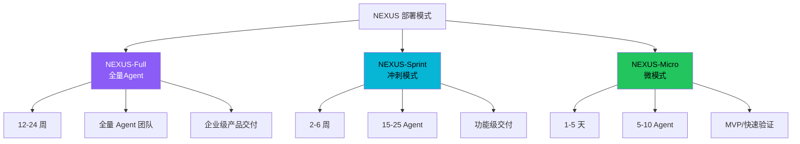
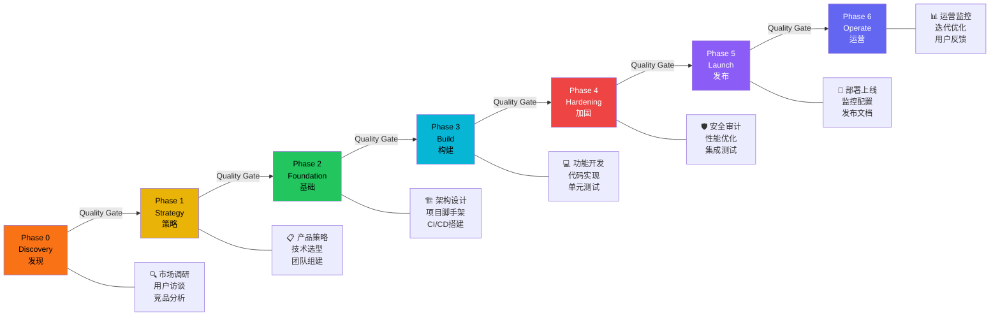
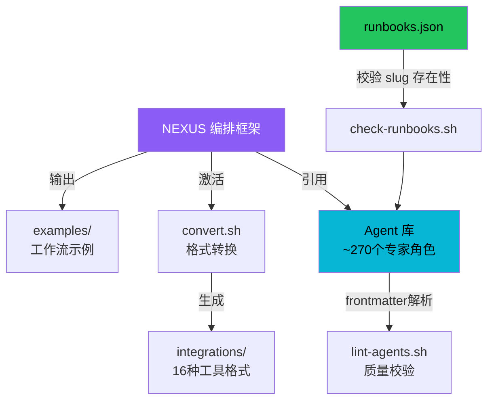

# NEXUS 多 Agent 编排框架

NEXUS（**N**etwork of **EX**perts, **U**nified in **S**trategy）是 The Agency 项目的多 Agent 协作编排框架，存放于 `strategy/` 目录。它定义了如何将约 270 个专家 Agent 编排为团队，通过分阶段流水线、质量门控和标准化交接协议完成从产品发现到运营的完整项目生命周期。

## 设计原理

1. **专家网络而非通用Agent**：每个 Agent 是窄域专家，通过编排形成协作网络，而非依赖单个全能 Agent
2. **阶段门控**：7 个阶段间设置质量门（Quality Gates），要求证据通过才能推进，防止缺陷传递
3. **规模弹性**：3 种部署模式适配不同项目规模，从 1-5 天的 Micro 到 12-24 周的 Full
4. **机器可读 + 人类可读**：Runbook 同时提供 JSON（自动化消费）和 Markdown（人类操作）两种格式
5. **策略与实现分离**：strategy/ 目录是操作手册，不包含 Agent frontmatter，不被识别为 Agent 定义

## 三种部署模式

NEXUS 定义了三种规模的部署模式，根据项目范围和时间线选择：



| 模式 | Agent 数量 | 时间线 | 适用场景 |
|------|-----------|--------|---------|
| NEXUS-Full | 全量（部门级） | 12-24 周 | 企业级产品从零到运营 |
| NEXUS-Sprint | 15-25 | 2-6 周 | 单个功能/模块交付 |
| NEXUS-Micro | 5-10 | 1-5 天 | MVP、落地页、快速验证 |

## 七阶段流水线

NEXUS 定义了从发现到运营的 7 个阶段，形成完整的产品交付生命周期：



### 阶段详情

**Phase 0 — Discovery（发现）**
- 市场调研、用户访谈、竞品分析
- 参与 Agent：市场研究员、UX 研究员、竞品分析师
- 产出物：调研报告、用户画像、竞品矩阵
- 质量门：调研覆盖目标用户群的核心需求

**Phase 1 — Strategy（策略）**
- 产品策略定义、技术选型、团队编制
- 参与 Agent：产品策略师、技术架构师、团队编排师
- 产出物：产品路线图、技术架构文档、团队编制计划
- 质量门：策略获得干系人认可，技术选型经过 PoC 验证

**Phase 2 — Foundation（基础）**
- 架构搭建、项目脚手架、CI/CD 流水线
- 参与 Agent：后端架构师、DevOps 工程师、前端架构师
- 产出物：项目仓库、部署流水线、开发规范
- 质量门：脚手架可运行，CI 通过，开发环境就绪

**Phase 3 — Build（构建）**
- 功能开发、代码实现、单元测试
- 参与 Agent：前端/后端/移动端开发者、API 测试员
- 产出物：功能代码、测试覆盖、文档
- 质量门：功能完成度、测试覆盖率达标

**Phase 4 — Hardening（加固）**
- 安全审计、性能优化、集成测试、渗透测试
- 参与 Agent：安全渗透测试员、性能工程师、QA
- 产出物：安全报告、性能基准、缺陷修复
- 质量门：无高危/严重安全漏洞，性能指标达标

**Phase 5 — Launch（发布）**
- 部署上线、监控配置、发布文档、营销准备
- 参与 Agent：DevOps、技术写作、增长营销
- 产出物：生产环境部署、监控仪表盘、发布说明
- 质量门：生产环境健康检查通过，回滚方案就绪

**Phase 6 — Operate（运营）**
- 持续监控、迭代优化、用户反馈处理
- 参与 Agent：SRE、客户支持、数据分析师
- 产出物：运营报告、迭代计划、用户满意度
- 质量门：SLA 达标，用户反馈闭环

### 质量门控机制

阶段间的 Quality Gate 要求**证据通过**才能推进，核心原则：

1. **不跳过**：任何阶段不能跳过质量门，即使时间紧迫
2. **证据驱动**：质量门需要具体产出物作为证据（文档/测试报告/审批记录）
3. **可回退**：未通过质量门时回退到对应阶段补充工作
4. **角色负责**：每个质量门有明确的 Agent 角色负责审批

## strategy/ 目录结构

```
strategy/
├── nexus-strategy.md           # NEXUS 完整操作条令（7阶段定义）
├── QUICKSTART.md               # 5分钟快速上手指南
├── EXECUTIVE-BRIEF.md          # 高管摘要文档
├── runbooks.json               # 机器可读的场景Runbook清单
├── coordination/
│   ├── agent-activation-prompts.md   # Agent激活提示模板
│   └── handoff-templates.md          # Agent间交接模板
├── playbooks/
│   ├── phase-0-discovery.md    # Phase 0 详细Playbook
│   ├── phase-1-strategy.md     # Phase 1 详细Playbook
│   ├── phase-2-foundation.md   # Phase 2 详细Playbook
│   ├── phase-3-build.md        # Phase 3 详细Playbook
│   ├── phase-4-hardening.md    # Phase 4 详细Playbook
│   ├── phase-5-launch.md       # Phase 5 详细Playbook
│   └── phase-6-operate.md      # Phase 6 详细Playbook
└── runbooks/
    ├── startup-mvp.md          # 创业MVP场景Runbook
    ├── enterprise-feature.md   # 企业功能场景Runbook
    ├── marketing-campaign.md   # 营销活动场景Runbook
    └── incident-response.md    # 事件响应场景Runbook
```

## Playbook 体系

每个阶段有对应的 Playbook（`playbooks/phase-{n}-{name}.md`），提供该阶段的详细操作指南：

- 阶段目标与成功标准
- 参与 Agent 角色清单
- 分步操作流程
- 输入/产出物定义
- 常见陷阱与应对
- 质量门检查清单

Playbook 是**阶段级**的通用操作手册，不针对特定项目类型。

## Runbook 场景体系

Runbook 是**场景级**的具体执行方案，`runbooks.json` 定义了 4 个预置场景：

```json
// runbooks.json（简化结构）
{
  "runbooks": [
    {
      "id": "startup-mvp",
      "name": "Startup MVP",
      "description": "快速构建最小可行产品",
      "phases": ["discovery", "strategy", "foundation", "build", "launch"],
      "agents": ["product-strategist", "ux-designer", "frontend-developer", "backend-architect", "devops-automator"],
      "duration": "2-4 weeks"
    },
    {
      "id": "enterprise-feature",
      "name": "Enterprise Feature",
      "description": "企业级功能开发与发布",
      "phases": ["discovery", "strategy", "foundation", "build", "hardening", "launch", "operate"],
      "agents": [...],
      "duration": "8-12 weeks"
    },
    {
      "id": "marketing-campaign",
      "name": "Marketing Campaign",
      "description": "营销活动策划与执行",
      "phases": ["discovery", "strategy", "build", "launch"],
      "agents": [...],
      "duration": "2-3 weeks"
    },
    {
      "id": "incident-response",
      "name": "Incident Response",
      "description": "生产事故应急响应",
      "phases": ["discovery", "build", "hardening", "operate"],
      "agents": ["sre", "security-penetration-tester", "backend-architect", "devops-automator"],
      "duration": "hours-days"
    }
  ]
}
```

`check-runbooks.sh` 在 CI 中校验 `runbooks.json` 中引用的每个 Agent slug 是否真实存在于 Agent 文件中，防止引用无效角色。

## 协调机制

### Agent 激活提示

`coordination/agent-activation-prompts.md` 定义了如何激活和配置每个参与协作的 Agent：

- 激活指令格式
- 上下文注入模板
- 角色边界定义
- 输出格式要求

### Handoff 交接模板

`coordination/handoff-templates.md` 标准化 Agent 之间的工作交接：

```markdown
## Handoff: {From Agent} → {To Agent}

**Context**: {当前任务背景简述}
**Completed Work**: {已完成工作摘要}
**Deliverables**: {产出物位置/引用}
**Open Questions**: {待解决问题}
**Next Steps**: {期望接收方完成的具体动作}
**Deadline**: {时间要求}
```

Handoff 模板确保信息在 Agent 间传递时不丢失关键上下文，是 NEXUS 流水线中阶段衔接的核心机制。

## 示例工作流

`examples/` 目录提供了 NEXUS 编排的实际示例：

| 示例文件 | 参与 Agent 数 | 场景 |
|---------|-------------|------|
| `nexus-spatial-discovery.md` | 8 | 空间计算产品并行发现 |
| `workflow-startup-mvp.md` | 7 | SaaS MVP 4周构建工作流 |
| `workflow-landing-page.md` | ~4 | 落地页构建 |
| `workflow-book-chapter.md` | ~3 | 书籍章节写作 |
| `workflow-with-memory.md` | - | 基于 MCP Memory 的持久化记忆工作流 |

### Startup MVP 工作流示例

以 `workflow-startup-mvp.md` 为例，7 个 Agent 按周协作：

```mermaid
gantt
    title SaaS MVP 4周工作流（NEXUS-Micro）
    dateFormat  W
    axisFormat  第%W周

    section Phase 0-1
    产品策略师  :p1, 2026-01W1, 1w
    UX研究员    :p1, 2026-01W1, 1w

    section Phase 2
    后端架构师  :p2, after p1, 1w
    前端开发    :p2, after p1, 1w
    DevOps      :p2, after p1, 1w

    section Phase 3
    前端开发    :p3, after p2, 2w
    后端开发    :p3, after p2, 2w
    API测试员   :p3, after p2, 2w

    section Phase 5
    DevOps部署  :p5, after p3, 3d
    技术写作    :p5, after p3, 3d
```

## 与其他组件的关系



## 最佳实践原则

NEXUS 框架遵循 5 条核心实践原则（来自 Playbook）：

1. **Name the outcome, not the steps**：命名目标而非步骤，让专家自主决定路径
2. **Cast a team, not a soloist**：组建团队而非单干，多角色协作优于全能Agent
3. **Loop until it's tested**：迭代直到测试通过，不假设首次正确
4. **Feed it context**：充分提供上下文，减少 Agent 猜测
5. **Start with one, then scale**：从一个 Agent 开始验证，再扩展到团队

## 相关概念

- [Persona 部门分类体系](persona-division-structure.md) — NEXUS 编排的角色来源（17个部门约270 Agent）
- [Agent Markdown 模板规范](agent-md-template.md) — 被编排 Agent 的文件格式
- [工具集成适配](integration-adapters.md) — 编排产物通过 convert.sh 部署到各工具平台
