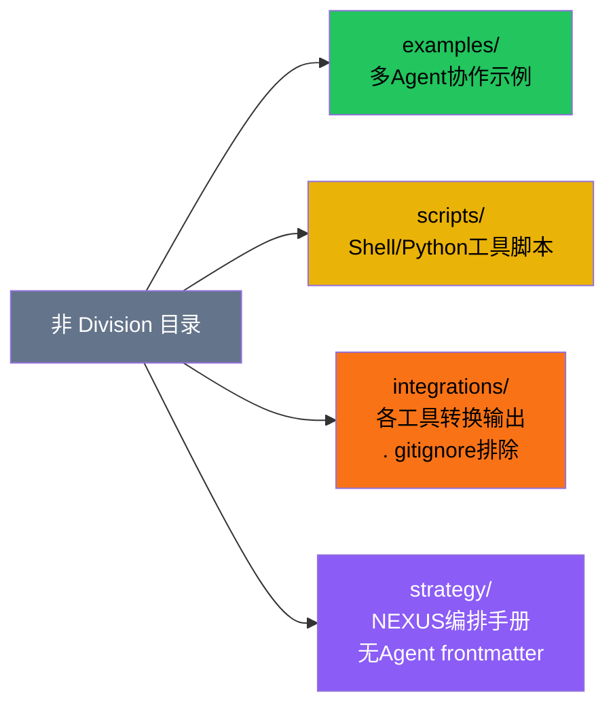

# Persona 部门分类体系

The Agency（agency-agents）是一个 AI Agent Persona 集合库，包含约 270 个专门领域的专家角色定义。所有 Agent 通过**部门（Division）**体系进行组织分类，每个部门代表一个专业领域，部门元数据由 `divisions.json` 作为单一真相源（Single Source of Truth）统一管理。

## 设计原理

1. **领域专业化**：每个部门聚焦一个专业领域，确保 Agent 的领域深度而非泛化的"万能助手"
2. **元数据驱动**：部门配置集中管理，前端 UI、CI 校验、转换脚本均从 `divisions.json` 读取，避免硬编码
3. **可扩展性**：新增部门只需修改 `divisions.json` 和创建对应目录，CI 自动校验一致性
4. **层级支持**：部门内支持子目录进一步细分（如游戏开发部门按引擎分目录）

## 部门全景

项目共定义 **17 个部门**，每个部门在 `divisions.json` 中配置三个属性：

| 属性 | 说明 |
|------|------|
| `label` | 部门显示名称 |
| `icon` | Lucide 图标名（PascalCase） |
| `color` | 部门品牌色（hex 值） |

```mermaid
graph TB
    ROOT["agency-agents/"] --> DIV1[academic<br/>学术]
    ROOT --> DIV2[design<br/>设计]
    ROOT --> DIV3[engineering<br/>工程]
    ROOT --> DIV4[finance<br/>金融]
    ROOT --> DIV5[game-development<br/>游戏开发]
    ROOT --> DIV6[gis<br/>地理信息]
    ROOT --> DIV7[healthcare<br/>医疗]
    ROOT --> DIV8[marketing<br/>营销]
    ROOT --> DIV9[paid-media<br/>付费媒体]
    ROOT --> DIV10[product<br/>产品]
    ROOT --> DIV11[project-management<br/>项目管理]
    ROOT --> DIV12[sales<br/>销售]
    ROOT --> DIV13[security<br/>安全]
    ROOT --> DIV14[spatial-computing<br/>空间计算]
    ROOT --> DIV15[specialized<br/>专项]
    ROOT --> DIV16[support<br/>支持]
    ROOT --> DIV17[testing<br/>测试]

    ROOT --> NON1[examples/<br/>示例工作流]
    ROOT --> NON2[scripts/<br/>安装/转换脚本]
    ROOT --> NON3[integrations/<br/>工具集成输出]
    ROOT --> NON4[strategy/<br/>NEXUS编排手册]
    ROOT --> CONF[divisions.json<br/>tools.json]

    style ROOT fill:#1e293b,color:#fff
    style DIV3 fill:#06b6d4,color:#000
    style DIV8 fill:#f97316,color:#000
    style DIV15 fill:#8b5cf6,color:#fff
    style NON1 fill:#64748b,color:#fff
    style NON2 fill:#64748b,color:#fff
    style NON3 fill:#64748b,color:#fff
    style NON4 fill:#64748b,color:#fff
    style CONF fill:#22c55e,color:#000
```



## divisions.json 真相源结构

`divisions.json` 是部门定义的唯一权威来源，所有工具脚本和 CI 校验都依赖此文件：

```json
// divisions.json（示例结构）
[
  {
    "id": "engineering",
    "label": "Engineering",
    "icon": "Code",
    "color": "#06b6d4"
  },
  {
    "id": "design",
    "label": "Design",
    "icon": "Palette",
    "color": "#ec4899"
  },
  {
    "id": "marketing",
    "label": "Marketing",
    "icon": "TrendingUp",
    "color": "#f97316"
  }
  // ... 共17个部门定义
]
```

### CI 一致性校验

`check-divisions.sh` 脚本在 CI 中运行，确保 `divisions.json` 与实际文件系统保持一致：

```bash
# check-divisions.sh 校验项
# 1. divisions.json 中定义的每个部门都有对应的目录
# 2. 根目录下的每个子目录（排除4个非division目录）都在 divisions.json 中有定义
# 3. install.sh 中包含所有部门的安装选项
# 4. convert.sh 中包含所有部门的转换逻辑
# 5. CI 工作流引用了正确的部门列表
```

校验范围涵盖四个方面：目录存在性、脚本覆盖、工作流配置、文档一致性，确保任何新增/删除/重命名部门的操作都必须同步更新所有相关位置。

## Agent 数量分布

各部门 Agent Markdown 文件数量统计（递归搜索子目录）：

```mermaid
graph LR
    subgraph 大型部门（>30 Agent）
        E[engineering<br/>58个]
        S[specialized<br/>57个]
        M[marketing<br/>36个]
    end
    subgraph 中型部门（10-29 Agent）
        GD[game-development<br/>21个]
        GIS[gis<br/>13个]
        SEC[security<br/>12个]
        DSN[design<br/>10个]
    end
    subgraph 小型部门（<10 Agent）
        SAL[sales 9个]
        TST[testing 9个]
        PM[paid-media 7个]
        PMG[project-mgmt 7个]
        ACA[academic 6个]
        SPT[support 6个]
        SPC[spatial-computing 6个]
        FIN[finance 5个]
        PRD[product 5个]
        HLT[healthcare 3个]
    end

    style E fill:#06b6d4,color:#000
    style S fill:#8b5cf6,color:#fff
    style M fill:#f97316,color:#000
```

| 部门 | Agent 数量 | 特色 |
|------|-----------|------|
| engineering | 58 | 最大技术部门，覆盖前后端/DevOps/SRE/API/数据库 |
| specialized | 57 | 跨领域专项角色，含 MCP Builder、Chief of Staff 等 |
| marketing | 36 | 覆盖 SEO/内容/增长/社媒/ carousel 等 |
| game-development | 21 | 唯一含引擎子目录的部门 |
| gis | 13 | 地理信息系统专业角色 |
| security | 12 | 渗透测试/安全审计等 |
| design | 10 | UI/UX/品牌设计 |
| 其余9部门 | 3-9 | 各自领域专业角色 |
| **总计** | **~270** | |

## 子目录层级组织

`game-development/` 是唯一包含引擎子目录的部门，展示了部门内的层级细分模式：

```
game-development/
├── game-designer.md              # 跨引擎通用角色（根目录）
├── level-designer.md
├── technical-artist.md
├── game-audio-engineer.md
├── narrative-designer.md
├── economy-designer.md
├── blender/                      # Blender 专用角色
│   └── blender-3d-artist.md
├── godot/                        # Godot 引擎专用角色
│   ├── godot-gameplay-programmer.md
│   └── ...
├── roblox-studio/                # Roblox 专用角色
│   └── ...
├── unity/                        # Unity 引擎专用角色
│   └── ...
└── unreal-engine/                # Unreal Engine 专用角色
    └── ...
```

根目录存放**跨引擎通用 Agent**（如 game-designer、level-designer），子目录存放**引擎专用 Agent**。lint 脚本递归搜索所有 `.md` 文件（排除非 division 目录），所以子目录深度不限制。

## 文件命名规则

每个 Agent 文件遵循 `{division-prefix}-{agent-slug}.md` 命名模式，全小写 kebab-case：

| 部门 | 文件名示例 |
|------|-----------|
| engineering | `engineering-frontend-developer.md` |
| design | `design-ui-designer.md` |
| security | `security-penetration-tester.md` |
| marketing | `marketing-seo-specialist.md` |

**例外**：`specialized/` 目录下部分文件以 `specialized-` 前缀开头（如 `specialized-mcp-builder.md`），部分不带此前缀（如 `agents-orchestrator.md`、`business-strategist.md`）。这是因为文件名的 stem 不完全等同于 slug——slug 由 frontmatter 中的 `name` 字段经 `slugify()` 函数推导，而非直接取文件名。

### slug 生成逻辑

```bash
# lib.sh 中的 slugify 函数
slugify() {
  echo "$1" | tr '[:upper:]' '[:lower:]' | sed 's/[^a-z0-9-]/-/g' | sed 's/--*/-/g' | sed 's/^-//;s/-$//'
}
```

slug 的生成规则：转为小写 → 非字母数字连字符替换为 `-` → 合并连续 `-` → 去除首尾 `-`。

## 非 Division 目录

根目录下有 4 个**非部门目录**，不被扫描为 Agent 源文件：



| 目录 | 用途 | Agent frontmatter |
|------|------|-------------------|
| `examples/` | 多 Agent 协作示例工作流 | 否（示例文档） |
| `scripts/` | 安装/转换/lint 工具脚本 | 否（脚本文件） |
| `integrations/` | 各工具格式转换输出目录 | 由 convert.sh 生成，不提交 |
| `strategy/` | NEXUS 编排框架手册/Playbook/Runbook | 否（操作手册） |

`check-divisions.sh` 在扫描时显式排除这四个目录，确保它们不会被误识别为部门。

## Agent 文件识别

`lib.sh` 中的 `is_agent_file()` 函数用于判断一个 Markdown 文件是否为有效 Agent：

```bash
# 判断逻辑（简化）
is_agent_file() {
  local file="$1"
  # 1. 文件首行必须是 "---"（YAML frontmatter 起始标记）
  # 2. frontmatter 中包含必需字段：name, description, color
  # 3. 文件位于 division 目录下（非 examples/scripts/integrations/strategy）
}
```

这也是 lint 脚本的核心判断逻辑：没有 YAML frontmatter 的 `.md` 文件不是有效 Agent。

## 设计约束与反模式

### 禁止事项

根据 CONTRIBUTING.md，以下做法被明确禁止：

1. **泛化人格**：禁止创建 "helpful assistant" 等无专业特色的 Agent
2. **范围过宽**：禁止 "jack of all trades" 类型的万能角色
3. **无代码示例**：Agent 正文必须包含可运行的代码示例（Technical Deliverables 要求）
4. **重复角色**：新增 Agent 必须通过 `check-agent-originality.sh` 检查，禁止近重复的"换皮"Agent
5. **可执行代码**：Agent Markdown 文件中禁止存储可执行代码片段以外的脚本

### Agent 设计五原则

1. **强人格（Strong Personality）**：每个 Agent 有鲜明的沟通风格和专业口吻
2. **清晰交付物（Clear Deliverables）**：明确定义产出物格式和标准
3. **成功指标（Success Metrics）**：可量化的完成标准
4. **经验证工作流（Proven Workflows）**：基于真实最佳实践而非理论推测
5. **学习记忆（Learning Memory）**：包含经验积累和持续改进机制

## 相关概念

- [Agent Markdown 模板规范](agent-md-template.md) — 单个 Agent 文件的 YAML frontmatter 和 10 标准章节结构
- [NEXUS 多 Agent 编排框架](nexus-orchestration.md) — strategy/ 目录中的 7 阶段协作流水线
- [工具集成适配](integration-adapters.md) — convert.sh 将部门 Agent 转换为 16 种工具格式
