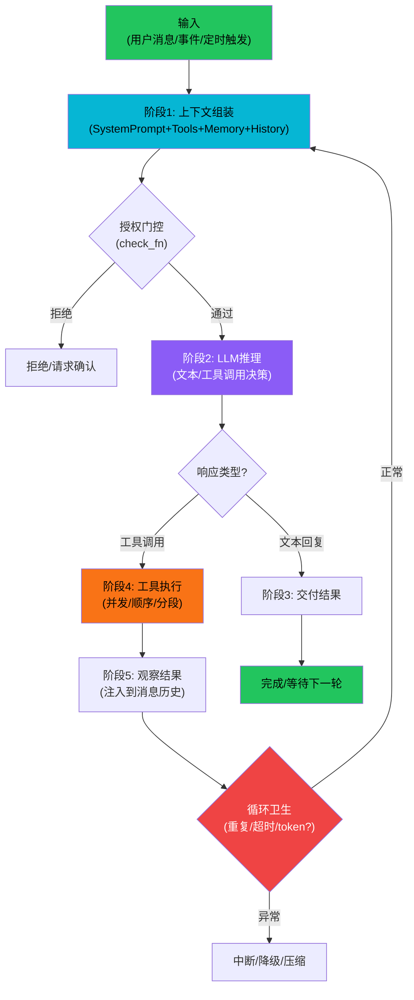
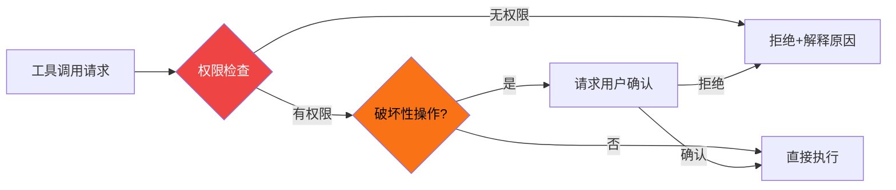
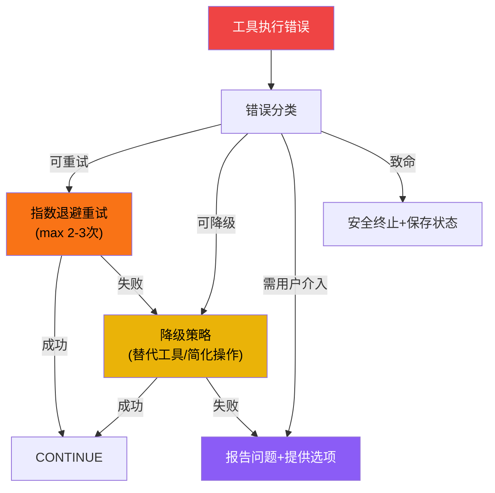

# Agent 核心循环模式

Agent 的核心是一个**感知-思考-行动**（Perceive-Think-Act）循环，即 ReAct（Reasoning + Acting）范式。本概念从6个Tier3项目的实践中提炼出通用的循环架构模式——不是单一框架的实现细节，而是跨项目反复出现的设计规律。

## 设计原理

1. **循环是Agent的心跳**：所有Agent行为最终归结为一个"接收输入→推理→行动→观察结果→继续"的循环
2. **门控比执行更重要**：生产级循环的核心不是"如何调用LLM"，而是授权门控、错误恢复、循环卫生检测
3. **阶段化降低复杂度**：将循环拆分为显式阶段（而非单体while循环）是跨项目的共同趋势
4. **Hook点是可扩展性的关键**：循环中的可注入点决定了框架的扩展能力
5. **循环卫生是安全底线**：无限循环、重复工具调用、token耗尽是Agent最常见的失败模式

## 通用循环结构



## 阶段1：上下文组装

循环的第一步不是调用LLM，而是组装模型可见的上下文。跨项目的上下文组装遵循统一公式：

```
Model Input = System Prompt
            + Persona/Role Instructions
            + Tool Definitions
            + Retrieved Memory
            + Conversation History
            + Current User Input
            + (Workspace/Phase-specific Prompt)
```

### 各项目的上下文组装实践

| 项目 | 上下文组装特点 |
|------|--------------|
| **agency-agents** | NEXUS Discovery阶段组装：Division Persona + Playbook指令 + 可用Roster工具 |
| **book-to-skill** | Step 3 结构分析后，按DEPTH(reference/study)决定context密度 |
| **anthropics-skills** | 三级渐进加载：Metadata(body前) → Body(SKILL.md主体) → Resources(references/) |
| **i-have-adhd** | SessionStart Hook注入：10条规则 + 偏好设置 + 恢复上下文 |

关键模式：**上下文不是静态的**——它根据当前阶段/任务类型/可用token动态组装。

## 阶段2：LLM推理与决策

LLM调用后可能返回两种结果：
1. **文本回复**（无工具调用）：循环结束，交付结果
2. **工具调用请求**：进入工具执行阶段

### 多工具调用处理

当LLM在一次推理中请求多个工具调用时，有三种执行策略：

| 策略 | 适用场景 | 项目实例 |
|------|---------|---------|
| **并发执行** | 独立工具调用（如多个搜索/读取） | agency-agents NEXUS并行工具适配 |
| **顺序执行** | 有依赖关系的调用 | book-to-skill 10步串行流程 |
| **分段执行** | 需要权限分级 | agency-agents 按Division分组工具 |

## 工具调用授权门控

工具执行前的授权检查是所有项目的安全关键：



### 各项目的门控实践

| 项目 | 门控机制 |
|------|---------|
| **i-have-adhd** | R10规则：破坏性操作必须明确确认（删除/覆盖/推送/部署） |
| **agency-agents** | NEXUS 质量门控：每个阶段通过后才能进入下一阶段 |
| **anthropics-skills** | SKILL.md中`<critical-rules>`定义工具使用红线 |
| **book-to-skill** | 安全扫描非零退出则停止流程 |

## 循环卫生检测

循环卫生（Loop Hygiene）防止Agent陷入无意义循环：

| 检测项 | 判定标准 | 处理方式 |
|--------|---------|---------|
| **重复工具调用** | 连续N次调用相同工具+相同参数 | 中断并提示用户 |
| **无进展循环** | M轮循环后无新信息产出 | 强制重新规划 |
| **Token耗尽** | 上下文窗口使用率>80% | 触发上下文压缩 |
| **超时** | 单步执行超过阈值 | 中断+保存状态 |
| **工具错误风暴** | 连续N次工具调用失败 | 降级策略 |

```python
# 循环卫生伪代码（跨项目通用模式）
class LoopHygiene:
    def check(self, history: list) -> HygieneResult:
        if self.repeated_tool_calls(history, threshold=3):
            return HygieneResult("重复工具调用", action="interrupt")
        if self.no_progress(history, rounds=5):
            return HygieneResult("无进展", action="replanning")
        if self.token_usage() > 0.8 * self.max_tokens:
            return HygieneResult("上下文即将溢出", action="compact")
        if self.elapsed > self.timeout:
            return HygieneResult("超时", action="abort")
        return HygieneResult("正常", action="continue")
```

## 错误恢复模式

跨项目出现的错误恢复策略：



### 降级策略实例

| 项目 | 降级场景 | 降级方式 |
|------|---------|---------|
| **book-to-skill** | PDF解析器失败 | 4级回退链：Docling→pdftotext→pypdf→pdfminer |
| **anthropics-skills** | Claude.ai无子Agent | 串行执行替代并行slave |
| **book-to-skill** | Docling未安装 | text-heavy模式（pdftotext快速提取） |
| **agency-agents-app** | 网络不可用 | bundled catalog离线使用 |

## 中断处理

| 中断类型 | 处理方式 | 项目实例 |
|---------|---------|---------|
| **用户中断（Ctrl+C）** | 保存当前状态+提供恢复点 | i-have-adhd SessionStop Hook |
| **工具超时** | 终止工具+报告超时+提供选项 | i-have-adhd PostToolUse超时检测 |
| **上下文溢出** | 自动压缩后重试 | 通用模式 |
| **进程崩溃** | 下次启动恢复（Session Resume） | i-have-adhd .adhd-session.json |

## 阶段化循环的变体

不同项目将循环阶段化的方式不同，但核心思想一致：

```mermaid
graph TB
    subgraph "agency-agents: NEXUS 7阶段"
        N1["Discovery"] --> N2["Planning"] --> N3["Foundation"]
        N3 --> N4["Build"] --> N5["Testing"] --> N6["Hardening"] --> N7["Operate"]
    end

    subgraph "book-to-skill: 10步流水线"
        B1["范围检查"] --> B2["提取"] --> B3["分析"]
        B3 --> B4["用途选择"] --> B5["命名"] --> B7["章节摘要"]
        B7 --> B8["辅助文件"] --> B9["SKILL.md"] --> B95["安全扫描"] --> B10["报告"]
    end

    subgraph "anthropics-skills: Eval循环"
        E1["加载用例"] --> E2["双slave并行"] --> E3["Grading"]
        E3 --> E4["Benchmark统计"] --> E5["报告"]
    end

    subgraph "i-have-adhd: Hook生命周期"
        H1["SessionStart<br/>状态恢复"] --> H2["运行中<br/>PostToolUse进度"] --> H3["SessionStop<br/>进展保存"]
    end
```



## 可扩展性：Hook点模式

所有框架都在循环中预留了可注入点：

| Hook点 | 触发时机 | 用途 | 项目实例 |
|--------|---------|------|---------|
| **BeforeLLM** | LLM调用前 | 注入额外上下文、修改system prompt | i-have-adhd SessionStart、anthropics-skills progressive loading |
| **AfterLLM** | LLM响应后 | 检查响应合规性、过滤不当内容 | agency-agents质量门控 |
| **BeforeTool** | 工具执行前 | 授权检查、参数验证 | i-have-adhd R10确认、book-to-skill路径安全 |
| **AfterTool** | 工具执行后 | 进度标记、错误检测 | i-have-adhd PostToolUse |
| **OnError** | 错误发生时 | 错误分类、自动恢复 | book-to-skill解析器回退链 |
| **OnComplete** | 循环结束时 | 保存状态、生成报告 | i-have-adhd SessionStop、book-to-skill benchmark |

## 通用循环伪代码

```python
# 跨项目通用Agent循环模式（伪代码）
async def agent_loop(input, agent, hooks=None):
    # 初始化
    state = LoopState()
    hooks = hooks or HookRegistry()

    while not state.done:
        # Hook: BeforeLLM
        await hooks.emit("before_llm", state)

        # 阶段1: 组装上下文
        messages = assemble_context(
            system_prompt=agent.system_prompt,
            tools=agent.available_tools,
            memory=await agent.recall_memory(input),
            history=state.history,
            current_input=input
        )

        # 授权门控
        if not await agent.check_permission(messages):
            yield PermissionDenied()
            break

        # 阶段2: LLM推理
        response = await agent.llm.chat(messages, tools=agent.tool_defs)

        # Hook: AfterLLM
        await hooks.emit("after_llm", state, response)

        # 判断响应类型
        if response.is_text():
            # 文本回复 → 交付
            yield TextResponse(response.text)
            state.done = True
        elif response.has_tool_calls():
            # 工具调用 → 执行
            for tool_call in response.tool_calls:
                # Hook: BeforeTool
                allowed = await hooks.emit("before_tool", tool_call)
                if not allowed:
                    continue

                try:
                    # 执行（并发/顺序/分段）
                    result = await execute_tool(tool_call, agent.tools)
                    state.history.append(ToolResult(tool_call.id, result))
                except ToolError as e:
                    # Hook: OnError
                    recovery = await hooks.emit("on_error", e)
                    if recovery:
                        state.history.append(recovery)
                    else:
                        yield ErrorResponse(e)
                        state.done = True

                # Hook: AfterTool
                await hooks.emit("after_tool", tool_call, result)

        # 循环卫生检查
        hygiene = check_loop_hygiene(state)
        if hygiene.needs_compaction:
            state.history = await compact(state.history)
        elif hygiene.should_abort:
            yield AbortedResponse(hygiene.reason)
            state.done = True

    # Hook: OnComplete
    await hooks.emit("on_complete", state)
    return state.result
```

## 相关概念

- [Provider适配器模式](provider-adapter-pattern.md) — 循环中LLM调用层的抽象
- [插件架构模式](plugin-architecture-patterns.md) — Hook系统和可扩展性的架构基础
- [多Agent编排模式](multi-agent-orchestration.md) — 单循环如何扩展为多Agent协作
- [记忆架构模式](memory-architecture-patterns.md) — 循环中的记忆检索和更新
- [MCP/ACP协议模式](mcp-acp-protocols.md) — 工具调用的标准化协议
