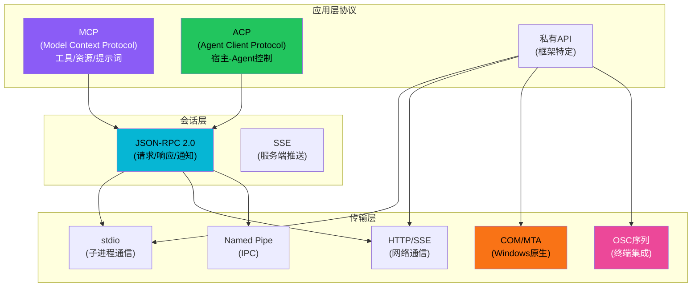
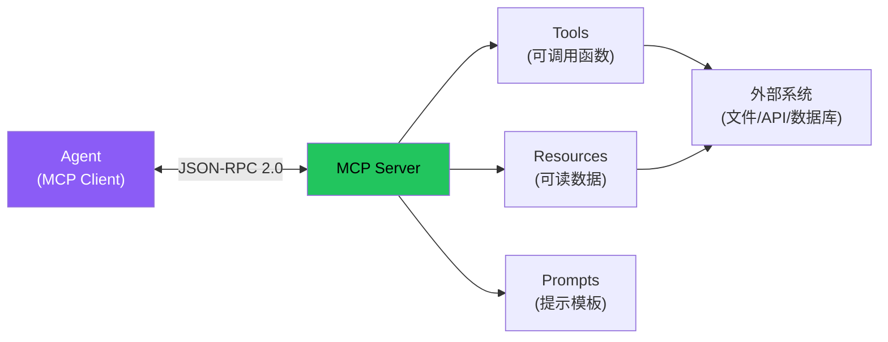
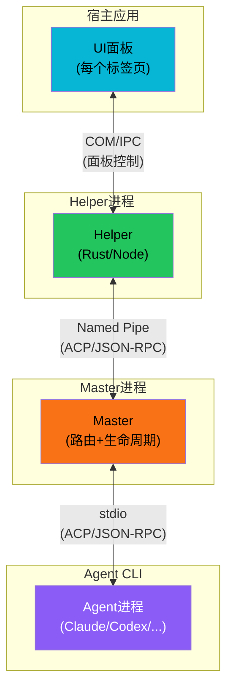
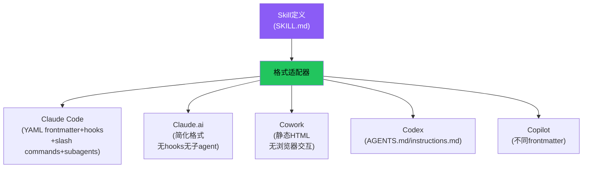

# MCP/ACP协议模式

Agent不是孤立运行的——它需要与宿主应用、外部工具、其他Agent通信。随着Agent生态成熟，通信协议正从各框架私有实现走向标准化。本概念从6个Tier3项目中提炼出Agent通信的通用协议模式：MCP（工具/数据集成）、ACP（宿主控制）、传输层抽象和适配器模式。

## 设计原理

1. **协议分层**：应用层协议（MCP/ACP）与传输层（stdio/HTTP/Named Pipe/COM）分离
2. **统一工具抽象**：无论工具来源（内置/MCP Server/自定义适配器），对Agent统一呈现为可调用函数
3. **JSON-RPC作为基础**：MCP和ACP都基于JSON-RPC 2.0，提供统一的请求-响应和通知模式
4. **传输无关**：同一协议可运行在不同传输层上
5. **适配器桥接**：非标准工具通过适配器接入统一工具系统

## 协议分层架构



## MCP：Model Context Protocol

MCP是标准化Agent如何与外部工具和数据源交互的开放协议。

### 三原语

MCP定义了三种核心原语：

| 原语 | 方向 | 用途 | 类比 |
|------|------|------|------|
| **Tools** | Server→Client | Agent可调用的函数 | 函数/RPC |
| **Resources** | Server→Client | Agent可读取的数据源 | 文件/数据库 |
| **Prompts** | Server→Client | 可复用的提示词模板 | 函数签名 |



### 通信流程

典型MCP交互序列：

```
1. 初始化握手
   Client → Server: initialize (protocolVersion, capabilities)
   Server → Client: initialize result (capabilities)

2. 能力发现
   Client → Server: tools/list
   Server → Client: [{name, description, inputSchema}]

3. 工具调用
   Client → Server: tools/call (name, arguments)
   Server → Client: {content: [{type: "text", text: "..."}]}

4. 资源读取
   Client → Server: resources/read (uri)
   Server → Client: {contents: [...]}

5. 变更通知（可选）
   Server → Client: tools/list_changed (notification)
   Server → Client: resources/updated (uri)
```

### MCP Server配置示例

```json
{
  "mcpServers": {
    "filesystem": {
      "command": "npx",
      "args": ["-y", "@modelcontextprotocol/server-filesystem", "/workspace"]
    },
    "github": {
      "command": "npx",
      "args": ["-y", "@modelcontextprotocol/server-github"],
      "env": {
        "GITHUB_PERSONAL_ACCESS_TOKEN": "${GITHUB_TOKEN}"
      }
    }
  }
}
```

## ACP：Agent Client Protocol

ACP标准化宿主应用（IDE/终端/编辑器）如何与Agent CLI进程通信，解决"任意Agent可被任意宿主集成"的问题。

### ACP解决的问题

在ACP之前，每个IDE/终端集成Agent都需要做专门适配：
- VS Code使用自己的Agent协议
- Cursor是独立实现
- Claude Code只能在终端中运行

ACP提出标准化协议，让任意Agent CLI（Claude/Codex/Copilot/Gemini）可被任意宿主集成。

### 双通道通信架构



| 通道 | 连接 | 传输 | 用途 |
|------|------|------|------|
| Helper ↔ Master | 双向 | Named Pipe | 面板控制、状态同步、消息路由 |
| Master ↔ Agent | 双向 | stdio | Agent会话、工具调用、流式输出 |

### 关键UX机制

| 机制 | 说明 |
|------|------|
| **预热启动** | 创建标签页时启动stash状态的helper，首次打开Agent面板无需等待 |
| **Stash而非Destroy** | 切换面板时保留helper进程、会话、历史，再次打开瞬间恢复 |
| **OSC 133自动检测** | Shell退出时通过OSC转义序列通知Terminal，触发Agent自动错误检测 |

### ACP消息类型

```
Session控制: session/start, session/stop, session/pause, session/resume
消息传递: message/send, message/receive (streaming)
工具调用: tool/call, tool/result (代理转发)
状态同步: state/update, state/query
事件通知: event/error, event/progress, event/complete
```

## 工具适配器模式：统一工具抽象

无论工具来源如何（内置/MCP/外部CLI/脚本），都通过适配器统一到同一接口。这是跨项目反复出现的模式。

### agency-agents的16种工具适配器

agency-agents项目通过适配器模式集成16种AI工具：

```mermaid
graph TB
    AGENT["NEXUS Agent"] --> UNIFIED["统一工具接口<br/>name/description/parameters/execute()"]
    UNIFIED --> A1["Claude Code适配器"]
    UNIFIED --> A2["Copilot适配器"]
    UNIFIED --> A3["Cursor适配器"]
    UNIFIED --> A4["["...16种...]"]

    A1 -->|convert.sh格式转换| T1["Claude CLI"]
    A2 -->|install.sh交互式安装| T2["Copilot"]
    A3 -->|roster注册| T3["Cursor"]

    style UNIFIED fill:#8b5cf6,color:#fff
    style A1 fill:#22c55e,color:#000
    style A2 fill:#f97316,color:#000
```

三种安装机制：
- **per-agent**：工具绑定到特定Agent Persona
- **roster**：工具注册到全局工具名册
- **plugin**：插件式动态加载

### 统一工具接口

```python
@dataclass
class ToolDefinition:
    """统一工具定义（跨平台通用模式）"""
    name: str                    # 工具名（kebab-case）
    description: str             # 触发描述（供LLM理解何时使用）
    parameters: dict             # JSON Schema参数定义
    source: ToolSource           # 来源：builtin/mcp/cli/script
    execute: Callable            # 执行函数

class ToolSource:
    BUILTIN = "builtin"         # 框架内置
    MCP = "mcp"                 # MCP Server提供
    CLI = "cli"                 # CLI命令（subprocess调用）
    SCRIPT = "script"           # 脚本文件
    ADAPTER = "adapter"         # 适配器转换
```

### anthropics-skills的三级资源加载作为工具发现

anthropics-skills的渐进式加载也是一种"工具/资源发现"协议：

```
Metadata层：name/description → 触发匹配（类似tools/list）
Body层：SKILL.md内容 → 指令注入（类似tools/call获取指令）
Resources层：references/scripts/evals → 按需加载（类似resources/read）
```

## 传输层模式

不同传输方式的特点和适用场景：

| 传输 | 延迟 | 适用场景 | 跨平台 | 项目实例 |
|------|------|---------|--------|---------|
| **stdio** | 极低 | 子进程通信 | ✅ 全平台 | MCP Server、Agent CLI |
| **SSE** | 低 | 服务端推送/流式输出 | ✅ 全平台 | MCP HTTP传输、流式响应 |
| **Named Pipe** | 低 | 本机IPC | ⚠️ 平台差异 | ACP helper-master |
| **HTTP/WebSocket** | 中 | 网络通信 | ✅ 全平台 | 远程MCP Server、API |
| **COM (MTA)** | 低 | Windows原生集成 | ❌ Windows | Terminal-WTA通信 |
| **OSC序列** | 极低 | 终端事件通知 | ✅ 终端 | 错误自动检测 |

### stdio：最通用的Agent传输

stdio是Agent协议最广泛使用的传输：

- Agent作为子进程启动
- stdin接收JSON-RPC请求
- stdout发送JSON-RPC响应
- stderr用于日志（不污染协议流）

```bash
# 启动MCP Server（stdio模式）
npx -y @modelcontextprotocol/server-filesystem /workspace

# Agent通过stdin/stdout与之通信
# Agent stdin → Server stdin: JSON-RPC requests
# Server stdout → Agent stdout: JSON-RPC responses
# Server stderr → 日志（Agent可忽略或记录）
```

### i-have-adhd的多平台Hook传输

i-have-adhd在不同平台使用不同的传输/注入机制：

| 平台 | 配置传输 | Hook机制 |
|------|---------|---------|
| **Claude Code** | settings.json (systemPrompt) | SessionStart/Stop/PostToolUse shell hooks |
| **Codex CLI** | ~/.codex/instructions.md | 无原生Hook，指令文件加载 |
| **Claude Desktop** | settings.json + CLAUDE.md | GUI事件绑定 |
| **跨应用Always-On** | 标记文件 + 各平台配置 | SessionStart检测标记→注入 |

### book-to-skill的CLI接口

book-to-skill的CLI是一个典型的Agent工具CLI接口：

```bash
# CLI作为工具被Agent调用
book-to-skill extract <input_file> [--mode technical|text] [--install]
book-to-skill generate <extracted_dir> [--depth reference|study]
book-to-skill --install          # 自动安装依赖
book-to-skill --interactive      # 交互式安装
```

CLI模式（4种运行模式）：
1. **Full Conversion**：完整转换（Steps 0-9）
2. **Analyze Only**：仅分析结构
3. **Generate from Prior**：从已有提取结果生成
4. **Update/Fold-in**：增量更新

## 跨平台适配模式

同一Agent Skill在不同平台/宿主上需要格式适配：



### 适配维度

| 维度 | Claude Code | Claude.ai | Codex | Cowork |
|------|------------|-----------|-------|--------|
| YAML frontmatter | ✅ 完整 | ✅ 基本 | ❌ | ✅ |
| 子Agent | ✅ | ❌ 串行 | ❌ | ❌ |
| 浏览器工具 | ✅ | ❌ | ❌ | ❌ 静态 |
| Hooks | ✅ Session hooks | ❌ | 有限 | ❌ |
| Slash Commands | ✅ | ❌ | ❌ | ❌ |
| Benchmark/Eval | ✅ | ❌ 跳过 | ❌ | ✅ 静态 |
| 流式输出 | ✅ | ✅ | ✅ | ❌ |

### 平台自动检测

Agent运行时通过环境信号检测平台：

```python
def detect_platform() -> str:
    """检测运行平台"""
    if os.environ.get('CLAUDE_CODE'): return 'claude-code'
    if os.environ.get('CODEX_CLI'): return 'codex'
    if os.environ.get('COPILOT'): return 'copilot'
    if os.environ.get('TERM_PROGRAM') == 'vscode': return 'vscode'
    # 进程名检测
    # 配置文件存在性检测
    return 'generic'
```

## 协议安全考虑

| 安全问题 | 防护措施 | 项目实例 |
|---------|---------|---------|
| **工具调用授权** | 执行前权限检查+用户确认 | i-have-adhd R10、agency-agents质量门控 |
| **路径遍历** | 文件操作路径安全检查 | book-to-skill XXE防护 |
| **命令注入** | Shell命令参数化+白名单 | 通用安全实践 |
| **Prompt注入** | 代码块豁免+注入扫描 | book-to-skill scan_generated_skill |
| **数据渗出** | 网络工具敏感数据检测 | book-to-skill exfiltration检测 |
| **MCP Server权限** | MCP工具独立权限声明 | MCP协议capabilities |
| **Always-On泄漏** | 评估时禁用全局注入 | i-have-adhd标记文件冲突 |

## 相关概念

- [Agent核心循环模式](agent-core-loop-pattern.md) — 工具调用在循环中的位置
- [插件架构模式](plugin-architecture-patterns.md) — MCP/ACP包作为插件注册
- [Provider适配器模式](provider-adapter-pattern.md) — LLM Provider也是一种适配器
- [多Agent编排模式](multi-agent-orchestration.md) — Agent间通过协议通信
