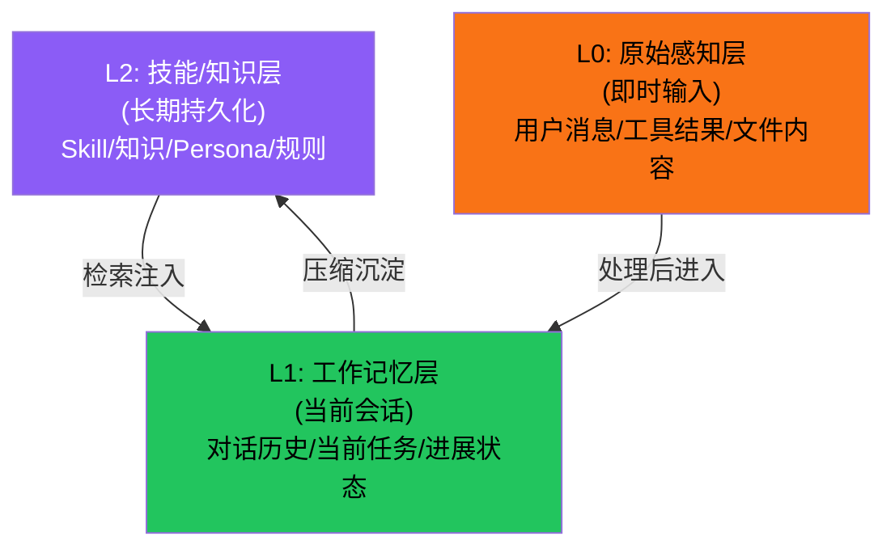
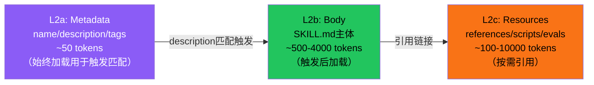
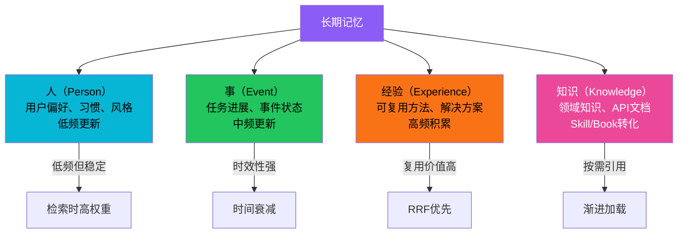
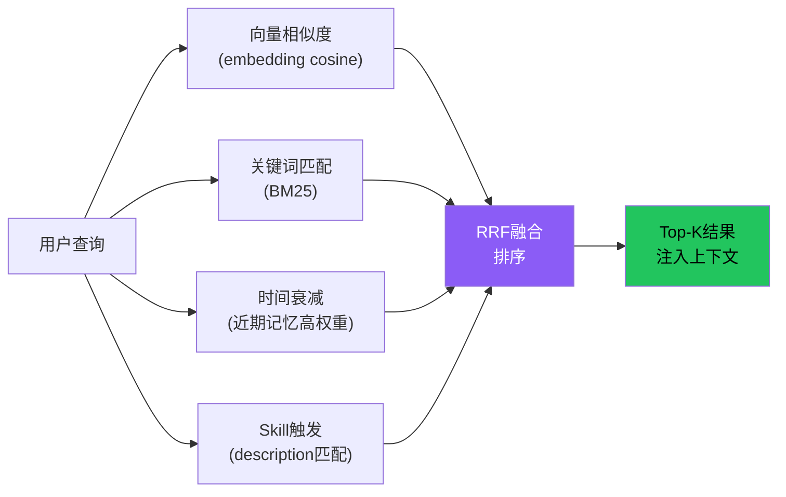
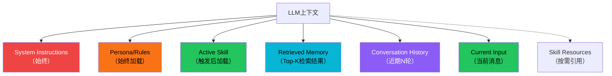

# 记忆架构模式

记忆（Memory）是Agent超越"无状态API调用"的关键能力。没有记忆，Agent每轮对话都是全新的；有了记忆，Agent可以记住之前的交互、学习用户偏好、积累知识、跨会话恢复上下文。本概念从6个Tier3项目中提炼出通用的记忆架构模式。

## 设计原理

1. **分层存储**：不同类型的信息有不同的生命周期和访问模式，需要分层存储
2. **短期≠长期**：当前对话窗口（工作记忆）和持久知识（长期记忆）是两个独立系统
3. **检索增强**：长期记忆通过语义检索按需召回，而非全部加载到上下文
4. **渐进式加载**：先加载最关键的信息，需要时再加载细节
5. **遗忘同样重要**：有效的遗忘机制和存储机制同等重要
6. **记忆是有结构的**：不是所有记忆都是文本片段——偏好、进展、技能、事实是不同类型的记忆

## 记忆分层模型

跨项目出现的通用记忆分层：



| 层级 | 生命周期 | 存储 | 访问方式 | 项目实例 |
|------|---------|------|---------|---------|
| **L0: 原始感知** | 即时 | 临时缓冲 | 直接读取 | 用户输入、工具返回 |
| **L1: 工作记忆** | 会话级 | 内存消息列表 | 全部可见 | 对话历史、当前任务状态 |
| **L2: 技能/知识** | 跨会话持久 | 文件/向量DB/Skill包 | 语义检索+渐进加载 | Skills、用户偏好、知识 |

### anthropics-skills的渐进式加载作为记忆分层

anthropics-skills的三级加载机制是记忆分层的直接体现：



这正是记忆分层原则——不把所有信息一次性加载到上下文，而是按相关性逐层加载。

### book-to-skill的四层产出物作为结构化记忆

book-to-skill将书籍转换为Skill包的过程，本质上是将**非结构化知识**转化为**分层结构化记忆**：

| 产出层 | 对应记忆层 | token量 | 加载时机 |
|--------|----------|---------|---------|
| full_text.txt | L0原始层 | ~100K+ tokens | 提取阶段一次性读取，AI生成时通过REPL式grep/sed访问 |
| chapters/*.md | L2c资源层 | 每章~1-3K tokens | 按需加载（被SKILL.md引用时） |
| glossary/patterns/cheatsheet | L2b知识层 | 每文件~1-2K tokens | 加载SKILL.md后按需引用 |
| SKILL.md | L2a核心层 | ≤4K tokens | **始终加载**（对应Metadata+核心Body） |

```
传统方式：全书119K-256K tokens常驻上下文 → 每轮重复消耗
book-to-skill：SKILL.md ~4K tokens始终加载 + 单章节按需加载 → 效率提升24-51倍
```

## 短期记忆（工作记忆）

短期记忆对应当前会话窗口，维护消息历史：

```python
class ShortTermMemory:
    """短期记忆：当前会话的消息历史"""

    def __init__(self, max_tokens: int = 8000):
        self.messages: list[Message] = []
        self.max_tokens = max_tokens
        self._current_tokens = 0

    def add(self, message: Message):
        """添加消息，超出预算时触发压缩"""
        self.messages.append(message)
        self._current_tokens += estimate_tokens(message)
        self._maybe_compact()

    def get_context(self) -> list[Message]:
        """获取当前上下文窗口内的消息"""
        return self.messages

    def _maybe_compact(self):
        """Token超出预算时压缩早期消息"""
        if self._current_tokens <= self.max_tokens:
            return
        # 策略：保留system prompt + 最近N轮，摘要更早的消息
        # 详见上下文压缩模式
```

### i-have-adhd的会话状态记忆

i-have-adhd的`.adhd-session.json`是短期记忆持久化的实例——将会话状态保存到磁盘以便下次恢复：

```json
{
  "session_id": "2026-08-22T14-30-00",
  "project_path": "/home/user/projects/my-app",
  "task": "修复用户登录bug",
  "status": "in_progress",
  "current_step": 3,
  "total_steps": 5,
  "completed_steps": [
    "1. 复现了登录失败问题",
    "2. 定位到auth.ts第87行"
  ],
  "current_focus": "修复refresh token过期时间判断",
  "next_actions": [
    "修改比较逻辑",
    "添加单元测试",
    "验证修复"
  ],
  "open_files": ["src/auth.ts"],
  "interrupted_at": "2026-08-22T15:45:00Z"
}
```

这种"中断-恢复"模式对ADHD用户尤为重要——他们经常在任务中途被打断，需要快速回到"我做到哪了"。

## 长期记忆

长期记忆跨会话持久化，通过检索按需召回。

### 记忆分区模式

跨项目出现的记忆分区（Semantic Partitioning）模式：



| 分区 | 存储内容 | 更新频率 | 检索策略 |
|------|---------|---------|---------|
| **Person** | 用户偏好、沟通风格、习惯 | 低频，稳定 | 高权重，始终加载 |
| **Event** | 任务状态、会话历史、进展 | 中频，随任务变化 | 时间衰减（近期高权重） |
| **Experience** | 可复用方法、问题解决方案 | 高频，持续积累 | RRF融合检索 |
| **Knowledge** | Skills、书籍转化、领域知识 | 低频添加 | 渐进式加载（description触发） |

### i-have-adhd的偏好记忆

i-have-adhd的`preferences.json`是Person分区的典型实例：

```json
{
  "version": 1,
  "preferences": {
    "detail_level": "balanced",
    "max_paragraph_sentences": 3,
    "max_list_items": 5,
    "emoji_level": "minimal",
    "code_block_max_lines": 30,
    "confirm_destructive": true,
    "auto_progress_markers": true,
    "explanation_mode": "after_action",
    "language": "zh"
  },
  "custom_overrides": {
    "code_block_max_lines": 50
  },
  "updated_at": "2026-08-22T10:00:00Z"
}
```

偏好记忆的关键原则：
- **显式确认才持久化**：用户明确表达的偏好（"代码块可以长一点"）才保存，不基于单次行为推断
- **可覆盖**：custom_overrides优先级高于默认值
- **跨会话保持**：偏好写入磁盘，所有会话共享

### Skill/Book作为知识记忆

anthropics-skills和book-to-skill的Skill包是Knowledge分区的实例——将专家知识编码为结构化的Markdown文件：

```
~/.claude/skills/
├── pdf/
│   ├── SKILL.md          # 核心知识（始终加载）
│   ├── references/       # 参考资料（按需）
│   └── scripts/          # 自动化脚本（按需）
├── book-to-skill/
│   └── SKILL.md
└── i-have-adhd/
    └── SKILL.md
```

## 记忆检索模式

### RRF融合检索

多路召回 + RRF（Reciprocal Rank Fusion）融合是跨项目出现的检索模式：

```
RRF_score(d) = Σ 1/(k + rank_i(d))
```



其中k通常取60，多路召回各自给出排名，RRF将排名融合为最终排序。

### anthropics-skills的description触发检索

Skill的触发机制是一种轻量级检索——通过YAML frontmatter中的`description`字段匹配用户意图：

```yaml
---
name: pdf
description: Use when the user wants to extract text from, merge, split, or manipulate PDF files.
---
```

当用户说"帮我合并这几个PDF"时，description中的关键词匹配触发Skill加载。这本质上是一种**基于规则的轻量级语义检索**，无需向量数据库。

## 上下文组装策略

记忆检索后，需要将检索到的记忆组装为LLM可见的上下文。通用公式：

```
Model Context = System Instructions          ← 始终存在
              + Core Persona/Rules           ← Person分区（始终加载）
              + Active Skill Body            ← Knowledge分区（触发后加载）
              + Retrieved Memory (Top-K)     ← Experience/Event分区（检索后注入）
              + Recent Conversation History  ← L1工作记忆
              + Current User Input           ← L0感知层
              + Skill Resources (on-demand)  ← Knowledge分区（引用时加载）
```



### 上下文预算分配

不同层级的记忆有不同的token预算：

| 组件 | 预算占比 | 说明 |
|------|---------|------|
| System + Persona | ~10% | 固定指令，始终存在 |
| Active Skill Body | ~20% | 核心Skill内容（≤4K tokens） |
| Retrieved Memory | ~15% | Top-K检索结果 |
| Conversation History | ~45% | 近期对话（随对话增长动态压缩） |
| Current Input | ~5% | 当前用户消息 |
| 输出预留 | ~5% | 为模型输出预留空间 |

## 记忆压缩策略

当工作记忆超出token预算时，需要压缩：

```mermaid
graph TB
    OVERFLOW["Token超限"] --> STRATEGY["选择压缩策略"]
    STRATEGY -->|早期消息| SUMMARIZE["摘要早期对话<br/>N轮→1条摘要"]
    STRATEGY Retrieved Memory --> PRUNE["修剪低相关度记忆<br/>降低Top-K"]
    STRATEGY -->|Skill Resources| UNLOAD["卸载非核心资源<br/>保留SKILL.md核心"]
    STRATEGY -->|极端情况| SLIDING["滑动窗口<br/>仅保留最近N轮"]

    SUMMARIZE --> CHECK{"Token<br/>仍超限?"}
    PRUNE --> CHECK
    UNLOAD --> CHECK
    CHECK -->|是| SLIDING
    CHECK -->|否| CONTINUE["继续循环"]

    style OVERFLOW fill:#ef4444,color:#fff
    style SUMMARIZE fill:#f97316,color:#000
    style SLIDING fill:#eab308,color:#000
```

## 遗忘机制

有效的遗忘和存储同等重要：

| 遗忘策略 | 实现方式 | 适用场景 |
|---------|---------|---------|
| **时间衰减** | 旧记忆在检索时权重降低 | 事件记忆（Event） |
| **滑动窗口** | 只保留最近N轮对话 | 短期记忆压缩 |
| **摘要替换** | 早期对话→摘要→原文丢弃 | 对话历史压缩 |
| **显式遗忘** | 用户说"忘记这个"→删除对应记忆 | 隐私/错误信息 |
| **版本更新** | 新偏好覆盖旧偏好 | Person分区 |
| **LRU淘汰** | 最久未使用的记忆被淘汰 | 缓存型记忆 |

### i-have-adhd的会话清理

任务完成后清理`.adhd-session.json`——已完成的任务不需要保留在恢复状态中，但生成的会话摘要保留7天供参考。

## 记忆模式对比

| 模式 | i-have-adhd | book-to-skill | anthropics-skills | agency-agents |
|------|-------------|---------------|-------------------|---------------|
| **短期记忆** | 消息历史+会话状态 | 提取文本缓冲 | SKILL.md Body | Workspace上下文 |
| **偏好记忆** | preferences.json | 提取模式选择 | 用户配置 | Division Persona |
| **知识记忆** | 10条规则(SKILL.md) | SKILL.md+chapters | SKILL.md+references | Agent MD模板 |
| **进展记忆** | .adhd-session.json | metadata.json | eval结果 | NEXUS阶段状态 |
| **检索方式** | Hook注入 | REPL式grep | description触发 | Division匹配 |
| **加载策略** | SessionStart注入 | 四层渐进 | 三级渐进 | Workspace隔离 |

## 相关概念

- [Agent核心循环模式](agent-core-loop-pattern.md) — 记忆在循环中的检索和更新时机
- [插件架构模式](plugin-architecture-patterns.md) — 记忆系统作为插件注册
- [多Agent编排模式](multi-agent-orchestration.md) — 多Agent间的记忆共享与隔离
- [MCP/ACP协议模式](mcp-acp-protocols.md) — MCP Resources作为外部记忆源
