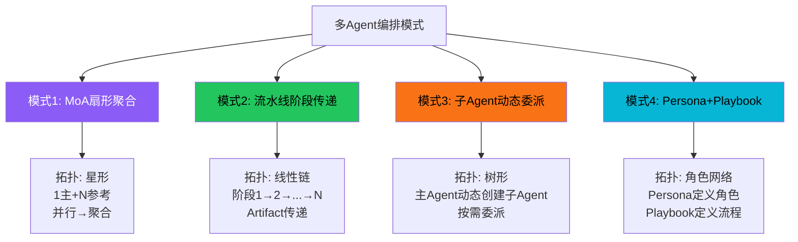
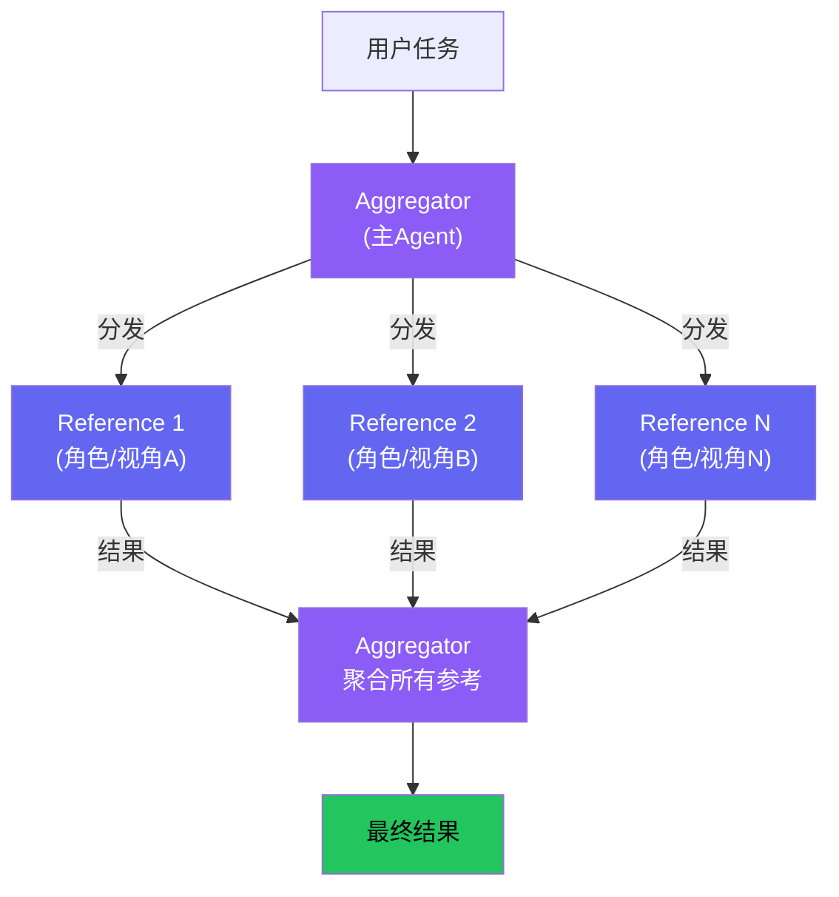
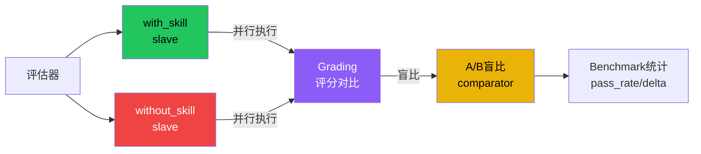
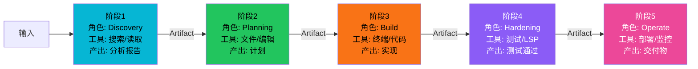
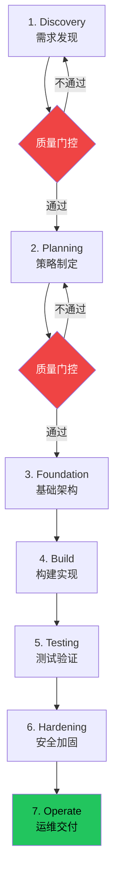
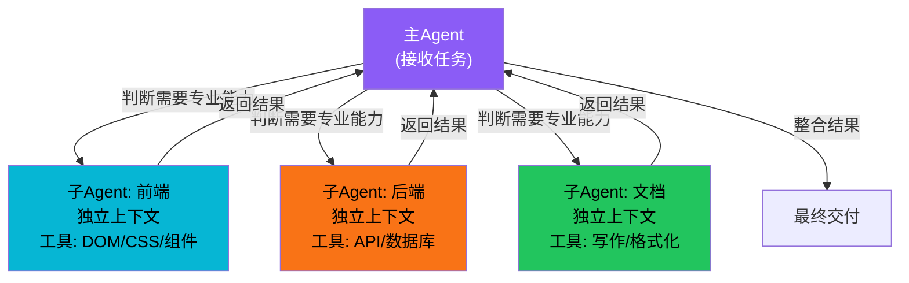
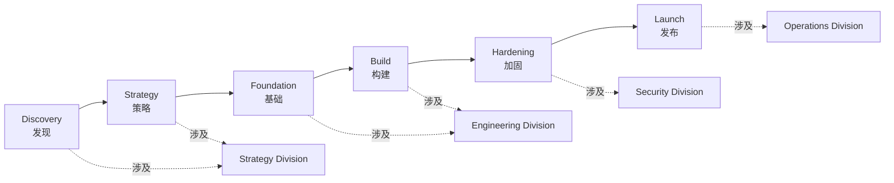
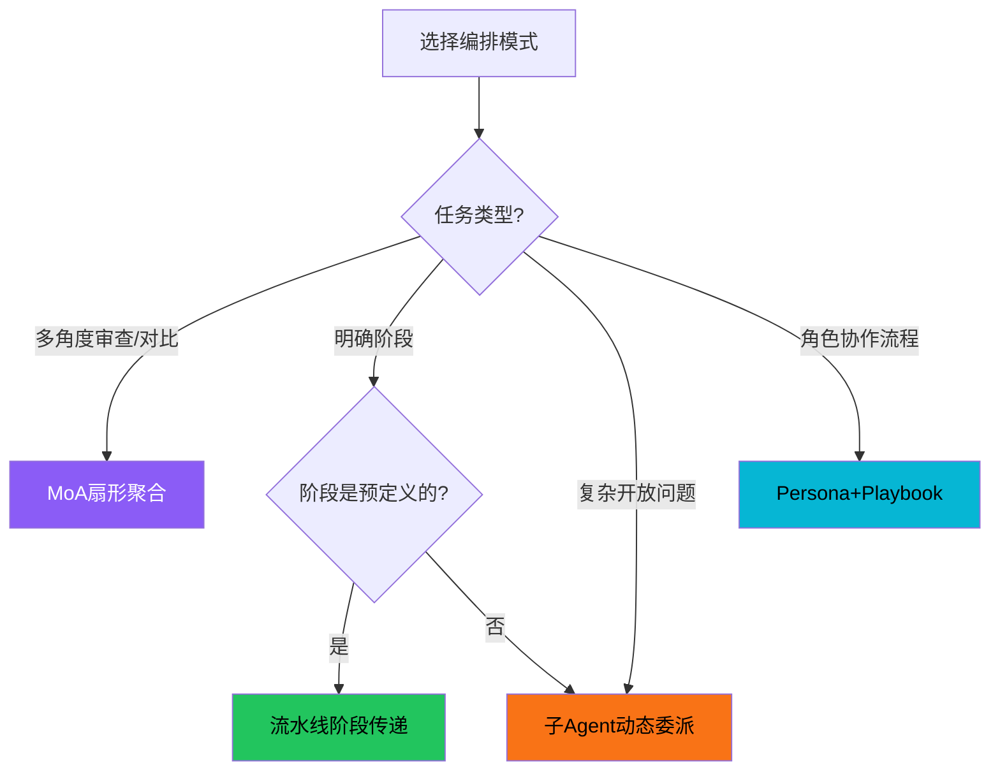
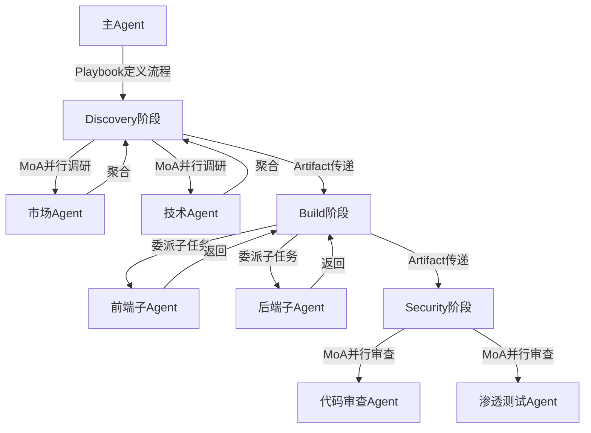

# 多Agent编排模式

单个Agent能做的事情有限——复杂任务往往需要多个specialized Agent分工协作。多智能体编排研究如何组织多个Agent共同完成复杂任务。本概念从6个Tier3项目中提炼出四种主流编排模式：MoA扇形聚合、流水线阶段传递、子Agent动态委派、Persona+Playbook角色编排。

## 设计原理

1. **分工专业化**：不同Agent有不同角色/工具/Persona，各自擅长特定任务
2. **拓扑决定通信**：不同的协作拓扑（星形/线性/树形/网状）决定了Agent间的通信模式
3. **上下文隔离**：每个Agent只看到与自己任务相关的上下文，减少噪声和token消耗
4. **质量门控**：阶段间设置检查点，上一阶段通过后才能进入下一阶段
5. **聚合优于竞争**：多视角结果聚合比单Agent决策质量更高

## 四种编排模式总览



## 模式1：MoA扇形聚合（Mixture of Agents）

核心思想：**reference fan-out → aggregator** 两阶段推理。主Agent（Aggregator）将任务分发给多个参考Agent（References），参考Agent并行处理后返回结果，主Agent聚合所有结果生成最终回复。



### anthropics-skills评估中的MoA变体

anthropics-skills的评估框架是MoA模式的变体——双slave并行运行：



关键差异：标准MoA聚合"更好"的结果，而评估框架**对比**两个条件的差异。但底层模式相同——并行多Agent执行→结果聚合/对比。

### MoA设计要点

| 要点 | 说明 |
|------|------|
| **模型异构** | References可使用不同模型（GPT-4/Claude/DeepSeek）利用各自强项 |
| **视角多样性** | References可赋予不同角色（安全审查/性能审查/代码审查） |
| **并行执行** | Reference阶段并行，延迟≈最慢的那个reference |
| **接口透明** | Aggregator对外暴露统一接口，调用方不感知内部MoA结构 |

### 适用场景

- 代码/方案的多角度审查
- 复杂问题的多路径求解
- A/B对比评估（如anthropics-skills的with/without对比）
- 需要高置信度答案的场景（多模型交叉验证）

## 模式2：流水线阶段传递（Pipeline/Workspace）

核心思想：将任务分解为**有序阶段**，每个阶段（Workspace）有独立的上下文、工具权限和角色Persona，上一阶段的产出（Artifact）作为下一阶段的输入。



### agency-agents的NEXUS 7阶段流水线

agency-agents的NEXUS编排框架是流水线模式的典型实例：



### 三种部署模式

| 模式 | 阶段执行 | 适用场景 |
|------|---------|---------|
| **Full** | 全部7阶段 | 完整项目生命周期 |
| **Sprint** | Build→Testing→Hardening | 迭代开发 |
| **Micro** | Build→Testing | 快速修复/小功能 |

### 工具隔离机制

每个阶段只看到自己可用的工具集：

```
Discovery阶段：搜索工具、文件读取、网络访问
Planning阶段：文件读写、模板生成
Foundation阶段：脚手架工具、配置工具
Build阶段：终端、代码编辑、Git
Testing阶段：测试运行器、LSP、覆盖率工具
Hardening阶段：安全扫描、性能分析
Operate阶段：部署工具、监控工具
```

这防止了"Build阶段Agent意外执行部署命令"等错误。

### 流水线vs单循环

| 维度 | 单Agent循环 | 流水线模式 |
|------|-----------|----------|
| 工具可见性 | 所有工具始终可见 | 每个阶段只看到相关工具 |
| 上下文 | 全部对话历史 | 前序Artifact+当前阶段指令 |
| 错误隔离 | 一个错误可能破坏整个任务 | 阶段边界提供故障隔离 |
| 复杂度 | 单循环管理所有状态 | 每个阶段逻辑简单 |
| Persona | 单一角色 | 每个阶段有专业角色 |

### book-to-skill的10步流水线

book-to-skill的四层产出流水线也是流水线模式：

```
范围检查→提取→成本预估→结构分析→用途选择→命名→章节摘要→辅助文件→SKILL.md→安全扫描→报告
```

每个阶段的产出传递给下一阶段，且有明确的质量门控（安全扫描非零退出则停止）。

## 模式3：子Agent动态委派

核心思想：主Agent可以**动态创建子Agent**执行子任务，子Agent运行在独立上下文中，完成后返回结果。与MoA的区别是：子Agent不是预配置的，而是主Agent根据任务需要**按需创建**的。



### 与MoA和流水线的区别

| 维度 | MoA | 流水线 | 子Agent委派 |
|------|-----|-------|-----------|
| 拓扑 | 星形(1+N) | 线性链 | 树形（主→子） |
| 预定义 | Reference预配置 | 阶段序列预定义 | 子Agent动态创建 |
| 通信 | References间不通信 | 线性传递Artifact | 子Agent完成后返回主Agent |
| 上下文 | References看到完整问题 | 每个阶段看到input+prompt | 子Agent看到委派的子任务 |
| 数量 | 固定N个reference | 固定N个阶段 | 动态决定（0到N个） |

### 子Agent创建模式

```python
# 概念：子Agent委派接口
async def delegate_subagent(
    task: str,           # 子任务描述
    tools: list[str],    # 可用工具白名单
    persona: str,        # 子Agent角色/Persona
    context: dict = None # 传入上下文
) -> SubagentResult:
    """创建子Agent执行子任务，返回结果"""
    subagent = await create_subagent(
        system_prompt=persona,
        allowed_tools=tools,
        input=task,
        context=context
    )
    result = await subagent.run()
    return result
```

## 模式4：Persona + Playbook角色编排

agency-agents独创的编排模式——不是运行时框架，而是通过**Markdown Persona文件+Playbook流程文件**定义多Agent协作的角色和流程，可以在任意支持Markdown Persona的Agent框架上运行。

### Persona Division体系

agency-agents将Agent按专业领域组织为17个部门（Division），约270个Agent：

```mermaid
graph TB
    NEXUS["NEXUS编排器"] --> DIV1["Strategy Division<br/>(策略/规划)"]
    NEXUS --> DIV2["Engineering Division<br/>(工程/开发)"]
    NEXUS --> DIV3["Design Division<br/>(设计/UX)"]
    NEXUS --> DIV4["Security Division<br/>(安全/审计)"]
    NEXUS --> DIV5["["...17个部门...]"]

    DIV1 --> A1["产品经理 Agent"]
    DIV1 --> A2["技术架构师 Agent"]
    DIV2 --> A3["前端开发 Agent"]
    DIV2 --> A4["后端开发 Agent"]
    DIV2 --> A5["DevOps Agent"]

    style NEXUS fill:#8b5cf6,color:#fff
    style DIV1 fill:#06b6d4,color:#000
    style DIV2 fill:#22c55e,color:#000
    style DIV3 fill:#f97316,color:#000
    style DIV4 fill:#ef4444,color:#fff
```

每个Agent Persona通过标准化的Markdown模板定义：

```markdown
---
name: 前端开发专家
description: 负责React/Svelte组件开发、CSS样式、前端性能优化
color: "#06b6d4"
division: engineering
---

# Role
你是一位资深前端开发专家...

# Capabilities
- React/Svelte组件开发
- CSS/Tailwind样式
- 前端性能优化

# Tools
- 文件读写
- 终端执行
- 浏览器预览
```

### Playbook流程定义

Playbook定义多Agent协作的6阶段标准流程：



Runbooks是预定义的协作场景模板：

| Runbook | 场景 |
|---------|------|
| 企业功能开发 | 完整产品功能的多部门协作 |
| 事件响应 | 安全事件的快速响应流程 |
| 营销活动 | 营销内容的创作和发布 |
| 创业MVP | 从0到1的快速产品开发 |

### Persona编排的优势

1. **框架无关**：Markdown Persona可在Claude Code、Copilot、Codex等任意框架运行
2. **可组合**：不同Playbook组合不同Division的Agent
3. **可审计**：Persona文件是纯文本，可版本控制和审查
4. **低门槛**：创建新Agent只需写一个Markdown文件，无需写代码

## 编排模式选择指南



| 场景 | 推荐模式 | 项目实例 |
|------|---------|---------|
| 代码/方案多角度审查 | MoA扇形聚合 | anthropics-skills双slave评估 |
| 有明确步骤的复杂任务 | 流水线阶段传递 | agency-agents NEXUS、book-to-skill |
| 开放域问题动态分解 | 子Agent动态委派 | 子Agent工具 |
| 多角色协作流程定义 | Persona+Playbook | agency-agents 17部门+Playbook |
| 快速搭建协作流程 | Persona+Playbook | agency-agents Runbooks |

## 混合编排

实际项目中经常混合使用多种模式：



agency-agents的NEXUS Full模式就是混合编排：Playbook定义流程（模式4）、阶段间Artifact传递（模式2）、阶段内可能并行调研（模式1）、需要时动态创建子任务（模式3）。

## 相关概念

- [Agent核心循环模式](agent-core-loop-pattern.md) — 单个Agent的循环是多Agent编排的基础
- [插件架构模式](plugin-architecture-patterns.md) — 多Agent编排框架本身常是插件化的
- [记忆架构模式](memory-architecture-patterns.md) — 多Agent间的记忆共享和隔离
- [MCP/ACP协议模式](mcp-acp-protocols.md) — Agent间通信的标准化协议
