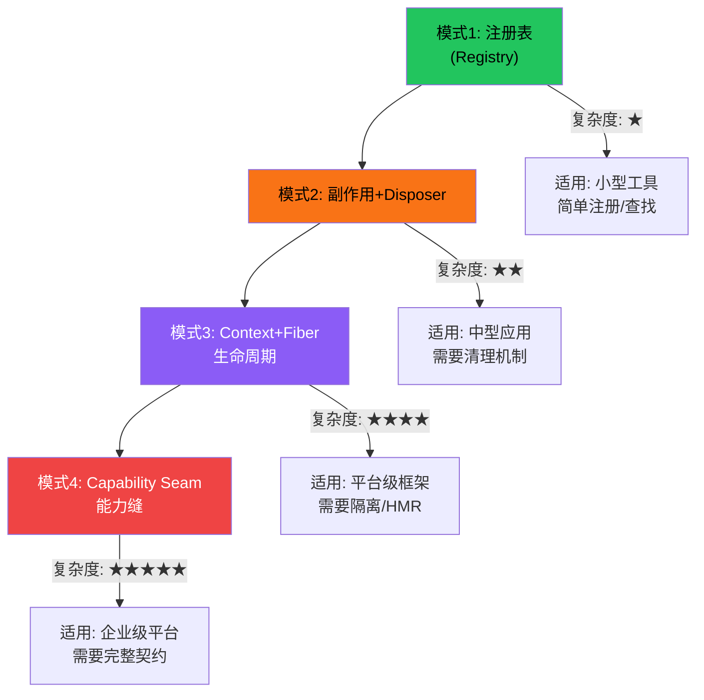
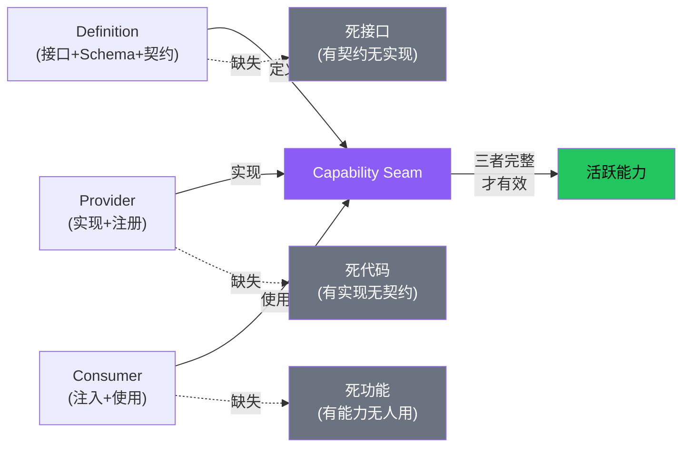
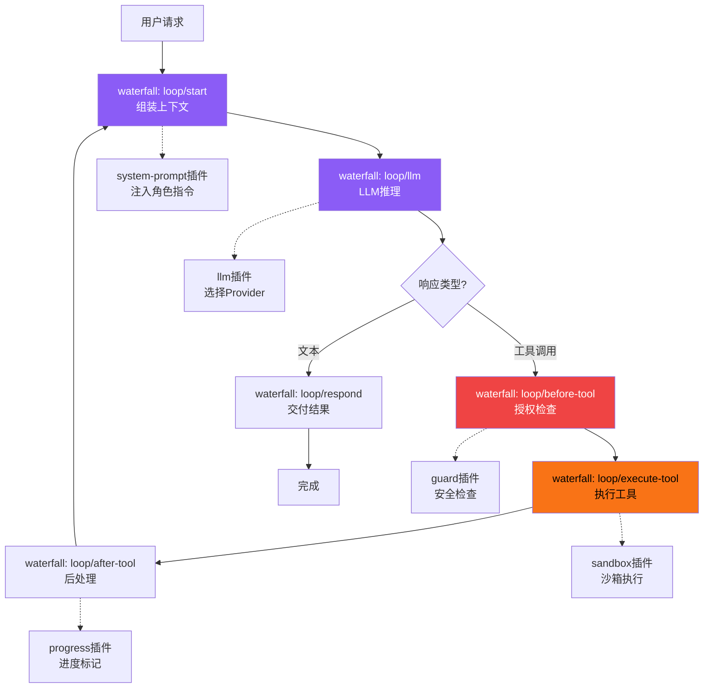

# 插件架构模式

插件化架构是现代Agent框架的基石——核心保持精简，功能通过插件扩展。从简单的工具注册表到复杂的Cordis Fiber生命周期，不同项目在"可扩展性"上展现了从简单到复杂的演进路径。本概念从6个Tier3项目中提炼出四种通用插件架构模式，并分析其适用场景和设计权衡。

## 设计原理

1. **核心精简**：框架核心只提供最小功能集，所有扩展能力通过插件提供
2. **控制反转**：插件不调用核心，核心调用插件——依赖方向单向
3. **生命周期管理**：插件有明确的加载/激活/卸载状态
4. **隔离性**：插件之间相互隔离，一个插件出错不影响全局
5. **声明式组合**：通过配置文件而非代码组合插件
6. **三角色完整**：每个能力点需要Definition（接口）、Provider（实现）、Consumer（使用者）三者完整

## 四种插件模式复杂度阶梯



## 模式1：注册表（Registry Pattern）

最简单的插件模式——中心化字典存储插件实例，提供register/get/list方法。

### 结构

```python
class Registry[T]:
    """通用注册表"""
    def __init__(self):
        self._items: dict[str, T] = {}

    def register(self, name: str, item: T) -> None:
        self._items[name] = item

    def unregister(self, name: str) -> None:
        self._items.pop(name, None)

    def get(self, name: str) -> T | None:
        return self._items.get(name)

    def list_all(self) -> list[T]:
        return list(self._items.values())
```

### 跨项目实例

| 项目 | 注册表应用 |
|------|----------|
| **agency-agents** | 16种AI工具适配器注册表（convert.sh转换+install.sh安装） |
| **agency-agents** | 17部门Persona注册表（divisions.json SSOT） |
| **anthropics-skills** | Skill注册表——Metadata层（name/description/tags）用于发现和匹配 |
| **agency-agents-app** | 三源Catalog注册表（bundled/managed/userClone） |

### agency-agents-app的三源Catalog注册

```typescript
// 三源Catalog模型
class CatalogRegistry {
    private sources: Map<CatalogSource, Catalog> = new Map();

    registerCatalog(source: CatalogSource, catalog: Catalog) {
        this.sources.set(source, catalog);
    }

    // 按优先级合并：userClone > managed > bundled
    getInstallableSkills(): Skill[] {
        const bundled = this.sources.get('bundled')?.listSkills() ?? [];
        const managed = this.sources.get('managed')?.listSkills() ?? [];
        const user = this.sources.get('userClone')?.listSkills() ?? [];
        return this.reconcile(bundled, managed, user);
    }

    private reconcile(bundled, managed, user) {
        // 模块级去重：userClone覆盖managed覆盖bundled
        // 版本选择：最新版本优先
        // 冲突解决：用户修改的优先级最高（modified状态）
    }
}
```

### 注册表模式优缺点

| 优点 | 缺点 |
|------|------|
| 简单直观，易于理解 | 无生命周期管理（注册后如何初始化？何时销毁？） |
| O(1)查找 | 无依赖注入（插件间依赖需手动管理） |
| 易于实现 | 无隔离（一个插件错误影响全局） |
| 适合简单场景 | 无热更新支持 |

## 模式2：副作用注册 + Disposer

比简单注册表更进一步——注册时执行初始化逻辑，返回disposer函数用于清理。

### 结构

```typescript
class PluginSystem {
    private disposers: Array<() => void> = [];

    /** 注册插件：setup执行初始化，返回清理函数 */
    effect(setup: () => (() => void) | void): void {
        const disposer = setup();
        if (disposer) {
            this.disposers.push(disposer);
        }
    }

    /** 卸载所有插件（逆序执行disposer） */
    dispose(): void {
        for (let i = this.disposers.length - 1; i >= 0; i--) {
            this.disposers[i]();
        }
        this.disposers = [];
    }
}
```

### 使用示例

```typescript
// 注册一个工具插件
system.effect(() => {
    // 初始化：注册工具
    toolRegistry.register("web_search", searchHandler);
    console.log("web_search tool registered");

    // 返回disposer
    return () => {
        toolRegistry.unregister("web_search");
        console.log("web_search tool unregistered");
    };
});

// 注册一个事件监听
system.effect(() => {
    const handler = (event) => console.log("Event:", event);
    eventBus.on("loop:complete", handler);
    return () => eventBus.off("loop:complete", handler);
});
```

### 跨项目实例

| 项目 | Disposer模式应用 |
|------|----------------|
| **i-have-adhd** | SessionStart/Stop Hook的注册和清理 |
| **book-to-skill** | 提取器依赖的import检查→fallback链构建→dispose时释放资源 |
| **anthropics-skills** | Skill加载时注册资源引用，卸载时清理临时文件 |

## 模式3：Context原型链 + Fiber生命周期

Cordis框架引入的高级插件模式，核心是三个抽象：Context（原型链式作用域）、Fiber（插件生命周期）、Service（可注入服务）。

### Context：原型链式作用域

```typescript
class Context {
    readonly root: Context;
    private store: Map<symbol, any> = new Map();

    /** 创建子上下文（继承父上下文所有服务） */
    extend(): Context {
        const child = Object.create(this);  // 原型链继承
        child.store = new Map();
        return child;
    }

    /** 创建隔离边界（屏蔽特定服务） */
    isolate(filter: symbol): Context {
        const child = this.extend();
        child.isolated = new Set([...(this.isolated || []), filter]);
        return child;
    }

    /** 拦截/覆盖配置 */
    intercept(config: object): Context {
        const child = this.extend();
        child.config = { ...this.config, ...config };
        return child;
    }
}
```

三种扩展操作：

| 操作 | 行为 | 类比 |
|------|------|------|
| `extend()` | 创建子上下文，继承所有服务 | 子类继承 |
| `isolate()` | 屏蔽特定服务 | 进程隔离 |
| `intercept()` | 覆盖配置 | 环境变量覆盖 |

### Fiber：插件生命周期状态机

```
PENDING → LOADING → ACTIVE → DISPOSED
                  ↘ FAILED
                  ↘ UNLOADING → DISPOSED
```

```typescript
class Fiber {
    status: 'PENDING' | 'LOADING' | 'ACTIVE' | 'FAILED' | 'UNLOADING' | 'DISPOSED';
    private effects: Array<() => void | Promise<void>> = [];
    private dependencies: Set<string>;

    /** 注册副作用 */
    effect(setup: () => (() => void) | void): void {
        this.effects.push(setup);
    }

    /** 启动 */
    async start(): Promise<void> {
        this.status = 'LOADING';
        try {
            this.checkDependencies();
            for (const eff of this.effects) {
                const disposer = await eff();
                if (disposer) this.cleanups.push(disposer);
            }
            this.status = 'ACTIVE';
        } catch (e) {
            this.status = 'FAILED';
            throw e;
        }
    }

    /** 销毁（逆序清理） */
    async dispose(): Promise<void> {
        this.status = 'UNLOADING';
        for (let i = this.cleanups.length - 1; i >= 0; i--) {
            await this.cleanups[i]();
        }
        this.status = 'DISPOSED';
    }

    /** 重启（HMR热更新） */
    async restart(): Promise<void> {
        await this.dispose();
        await this.start();
    }
}
```

### 依赖注入

```typescript
// 声明式注入
ctx.inject(['llm', 'fs'], (llm, fs) => {
    // llm和fs是解析后的服务实例
    // 当依赖变化时自动重新执行
});
```

### 五种事件分发模式

| 模式 | 行为 | 适用场景 |
|------|------|---------|
| `emit` | 同步广播，忽略返回值 | 通知类事件 |
| `parallel` | 并行Promise.allSettled | 独立并行任务 |
| `serial` | 串行异步，遇truthy提前返回 | 管道处理 |
| `bail` | 同步串行，遇truthy提前返回 | 快速查找 |
| `waterfall` | 中间件模式，必须next()传递 | Agent循环、请求处理链 |

**waterfall模式**是Agent循环的核心机制——每个插件通过waterfall监听在循环的不同阶段插入逻辑。

### agency-agents-app中的waterfall-like模式

agency-agents-app的Tauri后端虽然不用Cordis，但命令处理链类似waterfall：

```rust
// 概念：Tauri命令处理链
#[tauri::command]
async fn install_skill(app: AppHandle, skill_id: String, source: String) -> Result<()> {
    // 1. 前置检查（类似waterfall第一个监听器）
    validate_skill_id(&skill_id)?;
    check_disk_space().await?;

    // 2. 核心操作（类似waterfall中间监听器）
    let catalog = resolve_catalog(&source)?;
    let skill = catalog.get_skill(&skill_id)?;

    // 3. 安装执行（类似waterfall后续监听器）
    install_skill_files(skill).await?;
    update_installed_registry(&skill_id).await?;

    // 4. 后处理（类似waterfall最后监听器）
    emit_install_event(&app, &skill_id)?;
    Ok(())
}
```

## 模式4：Capability Seam（能力缝）

deepseek-harness在Cordis基础上提出的最完整插件模式——每个能力由三部分组成：Definition（接口+Schema）、Provider（实现+注册）、Consumer（使用方）。三者缺一不可。



### 三角色定义

| 角色 | 职责 | 缺失后果 |
|------|------|---------|
| **Definition** | 定义接口、JSON Schema、配置格式、事件类型 | 接口没有契约，类型不安全 |
| **Provider** | 实现接口，注册到Context，处理配置 | 接口定义了但无法使用 |
| **Consumer** | 通过依赖注入使用服务，声明依赖 | 能力存在但无人使用（死代码） |

### anthropics-skills的三层加载作为Seam

anthropics-skills的渐进式加载是Capability Seam的一个实例：

- **Definition**：SKILL.md格式规范（6个YAML字段、4种body模式、<500行原则）
- **Provider**：Skill加载器实现（三级加载：Metadata→Body→Resources）
- **Consumer**：Agent运行时（通过description匹配触发加载）

```
Metadata层（Definition）：name/description/tags → 触发匹配
Body层（Provider实现）：SKILL.md主体内容 → 注入上下文
Resources层（Consumer使用）：references/、scripts/、evals/ → 按需引用
```

### book-to-skill的可选依赖作为Seam

book-to-skill的三层依赖分组也是Seam模式：

- **Definition**：解析器接口（`extract(path) -> text + metadata`）
- **Provider**：各依赖组提供的具体解析器（pdftotext/pypdf/Docling...）
- **Consumer**：提取器主流程（统一调用`extract_single_file()`）

## 声明式插件组合

高级插件框架支持通过YAML配置文件声明式组合插件：

```yaml
# cordis.yml 概念示例（对应agency-agents-app的插件组合）
plugins:
  # 核心命令
  tauri-backend:
    commands:
      - skill-management    # 安装/卸载/更新
      - catalog-management  # Catalog源管理
      - keyring-auth        # OAuth Device Flow
  # UI框架
  svelte5-runes:
    theme: three-state     # light/dark/system
    navigation: seven-sections
    shortcuts: global
  # 存储
  catalog-store:
    sources: [bundled, managed, userClone]
    install-states: [current, outdated, modified, removed, foreign]
```

## 事件瀑布流：Agent循环的插件化

waterfall事件模式使得Agent循环本身可以完全插件化：



每个waterfall节点可以插入多个插件监听器，新功能通过注册新的监听器添加，不需要修改核心循环代码。

## 四种模式对比

| 维度 | 注册表 | 副作用+Disposer | Context+Fiber | Capability Seam |
|------|--------|----------------|---------------|----------------|
| 生命周期 | ❌ | ✅ dispose清理 | ✅ Fiber状态机 | ✅ Fiber状态机 |
| 依赖注入 | ❌ 手动 | ❌ 手动 | ✅ @Inject/ctx.inject | ✅ Service inject |
| 隔离性 | ❌ 全局 | ❌ 全局 | ✅ extend/isolate | ✅ isolate |
| 热更新 | ❌ | ❌ | ✅ Fiber.restart() | ✅ HMR |
| 配置管理 | ❌ | ❌ | ✅ intercept+YAML | ✅ 声明式YAML |
| 事件系统 | ❌ | ❌ | ✅ 5种模式 | ✅ waterfall链 |
| 接口契约 | ❌ | ❌ | ❌ | ✅ Definition+Schema |
| 复杂度 | ★☆☆☆☆ | ★★☆☆☆ | ★★★★☆ | ★★★★★ |
| 项目实例 | agency-agents工具注册 | i-have-adhd Hooks | agency-agents-app命令链 | anthropics-skills加载 |

## 模式选择指南

| 场景 | 推荐模式 |
|------|---------|
| 简单工具注册/查找 | 注册表模式 |
| 需要初始化/清理的插件 | 副作用+Disposer |
| 需要插件隔离、热更新、复杂依赖 | Context+Fiber |
| 企业级平台、需要完整类型安全和契约 | Capability Seam |
| 多个插件按顺序处理同一请求 | waterfall事件链 |

## 相关概念

- [Agent核心循环模式](agent-core-loop-pattern.md) — waterfall插件链如何实现Agent循环
- [Provider适配器模式](provider-adapter-pattern.md) — Provider作为插件注册到框架
- [多Agent编排模式](multi-agent-orchestration.md) — 多Agent本身也可以是插件化的
- [MCP/ACP协议模式](mcp-acp-protocols.md) — MCP Server作为外部插件集成
