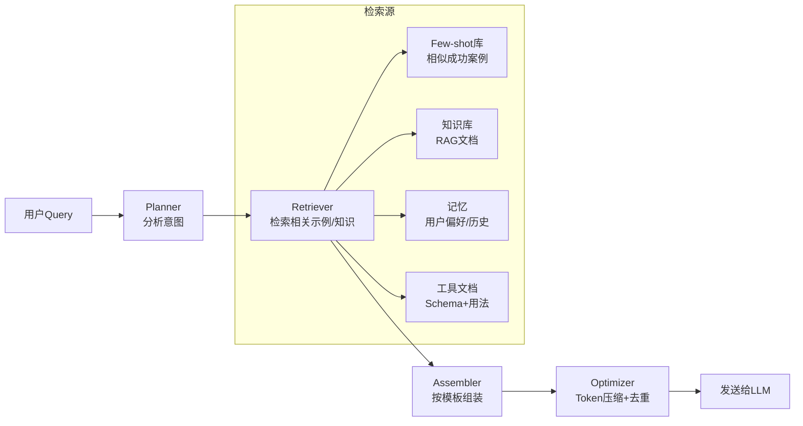

# Prompt工程架构模式

Prompt是Agent的"灵魂代码"——它定义了Agent的角色、能力边界、输出格式、思维链约束和工具使用策略。在成熟的Agent框架中，Prompt不是硬编码的字符串，而是一个有架构的系统：分层组织、动态组装、按需注入、版本管理。

## 1. Prompt架构的四种范式


### 范式1：静态模板（book-to-skill / i-have-adhd / anthropics-skills）

最简单直接的方式：一个Markdown文件定义完整系统提示词，运行时做简单变量替换。

```python
# anthropics/skills/ 中典型模式
SYSTEM_PROMPT = """You are a helpful assistant with access to the following skills:
{skills_list}

When a skill is relevant, use it. Otherwise, respond naturally.

Available commands:
{commands_list}
"""

def build_prompt(skills: list, commands: list) -> str:
    return SYSTEM_PROMPT.format(
        skills_list="\n".join(f"- {s.name}: {s.description}" for s in skills),
        commands_list="\n".join(f"- {c.name}: {c.usage}" for c in commands),
    )
```

**适用场景**：小工具、单一功能Agent、教学项目。
**优势**：直观、易读、易调试。
**劣势**：扩展性差，复杂场景下prompt会膨胀到不可维护。

### 范式2：分层角色组装（hermes-agent / Second-Me）

将系统提示词拆分为多个职责层，每层独立维护，运行时按顺序拼接。

```python
# hermes-agent/agent/conversation_loop.py — 分层组装模式
def build_system_prompt(agent_config: AgentConfig, context: ConversationContext) -> list[Message]:
    sections = []
    
    # L1: 核心角色定义（固定，永远加载）
    sections.append(load_template("role/core-identity.md", {
        "agent_name": agent_config.name,
        "personality": agent_config.personality,
    }))
    
    # L2: 能力与工具描述（根据可用工具动态生成）
    if context.tools:
        sections.append(build_tools_section(context.tools))
    
    # L3: 记忆注入（短期记忆+相关长期记忆）
    if context.memories:
        sections.append(build_memory_section(context.memories))
    
    # L4: 当前任务/目标（会话级）
    if context.current_task:
        sections.append(load_template("task/current-task.md", {
            "task": context.current_task,
            "constraints": context.constraints,
        }))
    
    # L5: 输出格式约束（固定）
    sections.append(load_template("format/output-schema.md"))
    
    return "\n\n".join(sections)
```

**层设计原则**：
- **L1 角色层**：身份、性格、核心原则（几乎不变）
- **L2 能力层**：可用工具、API、技能（随配置变化）
- **L3 记忆层**：历史摘要、用户偏好、相关知识（RAG检索）
- **L4 任务层**：当前任务描述、约束条件、期望结果（每次任务变化）
- **L5 格式层**：输出格式要求（JSON Schema、Markdown规范等）

### 范式3：动态组装+Token预算（veadk-python / zleap-agent）

在分层基础上增加Token预算管理——上下文窗口有限时，智能决定保留哪些内容、压缩哪些内容。

```typescript
// Zleap-Agent/packages/core/src/prompt/builder.ts — Token预算分配
class PromptBuilder {
  private tokenBudget: number;
  
  async build(input: PromptInput): Promise<ChatMessage[]> {
    const budget = new TokenBudget(this.tokenBudget);
    
    // 1. 系统提示词（固定占比 20%）
    const systemMsg = await this.buildSystemPrompt(input.config);
    budget.reserve(systemMsg, 0.20);
    
    // 2. 工具定义（固定占比 15%）
    const toolMsgs = await this.buildToolDescriptions(input.tools);
    budget.reserve(toolMsgs, 0.15);
    
    // 3. 记忆/知识（弹性占比 0-25%，根据相关性截断）
    const memoryMsg = await this.buildMemorySection(
      input.memories, 
      budget.remaining * 0.25
    );
    budget.reserve(memoryMsg);
    
    // 4. 对话历史（弹性占比 剩余空间，越近的越优先保留）
    const historyMsgs = await this.compactHistory(
      input.history, 
      budget.remaining
    );
    
    // 5. 当前输入（必须保留）
    const userMsg = { role: 'user', content: input.query };
    
    return [systemMsg, ...toolMsgs, memoryMsg, ...historyMsgs, userMsg];
  }
}
```

**Token预算分配策略**：
| 组件 | 预算占比 | 压缩策略 |
|------|---------|---------|
| 系统角色+格式 | 15-20% | 不可压缩（核心指令） |
| 工具Schema | 10-20% | 只加载当前可能用到的工具 |
| RAG知识 | 0-25% | 按相关性排序截断 |
| 对话历史 | 剩余 | 最近消息优先，旧消息摘要 |
| 用户输入 | 必须保留 | 不可压缩 |

### 范式4：提示词流水线（deepseek-harness）

最复杂的模式，将Prompt构建视为一个数据处理流水线，包含规划、检索、组装、优化四个阶段。



## 2. 关键设计模式

### 2.1 Few-shot示例动态选择

不硬编码示例，而是根据当前任务动态检索最相关的成功案例作为Few-shot。

```python
# Second-Me/app/prompts/few_shot.py — 语义检索示例
class FewShotSelector:
    def __init__(self, example_db: VectorStore):
        self.db = example_db
    
    def select(self, query: str, k: int = 3, tool_name: str = None) -> list[Example]:
        """根据当前query检索最相似的成功示例"""
        filter_dict = {"tool": tool_name} if tool_name else None
        results = self.db.similarity_search(
            query, k=k, filter=filter_dict
        )
        return [Example.from_doc(r) for r in results]
```

**对比**：
- 静态Few-shot：写死在prompt中，简单但无法覆盖所有场景
- 动态Few-shot：向量检索，相关性高但增加系统复杂度和延迟

### 2.2 上下文压缩策略

对话历史增长时需要压缩，三种主流策略：

| 策略 | 实现方式 | 采用项目 | 效果 |
|------|---------|---------|------|
| 滑动窗口 | 保留最近N轮 | book-to-skill | 简单但丢失早期上下文 |
| 摘要压缩 | LLM总结旧对话 | hermes, veadk | 保留语义但丢失细节，耗token |
| 混合策略 | 近N轮原文+更早摘要 | zleap, second-me | 最佳平衡，实现复杂 |

### 2.3 系统提示词的模块化

大型框架中，系统提示词按功能拆分为可复用模块（"Prompt Snippets"）：

```
prompts/
├── core/
│   ├── identity.md          # 你是谁
│   ├── principles.md        # 核心原则
│   └── safety.md            # 安全约束
├── tools/
│   ├── file-tools.md        # 文件工具使用说明
│   ├── shell-tools.md       # Shell工具使用说明
│   └── tool-format.md       # 工具调用格式
├── memory/
│   ├── memory-format.md     # 记忆注入格式
│   └── recall-strategy.md   # 记忆检索策略
└── format/
    ├── response-format.md   # 响应格式
    └── error-handling.md    # 错误处理指令
```

hermes-agent和deepseek-harness均采用这种目录结构，好处是：
- 团队协作：不同人维护不同模块
- A/B测试：可以替换单个模块测试效果
- 版本控制：每个模块独立版本历史
- 按需加载：只加载当前Agent需要的模块

## 3. 跨项目Prompt架构对比

| 特性 | hermes | veadk | zleap | deepseek | intelligent | second-me | book-to-skill |
|------|--------|-------|-------|----------|-------------|-----------|---------------|
| 分层组织 | ✅5层 | ✅4层 | ✅5层 | ✅流水线 | ✅C++模板 | ✅4层 | ❌单文件 |
| Token预算 | ❌ | ✅ | ✅ | ✅ | ❌ | ❌ | ❌ |
| 动态Few-shot | ❌ | ❌ | ✅ | ✅ | ❌ | ✅ | ❌ |
| 上下文压缩 | ✅摘要 | ✅ | ✅混合 | ✅ | ❌ | ✅ | ❌ |
| 模块化Snippet | ✅ | ✅ | ✅ | ✅ | ❌ | ✅ | ❌ |
| 工具描述自动 | ✅ | ✅ | ✅ | ✅ | ✅ | ✅ | ❌ |
| 版本化Prompt | ❌ | ❌ | ❌ | ✅ | ❌ | ❌ | ❌ |

## 4. 反模式与教训

1. **巨型单文件Prompt**：早期项目常把所有指令塞进一个2000行的system prompt，无法维护、无法调试、无法A/B测试。所有Tier 1框架都已迁移到模块化架构。

2. **硬编码工具描述**：手动维护工具的文字描述，当工具代码更新时描述不同步。正确做法是从工具Schema/装饰器自动生成描述。

3. **无Token预算管理**：不限定各部分token占比，导致对话历史膨胀时系统提示词被截断，Agent失去核心指令。zleap-agent和deepseek-harness的Token预算机制是生产级必需。

4. **Prompt中的自然语言歧义**："尽量简洁"、"适当的时候"这类模糊指令在Prompt中是灾难。好的Prompt应该是**精确的、可执行的、有示例的**，接近程序设计语言的风格。

5. **忽视Prompt注入防护**：用户输入如果直接拼接到系统提示词区域，可以覆盖系统指令。所有生产级框架都有用户输入与系统指令的严格分隔（不同的message role）。

---

**相关概念**：
- [记忆架构模式](memory-architecture-patterns.md) — 记忆注入是Prompt L3层的核心
- [Agent核心循环](agent-core-loop-pattern.md) — Prompt构建在每次循环迭代中发生
- [Provider适配器模式](provider-adapter-pattern.md) — 不同模型对Prompt格式有不同要求

**跨项目参考**：
- 🔬 hermes-agent: [分层Prompt构建](external/libs/models/ai/hermes-agent/agent/prompts/)
- 🔬 deepseek-harness: [Prompt流水线](external/libs/models/ai/deepseek-harness/packages/harness/src/prompt/)
- 🔬 zleap-agent: [Token预算管理](external/libs/models/ai/Zleap-Agent/packages/core/src/prompt/builder.ts)
- 🔬 Second-Me: [Few-shot检索](external/libs/models/ai/Second-Me/app/prompts/)
