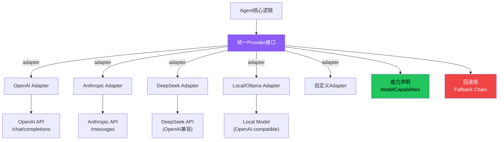
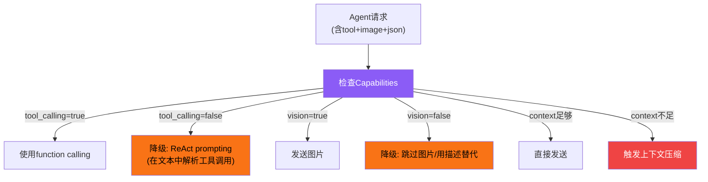
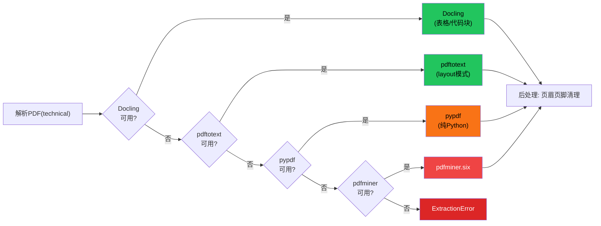

# Provider 适配器模式

LLM提供商（OpenAI、Anthropic、DeepSeek、本地模型等）的API存在显著差异——消息格式、工具调用协议、流式输出、认证方式各不相同。Provider适配器模式通过统一接口层屏蔽这些差异，让上层Agent逻辑用同一套API与任何模型交互。本概念从6个Tier3项目的实践中提炼出通用的Provider抽象模式。

## 设计原理

1. **统一接口**：所有Provider实现相同的核心方法（complete/stream/count_tokens）
2. **能力声明**：每个模型显式声明支持什么（function calling/vision/thinking/context window），不支持时自动降级
3. **格式转换在边界**：消息格式转换是Provider内部的事，上层不感知格式差异
4. **优雅回退**：Provider不可用时自动回退到备选方案
5. **声明式配置**：通过配置而非代码切换Provider，支持运行时动态切换

## 通用适配器架构



## 统一接口

所有Provider适配器必须实现的核心接口：

```python
from abc import ABC, abstractmethod
from dataclasses import dataclass
from typing import AsyncIterator, Optional

@dataclass
class Message:
    """统一消息格式"""
    role: str  # system | user | assistant | tool
    content: str | list[ContentBlock]
    tool_calls: Optional[list[ToolCall]] = None
    tool_call_id: Optional[str] = None
    name: Optional[str] = None

@dataclass
class ContentBlock:
    """多模态内容块"""
    type: str  # text | image | tool_use | tool_result
    text: Optional[str] = None
    image: Optional[ImageContent] = None

@dataclass
class ModelCapabilities:
    """模型能力声明"""
    tool_calling: bool = True
    vision: bool = False
    streaming: bool = True
    extended_thinking: bool = False
    cache_breakpoints: bool = False  # Anthropic prompt caching
    max_context_tokens: int = 128000
    max_output_tokens: int = 4096
    supports_json_mode: bool = True
    supports_parallel_calls: bool = True

class BaseLLMProvider(ABC):
    """LLM Provider基类"""

    @abstractmethod
    async def complete(
        self,
        messages: list[Message],
        tools: Optional[list[ToolDefinition]] = None,
        stream: bool = False,
        **kwargs
    ) -> LLMResponse:
        """统一的聊天补全接口"""
        ...

    @abstractmethod
    async def stream(
        self,
        messages: list[Message],
        tools: Optional[list[ToolDefinition]] = None,
        **kwargs
    ) -> AsyncIterator[StreamChunk]:
        """流式输出"""
        ...

    @abstractmethod
    def count_tokens(self, messages: list[Message]) -> int:
        """Token计数"""
        ...

    @property
    @abstractmethod
    def capabilities(self) -> ModelCapabilities:
        """返回模型能力声明"""
        ...
```

## 消息格式转换：核心差异点

不同Provider之间最繁琐的工作是消息格式转换。以下是关键差异：

### System Prompt 处理

| Provider | System prompt 位置 |
|----------|-------------------|
| OpenAI | `role: "system"` 消息 |
| Anthropic | 顶层 `system` 参数（不在messages中） |
| DeepSeek | `role: "system"` 消息（OpenAI兼容） |
| Local (Ollama) | `role: "system"` 消息 |

```python
# Anthropic Adapter的system提取
def _to_anthropic_messages(self, messages):
    system_parts = []
    chat_messages = []
    for msg in messages:
        if msg.role == "system":
            system_parts.append(msg.content)
        else:
            chat_messages.append(self._convert_message(msg))
    return "\n".join(system_parts), chat_messages
```

### Tool Calling 格式

| 方面 | OpenAI | Anthropic |
|------|--------|-----------|
| 工具调用表示 | `message.tool_calls[]` | `content` 中的 `tool_use` block |
| 工具结果消息 | `role: "tool"` | `content` 中的 `tool_result` block |
| 工具ID | `tool_call.id` | `tool_use.id` |
| 并行调用 | `tool_calls` 数组 | 多个 `tool_use` block |

```python
# OpenAI格式 → 统一格式
def _from_openai_response(self, response):
    message = response.choices[0].message
    tool_calls = []
    if message.tool_calls:
        for tc in message.tool_calls:
            tool_calls.append(ToolCall(
                id=tc.id,
                name=tc.function.name,
                arguments=json.loads(tc.function.arguments)
            ))
    return LLMResponse(
        text=message.content or "",
        tool_calls=tool_calls,
        usage=Usage(response.usage.prompt_tokens, response.usage.completion_tokens)
    )
```

## 能力声明与降级策略

模型能力声明不仅是元数据——它驱动运行时行为：



### 降级策略实例

| 能力缺失 | 降级方案 | 项目实例 |
|---------|---------|---------|
| 不支持function calling | ReAct prompting（文本中解析 `Action: tool_name(args)`） | 本地模型适配 |
| 不支持vision | 跳过图像内容，用文本描述替代 | 文本模型处理多模态请求 |
| 不支持streaming | 使用非流式complete，全量返回 | 简单HTTP客户端 |
| 上下文窗口不足 | 更激进的压缩/摘要策略 | 所有框架的compaction逻辑 |
| 不支持parallel calls | 顺序逐个执行工具调用 | 基础模型适配 |

## 回退链模式：从book-to-skill解析器到Provider

book-to-skill的多格式解析器回退链是Provider回退模式的经典实例：



将此模式推广到LLM Provider：

```python
class FallbackProvider(BaseLLMProvider):
    """Provider回退链"""

    def __init__(self, providers: list[BaseLLMProvider]):
        self.providers = providers  # 按优先级排序

    async def complete(self, messages, **kwargs):
        last_error = None
        for provider in self.providers:
            try:
                return await provider.complete(messages, **kwargs)
            except (RateLimitError, APIError, ConnectionError) as e:
                last_error = e
                continue  # 尝试下一个provider
        raise last_error

    @property
    def capabilities(self):
        # 返回所有provider的能力并集的最小值（最保守估计）
        return ModelCapabilities(
            tool_calling=all(p.capabilities.tool_calling for p in self.providers),
            vision=all(p.capabilities.vision for p in self.providers),
            max_context_tokens=min(p.capabilities.max_context_tokens for p in self.providers),
        )
```

## 注册表模式：声明式Provider管理

```python
class ProviderRegistry:
    """Provider注册表"""

    def __init__(self):
        self._providers: dict[str, type[BaseLLMProvider]] = {}
        self._models: dict[str, ModelConfig] = {}

    def register_provider(self, name: str, adapter: type[BaseLLMProvider]):
        self._providers[name] = adapter

    def register_model(self, model_id: str, config: ModelConfig):
        self._models[model_id] = config

    def get_client(self, model_id: str) -> BaseLLMProvider:
        config = self._models[model_id]
        adapter_class = self._providers[config.provider]
        return adapter_class(model=config.model_name, **config.auth)

# 使用示例
registry = ProviderRegistry()
registry.register_provider("openai", OpenAIAdapter)
registry.register_provider("anthropic", AnthropicAdapter)
registry.register_provider("deepseek", DeepSeekAdapter)

registry.register_model("gpt-4o", ModelConfig(
    provider="openai",
    model_name="gpt-4o-2024-08-06",
    capabilities=ModelCapabilities(vision=True, max_output_tokens=16384)
))
registry.register_model("claude-sonnet", ModelConfig(
    provider="anthropic",
    model_name="claude-sonnet-4-20250514",
    capabilities=ModelCapabilities(
        vision=True, extended_thinking=True, cache_breakpoints=True
    )
))

client = registry.get_client("claude-sonnet")
```

## SKILL.md格式适配：anthropics-skills的跨平台兼容

anthropics-skills项目展示了Provider/平台适配的另一个维度——同一Skill在不同环境中需要不同格式：

| 环境 | 适配点 |
|------|--------|
| Claude Code | YAML frontmatter支持完整、slash commands、hooks、子Agent |
| Claude.ai | 无子Agent、无浏览器工具、跳过benchmark/eval |
| Cowork（无头） | 静态HTML输出、无浏览器交互 |

```python
# 概念：格式适配器
class SkillFormatAdapter:
    def adapt(self, skill_md: str, target_platform: str) -> str:
        if target_platform == "claude-code":
            return skill_md  # 原生格式，无需转换
        elif target_platform == "claude-ai":
            return self._adapt_for_web(skill_md)
        elif target_platform == "copilot":
            return self._convert_to_copilot_format(skill_md)
        elif target_platform == "codex":
            return self._convert_to_agenda_md(skill_md)
```

## Token计数策略

| 策略 | 准确度 | 速度 | 适用场景 |
|------|--------|------|---------|
| **模型tokenizer** | 最准确 | 需加载tokenizer模型 | 生产环境 |
| **tiktoken（OpenAI模型）** | 对OpenAI模型准确 | 快 | OpenAI模型 |
| **启发式估算** | 粗略（words/0.75） | 极快 | book-to-skill成本预估 |
| **字符数/4** | 粗略 | 极快 | 快速检查 |

```python
# book-to-skill的启发式估算
def estimate_tokens(text: str) -> int:
    return int(len(text.split()) / 0.75)  # ~0.75词/token
```

## 错误处理模式

| 错误类型 | 处理策略 |
|---------|---------|
| **Rate Limit (429)** | 指数退避重试（初始1s，最大60s，最多3次） |
| **API Error (5xx)** | 切换到备用Provider |
| **Authentication Error (401)** | 报告配置错误，不重试 |
| **Context Overflow** | 自动压缩后重试1次 |
| **Timeout** | 增加超时时间重试1次，然后切换Provider |
| **Model Not Found** | 回退到该Provider的默认模型 |

## 相关概念

- [Agent核心循环模式](agent-core-loop-pattern.md) — Provider在循环中的位置（阶段2：LLM推理）
- [插件架构模式](plugin-architecture-patterns.md) — Provider注册与插件系统的关系
- [MCP/ACP协议模式](mcp-acp-protocols.md) — MCP工具协议与Provider抽象的互补关系
