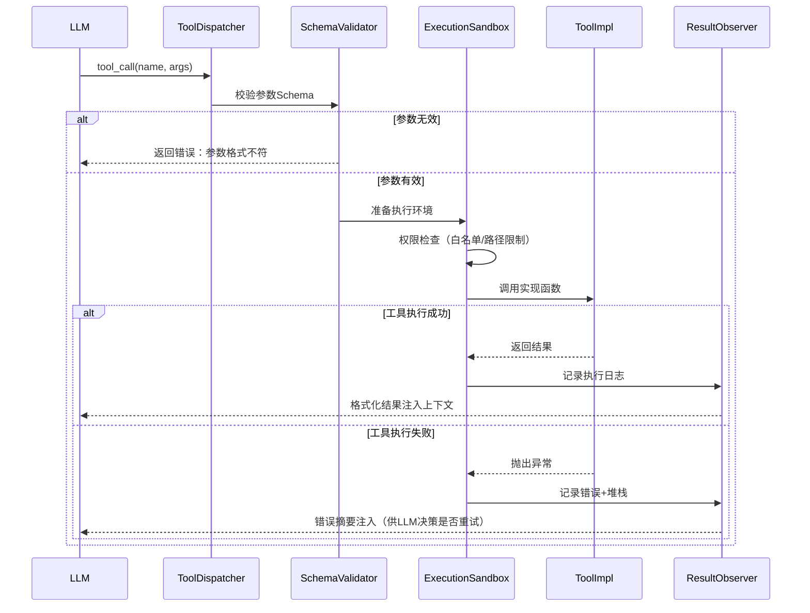
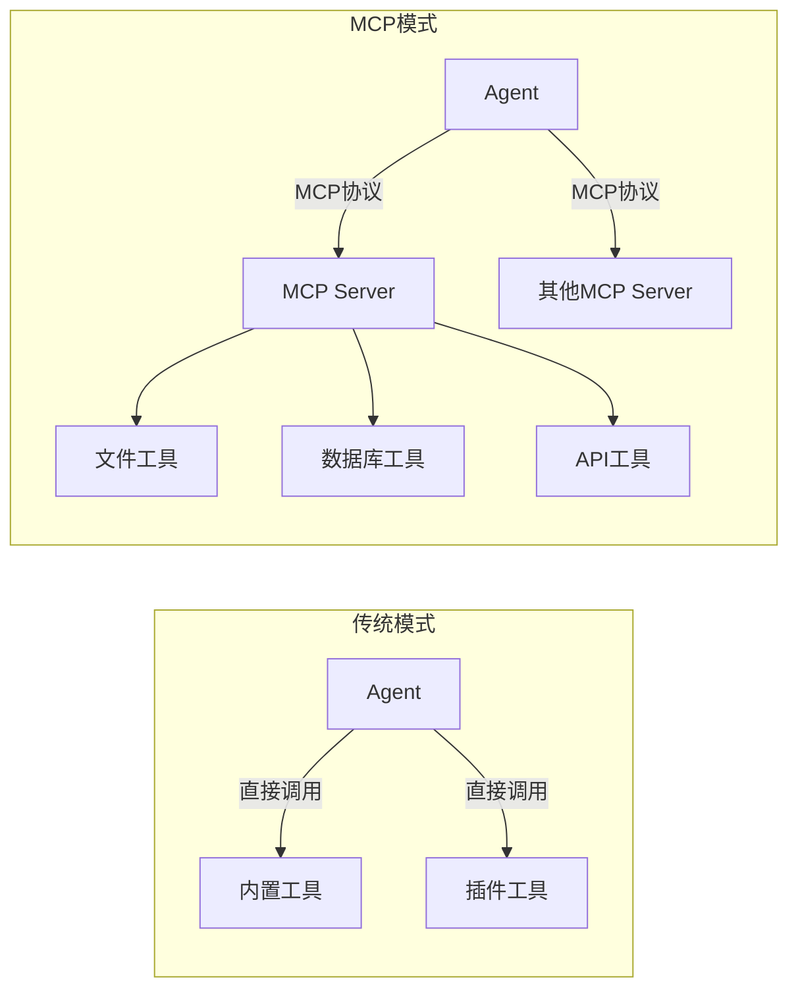

# 工具系统设计模式

工具系统是AI Agent与外部世界交互的核心接口。LLM本身只能生成文本，通过工具调用（Function Calling）才能操作文件、执行命令、访问网络、调用API。一个设计良好的工具系统直接决定了Agent的能力边界和安全边界。

## 1. 工具系统的四大架构模式

通过12个Agent项目的源码对比，工具系统存在四种主流架构范式：

```mermaid
graph TB
    subgraph "模式A：Python装饰器注册"
        A1["@tool decorator"] --> A2["函数签名→Schema"]
        A2 --> A3["全局ToolRegistry"]
    end
    subgraph "模式B：Cordis Service模式"
        B1["Service定义"] --> B2["Context API暴露"]
        B2 --> B3["Fiber插件自动注册"]
    end
    subgraph "模式C：Schema注册模式"
        C1["JSON Schema声明"] --> C2["handler映射"]
        C2 --> C3["动态加载/卸载"]
    end
    subgraph "模式D：原生代码绑定"
        D1["C++/Rust函数"] --> D2["V8/JS桥接"]
        D2 --> D3["ACP协议暴露"]
    end
```



### 模式A：Python装饰器模式（hermes-agent / veadk-python / anthropics-skills）

Python生态中最主流的工具定义方式。使用装饰器将普通Python函数标记为工具，通过反射自动生成JSON Schema。

```python
# hermes-agent/tools/file_tools.py — 装饰器模式典型实现
@tool(
    name="read_file",
    description="Read the contents of a file at the given path",
    parameters={
        "path": {"type": "string", "description": "Absolute path to the file"}
    }
)
def read_file(path: str) -> str:
    """Read file contents with encoding detection."""
    with open(path, 'r', encoding='utf-8', errors='replace') as f:
        return f.read()
```

**关键设计点**：
- `@tool`装饰器同时完成：Schema生成、注册入库、参数类型校验
- 函数docstring自动作为工具描述（回退机制）
- 类型注解（type hints）驱动JSON Schema自动生成
- 工具实例全局注册到`ToolRegistry`单例

### 模式B：Cordis Service模式（deepseek-harness / cordis）

在TypeScript插件框架Cordis中，工具通过Service机制暴露，利用依赖注入实现松耦合。

```typescript
// cordis/packages/cordis/src/context.ts — Service模式核心
class Context {
  // 工具作为Service注入，每个Fiber自动继承
  provide(name: string, service: any) {
    this[Context.handler].set(name, service);
  }
  
  // 插件可以extend Context，添加新工具API
  extend(meta: Partial<PluginMeta>, callback: (ctx: Context) => void) {
    const fiber = this.locate({}, meta.name);
    callback(fiber);  // fiber自带隔离作用域
  }
}

// deepseek-harness中注册工具示例
ctx.implement('tool/registry', (tools) => {
  tools.register({
    name: 'shell_exec',
    schema: z.object({ cmd: z.string() }),
    handler: async ({ cmd }) => execAsync(cmd),
  });
});
```

**关键设计点**：
- 工具=Service，通过DI容器自动注入
- Fiber隔离：每个Agent实例有独立工具视图
- 插件`extend`机制动态添加工具，无需修改核心代码
- 支持工具的热加载/卸载（插件启停）

### 模式C：Schema注册模式（agency-agents / book-to-skill）

Markdown或YAML中声明工具Schema，运行时绑定handler。常见于配置驱动的Agent系统。

```yaml
# agency-agents中的工具声明
- name: web_search
  description: Search the web for information
  parameters:
    type: object
    properties:
      query: { type: string, description: "Search query" }
    required: [query]
  handler: builtin.web_search  # 映射到内置实现
```

**关键设计点**：
- 声明式定义：非程序员也能配置工具
- handler延迟绑定：Schema与实现分离
- 支持工具市场/工具包分发
- 劣势：缺乏编译时类型检查

### 模式D：原生代码绑定（intelligent-terminal / agency-agents-app）

C++/Rust实现高性能工具，通过V8引擎桥接或ACP协议暴露给JS/TS层。

```cpp
// intelligent-terminal/src/helper/terminal_session.cpp — 原生工具绑定
void TerminalSession::RegisterTool(v8::Isolate* isolate) {
    // 将C++ Shell执行函数暴露给V8
    node::AddFunctionToContext(isolate, context, "ExecuteCommand", 
        [this](const v8::FunctionCallbackInfo<v8::Value>& args) {
            String::Utf8Value cmd(isolate, args[0]);
            auto result = ExecuteShellCommand(*cmd);
            args.GetReturnValue().Set(NewString(isolate, result));
        });
}
```

**关键设计点**：
- 原生代码性能优势（终端IO、文件系统密集操作）
- V8/JS桥接实现跨语言调用
- ACP（Agent Communication Protocol）标准化工具暴露
- 需要额外的类型编解码层

## 2. 工具执行生命周期

所有项目的工具执行都遵循相同的生命周期模型：



### 关键设计决策

| 阶段 | 设计选项 | 采用项目 | 权衡 |
|------|---------|---------|------|
| Schema校验 | Pydantic(TypeScript: Zod) | hermes, veadk, deepseek | 强校验+类型安全，运行时开销小 |
| | JSON Schema手动验证 | agency-agents, book-to-skill | 声明式灵活，但容易校验遗漏 |
| 执行沙箱 | 进程隔离（subprocess） | zleap-agent, hermes | 安全性高，启动开销大 |
| | 同进程函数调用 | cordis, anthropics | 性能好，需要代码级信任 |
| | 容器化（Docker） | （无直接实现） | 隔离最强，开销最大 |
| 权限控制 | 路径白名单 | hermes, zleap | 文件工具限制工作目录 |
| | 命令白名单 | intelligent-terminal | Shell命令需要前缀匹配 |
| | 人工审批 | deepseek-harness | 危险操作需用户确认 |
| 结果截断 | 字符数硬限制 | 所有项目 | 防止上下文溢出 |
| | 摘要后返回 | hermes, second-me | LLM总结大结果，省token |

## 3. 跨项目工具生态对比

| 工具类别 | hermes | veadk | zleap | deepseek | intelligent | cordis | second-me |
|---------|--------|-------|-------|----------|-------------|--------|-----------|
| 文件操作 | ✅读写/搜索 | ✅ | ✅ | ✅ | ✅原生 | 🔌插件 | ✅ |
| Shell执行 | ✅ | ❌ | ✅Rust | ✅ | ✅C++ | 🔌 | ✅ |
| 网络请求 | ✅HTTP | ✅SDK | ✅ | ✅ | ❌ | 🔌 | ✅ |
| 代码执行 | ✅Python | ❌ | ✅ | ❌ | ❌ | 🔌 | ❌ |
| 浏览器 | ❌ | ✅ | ✅Tauri | ❌ | ❌ | 🔌 | ❌ |
| 搜索 | ✅Tavily | ✅火山 | ✅ | ✅ | ❌ | 🔌 | ✅ |
| 知识库/RAG | ✅ | ✅ | ✅向量 | ✅ | ❌ | 🔌 | ✅ |

（✅=内置支持，🔌=插件可扩展，❌=不支持）

## 4. 反模式与教训

1. **无Schema直接传dict**：部分早期实现绕过参数校验直接传递字典，导致LLM幻觉参数名时工具崩溃。所有成熟项目都强制Schema校验。

2. **同步阻塞执行**：工具执行如果是同步阻塞，会卡住整个Agent循环。hermes-agent早期的同步Shell执行导致UI冻结，后来全面转向async/await。

3. **结果无截断**：读取大文件或返回大量搜索结果会迅速占满LLM上下文窗口。所有生产级实现都在工具层做结果截断/分页/摘要。

4. **工具描述不清**：工具description是LLM选择工具的唯一依据。描述模糊（如"处理文件"）导致LLM频繁选错工具。好的描述应该包含：做什么、何时用、参数含义、返回格式、边界条件。

## 5. 工具与MCP的关系

MCP（Model Context Protocol）正在成为工具暴露的标准化协议。传统工具系统是框架内部实现，MCP使工具可以跨进程、跨语言、跨框架共享。



**演进趋势**：deepseek-harness和zleap-agent已经开始内置MCP Client支持，hermes-agent的工具系统也预留了MCP适配接口。工具系统正在从"框架内置"走向"协议标准化"。

---

**相关概念**：
- [插件架构模式](plugin-architecture-patterns.md) — Cordis Service模式是工具注册的底层基础
- [MCP/ACP协议](mcp-acp-protocols.md) — 工具暴露的标准化协议
- [Agent核心循环](agent-core-loop-pattern.md) — 工具调用在主循环中的位置

**跨项目参考**：
- 🔬 hermes-agent: [工具装饰器实现](external/libs/models/ai/hermes-agent/tools/)
- 🔬 cordis: [Context Service机制](external/libs/models/ai/cordis/packages/cordis/src/context.ts)
- 🔬 deepseek-harness: [工具注册表](external/libs/models/ai/deepseek-harness/packages/harness/src/tools/)
- 🔬 intelligent-terminal: [原生终端工具绑定](external/libs/models/ai/intelligent-terminal/src/helper/)
