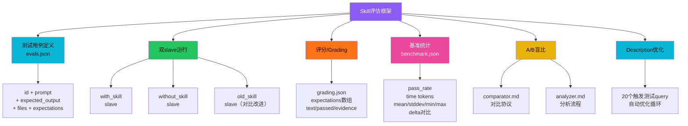
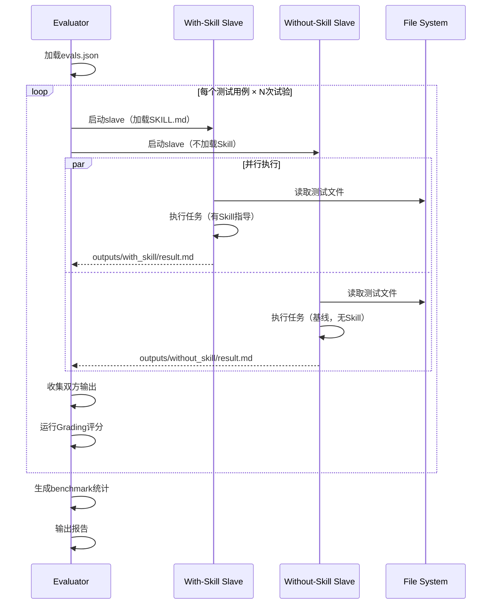
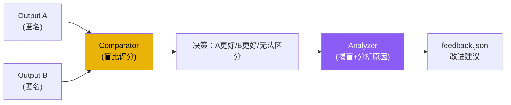
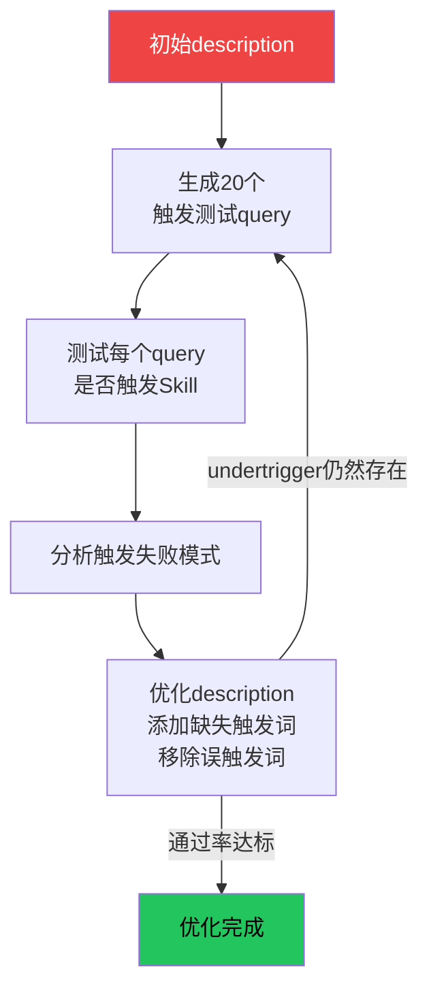

# 评估基准框架

skill-creator 元技能内置了完整的 Skill 评估体系，用于量化验证 Skill 的效果。该框架采用配对对比（paired comparison）设计，通过双 slave 运行（有 Skill vs 无 Skill/旧 Skill）、自动化评分、基准统计和 A/B 盲比，实现 Skill 质量的可度量改进。

## 设计原理

1. **配对对比**：每个测试用例在 with_skill 和 without_skill（或 old_skill）两种条件下运行，通过对比量化 Skill 的价值
2. **多维度评分**：不仅评判正确性，还评估自主性、可操作性、安全性、简洁性
3. **盲比消除偏见**：A/B 盲比模式下评分者不知道哪个输出来自哪个条件，减少确认偏见
4. **基准统计**：多次运行计算均值/标准差/极值，区分信号与噪声
5. **迭代优化**：基于评估结果自动生成改进建议，特别是 description 触发优化
6. **断点续跑**：评估支持中断恢复，已完成的 (case, trial, condition) 自动跳过

## 评估架构总览



## 测试用例定义（evals.json）

每个 Skill 的评估通过 `evals/evals.json` 定义测试用例集：

```json
{
  "skill_name": "pdf",
  "evals": [
    {
      "id": "extract-text-simple",
      "prompt": "Extract all text from the attached PDF file.",
      "expected_output": "Text extraction with page numbers",
      "files": ["test-files/sample.pdf"],
      "expectations": [
        "All text is extracted",
        "Page numbers are included",
        "Tables are preserved as structured text"
      ]
    },
    {
      "id": "merge-pdfs",
      "prompt": "Merge the three attached PDFs into one file.",
      "expected_output": "A single merged PDF file",
      "files": ["test-files/a.pdf", "test-files/b.pdf", "test-files/c.pdf"],
      "expectations": [
        "Output is a valid PDF",
        "Pages are in correct order",
        "No content is lost"
      ]
    }
  ]
}
```

### 用例字段

| 字段 | 类型 | 说明 |
|------|------|------|
| `id` | string | 用例唯一标识符 |
| `prompt` | string | 发送给模型的用户提示 |
| `expected_output` | string | 期望输出的描述 |
| `files` | string[] | 测试需要的附件文件列表 |
| `expectations` | string[] | 评分检查点列表 |
| `risk` | string | 风险等级（low/medium/high） |
| `category` | string | 用例类别 |

### i-have-adhd 的评估用例分类

参考 i-have-adhd 项目的 14 个评估用例（其评估体系基于相同的 skill-creator 框架），覆盖以下类别：

| 类别 | 测试重点 |
|------|---------|
| direct-answer | 直接回答是否符合行动优先原则 |
| agent-autonomy | Agent 自主完成度 |
| debugging | 调试场景下的输出质量 |
| explanation | 解释请求是否充分（破规例外） |
| safety | 破坏性操作的安全确认 |
| ambiguity | 歧义处理能力 |
| progress | 进展可见性 |
| user-preference | 用户偏好尊重 |
| error-reporting | 错误报告的平实语气 |
| casual | 日常对话场景 |
| coding | 代码输出质量 |
| planning | 规划场景的步骤编号 |
| medical-boundary | 边界条件处理 |

## 双 Slave 运行机制

每个测试用例启动两个独立的子 Agent（slave），分别在不同条件下执行：



### 三种对比条件

| 条件 | 说明 | 用途 |
|------|------|------|
| `baseline`（without_skill） | 不加载 Skill，纯模型原生能力 | 衡量 Skill 的绝对增益 |
| `candidate`（with_skill） | 加载当前版本 Skill | 评估当前效果 |
| `comparator`（old_skill） | 加载旧版本 Skill | 衡量改进幅度（迭代时） |

### 运行隔离

评估运行时严格隔离环境，防止配置泄漏影响结果：

```bash
# Claude runner 隔离参数
claude --setting-sources "" \
       --disable-slash-commands \
       --no-session-persistence \
       --tools "" \
       --model claude-opus-4-8 \
       --max-budget-usd 25

# Codex runner 隔离参数
codex --ephemeral \
      --ignore-user-config \
      --sandbox read-only
```

隔离原因：
- `--setting-sources ""`：禁用所有用户配置源
- `--disable-slash-commands`：禁用斜杠命令
- `--no-session-persistence`：禁用会话持久化（包括记忆）
- `--tools ""`：禁用工具（纯生成对比）
- 固定模型版本：防止模型随 CLI 版本变化

特别注意：如果用户启用了 always-on 标志（如 i-have-adhd 的 `~/.claude/.i-have-adhd-always`），会导致规则注入到 baseline 条件中，使得 Skill 与自己比较，评估结果无效。

## 评分体系（Grading）

### 评分维度与权重

| 维度 | 权重 | 评估内容 |
|------|------|---------|
| correctness | 35% | 答案正确性 |
| autonomy | 25% | Agent 自主完成度（减少用户干预） |
| actionability | 20% | 可操作性（具体下一步行动） |
| safety | 10% | 安全性（危险操作确认） |
| concision | 10% | 简洁性（无冗余） |

### Grading 输出格式

```json
{
  "eval_id": "extract-text-simple",
  "trial": 1,
  "condition": "with_skill",
  "expectations": [
    {
      "text": "All text is extracted",
      "passed": true,
      "evidence": "Output contains text from all 5 pages of the document"
    },
    {
      "text": "Page numbers are included",
      "passed": true,
      "evidence": "Each section is prefixed with 'Page N:'"
    },
    {
      "text": "Tables are preserved as structured text",
      "passed": false,
      "evidence": "Table on page 3 is flattened to plain text without column alignment"
    }
  ],
  "scores": {
    "correctness": 0.8,
    "autonomy": 0.9,
    "actionability": 1.0,
    "safety": 1.0,
    "concision": 0.7
  },
  "weighted_score": 0.86,
  "blocker": false
}
```

### 发布门槛（Release Gate）

评估结果必须通过以下门槛才能发布：

1. **无阻断性发现**：`blocker !== true`
2. **正确性不退化**：correctness 和 safety 不低于 baseline 0.1 分以上
3. **加权分数提升**：weighted_score 高于 baseline
4. **公开对比要求**：公开对比声明需使用相同用例、模型、试验次数、评分标准

## 基准统计（Benchmark）

### benchmark.json 格式

```json
{
  "skill_name": "pdf",
  "timestamp": "2026-08-22T12:00:00Z",
  "model": "claude-opus-4-8",
  "trials": 3,
  "conditions": {
    "baseline": {
      "pass_rate": { "mean": 0.52, "stddev": 0.08, "min": 0.43, "max": 0.60 },
      "time_seconds": { "mean": 45.2, "stddev": 12.3, "min": 28.0, "max": 72.0 },
      "tokens": { "mean": 1250, "stddev": 340, "min": 890, "max": 1800 }
    },
    "with_skill": {
      "pass_rate": { "mean": 0.87, "stddev": 0.05, "min": 0.80, "max": 0.93 },
      "time_seconds": { "mean": 38.6, "stddev": 8.7, "min": 25.0, "max": 55.0 },
      "tokens": { "mean": 980, "stddev": 210, "min": 720, "max": 1300 }
    }
  },
  "delta": {
    "pass_rate": { "absolute": 0.35, "relative": "67% improvement" },
    "time_seconds": { "absolute": -6.6, "relative": "15% faster" },
    "tokens": { "absolute": -270, "relative": "22% fewer tokens" }
  }
}
```

### 统计指标

| 指标 | 说明 |
|------|------|
| `mean` | 均值（N次试验平均） |
| `stddev` | 标准差（结果稳定性） |
| `min/max` | 极值（最佳/最差情况） |
| `delta` | 与 baseline 的差异对比 |

## A/B 盲比

盲比模式消除评分者偏见：

1. **匿名化**：输出文件随机标记为 A/B，评分者不知道哪个是 with_skill
2. **comparator.md**：定义对比协议，指导评分者如何公平比较
3. **analyzer.md**：定义分析流程，识别双方的优势/劣势
4. **强制选择**：评分者必须选择更好的输出，不能平局（或标注"无法区分"）



## Description 自动优化

description 是 Skill 触发的关键，框架支持自动优化：



优化循环：
1. 基于当前 description 生成 20 个测试 query
2. 运行每个 query 检查 Skill 是否被正确触发
3. 分析 undertrigger（该触发未触发）和 overtrigger（不该触发却触发）
4. 修改 description
5. 重复直到触发率达标

## 输出目录结构

```
<skill-name>-workspace/
└── iteration-N/
    ├── eval-<descriptive-name>/
    │   ├── with_skill/
    │   │   └── outputs/
    │   │       └── <case-id>/
    │   │           └── result.md
    │   ├── without_skill/          # 或 old_skill/
    │   │   └── outputs/
    │   │       └── <case-id>/
    │   │           └── result.md
    │   ├── eval_metadata.json      # 运行元数据
    │   ├── grading.json            # 评分结果
    │   └── timing.json             # 耗时统计
    ├── benchmark.json              # 基准统计汇总
    ├── benchmark.md                # 人类可读报告
    └── feedback.json               # 改进建议
```

## 断点续跑

评估运行支持中断恢复：

- 已完成的 `(case, trial, condition, runner)` 四元组自动跳过
- 结果追加写入而非覆盖
- 使用 `runners.example.json` 配置 runner 参数
- 默认试验次数：3 次
- 默认预算上限：$25
- 默认重试次数：2 次

## 三环境适配

评估功能在不同环境的支持程度：

| 功能 | Claude Code | Claude.ai | Cowork（无头） |
|------|------------|-----------|---------------|
| 双 slave 运行 | ✅ | ❌（串行执行，无子agent） | ✅ |
| 浏览器工具 | ✅ | ❌ | ❌（静态HTML） |
| Benchmark | ✅ | ❌ | ✅（--static输出） |
| Description优化 | ✅ | ❌ | ❌ |
| 打包功能 | ✅ | ✅ | ✅ |

Claude.ai 环境限制：
- 无子 agent 支持（串行执行）
- 无浏览器工具
- 跳过 benchmark 和 description 优化
- 仍然支持打包和基本格式验证

## 相关概念

- [SKILL.md 格式规范](skill-md-format-spec.md) — 被评估的 SKILL.md 格式
- [渐进式加载机制](progressive-loading.md) — 评估时 Skill 的加载方式
- [Skill 打包格式](skill-packaging.md) — evals/ 目录不打包进分发文件
