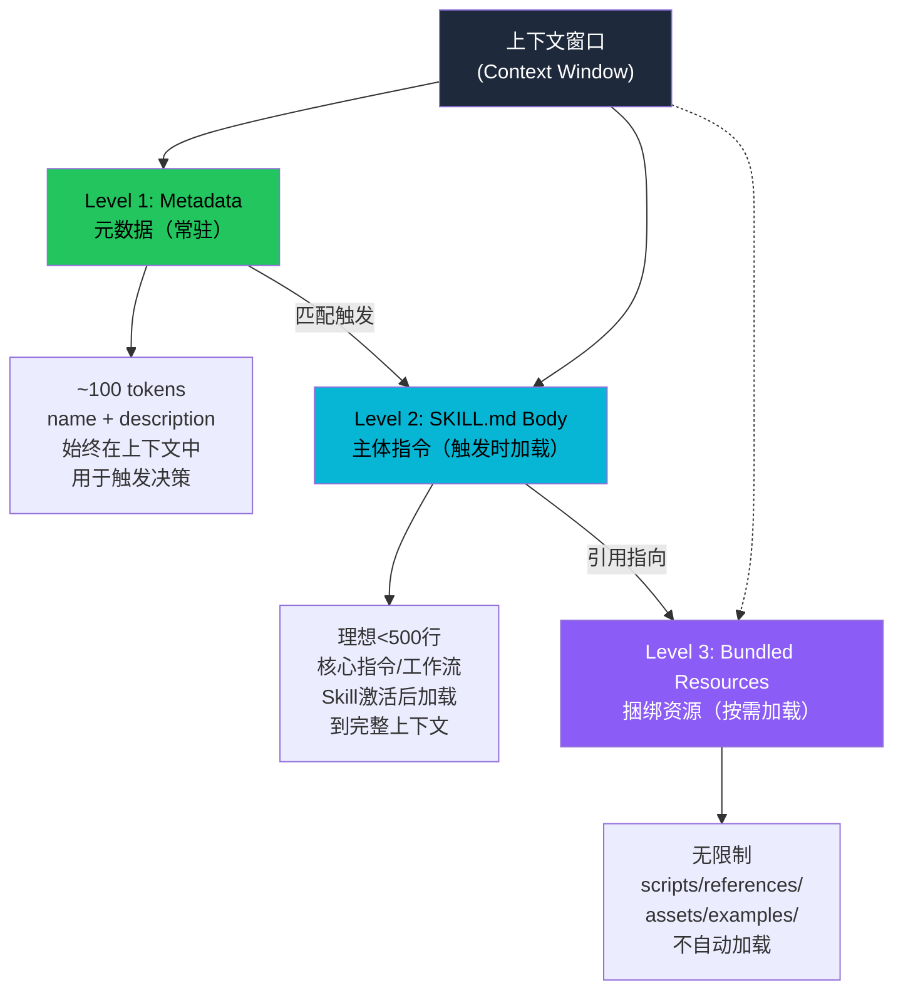
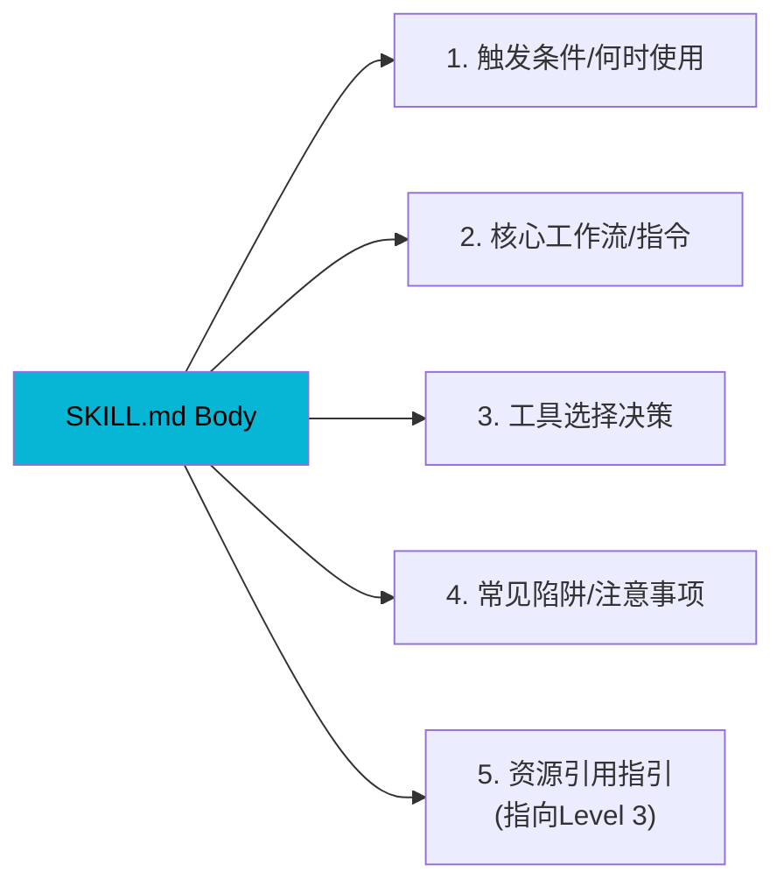
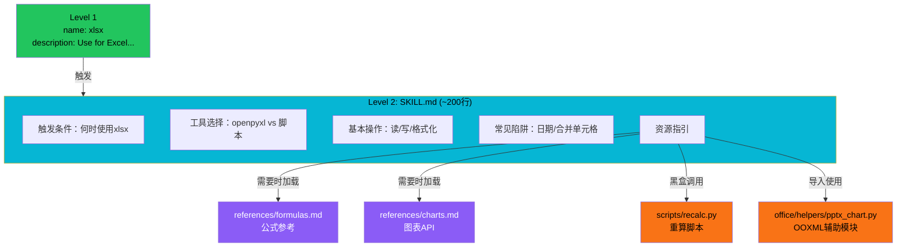

# 渐进式加载机制

Anthropic Skills 采用三级渐进式加载（Progressive Disclosure）架构，解决上下文窗口有限与 Skill 功能丰富之间的矛盾。核心思想是：只在需要时加载需要的内容，将最小必要信息始终保留在上下文中，大资源按需加载。

## 设计原理

1. **上下文预算意识**：LLM 的上下文窗口是有限且昂贵的资源，每个 token 都有成本
2. **触发式加载**：Metadata 常驻用于触发决策，Body 仅在 Skill 激活后加载，Resources 按需读取
3. **黑盒脚本优先**：scripts/ 中的可执行代码作为黑盒调用（先跑 --help），不加载源码到上下文
4. **参考文件指引**：SKILL.md 明确标注何时加载哪个 reference 文件，避免模型盲目加载所有内容
5. **模板字面使用**：assets/ 中的模板作为字面起点使用，而非灵感参考

## 三级加载架构



### 各级加载对比

| 级别 | 内容 | 加载时机 | 大小建议 | 上下文消耗 |
|------|------|---------|---------|-----------|
| **Level 1** Metadata | name + description | 始终常驻（所有 Skill 的元数据列表） | ~100 词/Skill | 27 Skill × ~50 tokens ≈ 1.3K tokens |
| **Level 2** Body | SKILL.md 正文指令 | Skill 被触发（激活）时加载 | < 500 行 | 约 2-4K tokens/Skill |
| **Level 3** Resources | scripts/、references/、assets/、examples/ | Body 中明确指向时按需加载 | 无限制 | 按需消耗 |

## Level 1：Metadata（元数据）

元数据是 Skill 的"目录条目"，所有已安装 Skill 的元数据始终在上下文中，用于模型决定何时触发哪个 Skill。

### 内容

```yaml
# Level 1 仅包含两个字段的实质信息
name: pdf          # 用于内部引用
description: >     # 触发决策的唯一依据
  Use when the user needs to work with PDF files:
  extract text, merge/split PDFs, fill forms,
  perform OCR, or convert formats.
```

### 设计考量

- **description 是触发的唯一依据**：模型通过匹配用户意图与所有 Skill 的 description 来决定激活哪个 Skill
- **Pushy 原则**：description 应写得主动（pushy），覆盖各种触发表达，减少 undertrigger
- **不要过度堆砌**：虽然 description 最长 1024 字符，但保持精准——过多无关关键词会导致误触发

### 元数据规模估算

以 17 个内置 Skill 计算：
- 平均 name：~15 字符
- 平均 description：~200 字符
- 总计元数据：~3.6K 字符 ≈ 500-800 tokens
- 这是为快速触发决策付出的固定上下文成本

## Level 2：SKILL.md Body（主体指令）

当模型根据 description 判断需要激活某个 Skill 时，将 SKILL.md 的正文加载到上下文中。

### 大小指南

| 指标 | 建议值 | 原因 |
|------|--------|------|
| 理想行数 | < 500 行 | 超过则消耗过多上下文 |
| 大参考文件 | > 300 行需目录 | 便于快速定位相关部分 |
| 多框架变体 | 拆分为独立文件 | Claude 只读取相关变体 |

### Body 的典型结构



### 何时拆分到 Level 3

当出现以下情况时，应将内容移至 references/ 而非保留在 SKILL.md 中：

1. **长代码示例**：超过 50 行的代码应放入 `scripts/` 作为可执行脚本
2. **API 文档**：详细的 API 参考放入 `references/`
3. **多平台变体**：如 AWS/GCP/Azure 分别独立文件
4. **模板文件**：完整的输出模板放入 `assets/`
5. **使用示例**：详细示例放入 `examples/`

## Level 3：Bundled Resources（捆绑资源）

Level 3 是 Skill 目录中除 SKILL.md 外的所有内容，按子目录分类组织：

```
skill-name/
├── SKILL.md              # Level 1+2
├── scripts/              # Level 3: 可执行脚本（黑盒）
├── references/           # Level 3: 参考文档（按需读取）
├── assets/               # Level 3: 模板/字体/图标（字面使用）
├── examples/             # Level 3: 使用示例
├── agents/               # Level 3: 子代理指令（仅skill-creator）
├── eval-viewer/          # Level 3: 评估查看器（仅skill-creator）
├── core/                 # Level 3: 核心Python模块
├── templates/            # Level 3: HTML/JS模板
├── canvas-fonts/         # Level 3: 字体资源
└── LICENSE.txt           # Level 3: 许可证
```

### 资源类型与引用约定

#### 1. scripts/ — 黑盒脚本

**核心原则**：scripts 是可执行的黑盒工具，建议先运行 `--help` 了解用法，而非读取源码到上下文。

```markdown
<!-- SKILL.md 中的 scripts 引用模式 -->
Scripts are available in the `scripts/` directory. They exist to be called
directly as black-box commands rather than ingested into your context window.

Before using a script, run it with `--help` to understand its interface:
```bash
python scripts/xxx.py --help
```
```

```python
# 示例：webapp-testing 中的脚本引用
# "Script paths below are relative to this skill's directory"
# - scripts/start_server.py — 启动测试服务器
# - scripts/run_tests.py — 运行Playwright测试
```

#### 2. references/ — 参考文档

**核心原则**：明确说明何时加载参考文档，而非一次性全部加载。

```markdown
<!-- 好的引用方式：明确加载时机 -->
Load `references/aws.md` during Phase 1 when deploying to AWS.
Load `references/gcp.md` during Phase 1 when deploying to GCP.
Load `references/api-reference.md` when you need detailed API parameters.

<!-- 不好的引用方式：无指引 -->
See references/ for more information.
```

以 claude-api Skill 为例（最大的 Skill，含 8 语言 SDK 文档）：
- SKILL.md 仅包含工作流和通用指引
- `references/` 包含 20+ 参考文件（TypeScript/Python/Go SDK 等）
- 模型只在需要时读取对应语言的 SDK 文档

#### 3. assets/ — 模板文件

**核心原则**：作为字面上的起点使用，而非灵感参考。

```markdown
<!-- assets 引用模式 -->
Use `assets/template.html` as the literal starting point for your output.
Do not modify the structure — fill in the placeholders with your content.
```

#### 4. 路径约定

所有资源路径相对于 Skill 目录解析：

```markdown
Script paths below are relative to this skill's directory.
```

## 分层策略示例

以 xlsx Skill（Excel 处理）为例展示三级加载：



### 实际资源分布

以 17 个内置 Skill 的 Python 脚本分布为例：

| Skill | Python 文件数 | 资源类型 |
|-------|-------------|---------|
| xlsx | 11 | office/ 共享模块 + recalc + validators |
| docx | 14 | office/ 共享模块 + accept_changes/comment/merge_runs |
| pptx | 14 | office/ 共享模块 + add_slide/clean/thumbnail |
| pdf | 8 | PDF 处理脚本 |
| skill-creator | 10 | 评估/验证/打包/优化脚本 |
| slack-gif-creator | 4 | GIF 构建/验证/缓动/帧合成 |
| webapp-testing | 4 | Playwright 服务器管理+示例 |
| mcp-builder | 2 | 连接测试/评估脚本 |

这些脚本全部是 Level 3 资源，不自动加载到上下文。

## office/ 共享模块模式

文档处理类 Skill（xlsx/docx/pptx）共享一个 `office/` 子模块结构，展示了 Level 3 资源的复用模式：

```
shared office/ module structure:
├── helpers/           # OOXML 辅助函数
│   ├── pptx_chart.py
│   ├── pptx_slide.py
│   └── pptx_theme.py
├── validators/        # XSD 验证
│   ├── base.py
│   ├── docx.py
│   ├── pptx.py
│   └── redlining.py
├── soffice.py         # LibreOffice 封装
└── validate.py        # OOXML 验证入口
```

模块通过 Python import 方式使用（`from office.helpers import pptx_chart`），而非加载到 LLM 上下文。

## 上下文消耗对比

渐进式加载的 token 效率优势（以使用 pdf Skill 处理一个任务为例）：

| 加载策略 | 上下文消耗 | 浪费率 |
|---------|-----------|--------|
| **全量加载**（所有文件） | SKILL.md + 8 scripts + references ≈ 50K tokens | > 90% |
| **二级加载**（仅 SKILL.md） | ~3K tokens | ~30%（不需要的部分） |
| **三级加载**（按需） | ~2K（SKILL.md 核心部分）+ 按需加载引用 | < 10% |

核心收益：
1. 元数据常驻的固定成本低（~1-2K tokens for all skills）
2. 单个 Skill 激活时只加载核心指令（2-4K tokens）
3. 大参考文件和脚本完全不消耗上下文，直到确实需要

## SKILL.md 解析工具

`utils.py` 中的 `parse_skill_md()` 函数实现了轻量 SKILL.md 解析，支持三级加载的提取需求：

```python
# utils.py L7-L46
def parse_skill_md(skill_path: Path) -> tuple[str, str, str]:
    """Parse a SKILL.md file, returning (name, description, full_content)."""
    content = skill_path.read_text(encoding="utf-8")

    # 手动逐行扫描frontmatter（非yaml库）
    # 支持多行description（>, |, >-, |- YAML语法）
    # 处理引号包裹的值（strip " 和 '）

    return name, description, full_content
```

返回三元组正好对应三级加载的不同需求：
- `name` + `description` → Level 1 元数据
- `full_content` → Level 2 Body（需要时可仅提取 frontmatter 后的正文部分）
- 其他文件 → Level 3 通过文件系统按需读取

## 相关概念

- [SKILL.md 格式规范](skill-md-format-spec.md) — Level 1+2 的格式定义
- [Skill 打包格式](skill-packaging.md) — .skill 如何包含三级资源
- [评估基准框架](eval-benchmark-framework.md) — 评估 Skill 加载效率的基准
