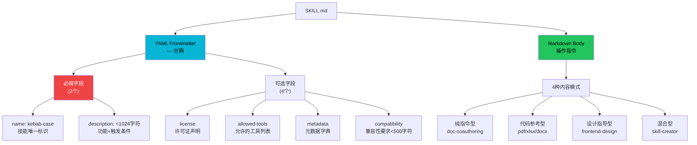
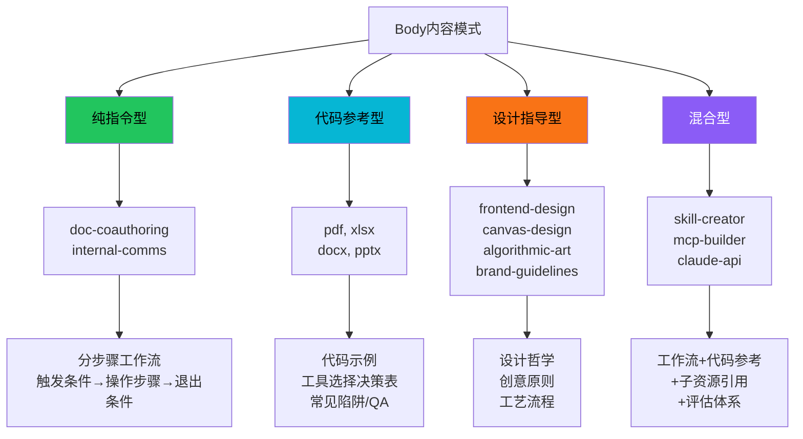

# SKILL.md 格式规范

SKILL.md 是 Anthropic Agent Skills 系统中每个技能的核心定义文件。它以 YAML frontmatter 声明元数据，Markdown 正文提供操作指令。格式规范由 skill-creator 元技能定义，`quick_validate.py` 脚本强制执行格式校验，确保所有 Skill 在结构上一致、可被加载器可靠解析。

## 设计原理

1. **元数据驱动触发**：description 字段是 Skill 触发的主要机制，必须同时包含"做什么"和"何时使用"
2. **最小强制约束**：仅 name 和 description 为必填，其余字段可选，保持创建门槛低
3. **长度受控**：SKILL.md 正文理想 <500 行，超长内容通过 references/ 外置实现渐进式加载
4. **祈使句写作**：指令使用祈使句、解释"为什么"而非硬性 MUST 约束，利用 theory of mind 增强通用性
5. **安全底线**：禁止恶意内容，遵循 Lack of Surprise 原则

## 文件结构总览



## YAML Frontmatter 规范

### 允许的完整字段集

根据 `quick_validate.py`，frontmatter 共允许 6 个字段：

```python
# quick_validate.py L42-L43
ALLOWED_PROPERTIES = {'name', 'description', 'license', 'allowed-tools', 'metadata', 'compatibility'}
```

任何不在此集合中的字段都会导致验证失败（`unexpected property` 错误）。

### 必填字段详解

**1. name**

| 属性 | 值 |
|------|-----|
| 类型 | string |
| 必填 | 是 |
| 格式 | kebab-case（正则 `^[a-z0-9-]+$`） |
| 最大长度 | 64 字符 |
| 约束 | 不能以连字符开头/结尾，不能包含连续连字符 |

```yaml
# ✅ 正确
name: pdf
name: web-app-testing
name: mcp-builder

# ❌ 错误
name: PDF           # 含大写
name: my_skill      # 含下划线
name: -skill-       # 连字符开头/结尾
name: my--skill     # 连续连字符
```

**2. description**

| 属性 | 值 |
|------|-----|
| 类型 | string |
| 必填 | 是 |
| 最大长度 | 1024 字符 |
| 禁止字符 | `<` 和 `>`（尖括号） |
| 核心功能 | **Skill 触发的主要机制** |

```yaml
# ✅ Good：同时包含做什么+何时使用，语气主动(pushy)
description: >
  Use this skill when the user asks to create, edit, analyze, or extract data
  from PDF files. Handles merging, splitting, form filling, OCR, and text extraction.
  Trigger for any PDF-related task, including "read this PDF" or "extract pages".

# ❌ Bad：仅描述功能，无触发上下文
description: PDF processing tool.
```

### description 的触发设计

description 是 Skill 被自动激活的关键。设计原则：

1. **Pushy（主动/激进）**：写得积极一些，解决 "undertrigger"（触发不足）问题
2. **双信息**：必须同时说明"做什么"和"何时使用"
3. **覆盖变体**：包含用户可能使用的各种表达方式
4. **复杂任务更可靠**：简单的单步查询（如 "read this PDF"）可能不触发 Skill；复杂多步或专业查询才能可靠触发

支持 YAML 多行语法（`>`, `|`, `>-`, `|-`），适合长 description。

### 可选字段详解

**3. license**

```yaml
# 专有许可证
license: Proprietary. LICENSE.txt has complete terms

# 引用文件
license: Complete terms in LICENSE.txt
```

**4. allowed-tools**

声明 Skill 执行所需的工具白名单。若 Skill 依赖特定工具（如 Bash、WebFetch），在此声明。

**5. metadata**

```yaml
metadata:
  hermes:
    tags: [ADHD, Output Style, Productivity]
    category: productivity
```

用于存储任意结构化元数据，如分类标签、平台特定配置等。

**6. compatibility**

| 属性 | 值 |
|------|-----|
| 类型 | string |
| 最大长度 | 500 字符 |

声明 Skill 的运行环境兼容性要求。

### Frontmatter 示例

以最小模板为例：

```yaml
---
name: template-skill
description: Replace with description of the skill and when Claude should use it.
---

# Insert instructions below
```

以实际 Skill（pdf）为例：

```yaml
---
name: pdf
description: >
  Use when the user needs to work with PDF files: extract text, merge/split PDFs,
  fill forms, perform OCR, or convert formats. Trigger on any PDF-related request.
license: Proprietary. LICENSE.txt has complete terms.
---
```

## 验证流程

`quick_validate.py` 中的 `validate_skill()` 函数执行 10 步验证：


```python
# quick_validate.py 验证流程核心代码
def validate_skill(skill_path: Path) -> list[str]:
    errors = []
    # 1. 检查文件存在
    skill_md = skill_path / "SKILL.md"
    if not skill_md.exists():
        return [f"SKILL.md not found in {skill_path}"]

    content = skill_md.read_text(encoding="utf-8")

    # 2. 检查开头
    if not content.startswith("---\n"):
        errors.append("SKILL.md must start with ---")
        return errors

    # 3. 提取frontmatter
    match = re.match(r"^---\n(.*?)\n---", content, re.DOTALL)
    if not match:
        errors.append("Could not parse YAML frontmatter")
        return errors

    # 4. YAML解析
    try:
        data = yaml.safe_load(match.group(1))
    except yaml.YAMLError as e:
        errors.append(f"Invalid YAML: {e}")
        return errors

    # 5. 类型检查
    if not isinstance(data, dict):
        errors.append("Frontmatter must be a YAML dictionary")
        return errors

    # 6. 字段检查...
    return errors
```

## SKILL.md Body 内容模式

17 个内置 Skill 的 body 呈现 4 种内容模式：



### 按功能域分类

| 类别 | Skills | 特征 |
|------|--------|------|
| 创意设计类 | algorithmic-art, canvas-design, brand-guidelines, frontend-design, theme-factory, slack-gif-creator | 输出视觉产物，含字体/模板资源，强调工艺感 |
| 文档处理类 | pdf, docx, pptx, xlsx | Source-available，专有许可证，含 office/ 共享模块，依赖 LibreOffice |
| 开发技术类 | claude-api, mcp-builder, webapp-testing, web-artifacts-builder, skill-creator | 面向开发者，大量参考文档和代码示例 |
| 企业沟通类 | doc-coauthoring, internal-comms | 纯指令型工作流，无 scripts，指导写作流程 |

## 指令写作风格原则

skill-creator 的 SKILL.md 定义了以下写作原则：

### 1. 使用祈使句（Imperative Form）

```markdown
<!-- ✅ Good -->
Load references only when needed. Call scripts as black-box commands.

<!-- ❌ Bad -->
You should always consider whether to load references.
```

### 2. 解释"为什么"

> "Try to explain to the model why things are important in lieu of heavy-handed musty MUSTs"

```markdown
<!-- ✅ Good -->
Keep SKILL.md under 500 lines because longer files consume more context window
on every invocation, leaving less room for the actual task.

<!-- ❌ Bad -->
SKILL.md MUST NOT exceed 500 lines. This is a hard requirement.
```

### 3. 利用 Theory of Mind

让 Skill 具有通用性，而非绑定到特定示例。模型能推断出如何将原则应用到新情况。

### 4. 避免过度约束

当发现自己写 ALWAYS/NEVER 全大写时是黄色警告标志，应重构为解释原因。

### 5. 明确输出格式

使用 "ALWAYS use this exact template:" 模式定义输出模板（这是少数可使用 ALWAYS 的场景）：

```markdown
ALWAYS use this exact template for the output:
```markdown
# Analysis Report
## Summary
{summary}
## Findings
{findings}
```
```

## 长度指南

| 指标 | 建议值 |
|------|--------|
| SKILL.md 正文 | < 500 行 |
| 参考文件 | > 300 行应包含目录 |
| 辅助脚本 | 作为黑盒调用，不加载到上下文 |

超过 500 行时：
1. 增加分层结构
2. 将大段内容抽取到 `references/` 目录
3. 在 SKILL.md 中明确标注何时读取哪个参考文件
4. 多框架支持时按变体组织（如 `aws.md`、`gcp.md`、`azure.md`），Claude 只读取相关文件

## 安全原则（Lack of Surprise）

- Skill 不得包含恶意软件、漏洞利用代码
- Skill 内容不应在意图上让用户感到意外
- "Roleplay as an XYZ" 类内容是可接受的
- 禁止通过 frontmatter 注入恶意配置
- 生成后的 Skill 需经 `scan_generated_skill.py` 扫描检测 prompt 注入

## 多环境适配

skill-creator 明确区分三种运行环境的差异：

| 环境 | 子 Agent | 浏览器 | Benchmark | Description 优化 | 打包 |
|------|---------|--------|-----------|-----------------|------|
| Claude Code | ✅ | ✅ | ✅ | ✅ | ✅ |
| Claude.ai | ❌ | ❌（串行执行） | ❌ | ❌ | ✅ |
| Cowork（无头） | ✅ | ❌（静态HTML输出） | ❌ | ❌ | ✅ |

所有环境均支持打包功能（`package_skill.py` 仅需 Python 和文件系统）。

## 最小可用模板

`template/SKILL.md` 是官方最小模板（6 行）：

```markdown
---
name: template-skill
description: Replace with description of the skill and when Claude should use it.
---

# Insert instructions below
```

## 相关概念

- [渐进式加载机制](progressive-loading.md) — Metadata→Body→Resources 三级加载
- [Skill 打包格式](skill-packaging.md) — .skill ZIP 打包与排除规则
- [评估基准框架](eval-benchmark-framework.md) — skill-creator 内置的 eval/benchmark/blind comparison
