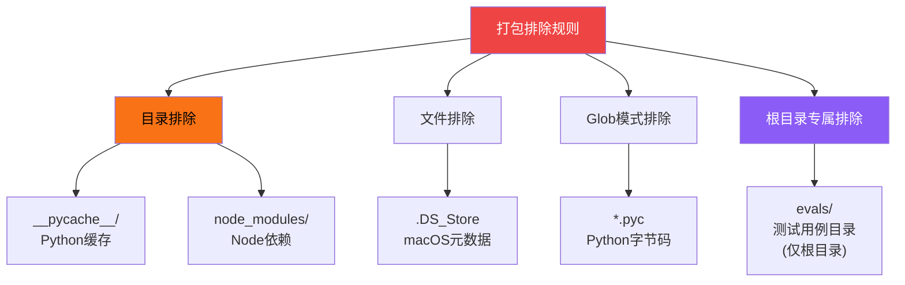
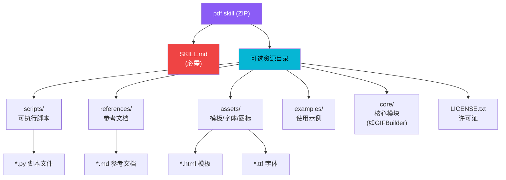
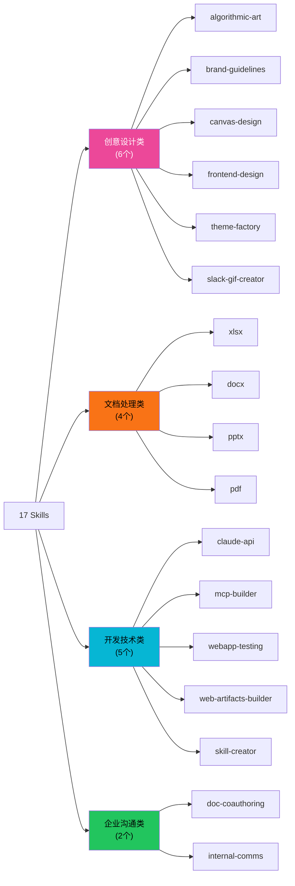
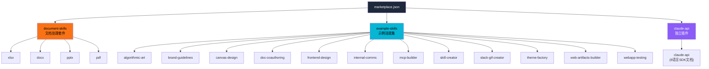
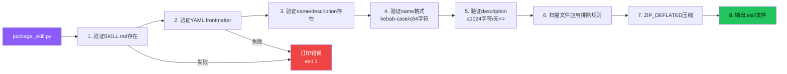

# Skill 打包格式

Anthropic Skills 使用 `.skill` 文件作为分发格式，本质是 ZIP 压缩包，包含 SKILL.md 和所有捆绑资源。打包前自动执行格式验证，内置排除规则过滤掉不应分发的文件。`.claude-plugin/marketplace.json` 将 17 个内置 Skill 组织为 3 个插件包，支持 Claude Code 的插件市场机制。

## 设计原理

1. **标准 ZIP 格式**：使用通用 ZIP/DEFLATED 压缩，任何工具都能解压查看内容，无需专用解析器
2. **验证优先**：打包前强制运行 `validate_skill()`，无效 Skill 不能打包
3. **合理排除**：自动排除缓存、依赖、测试等非分发内容，保持包体积小
4. **目录名命名**：输出文件使用目录名（非 frontmatter 的 name 字段），避免 name 与目录不一致导致混淆
5. **插件分组**：多个 Skill 可组合为 plugin 包，用户可按功能组安装而非逐个安装

## .skill 文件格式

### 本质与压缩

`.skill` 文件是标准 ZIP 压缩包：


- **压缩方法**：`zipfile.ZIP_DEFLATED`（标准 ZIP 压缩，非 STORE 存储）
- **文件扩展名**：`.skill`
- **输出命名**：使用目录名（如 `pdf.skill`），而非 frontmatter 中的 `name` 字段
- **打包前验证**：先调用 `validate_skill()` 检查 SKILL.md 格式，验证失败则中止

### 打包命令

```bash
# 使用 skill-creator 的打包脚本
python -m scripts.package_skill <skill-folder> [output-dir]
```

```python
# package_skill.py 核心流程
def package_skill(skill_dir: Path, output_dir: Path = None) -> Path:
    # 1. 验证 Skill
    errors = validate_skill(skill_dir)
    if errors:
        for e in errors:
            print(f"ERROR: {e}", file=sys.stderr)
        sys.exit(1)

    # 2. 确定输出路径
    skill_name = skill_dir.name  # 使用目录名
    if output_dir is None:
        output_dir = skill_dir.parent
    output_path = output_dir / f"{skill_name}.skill"

    # 3. 创建 ZIP
    with zipfile.ZipFile(output_path, 'w', zipfile.ZIP_DEFLATED) as zf:
        for file_path in skill_dir.rglob('*'):
            # 排除规则检查
            if should_exclude(file_path, skill_dir):
                continue
            # 保持相对路径结构
            arcname = file_path.relative_to(skill_dir)
            zf.write(file_path, arcname)

    return output_path
```

## 排除规则

打包时自动排除以下文件和目录，确保 `.skill` 包只包含运行所需内容：



```python
# package_skill.py 排除规则
EXCLUDE_DIRS = {'__pycache__', 'node_modules'}
EXCLUDE_FILES = {'.DS_Store'}
EXCLUDE_GLOBS = {'*.pyc'}
ROOT_EXCLUDE_DIRS = {'evals'}  # 仅排除根目录下的 evals/

def should_exclude(file_path: Path, skill_root: Path) -> bool:
    rel = file_path.relative_to(skill_root)
    parts = set(rel.parts)

    # 检查目录名排除
    if parts & EXCLUDE_DIRS:
        return True

    # 检查文件名排除
    if file_path.name in EXCLUDE_FILES:
        return True

    # 检查 glob 模式
    for pattern in EXCLUDE_GLOBS:
        if file_path.match(pattern):
            return True

    # 检查根目录专属排除
    if rel.parts[0] in ROOT_EXCLUDE_DIRS:
        return True

    return False
```

### 排除规则设计考量

| 排除项 | 原因 |
|--------|------|
| `__pycache__/` | Python 运行时自动生成，不具可移植性 |
| `node_modules/` | 应通过 npm install 安装，不打包依赖 |
| `.DS_Store` | macOS 专属元数据，跨平台污染 |
| `*.pyc` | Python 字节码，平台相关，自动重新生成 |
| `evals/`（根目录） | 测试用例和评估数据，非运行时必需 |

### 注意：子目录中的 evals/ 不排除

`evals/` 排除规则仅作用于根目录。如果 Skill 的子目录中有名为 evals 的目录（非测试用途），不会被排除。

## Skill 目录结构（打包后）



解压后的目录结构与源目录一致（保留相对路径）。最小的 `.skill` 文件仅包含一个 `SKILL.md`。

## 17 个内置 Skill 清单

仓库共包含 17 个可用 Skill（不含 template/）：



| Skill | 类型 | 脚本数 | 许可证 |
|-------|------|--------|--------|
| algorithmic-art | 创意设计 | templates/ | Apache 2.0 |
| brand-guidelines | 创意设计 | 0 | Apache 2.0 |
| canvas-design | 创意设计 | canvas-fonts/ | Apache 2.0 |
| doc-coauthoring | 企业沟通 | 0 | Apache 2.0 |
| docx | 文档处理 | 14 | Proprietary |
| frontend-design | 创意设计 | 0 | Apache 2.0 |
| internal-comms | 企业沟通 | 0 | Apache 2.0 |
| claude-api | 开发技术 | references/ (8 SDK) | Apache 2.0 |
| mcp-builder | 开发技术 | 2 | Apache 2.0 |
| pdf | 文档处理 | 8 | Proprietary |
| pptx | 文档处理 | 14 | Proprietary |
| skill-creator | 开发技术 | 10 | Apache 2.0 |
| slack-gif-creator | 创意设计 | 4 | Apache 2.0 |
| theme-factory | 创意设计 | 0 | Apache 2.0 |
| web-artifacts-builder | 开发技术 | 0 | Apache 2.0 |
| webapp-testing | 开发技术 | 4 | Apache 2.0 |
| xlsx | 文档处理 | 11 | Proprietary |

## Marketplace 插件分组

`.claude-plugin/marketplace.json` 将 17 个 Skill 组织为 3 个 plugin（插件包），支持 Claude Code 的插件市场机制：



### Plugin 配置结构

```json
{
  "plugins": [
    {
      "name": "document-skills",
      "description": "Document processing skills: xlsx, docx, pptx, pdf",
      "source": "./",
      "strict": false,
      "skills": [
        "skills/xlsx",
        "skills/docx",
        "skills/pptx",
        "skills/pdf"
      ]
    },
    {
      "name": "example-skills",
      "description": "Example skills for learning and reference",
      "source": "./",
      "strict": false,
      "skills": [
        "skills/algorithmic-art",
        "skills/brand-guidelines",
        "skills/canvas-design",
        "skills/doc-coauthoring",
        "skills/frontend-design",
        "skills/internal-comms",
        "skills/mcp-builder",
        "skills/skill-creator",
        "skills/slack-gif-creator",
        "skills/theme-factory",
        "skills/web-artifacts-builder",
        "skills/webapp-testing"
      ]
    },
    {
      "name": "claude-api",
      "description": "Claude API/SDK reference documentation",
      "source": "./",
      "strict": false,
      "skills": [
        "skills/claude-api"
      ]
    }
  ]
}
```

### Plugin 字段说明

| 字段 | 说明 |
|------|------|
| `name` | 插件包名称 |
| `description` | 插件描述（显示在市场中） |
| `source` | 源路径（`"./"` 表示仓库根目录） |
| `strict` | 严格模式（false 允许部分 Skill 加载失败） |
| `skills` | 包含的 Skill 路径列表（相对于 source） |

### 分组设计考量

- **document-skills**：4 个专有许可证的文档处理 Skill 打包在一起，它们共享 `office/` 模块
- **example-skills**：12 个 Apache 2.0 开源示例 Skill 打包在一起，适合学习和参考
- **claude-api**：Claude API 文档独立打包，因为它体积最大（含 8 语言 SDK 文档），用户按需安装

## 打包流程验证

打包脚本在创建 `.skill` 文件前执行的验证步骤：



## 跨环境打包兼容性

打包功能在所有三种运行环境中均可用：

| 环境 | 打包支持 | 原因 |
|------|---------|------|
| Claude Code | ✅ | 完整功能 |
| Claude.ai | ✅ | `package_skill.py` 仅需 Python + 文件系统 |
| Cowork（无头） | ✅ | 无 display 依赖 |

## 相关概念

- [SKILL.md 格式规范](skill-md-format-spec.md) — 被打包的 SKILL.md 文件格式
- [渐进式加载机制](progressive-loading.md) — 包内资源的三级加载策略
- [评估基准框架](eval-benchmark-framework.md) — evals/ 目录不打包的原因（评估数据）
