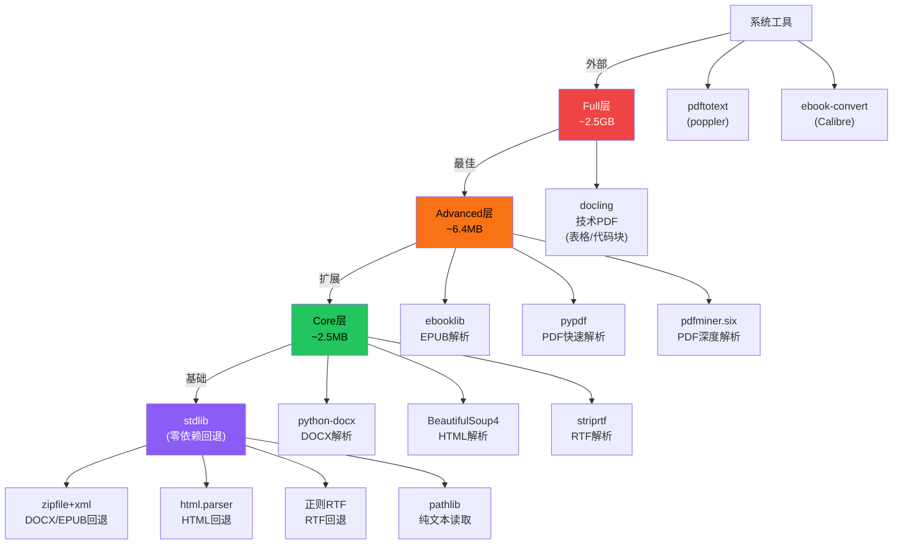
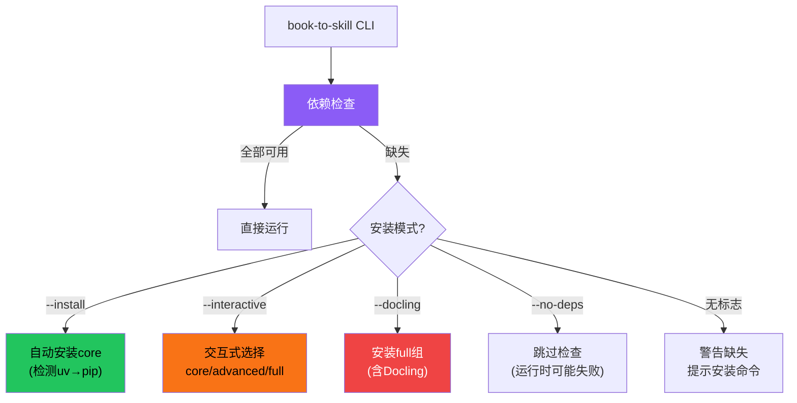
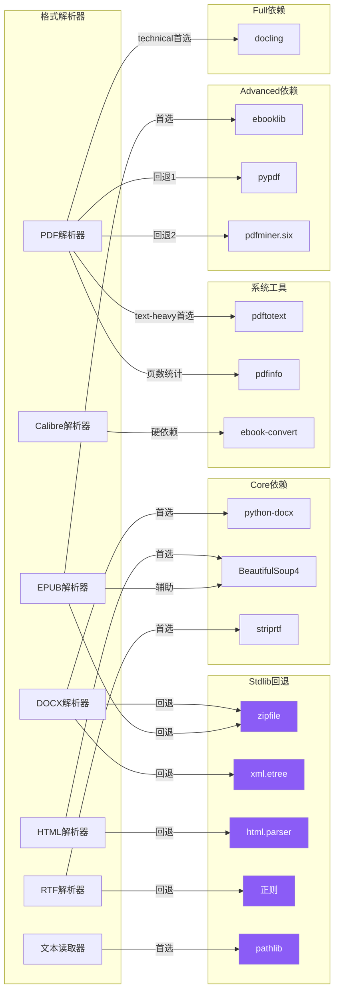

# 依赖管理系统

book-to-skill 采用**分层可选依赖**策略，将第三方库按功能分为 core/advanced/full 三个分组，每个格式解析器都有 stdlib 零依赖回退方案。用户可以按需安装最小依赖子集（仅 core 即可处理 DOCX/HTML/RTF + 部分 PDF/EPUB），也可以一键安装 full 组获取最佳提取质量。系统还支持 uv 包管理器自动安装、交互式依赖选择、pip 可安装包发布。

## 设计原理

1. **最小可用**：仅 core 依赖（2.5MB）即可处理 DOCX/HTML/RTF/纯文本 + PDF/EPUB 的 stdlib 回退
2. **优雅降级**：每个可选依赖缺失时自动回退到 stdlib 方案，不中断流程
3. **按需扩展**：advanced 组（+6.4MB）获得更好的 PDF/EPUB 质量；full 组（+2.5GB Docling）获得技术文档结构化提取
4. **零配置安装**：Claude Code 环境下自动检测 uv 并创建 venv，用户无需手动配置
5. **跨平台**：支持 Windows/macOS/Linux，含 WSL 路径处理

## 依赖分层架构



## 依赖分组详情

### Core 组（必选，~2.5MB）

| 包名 | 版本要求 | 用途 | 缺失影响 |
|------|---------|------|---------|
| python-docx | ≥0.8.11 | DOCX 段落/表格提取 | DOCX 回退到 stdlib ZIP/XML 解析 |
| beautifulsoup4 | ≥4.12.0 | HTML/EPUB 文本提取 | HTML 回退到 stdlib html.parser；EPUB 回退到 stdlib zipfile |
| striprtf | ≥0.0.26 | RTF 转纯文本 | RTF 回退到正则表达式清洗 |

```toml
# pyproject.toml
dependencies = [
    "python-docx>=0.8.11",
    "beautifulsoup4>=4.12.0",
    "striprtf>=0.0.26",
]
```

### Advanced 组（可选，+6.4MB）

| 包名 | 版本要求 | 用途 | 缺失影响 |
|------|---------|------|---------|
| ebooklib | ≥0.18 | EPUB 结构化解析（manifest/spine） | EPUB 回退到 stdlib zipfile |
| pypdf | ≥4.0 | PDF 快速文本提取 | PDF 回退链退化为 pdftotext→pdfminer→stdlib |
| pdfminer.six | ≥20231228 | PDF 深度文本提取 | 作为 pypdf 失败后的备用方案 |

```toml
[project.optional-dependencies]
advanced = [
    "ebooklib>=0.18",
    "pypdf>=4.0",
    "pdfminer.six>=20231228",
]
```

### Full 组（可选，+2.5GB）

| 包名 | 版本要求 | 用途 | 缺失影响 |
|------|---------|------|---------|
| docling | ≥2.0 | 技术文档结构化提取（表格/代码块 → Markdown） | technical 模式 PDF 退化为 text-heavy 提取 |

```toml
full = [
    "book-to-skill[advanced]",
    "docling>=2.0",
]
```

> **注意**：Docling 依赖 PyTorch 和多个 ML 模型，首次使用会下载模型文件。提取速度约 1.5 秒/页（pdftotext 约 0.1 秒/页），但能保留表格和代码块的 Markdown 结构。

### 系统工具（外部）

| 工具 | 提供方 | 用途 | 缺失影响 |
|------|--------|------|---------|
| `pdftotext` | Poppler | PDF 快速布局提取（`-layout` 模式） | PDF 回退链起点不可用 |
| `pdfinfo` | Poppler | PDF 页数统计 | 页数统计回退到 pypdf |
| `ebook-convert` | Calibre | MOBI/AZW/AZW3 转 EPUB 后提取 | MOBI/AZW 格式完全不可用（唯一硬依赖） |

### Stdlib 零依赖回退

所有格式都有 Python 标准库回退方案，确保在任何 Python 3.10+ 环境中都能运行：

| 格式 | stdlib 回退 | 质量 |
|------|-----------|------|
| DOCX | `zipfile` + `xml.etree` | 可提取段落文本和表格，无 python-docx 的样式/格式信息 |
| EPUB | `zipfile` + `html.parser.HTMLParser` | 可按 spine/manifest 顺序提取 HTML 文本 |
| HTML | `html.parser.HTMLParser` | 基础纯文本提取，无 BeautifulSoup 的容错性 |
| RTF | 正则表达式 | 基础转义解码，无 striprtf 的完整 RTF 指令处理 |
| PDF | 无纯 stdlib 方案 | 依赖 pdftotext 或 pypdf/pdfminer |
| 纯文本 | `pathlib` + 多编码检测 | 完整支持 |

## 依赖可用性检测

`deps.py` 模块在运行时检测各依赖是否可用：

```python
# deps.py
class DependencyStatus:
    def __init__(self):
        self.has_python_docx = self._try_import('docx')
        self.has_bs4 = self._try_import('bs4')
        self.has_striprtf = self._try_import('striprtf')
        self.has_ebooklib = self._try_import('ebooklib')
        self.has_pypdf = self._try_import('pypdf')
        self.has_pdfminer = self._try_import('pdfminer')
        self.has_docling = self._try_import('docling')
        self.has_pdftotext = self._check_command('pdftotext')
        self.has_pdfinfo = self._check_command('pdfinfo')
        self.has_ebook_convert = self._check_command('ebook-convert')

    def format_report(self) -> str:
        """生成依赖可用性报告"""
        lines = ["Dependency status:"]
        for name, available in self._asdict().items():
            icon = "✓" if available else "✗"
            lines.append(f"  {icon} {name}")
        return "\n".join(lines)
```

## CLI 安装模式

```bash
# 核心依赖（最小可用）
uv pip install book-to-skill
# 或
pip install book-to-skill

# 高级依赖（更好的PDF/EPUB质量）
uv pip install "book-to-skill[advanced]"
pip install "book-to-skill[advanced]"

# 完整依赖（含Docling，~2.5GB）
uv pip install "book-to-skill[full]"
pip install "book-to-skill[full]"
```

CLI 提供 4 种安装相关标志：

| 标志 | 行为 |
|------|------|
| `--install` | 自动检测 uv/pip 并安装 core 依赖 |
| `--interactive` | 交互式选择安装层级（core/advanced/full） |
| `--docling` | 安装 full 组（含 Docling） |
| `--no-deps` | 不检查依赖，直接运行（假设依赖已就绪） |



## Claude Code 自动安装

在 Claude Code 环境中（Skill 被触发时），book-to-skill 提供零配置自动安装流程：

```
Step 1: 检测 CLI 是否可用
  → which book-to-skill / python -m book_to_skill

Step 2: 不可用时自动安装
  → 优先检测 uv（UV_REQUIRED=true）
    - 已有项目 venv → uv pip install book-to-skill
    - 无 venv → uv tool install book-to-skill
  → uv 不可用 → pip install book-to-skill

Step 3: 安装后再次验证
  → book-to-skill --version
```

### UV_REQUIRED 策略

book-to-skill 优先使用 uv 作为包管理器（比 pip 快 10-100 倍）：

```python
# SKILL.md 中的自动安装逻辑
def ensure_installed():
    if shutil.which('uv'):
        # uv 可用：优先使用
        if in_venv():
            subprocess.run(['uv', 'pip', 'install', 'book-to-skill'], check=True)
        else:
            subprocess.run(['uv', 'tool', 'install', 'book-to-skill'], check=True)
    elif shutil.which('pip'):
        # pip 回退
        subprocess.run(['pip', 'install', 'book-to-skill'], check=True)
    else:
        raise InstallationError("Neither uv nor pip found")
```

## 跨平台支持

| 平台 | 支持状态 | 注意事项 |
|------|---------|---------|
| macOS | ✅ 完全支持 | Homebrew 安装 poppler/calibre |
| Linux | ✅ 完全支持 | apt/yum 安装 poppler-utils/calibre |
| Windows | ✅ 支持 | WSL 推荐用于 poppler/calibre；原生 Windows 使用 pip 安装 Python 依赖 |
| WSL2 | ✅ 完全支持 | Windows 路径通过 `/mnt/c/...` 访问 |

### WSL 路径处理

在 WSL 环境中，如果输入路径是 Windows 路径（`C:\...`），自动转换为 WSL 路径（`/mnt/c/...`）。

## Pip Installable 包发布

book-to-skill 配置为标准的 pip-installable Python 包：

```toml
# pyproject.toml
[project]
name = "book-to-skill"
version = "0.1.0"
requires-python = ">=3.10"

[project.scripts]
book-to-skill = "book_to_skill.cli:main"

[build-system]
requires = ["hatchling"]
build-backend = "hatchling.build"

[tool.hatch.build.targets.wheel]
packages = ["book_to_skill"]
```

CLI 入口点 `book-to-skill` 指向 `book_to_skill.cli:main`，安装后可直接在命令行使用。

## 提取器与依赖的映射关系



## 相关概念

- [四层产出流水线](four-layer-pipeline.md) — 依赖管理在流水线中的角色（Step 0-1 环境检查阶段）
- [多格式解析器](multi-format-parsers.md) — 各格式解析器的依赖链和回退逻辑
- [安全清洗机制](security-sanitization.md) — 安全扫描脚本无外部依赖（stdlib only）
