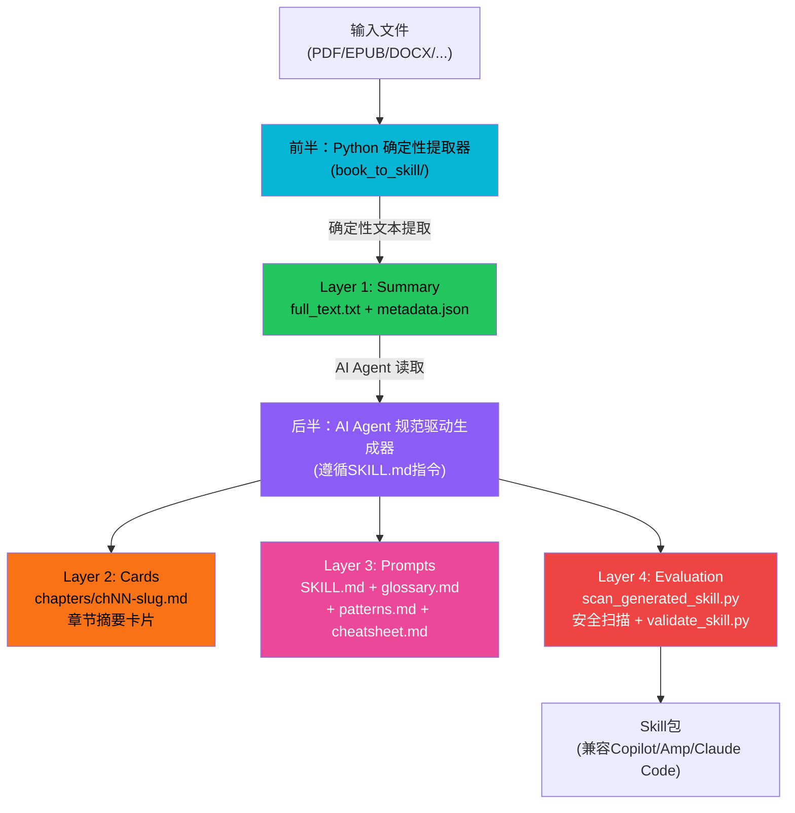
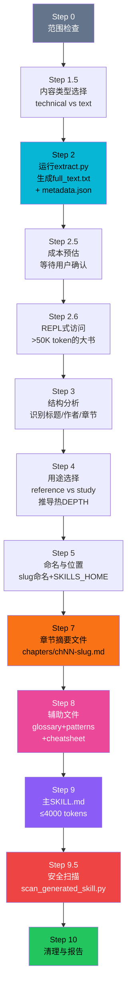
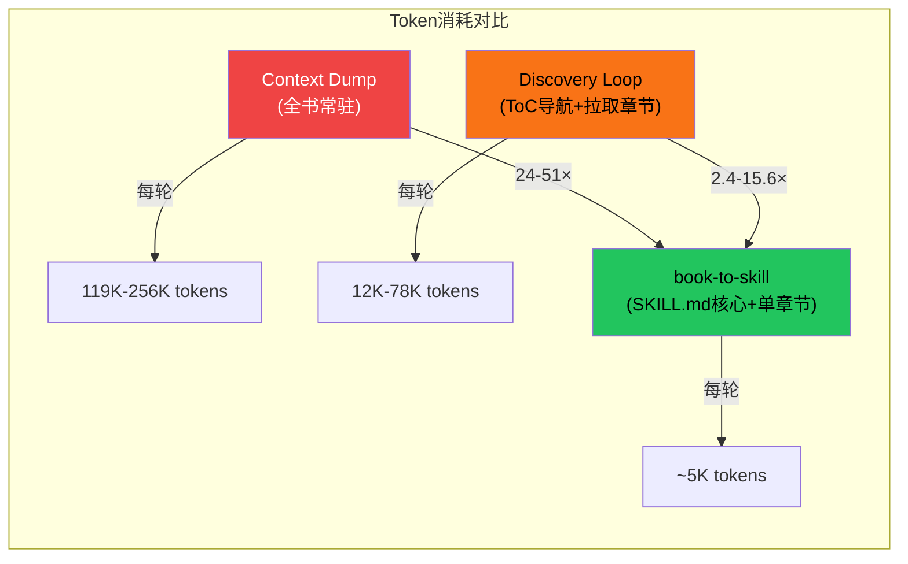

# 四层产出流水线

book-to-skill 采用**双半架构**（Dual-Half Architecture）：前半部分是 Python 确定性文本提取器（纯代码，无 AI），后半部分是 AI Agent 遵循 SKILL.md 指令的规范驱动生成器。整个流水线分为四层产出：summary（摘要/原始文本）→ cards（章节卡片）→ prompts（提示词/技能）→ evaluation（评估），将技术书籍/文档编译为符合 Agent Skills 开放标准的结构化 Skill 包。

## 设计原理

1. **关注点分离**：确定性文本提取（Python 代码）与 AI 生成（LLM 推理）完全分离，提取器不依赖 LLM，生成器由 SKILL.md 指令驱动
2. **token 效率**：通过分层产出和按需加载，将知识访问的 token 消耗降低 24-51 倍（对比全书常驻上下文）
3. **规范驱动生成**：AI 部分遵循严格的 SKILL.md 步骤指令，非自主发挥——输出格式、token 预算、质量规则都有明确约束
4. **优雅降级**：每个格式解析器都有 stdlib 回退方案，单个文件失败不中断批量处理
5. **分层安全**：从提取时清洗到生成后扫描，多层防护确保输出安全

## 双半架构



## 前半：Python 确定性提取器

Python 提取器负责将各种格式的输入文件转换为纯文本和元数据，**完全确定性**（相同输入始终产生相同输出），不调用任何 LLM。

### 输出产物

| 文件 | 内容 |
|------|------|
| `full_text.txt` | 合并后的纯文本，多文件用 `==== SOURCE: filename ====` 分隔 |
| `metadata.json` | 文件元数据（格式、页数/章节数、字符数、token 估算、章节检测结果） |

### metadata.json 字段

```json
{
  "source_file": "/path/to/book.pdf",
  "filename": "book.pdf",
  "format": "pdf",
  "extraction_method": "pdftotext",
  "file_size_mb": 12.4,
  "pages": 103,
  "sections": null,
  "spine_items": null,
  "chars": 456789,
  "words": 78234,
  "estimated_tokens": 104312,
  "chapters_detected": 12,
  "chapter_headings_sample": ["Chapter 1: Introduction", "Chapter 2: Getting Started"],
  "has_toc": true
}
```

### Token 估算

```python
# config.py L14
WORDS_PER_TOKEN = 0.75  # 约 0.75 词/token

# utils.py L50-L51
def estimate_tokens(text: str) -> int:
    return int(len(text.split()) / 0.75)
```

这是一个启发式估算，实际 token 数因模型分词器而异，但足以用于成本预估。

## 四种运行模式

| 模式 | 步骤 | 输出 | 用途 |
|------|------|------|------|
| **Mode 1: Full Conversion** | Steps 0-9 | 完整 Skill 包 | 全新转换 |
| **Mode 2: Analyze Only** | Steps 0-3 | 提取报告 | 仅分析结构，不生成 |
| **Mode 3: Generate from Prior** | Steps 4-9 | 完整 Skill 包 | 从已有提取结果生成 |
| **Mode 4: Update/Fold-in** | 6步更新流程 | 增量更新 | 合并新内容到已有 Skill |

## 10步转换流程（Full Conversion）



### Step 1.5：内容类型选择

用户选择提取模式：
- **technical**：代码/表格/公式，使用 Docling（~1.5s/页，保留 markdown 格式的表格/代码块）
- **text-heavy**：纯散文，使用 pdftotext 等快速提取器（~0.1s/页）

### Step 2.5：成本预估

基于 metadata 计算 input/output tokens 预估，等待用户确认后才执行 AI 生成步骤。实测成本约 **$1/书**（Claude Sonnet 4.5）。

### Step 2.6：REPL 式访问

对于 >50K token 的大书，不直接全文加载到上下文，而是使用 grep/sed/Read(offset/limit) 程序化探测：

```bash
# 示例：程序化探测大书
grep -n "Chapter" full_text.txt | head -20    # 找到章节位置
sed -n '100,200p' full_text.txt               # 读取特定范围
```

## Layer 2：章节摘要文件（Cards）

Step 7 生成 per-chapter 摘要文件，存放在 `chapters/` 目录：

```
chapters/
├── ch01-introduction.md
├── ch02-getting-started.md
├── ch03-core-concepts.md
└── ...
```

### Per-chapter Token 预算矩阵

| 内容类型 | reference 模式 | study 模式 |
|---------|---------------|-----------|
| text（纯散文） | 800-1,200 tokens | 1,000-1,800 tokens |
| technical（代码/表格） | 1,200-1,800 tokens | 2,000-3,000 tokens |

### 章节卡片模板

每个章节文件遵循统一结构：

```markdown
# Chapter N: {Title}

## Core Idea
{一句话核心概念}

## Frameworks Introduced
{介绍的框架/模型}

## Key Concepts
- {概念1}
- {概念2}

## Mental Models
{思维模型}

## Anti-patterns
{反模式和常见错误}

## Code Examples (technical only)
{代码示例}

## Reference Tables (technical only)
{参考表格}

## Worked Example (study only)
{完整工作示例}

## Key Takeaways
- {要点1}
- {要点2}

## Connects To
- 下一章：{chNN-slug}
- 相关概念：{glossary term}
```

## Layer 3：辅助文件 + 主 SKILL.md

### Step 8：辅助文件

| 文件 | 内容 | Token 上限 |
|------|------|-----------|
| `glossary.md` | 术语表，字母序，格式 `**Term** — definition (Ch N)` | ≤1,500 tokens |
| `patterns.md` | 技术/算法/设计模式，含 When to use/How/Trade-offs | ≤2,000 tokens |
| `cheatsheet.md` | 决策规则/决策树/权衡矩阵/阈值/启发式 | ≤1,200 tokens |

### Step 9：主 SKILL.md

主 SKILL.md 的结构（总正文 ≤4,000 tokens，最重要内容前置）：

```markdown
---
name: {author-concept-or-title}
description: {触发条件+功能描述}
---

# {Skill Name}

## How to Use
{使用方式和触发条件}

## Core Frameworks & Mental Models
{~2,000 tokens，核心框架和思维模型}

## Chapter Index
| Chapter | Title | Key Concepts |
|---------|-------|-------------|
| 1 | ... | ... |

## Topic Index
{字母序术语→章节映射}

## Supporting Files
- [Glossary](glossary.md)
- [Patterns](patterns.md)
- [Cheatsheet](cheatsheet.md)
- [Chapter 1](chapters/ch01-xxx.md)
- ...

## Scope & Limits
{技能的适用范围和局限性}
```

## Layer 4：评估与安全扫描

Step 9.5 运行 `tools/scan_generated_skill.py` 安全扫描，检测 7 类 prompt 注入和数据渗出：

| 检测类别 | 规则 |
|---------|------|
| prompt.ignore_previous | "忽略先前指令" |
| prompt.disregard_system | "忽略系统指令" |
| prompt.role_reassignment | 角色重分配（"you are now"） |
| prompt.fake_system_prefix | 伪造系统消息前缀 |
| prompt.system_tag | `<system>` 标签 |
| prompt.chat_template_tag | 模型聊天模板分隔符 |
| prompt.tool_call_tag | 工具调用控制 token |
| 数据渗出 | exfiltrate + curl/wget + .env/secrets/api_key 共现 |
| Frontmatter 权限扩大 | allowed-tools 声明越权 |
| disable-model-invocation | 检查 `disable-model-invocation: false` |

非零退出则停止并要求人工审查。

### 扫描限制

- 最多 1000 个 Markdown 文件
- 单文件 ≤2MB
- 总体 ≤20MB
- 拒绝符号链接

## Update/Fold-in 模式（Mode 4）

6 步增量更新流程：

1. 读取已有 Skill 结构
2. 匹配内容（修订 vs 新增）
3. 生成/更新章节文件
4. 合并辅助文件（glossary/patterns/cheatsheet）
5. 重新生成 SKILL.md
6. 扫描 + 清理 + 报告

## 8 条质量规则

1. **提取结构非摘要**：提取器提取完整结构，不是生成摘要
2. **保留作者精确命名**：使用原书术语和概念名
3. **密度优于完整性**：宁可省略边缘内容，也要保持核心信息密度
4. **实践者语气**：面向实践者而非学术读者
5. **SKILL.md 前置加载**：最重要内容放在 SKILL.md（始终加载）
6. **章节按需加载**：详细内容放在 chapters/，按需读取
7. **绝不复制原文**：用自己的话重述，不直接复制原文段落
8. **主题索引关键**：Topic Index 是快速导航的核心

## 发现循环税效率优势

book-to-skill 的分层产出相比传统的上下文注入方式有显著的 token 效率优势：



| 策略 | 每轮 token 消耗 | 相对 book-to-skill | 成本特性 |
|------|----------------|-------------------|---------|
| Context Dump | 119K-256K | 24-51× | 每轮重复消耗全书 |
| Discovery Loop | 12K-78K | 2.4-15.6× | 导航开销+章节加载 |
| **book-to-skill** | **~5K** | **1×** | 仅加载 SKILL.md+单章节 |

核心优势：context-dump 策略每轮都重复加载全书，而 book-to-skill 的 SKILL.md 始终在上下文中（~4K tokens），只按需加载单个章节文件（~1-2K tokens）。

## 性能指标

实测数据（103 页技术 PDF）：

| 提取器 | 耗时 | 表格 | 代码块 | 质量 |
|--------|------|------|--------|------|
| pdftotext | 0.1s | 0 | 0 | 纯文本可用 |
| Docling | 164s | 48 | 36 | 保留markdown结构 |

## 相关概念

- [多格式解析器](multi-format-parsers.md) — Python 提取器支持的 7 种格式和多语言章节检测
- [安全清洗机制](security-sanitization.md) — sanitize 模块和多层安全防护
- [依赖管理系统](dependency-management.md) — 提取器的可选依赖分组和运行模式
