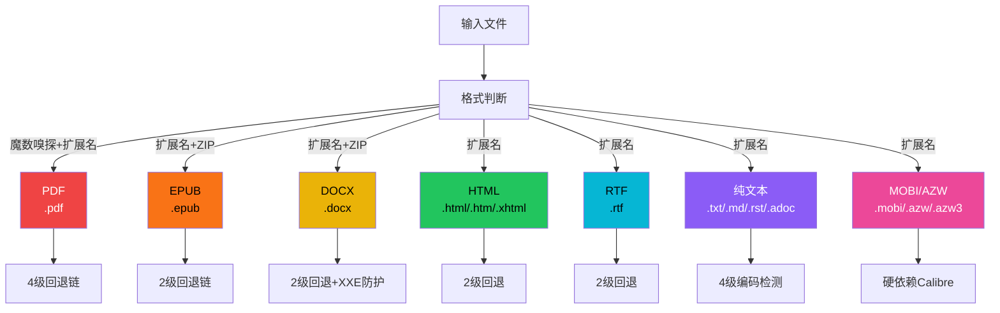
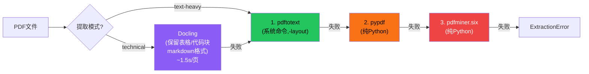
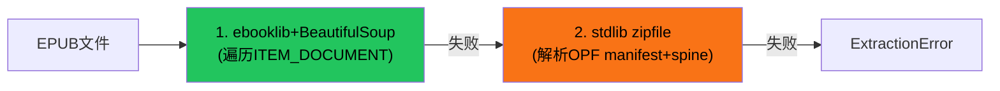
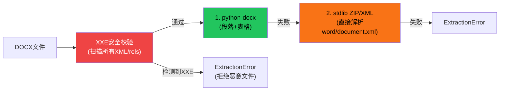
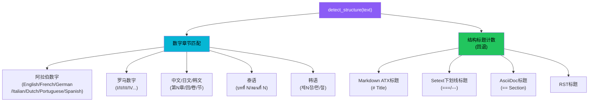

# 多格式解析器

book-to-skill 的 Python 提取器支持 7 种文档格式的解析，每种格式都实现了"优先第三方库 → stdlib 回退"的降级策略。解析器还包含一个覆盖 13 种语言的章节检测系统，能识别阿拉伯数字、罗马数字、中文/日文/韩文/泰语数字的章节标题，以及 Markdown/AsciiDoc/RST 结构标题。

## 设计原理

1. **优雅降级**：每种格式至少有一个第三方库优先方案和一个 stdlib 回退方案，MOBI/AZW 是唯一硬依赖（必须 Calibre）
2. **格式嗅探**：不支持的后缀名通过魔数（`%PDF`/`PK` ZIP）判断真实格式
3. **多语言章节检测**：支持 13 种语言的章节标题识别，包括 CJK 和泰语等非拉丁文字
4. **页眉页脚清理**：PDF 解析通过频率统计自动移除重复的页眉页脚
5. **编码自动检测**：文本文件按 BOM→UTF-8→CP1252→Latin-1 优先级尝试编码

## 支持的文件格式



### 支持的扩展名

```python
# config.py L16-L24
SUPPORTED_EXTENSIONS = {
    # 纯文本类
    '.txt', '.text', '.md', '.markdown', '.rst', '.adoc', '.asciidoc',
    # HTML 类
    '.html', '.htm', '.xhtml',
    # Calibre 电子书
    '.mobi', '.azw', '.azw3',
    # 其他
    '.pdf', '.epub', '.docx', '.rtf',
}
```

## PDF 解析器

PDF 解析有最复杂的回退链，同时支持 text-heavy 和 technical 两种模式：



### pdftotext 后处理

```python
# pdf.py L14-L47 — clean_pdftotext
def clean_pdftotext(text: str) -> str:
    # 1. 按换页符(\f)分页
    # 2. 统计每页首尾行频率，移除出现率>50%的重复行（页眉页脚）
    # 3. 移除页边页码
    # 4. 连字符断词合并（word-\nword → wordword）
```

页眉页脚清理的核心逻辑：对每页提取首行和尾行，统计全局频率，出现率超过 50% 的行判定为页眉/页脚并移除。

### Docling（technical 模式）

```python
# pdf.py L97-L120
def extract_with_docling(pdf_path: str) -> str | None:
    # 使用 Docling DocumentConverter
    # 关闭 OCR（pipeline_options.do_ocr = False）
    # 启用表格结构识别
    # 输出 markdown 格式（保留表格为 markdown 表格、代码块为 fenced code block）
```

Docling 是 technical 模式的首选提取器，能保留文档的结构化信息（表格、代码块），但速度较慢。

### 页数统计

```python
# pdf.py L123-L142
def count_pages(pdf_path: str) -> int:
    # 优先: pdfinfo 系统命令（快速）
    # 回退: pypdf 页数统计
```

## EPUB 解析器



### stdlib zipfile 回退的详细流程

ebooklib 不可用时，纯 stdlib 回退实现了完整的 EPUB 解析：

1. **查找 OPF 路径**：读取 `META-INF/container.xml` 获取 rootfile 路径；回退扫描 zip 内 `.opf` 文件
2. **解析 manifest**：建立 id→href 映射，正确处理 OPF 相对路径
3. **解析 spine**：spine 定义阅读顺序（itemref 列表）
4. **按 spine 顺序提取**：按 spine 顺序读取 HTML/XHTML 内容
5. **安全网**：追加 manifest 中剩余的 HTML 文件（防止 spine 不完整）

```python
# epub.py L49-L111（简化）
def extract_with_zipfile(epub_path: str) -> str | None:
    with zipfile.ZipFile(epub_path) as zf:
        opf_path = _find_opf_path(zf)
        opf_content = zf.read(opf_path)
        # 解析 manifest（id → href）
        # 解析 spine（阅读顺序）
        # 按 spine 顺序提取 HTML 内容
        # 使用 _HTMLTextExtractor 解析 HTML
```

### EPUB 章节计数

OPF spine 中的 `<itemref>` 数量即为章节数。

## DOCX 解析器



### XXE/Billion Laughs 防护

```python
# docx.py L71-L92
def validate_docx_xml_safety(docx_path: str):
    """扫描 ZIP 内所有 XML/rels 文件，防止 XXE 和 Billion Laughs 攻击"""
    with zipfile.ZipFile(docx_path) as zf:
        for name in zf.namelist():
            if name.endswith(('.xml', '.rels')):
                content = zf.read(name).decode('utf-8', errors='replace')
                if '<!DOCTYPE' in content or '<!ENTITY' in content:
                    raise ExtractionError(
                        f"XML entity declaration detected in {name}: "
                        "possible XXE or Billion Laughs attack"
                    )
```

### stdlib ZIP/XML 回退

直接解析 `word/document.xml`，按文档顺序遍历块元素（段落/表格/内容控件）：
- 段落：提取 `w:t` 文本节点
- 表格：按行提取，单元格用制表符分隔
- 递归处理未知包装器（`w:sdt` 等内容控件），但不重复计算表格单元格内的段落

## HTML 解析器

```python
# html.py — 最小 HTML 解析器
class _HTMLTextExtractor(html.parser.HTMLParser):
    """stdlib 纯 Python HTML→纯文本转换器"""
    # 跳过 <script>, <style>, <head> 标签内容
    # 在块级标签处插入换行(p/br/h1-h6/li/div)
```

回退链：BeautifulSoup（移除 script/style/head 后 get_text）→ `_HTMLTextExtractor`。

## RTF 解析器

```python
# rtf.py L12-L29
# Unicode 解码: \uN 转义（有符号16位），对0x10000取模，跳过NUL和代理对(D800-DFFF)
_RTF_UNICODE = re.compile(r'\\u(-?\d+)')

# 正则回退清洗:
# 1. Unicode 转义 → 实际字符
# 2. 十六进制转义(\'XX)
# 3. 段落标记(\par[d]?) → 换行
# 4. 制表符(\tab) → \t
# 5. 控制字移除
# 6. 花括号移除
# 7. HTML 实体 unescape
```

回退链：striprtf 库 → 正则清洗。

## 文本文件读取器

编码检测优先级（按 BOM 和尝试顺序）：

1. **UTF-8 BOM**（`EF BB BF`）
2. **UTF-32 LE/BE**（BOM 检测）
3. **UTF-16 LE/BE**（BOM 检测）
4. **UTF-8**（无 BOM 尝试）
5. **CP1252**（Windows 西欧语言）
6. **Latin-1**（最终回退，永远不会失败）

## Calibre 解析器（MOBI/AZW/AZW3）

MOBI/AZW 格式是唯一的硬依赖——必须安装 Calibre 的 `ebook-convert` 工具，无 Python 回退方案：

```python
# calibre.py L10-L26
def extract_with_ebook_convert(input_path: str) -> str | None:
    # 调用 ebook-convert <input> <temp_output.txt>
    # 超时 300 秒
    # 读取输出文本文件
```

如果 Calibre 不可用，MOBI/AZW 文件的提取将失败并抛出 ExtractionError（批量模式下跳过该文件）。

## 13 语言章节检测系统

章节检测是结构分析的核心，支持 13 种语言的章节标题识别：



### 数字章节正则

```python
# utils.py — 显式章节正则
_EXPLICIT_CHAPTER = re.compile(
    r'^(?:Chapter|Chapitre|Kapitel|Capítulo|Capitolo|Hoofdstuk|ch\.)\s+'
    r'(\d{1,2}|[IVX]+)',
    re.IGNORECASE
)
```

支持的语言"章节"关键词：

| 语言 | 关键词 |
|------|--------|
| English | Chapter |
| French | Chapitre |
| German | Kapitel |
| Spanish | Capítulo |
| Italian | Capitolo |
| Dutch | Hoofdstuk |
| Portuguese | Capítulo |
| 通用缩写 | ch. |

### 中文/日文/韩文章节

```python
# 中文数字解析
_CN_NUM_VALUES = {'一':1, '二':2, '三':3, '四':4, '五':5, '六':6, '七':7, '八':8, '九':9, '十':10, '百':100}
_CN_NUM_UNITS = {'章', '回', '卷', '节', '篇', '讲'}

# 支持格式：
# 第N章 / 第一回 / 第三章 / 第12节
# Markdown CJK序号：## 一 · 缘起
# 全角阿拉伯数字：Ｕ+FF10-FF19
```

### 泰语章节

```python
# 泰语章节关键词
_TH_CHAPTER = re.compile(r'^(?:บทที่|ตอนที่|ภาคที่)\s+(\d+)')
_TH_DIGIT_MAP = {'๐':0,'๑':1,'๒':2,'๓':3,'๔':4,'๕':5,'๖':6,'๗':7,'๘':8,'๙':9}
```

### 韩文章节

```python
# 韩语章节格式：제N장/제N편/제N절/제N관
# 支持插入后缀：제6장의2（第6章之2）
_KO_CHAPTER = re.compile(r'^제\s*(\d+)\s*(장|편|절|관)')
# 通过尾部语义（行尾/标点/空格+内容）区分标题和正文交叉引用
```

### 罗马数字处理

```python
# utils.py L232-L257
_ROMAN_VALUES = {'I':1, 'V':5, 'X':10, 'L':50, 'C':100, 'D':500, 'M':1000}

def _roman_to_int(s: str) -> int | None:
    """罗马数字转整数，通过回转校验拒绝非规范形式（如IIII、VV）"""

def _int_to_roman(n: int) -> str:
    """整数转罗马数字（用于回转校验）"""
```

### 目录检测

13 种语言的目录标题词：

```python
_TOC_HEADERS = {
    'table of contents', 'contents',          # 英
    'tabla de contenidos', 'índice',          # 西
    'sumário', 'índice',                      # 葡
    '目录', '目次',                            # 中/日
    'table des matières',                     # 法
    'inhaltsverzeichnis',                     # 德
    'indice',                                 # 意
    'inhoudsopgave',                          # 荷
}
```

目录仅在前 30K 字符内搜索。

### 结构标题回退

当数字章节匹配无结果时，回退到结构标题计数：

1. 统计 Markdown/AsciiDoc/RST 中的结构标题
2. **跳过代码块内标题**（防止误识别注释/代码中的 # 符号）
3. **拒绝纯数字开头标题**和全标点标题
4. 选择最浅层且 ≥2 个不同标题的深度作为章节级别

### 中文数字转换

`_cn_numeral_to_int()` 支持组合式中文数字（1-999 范围）：
- "一百零八" → 108
- "二十一" → 21
- "三百六十五" → 365

## 单文件提取主流程

```python
# utils.py L410-L599 — extract_single_file()
def extract_single_file(input_path, extraction_mode, install_mode) -> dict:
    # 1. 检查文件存在性
    # 2. 魔数嗅探（%PDF/PK）判断真实格式
    # 3. 按格式选择提取器链
    # 4. 提取后调用 sanitize_extracted_text() 清洗
    # 5. 返回元数据字典
```

## 相关概念

- [四层产出流水线](four-layer-pipeline.md) — 解析器在流水线中的位置（Step 2 提取阶段）
- [安全清洗机制](security-sanitization.md) — 提取后的零宽字符清洗和多层安全防护
- [依赖管理系统](dependency-management.md) — 解析器第三方库依赖的分组和安装策略
