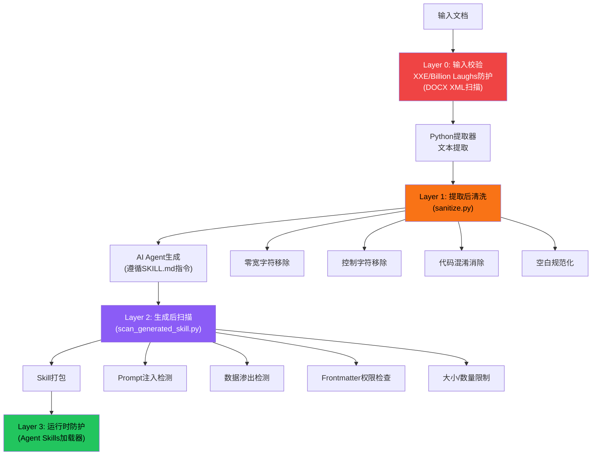

# 安全清洗机制

book-to-skill 采用**防御纵深**（Defense in Depth）策略，在提取、生成、打包三个阶段实施多层安全防护。核心目标是防止恶意文档通过零宽字符隐写、控制字符混淆、prompt 注入、数据渗出等手段劫持 AI Agent。安全检查覆盖输入校验→文本提取→AI 生成→输出扫描全链路，同时保持对 CJK/泰语等非拉丁文字的友好性。

## 设计原理

1. **防御纵深**：不依赖单一防护点，在每个阶段都实施安全检查
2. **零宽字符清洗**：6 类零宽/不可见 Unicode 字符是文本隐写的主要载体，必须在提取后立即清除
3. **代码混淆消除**：RTLO、同形异义字等是 prompt 注入的常见混淆手段
4. **代码块豁免**：Markdown 代码块内的内容是原文引用，不做 prompt 注入扫描
5. **非零退出**：安全扫描发现问题时以非零退出码终止流程，要求人工审查
6. **多语言友好**：清洗规则不误伤中文、日文、韩文、泰语等非拉丁文字

## 多层安全防护总览



## Layer 0：输入校验（XXE 防护）

DOCX 解析器在读取文件前扫描所有 XML/rels 文件，检测 XXE（XML External Entity）和 Billion Laughs 攻击：

```python
# docx.py L71-L92
def validate_docx_xml_safety(docx_path: str):
    """拒绝包含ENTITY声明的DOCX文件"""
    with zipfile.ZipFile(docx_path) as zf:
        for name in zf.namelist():
            if name.endswith(('.xml', '.rels')):
                content = zf.read(name).decode('utf-8', errors='replace')
                if '<!DOCTYPE' in content or '<!ENTITY' in content:
                    raise ExtractionError(
                        f"XML entity declaration detected in {name}: "
                        "possible XXE or Billion Laughs attack"
                    )
```

此检查在实际解析内容**之前**执行，确保恶意 XML 不会被解析器处理。

## Layer 1：提取后文本清洗（sanitize.py）

`sanitize_extracted_text()` 是所有提取器的后处理必经步骤：

### 清洗规则

```python
# sanitize.py L17-L37
def sanitize_extracted_text(text: str) -> str:
    if not text:
        return ""

    # 1. 移除零宽/不可见字符
    text = _remove_zero_width_chars(text)
    # 2. 移除控制字符（保留换行/制表）
    text = _remove_control_chars(text)
    # 3. 消除代码混淆
    text = _sanitize_code_obfuscation(text)
    # 4. 规范化空白
    text = _normalize_whitespace(text)
    # 5. 确保以换行结尾
    text = text.rstrip() + '\n'
    return text
```

### 1.1 零宽/不可见字符移除

移除 6 类 Unicode 不可见/零宽字符：

| Unicode 码位 | 名称 | 用途/风险 |
|-------------|------|----------|
| `U+200B` | ZERO WIDTH SPACE (ZWSP) | 最常见的隐写字符，用于在文本中嵌入隐藏标记 |
| `U+200C` | ZERO WIDTH NON-JOINER (ZWNJ) | 可用于绕过关键字过滤 |
| `U+200D` | ZERO WIDTH JOINER (ZWJ) | 同上 |
| `U+FEFF` | ZERO WIDTH NO-BREAK SPACE (BOM) | 文件头 BOM，正文中不合法 |
| `U+2060` | WORD JOINER | 零宽不可断空格 |
| `U+180E` | MONGOLIAN VOWEL SEPARATOR | 传统上无可见字形 |

```python
# sanitize.py L10-L11
_ZERO_WIDTH_CHARS = re.compile(r'[\u200B\u200C\u200D\uFEFF\u2060\u180E]')
```

### 1.2 控制字符移除

移除 BMP（Basic Multilingual Plane）中 U+0000-U+FFFF 范围内的所有 Cc 类别控制字符，仅保留：

| 保留字符 | 码位 | 原因 |
|---------|------|------|
| `\t` | U+0009 | 制表符（后转为双空格） |
| `\n` | U+000A | 换行符 |
| `\r` | U+000D | 回车符（可能出现在 CRLF 中） |

```python
# sanitize.py L13
_CONTROL_CHARS = re.compile(r'[\x00-\x08\x0B\x0C\x0E-\x1F\x7F-\x9F]')
```

### 1.3 代码混淆消除

处理 4 类常见的代码混淆技术：

| 混淆类型 | Unicode | 处理方式 |
|---------|---------|---------|
| **RTLO** (Right-to-Left Override) | U+202E | 移除 |
| **Bidi 控制字符** | U+202A-U+202E, U+2066-U+2069 | 全部移除 |
| **Cyrillic 'a'同形异义** | U+0430（а，看起来像 a） | 替换为拉丁 'a'（0x61） |
| **Cyrillic 'o'同形异义** | U+043E（о，看起来像 o） | 替换为拉丁 'o'（0x6F） |

```python
# sanitize.py L40-L50
def _sanitize_code_obfuscation(text: str) -> str:
    # RTLO和Bidi控制字符
    text = re.sub(r'[\u202A-\u202E\u2066-\u2069]', '', text)
    # Cyrillic homoglyphs → Latin
    # U+0430 (а) → U+0061 (a)
    text = text.replace('\u0430', 'a')
    # U+043E (о) → U+006F (o)
    text = text.replace('\u043E', 'o')
    return text
```

> **注意**：同形异义字替换仅限已被广泛用于钓鱼/绕过的特定字符。常规 Cyrillic 文本（如俄文书籍）中绝大多数字符不受影响。

### 1.4 Tab 转换

Tab 字符统一转换为双空格：

```python
# config.py L13
TAB_REPLACEMENT = "  "
```

这是因为不同编辑器/渲染器对 Tab 宽度的解释不一致，统一为双空格确保跨平台一致显示。

### 1.5 空白规范化

- 每行去除首尾空白（`rstrip`）
- 连续空行压缩为最多 2 个连续换行
- 文件以单个 `\n` 结尾

## Layer 2：生成后安全扫描（scan_generated_skill.py）

AI Agent 生成 Skill 文件后，运行 `scan_generated_skill.py` 进行最终安全检查。此脚本独立于 Python 包（tools/ 目录下），使用 stdlib `re` 模块实现，无需任何外部依赖。

### 扫描范围限制

| 限制项 | 阈值 | 原因 |
|--------|------|------|
| 最大文件数 | 1,000 个 Markdown 文件 | 防止扫描超大目录 |
| 单文件大小 | 2 MB | 防止处理异常大文件 |
| 总体大小 | 20 MB | 合理 Skill 包上限 |
| 符号链接 | **拒绝扫描** | 防止符号链接遍历攻击 |
| 扫描文件类型 | 仅 `.md`/`.markdown` | 只扫描 Agent 可能加载的文本 |

### 7 类 Prompt 注入检测

| ID | 检测规则 | 匹配模式 |
|----|---------|---------|
| prompt.ignore_previous | "ignore previous/above instructions" 及其变体 | 多语言关键词 |
| prompt.disregard_system | "disregard system/developer prompt" | 多语言关键词 |
| prompt.role_reassignment | "you are now/forget your role" 角色重分配 | 正则匹配 |
| prompt.fake_system_prefix | 伪造系统消息前缀（`[SYSTEM]`、`SYSTEM:`、`<system_message>`） | 正则匹配 |
| prompt.system_tag | 裸 `<system>`/`</system>` 标签（Anthropic 等模型的系统消息标记） | 字面匹配 |
| prompt.chat_template_tag | 模型聊天模板分隔符（`<|im_start|>`、`<|endoftext|>`、`<s>...</s>`、`</s>`） | 字面匹配 |
| prompt.tool_call_tag | 工具调用控制 token（`<|FunctionCallBegin|>`、`<tool_call>`） | 字面匹配 |

### 数据渗出检测

检测数据外泄企图——需要同时满足两个条件（精确+邻近）：
1. **渗出动作词**：`exfiltrate`、`send`、`post`、`curl`、`wget`、`fetch`、`upload`、`transmit`、`http://`、`https://`
2. **敏感目标**：`.env`、`secret`、`api_key`、`apikey`、`password`、`credential`、`token`
3. **邻近窗口**：两词相距 ≤80 字符（同一段落）

这避免了单独提到 "curl" 或单独提到 "api_key" 的假阳性（例如合法的 API 使用教程）。

### Frontmatter 权限扩大检测

扫描 YAML frontmatter 中的 `allowed-tools` 字段：

- `*` 通配符（授予所有工具权限）→ 严重
- `Bash`/`bash`（shell 执行权限）→ 警告
- 未声明（默认行为）→ 通过

同时检测 `disable-model-invocation: false`（可能绕过安全检查）。

### 代码块豁免扫描

安全扫描的关键设计：**Markdown 代码块（fenced code block，```` ``` ```` 和 `~~~`）内的内容跳过 prompt 注入和数据渗出检测**。

原因：
1. 代码块内是引用的原文，可能包含示例命令如 `curl https://api.example.com`
2. 代码块内的 "ignore previous" 等文本是原文引用，不是注入指令
3. Agent Skills 加载器不会执行代码块内的指令（仅作为参考内容）

但 frontmatter 检查和文件大小限制仍然适用。

### 输出格式

```
== Skill Security Scan ==
Scanning: /path/to/skill/
Files scanned: 12
┌─────────────────────────────────────────────────────────────┐
│ Severity │ File                  │ Line │ Rule              │
├─────────────────────────────────────────────────────────────┤
│ CRITICAL │ SKILL.md              │   42 │ prompt.role_...   │
│ WARNING  │ examples.md           │   18 │ frontmatter.tools │
└─────────────────────────────────────────────────────────────┘
Errors: 1 critical, 1 warning
FAIL — issues detected
```

退出码：
- 0：通过（无 critical/warning）
- 1：发现问题（需人工审查）

## 多语言友好性

所有清洗规则经过精心设计，确保不误伤非拉丁文字：

| 文字 | 影响 | 原因 |
|------|------|------|
| 中文 (CJK) | ✅ 无影响 | 零宽字符和控制字符独立于 CJK 码位范围 |
| 日文 (Hiragana/Katakana/Kanji) | ✅ 无影响 | 同上 |
| 韩文 (Hangul/Hanja) | ✅ 无影响 | 韩语章节检测和清洗互不干扰 |
| 泰语 | ✅ 无影响 | 泰语数字（๐-๙）不在控制字符范围内 |
| 俄文 (Cyrillic) | ⚠️ 仅替换 2 个同形异义字 | 常规俄文文本中的 а/о 在编程上下文中可能被滥用，但普通文本中出现频率低，替换风险可控 |
| 阿拉伯文 | ✅ 无影响 | RTL 文本正常处理（RTLO U+202E 是控制字符，区别于正常的 RTL 方向性） |

## 相关概念

- [四层产出流水线](four-layer-pipeline.md) — 安全清洗在流水线中的位置（Layer 1 在提取后，Layer 2 在生成后）
- [多格式解析器](multi-format-parsers.md) — 各解析器在提取后统一调用 sanitize_extracted_text()
- [依赖管理系统](dependency-management.md) — scan 脚本无外部依赖（stdlib only）
