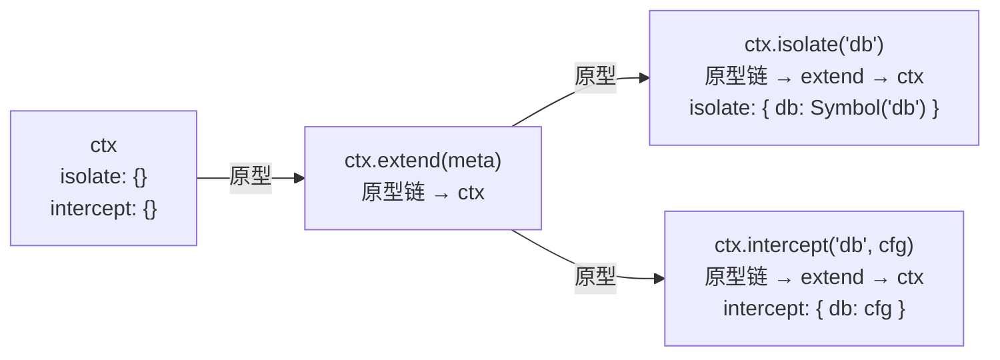
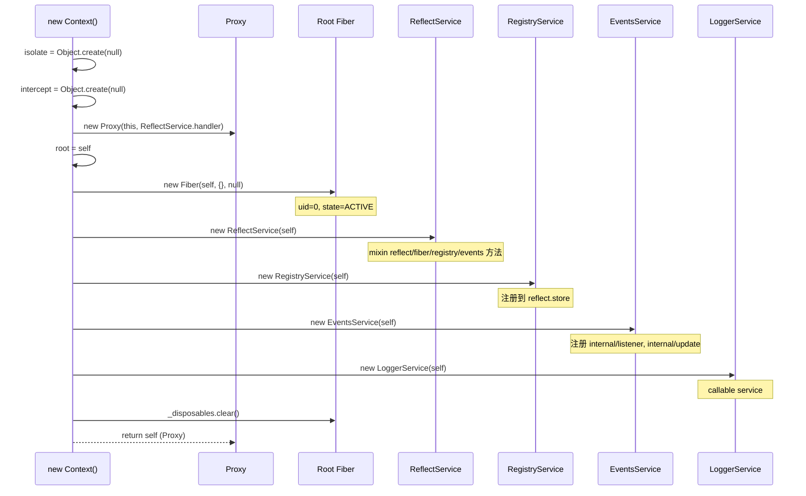

# Context 容器

Context 是 Cordis 框架的心脏，是一个基于 **ES6 Proxy** 实现的依赖注入容器。它不是普通的类实例——构造函数返回的是一个被 `ReflectService.handler` 代理的 Proxy 对象。所有服务查找、属性拦截、事件派发、插件注册都通过这个 Proxy 透明完成。开发者永远不会直接操作原始 Context 对象，而是与 Proxy 交互，从而实现了"时空可组合性"的核心抽象。

## 设计原理

Cordis 的 Context 设计解决了三个核心问题：

1. **透明的依赖注入**：通过 Proxy 的 `get` 拦截器，访问未声明的属性时自动沿 Fiber 链查找服务实现，无需显式调用容器 API。
2. **层次化的上下文扩展**：通过原型链继承创建子 Context（`extend`/`isolate`/`intercept`），每个插件运行在独立的 Context 分支上，互不干扰。
3. **可组合的效果管理**：Context 与 Fiber 深度绑定，`ctx.effect()` 注册的副作用随 Fiber 生命周期自动清理。

```mermaid
graph TB
    subgraph RootContext["Root Context (Proxy)"]
        R[Context 对象<br/>isolate: {}<br/>intercept: {}]
        RF[Root Fiber<br/>uid=0, state=ACTIVE]
        RS[ReflectService<br/>handler/get/set/has]
        RY[RegistryService<br/>plugin/inject]
        RE[EventsService<br/>emit/parallel/serial/bail/waterfall]
        RL[LoggerService<br/>callable service]
    end

    subgraph PluginContext["Plugin Context (extend)"]
        PC[Context 派生对象<br/>原型 = getTraceable(parent)]
        PF[Plugin Fiber<br/>uid=1, state=PENDING→ACTIVE]
    end

    subgraph IsolateContext["Isolate Context (isolate)"]
        IC[Context 派生对象<br/>isolate: { database: Symbol('database') }]
    end

    R -->|原型链| PC
    PC -->|原型链| IC
    RF -->|parent.fiber| PF
    RS -.->|Proxy handler| R
```

## Context 类定义

[context.ts:L9-L78](file:///d:/spaces/SpecWeave/external/libs/models/ai/cordis/packages/core/src/context.ts#L9-L78)

### 接口声明

Context 接口通过 TypeScript 的 **module augmentation**（声明合并）在多个文件中逐步扩展：

```typescript
// context.ts 中的基础接口
export interface Context {
  [symbols.isolate]: Dict<symbol>      // 服务隔离映射表
  [symbols.intercept]: Dict             // 服务配置拦截表
  root: this                            // 根 Context 引用
  baseUrl?: string                      // 可选的基础 URL
  events: EventsService                 // 内置事件服务
  logger: LoggerService                 // 内置日志服务
  reflect: ReflectService               // 内置反射服务
  registry: RegistryService             // 内置注册服务
}
```

```typescript
// fiber.ts 扩展：添加 fiber 属性和 effect 方法
declare module './context' {
  export interface Context extends Pick<Fiber, 'effect'> {
    fiber: Fiber
  }
}
```

```typescript
// events.ts 扩展：添加事件派发和监听方法
declare module './context' {
  export interface Context {
    parallel<K>(name: K, ...args): Promise<void>
    emit<K>(name: K, ...args): void
    serial<K>(name: K, ...args): Promisify<R>
    bail<K>(name: K, ...args): R
    waterfall<K>(name: K, ...args): R
    on<K>(name, listener, options?): () => boolean
    once<K>(name, listener, options?): () => boolean
  }
}
```

```typescript
// registry.ts 扩展：添加插件注册和依赖注入方法
declare module './context' {
  export interface Context {
    inject(deps: Inject, callback): Fiber & PromiseLike<Fiber>
    plugin<P extends Plugin>(plugin: P, ...args): Fiber & PromiseLike<Fiber>
  }
}
```

```typescript
// reflect.ts 扩展：添加反射和混入方法
declare module './context' {
  interface Context {
    get<K>(name: K, strict?): this[K]
    set<K>(name: K, value): void
    provide<K>(name: K, value?): () => void
    accessor(name: string, options): void
    mixin<K>(name: K, mixins): void
  }
}
```

这种**分散式接口扩展**是 Cordis 架构的关键设计：每个模块只声明自己添加到 Context 的 API，不需要一个集中式的"上帝接口"。

### 静态符号属性

Context 类暴露 4 个静态只读 symbol，全部通过 `Symbol.for('cordis.xxx')` 全局注册：

```typescript
export class Context {
  static readonly effect: unique symbol = symbols.effect      // Symbol.for('cordis.effect')
  static readonly filter: unique symbol = symbols.filter      // Symbol.for('cordis.filter')
  static readonly isolate: unique symbol = symbols.isolate    // Symbol.for('cordis.isolate')
  static readonly intercept: unique symbol = symbols.intercept // Symbol.for('cordis.intercept')
}
```

| Symbol | 用途 |
|--------|------|
| `Context.effect` | 标记 Effect 元信息，用于效果追踪树 |
| `Context.filter` | 事件/服务的上下文过滤函数键名 |
| `Context.isolate` | 存储隔离域 symbol 映射的内部属性键名 |
| `Context.intercept` | 存储配置拦截的内部属性键名 |

### 类型守卫

```typescript
static is(value: any): value is Context {
  return !!value?.[Context.is as any]
}

static {
  Context.is[Symbol.toPrimitive] = () => Symbol.for('cordis.is')
  Context.prototype[Context.is as any] = true
}
```

`Context.is()` 是一个类型守卫方法，通过检查 `value[Context.is]` 是否为 true 来判断值是否为 Context 实例。巧妙之处在于 `Context.is` 本身通过 `Symbol.toPrimitive` 返回 `Symbol.for('cordis.is')`，使得 `value[Context.is]` 在普通对象上为 undefined，而在 Context 实例（原型链上有 `Context.prototype[Context.is] = true`）上为 true。

## 构造函数：Proxy 代理模式

[context.ts:L36-L49](file:///d:/spaces/SpecWeave/external/libs/models/ai/cordis/packages/core/src/context.ts#L36-L49)

```typescript
constructor() {
  this[symbols.isolate] = Object.create(null)
  this[symbols.intercept] = Object.create(null)
  const self = new Proxy<this>(this, ReflectService.handler)
  this.root = self
  this.baseUrl = undefined
  this.fiber = new Fiber(self, {}, Object.create(null), null, () => [])
  this.reflect = new ReflectService(self)
  this.registry = new RegistryService(self)
  this.events = new EventsService(self)
  this.logger = new LoggerService(self)
  this.fiber._disposables.clear()
  return self
}
```

构造流程：

1. **初始化内部映射**：创建空的 `isolate` 和 `intercept` 对象（均使用 `Object.create(null)` 创建无原型对象，避免原型污染）。
2. **创建 Proxy**：以 `ReflectService.handler` 为 handler 创建 Proxy，后续所有操作都通过 Proxy 进行。
3. **设置 root 引用**：`this.root = self` 指向 Proxy 自身。
4. **创建 Root Fiber**：uid=0、state=ACTIVE、runtime=null（表示根纤程）。
5. **初始化 4 个内置服务**：ReflectService → RegistryService → EventsService → LoggerService。注意顺序：ReflectService 必须最先创建（因为其他服务的构造函数依赖 reflect.provide）。
6. **清理 disposables**：root fiber 的 disposables 在服务创建过程中会被填充，这里清空以确保 root fiber 不会自动清理内置服务。
7. **返回 Proxy**：构造函数返回的不是 `this`，而是 Proxy 对象。

> **关键理解**：`new Context()` 返回的是 Proxy，不是原始实例。所有通过 Proxy 的属性访问都会经过 `ReflectService.handler` 的 get/set/has 拦截。这是 Cordis 实现"透明依赖注入"的基础。

## 层次化扩展机制

Context 提供三种扩展方法，均返回新的 Context 对象（不修改原 Context），通过原型链实现继承：



### extend(meta) — 通用扩展

[context.ts:L55-L63](file:///d:/spaces/SpecWeave/external/libs/models/ai/cordis/packages/core/src/context.ts#L55-L63)

```typescript
extend(meta = {}): this {
  const shadow = Reflect.getOwnPropertyDescriptor(this, symbols.shadow)?.value
  const self = Object.create(getTraceable(this, this))
  for (const prop of Reflect.ownKeys(meta)) {
    Object.defineProperty(self, prop, Reflect.getOwnPropertyDescriptor(meta, prop)!)
  }
  if (!shadow) return self
  return Object.assign(Object.create(self), { [symbols.shadow]: shadow })
}
```

- 以 `getTraceable(this, this)` 的结果为原型创建新对象。`getTraceable` 会为带有 tracker 的对象创建 traceable proxy。
- 将 `meta` 的自有属性描述符复制到新对象上。
- 如果当前 context 有 shadow，则在新对象外再包一层 shadow。

### isolate(name, label?) — 服务隔离

[context.ts:L65-L69](file:///d:/spaces/SpecWeave/external/libs/models/ai/cordis/packages/core/src/context.ts#L65-L69)

```typescript
isolate(name: string, label?: symbol) {
  const shadow = Object.create(this[symbols.isolate])
  shadow[name] = label ?? Symbol(name)
  return this.extend({ [symbols.isolate]: shadow })
}
```

Isolate 是 Cordis 的**服务隔离**机制。每个服务名在 isolate map 中映射一个 symbol：

- **不传 label**：`ctx.isolate('database')` 创建新的 `Symbol('database')`，该 context 及其子 context 看到的 database 服务与父 context 完全独立。
- **传入相同 label**：`ctx1.isolate('db', myLabel)` 和 `ctx2.isolate('db', myLabel)` 共享同一个 symbol，因此共享同一服务实例。

Service 的默认 `[symbols.filter]` 方法基于 isolate 实现：

```typescript
// service.ts:L37-L39
protected [symbols.filter](ctx: Context) {
  return ctx[symbols.isolate][this.name] === this.ctx[symbols.isolate][this.name]
}
```

这意味着只有同一 isolate 域内的 context 才能看到该服务。

### intercept(name, config) — 配置覆盖

[context.ts:L71-L77](file:///d:/spaces/SpecWeave/external/libs/models/ai/cordis/packages/core/src/context.ts#L71-L77)

```typescript
intercept(name: string, config: any) {
  const intercept = Object.create(this[symbols.intercept])
  intercept[name] = config
  return this.extend({ [symbols.intercept]: intercept })
}
```

Intercept 用于为特定服务提供配置覆盖。Service 的 `[symbols.resolveConfig]` 方法沿原型链收集 intercept 配置：

```typescript
// service.ts:L51-L67
[symbols.resolveConfig](base?, head?): T {
  let intercept = this.ctx[Context.intercept]
  const configs: any[] = []
  while (this.name in intercept) {
    if (Object.hasOwn(intercept, this.name)) {
      configs.unshift(intercept[this.name])
    }
    intercept = Object.getPrototypeOf(intercept)
  }
  if (base) configs.unshift(base)
  if (head) configs.push(head)
  if (this['Config']?.merge) {
    return this['Config'].merge(...configs)
  } else {
    return Object.assign({}, ...configs)
  }
}
```

## Mixin 混入机制

Mixin 是 Cordis 将服务方法"混合"到 Context 原型上的核心机制，由 `ReflectService.mixin()` 实现：

[reflect.ts:L239-L265](file:///d:/spaces/SpecWeave/external/libs/models/ai/cordis/packages/core/src/reflect.ts#L239-L265)

```typescript
mixin(source: any, mixins: string[] | Dict<string>) {
  const self = this
  return this.ctx.fiber.effect(function* () {
    const entries = Array.isArray(mixins) ? mixins.map(key => [key, key]) : Object.entries(mixins)
    const getTarget = (ctx: Context, error: Error) => {
      return ctx[source]
    }
    for (const [key, value] of entries) {
      yield self.accessor(value, {
        get(receiver, error) {
          const service = getTarget(this, error)
          if (isNullable(service)) return service
          const mixin = receiver ? withProps(receiver, service) : service
          const v = Reflect.get(service, key, mixin)
          if (typeof v !== 'function') return v
          return v.bind(mixin ?? service)
        },
        set(value, receiver, error) {
          const service = getTarget(this, error)
          const mixin = receiver ? withProps(receiver, service) : service
          return Reflect.set(service, key, value, mixin)
        },
      })
    }
  }, `ctx.mixin(${JSON.stringify(source)})`)
}
```

**工作原理**：

1. 为每个要混入的方法名创建一个 **accessor**（计算属性）。
2. getter 中获取服务实例（`ctx[source]`），通过 `withProps` 将 receiver 和 service 合并为 proxy，确保方法中的 `this` 同时包含 context 属性和 service 方法。
3. 函数值自动 `bind` 到 mixin proxy 上，确保方法调用时 `this` 正确。
4. setter 转发到服务实例。

内置服务在 ReflectService 构造函数中通过 mixin 注入到 Context：

```typescript
// reflect.ts:L144-L148
this.mixin('reflect', ['get', 'set', 'provide', 'accessor', 'mixin'])
this.mixin('fiber', ['runtime', 'effect'])
this.mixin('registry', ['inject', 'plugin'])
this.mixin('events', ['on', 'once', 'parallel', 'emit', 'serial', 'bail', 'waterfall'])
```

这就是为什么可以直接写 `ctx.plugin(...)`、`ctx.on(...)`、`ctx.effect(...)`——这些方法实际来自各服务，通过 accessor 透明代理到服务实例。

## Effect 追踪

Context 与 Fiber 的 effect 系统深度绑定。`ctx.effect()` 方法（实际是 fiber.effect 通过 mixin 暴露）是 Cordis 资源管理的核心：

[fiber.ts:L275-L340](file:///d:/spaces/SpecWeave/external/libs/models/ai/cordis/packages/core/src/fiber.ts#L275-L340)

```typescript
effect(execute: () => Effect, label = 'anonymous'): AsyncDisposable {
  this.assertActive()

  const disposables: Disposable[] = []
  const dispose = () => {
    let task: void | Promise<void>
    for (const dispose of disposables.splice(0).reverse()) {
      if (task) {
        task = task.then(dispose)
      } else {
        const result = dispose()
        if (isObject(result) && 'then' in result) {
          task = result as any
        }
      }
    }
    return task
  }

  const meta: EffectMeta = { label, children: [] }
  const runner: EffectRunner<boolean> = {
    execute,
    epoch: true,
    collect: (dispose) => {
      disposables.push(dispose)
      this._disposables.delete(dispose)
      if (dispose[symbols.effect]) {
        meta.children.push(dispose[symbols.effect])
      }
    },
    getOuterStack: buildOuterStack(),
  }

  // ... 执行 execute 并收集 disposables

  const wrapper = defineProperty(() => {
    if (!runner.epoch) return
    runner.epoch = false
    return task ? task.then(dispose) : dispose()
  }, symbols.effect, meta) as AsyncDisposable

  wrapper.then = async (onFulfilled, onRejected) => {
    return Promise.resolve(task).then(() => disposeAsync).then(onFulfilled, onRejected)
  }
  disposables.push(this._disposables.push(wrapper))
  return wrapper
}
```

Effect 返回值是一个 **AsyncDisposable**——既是函数（调用即 dispose）又是 PromiseLike（可 await）。支持 4 种 Effect 返回形式：

| Effect 类型 | 说明 |
|------------|------|
| `() => void \| Promise<void>` | 同步/异步清理函数 |
| `Iterable<Disposable>` | Generator 产出多个清理函数 |
| `Promise<Disposable>` | 异步 resolve 为清理函数 |
| `AsyncIterable<Disposable>` | AsyncGenerator 产出多个清理函数 |

Fiber 销毁时，`_disposables.clear()` 返回逆序的值数组，按注册顺序**逆序串行执行**清理，确保依赖关系正确释放。

## Shadow Context

Shadow 是 Cordis 的一个精巧机制，解决"服务方法中访问 this.ctx 应指向原始注册 context 而非调用方 context"的问题：

[utils.ts:L141-L155](file:///d:/spaces/SpecWeave/external/libs/models/ai/cordis/packages/core/src/utils.ts#L141-L155)

```typescript
function createShadow(ctx: Context, target: any, property: string | undefined, receiver: any) {
  if (!property) return receiver
  const origin = getPropertyDescriptor(target, property)?.value
  if (!origin) return receiver
  return withProp(receiver, property, ctx.extend({ [symbols.shadow]: origin }))
}
```

当从 service 方法内部访问 `this.ctx` 时，traceable proxy 会创建一个 shadow context，将 service 的原始 ctx 作为 shadow 原型上的值。这确保了：

- 服务方法中 `this.ctx` 始终是服务注册时的 context
- 但通过 `this.ctx.someOtherService` 访问其他服务时，仍遵循当前 isolate 域的可见性规则

## 内置服务初始化顺序



## 类型签名汇总

```typescript
// 核心类型
interface Context {
  readonly [symbols.isolate]: Dict<symbol>
  readonly [symbols.intercept]: Dict
  readonly root: this
  baseUrl?: string
  readonly events: EventsService
  readonly logger: LoggerService
  readonly reflect: ReflectService
  readonly registry: RegistryService
  readonly fiber: Fiber
}

// 静态成员
class Context {
  static readonly effect: unique symbol
  static readonly filter: unique symbol
  static readonly isolate: unique symbol
  static readonly intercept: unique symbol
  static is(value: any): value is Context
  constructor()
  extend(meta?: object): this
  isolate(name: string, label?: symbol): this
  intercept(name: string, config: any): this
}
```

## 源码引用

| 文件 | 内容 |
|------|------|
| [context.ts](file:///d:/spaces/SpecWeave/external/libs/models/ai/cordis/packages/core/src/context.ts) | Context 类定义、Proxy 构造、extend/isolate/intercept |
| [reflect.ts](file:///d:/spaces/SpecWeave/external/libs/models/ai/cordis/packages/core/src/reflect.ts) | ReflectService.handler（Proxy 拦截器）、mixin/accessor/provide |
| [fiber.ts](file:///d:/spaces/SpecWeave/external/libs/models/ai/cordis/packages/core/src/fiber.ts) | Fiber 类、effect 效果管理、epoch 状态机 |
| [utils.ts](file:///d:/spaces/SpecWeave/external/libs/models/ai/cordis/packages/core/src/utils.ts) | createTraceable/createShadow/createCallable、symbols 定义 |
| [service.ts](file:///d:/spaces/SpecWeave/external/libs/models/ai/cordis/packages/core/src/service.ts) | Service 抽象基类、filter/resolveConfig |
