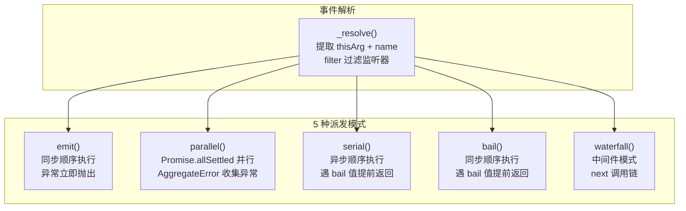
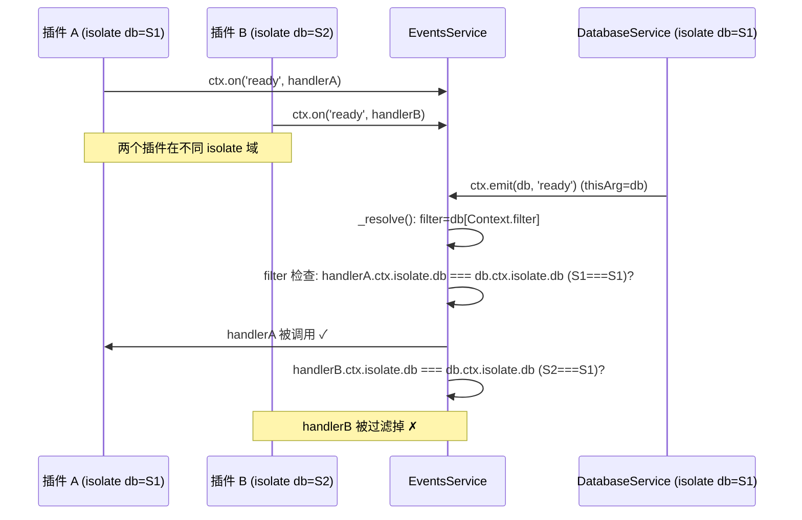

# 事件系统

EventsService 是 Cordis 的事件总线，提供了远超传统 EventEmitter 的事件派发能力。它支持 **5 种派发模式**——从简单的同步通知到异步并行、带返回值的顺序 bail、以及类 Koa 的中间件 waterfall 模式，同时内置了基于 isolate 域的事件过滤、thisArg 冒泡机制和可拦截的监听器注册流程。

## 设计原理

传统 EventEmitter 只有一种 `emit` 模式（同步顺序执行，返回值被忽略），无法满足插件框架的多样需求。Cordis 的事件系统在设计上考虑了以下场景：

1. **通知类事件**（如 `internal/status`）：同步顺序执行，异常立即抛出 → `emit`
2. **广播类事件**（如 `internal/service`）：并行执行，收集所有异常 → `parallel`
3. **责任链模式**（如权限检查）：同步顺序，遇到有效返回值即停止 → `bail`
4. **异步责任链**（如异步初始化）：异步顺序，遇到有效返回值即停止 → `serial`
5. **中间件模式**（如配置更新）：类 Koa onion 模型，支持 next 调用链 → `waterfall`

## 五种 Dispatch 模式

[events.ts:L89-L126](file:///d:/spaces/SpecWeave/external/libs/models/ai/cordis/packages/core/src/events.ts#L89-L126)



### emit — 同步通知

```typescript
emit(...args: any[]) {
  const [thisArg, callbacks] = this._resolve('emit', args)
  for (const callback of callbacks) Reflect.apply(callback, thisArg, args)
}
```

**特点**：
- 同步顺序执行所有监听器
- 任何监听器抛出异常立即中断（不捕获）
- 无返回值
- 最基础的事件模式，适用于状态变更通知

**使用场景**：`internal/status`（状态变更）、`internal/plugin`（fiber 创建/销毁）、`internal/service`（服务上线/下线）

### parallel — 并行广播

```typescript
async parallel(...args: any[]) {
  const [thisArg, callbacks] = this._resolve('emit', args)
  const results = await Promise.allSettled(callbacks.map(async callback => Reflect.apply(callback, thisArg, args)))
  const errors = results.filter((result): result is PromiseRejectedResult => result.status === 'rejected')
  if (errors.length) throw new AggregateError(errors.map(error => error.reason))
}
```

**特点**：
- 使用 `Promise.allSettled` 并行执行所有监听器
- 等待所有监听器完成（包括 rejected 的）
- 如果有 rejection，收集为 `AggregateError` 抛出
- 所有异常都会被收集，不会因一个失败而丢失其他异常

**使用场景**：多插件需要并行响应的广播事件

### bail — 同步责任链

```typescript
bail(...args: any[]) {
  const [thisArg, callbacks] = this._resolve('bail', args)
  for (const callback of callbacks) {
    const result = Reflect.apply(callback, thisArg, args)
    if (isBailed(result)) return result
  }
}
```

**特点**：
- 同步顺序执行
- 遇到 bail 值（非 null/false/undefined）立即返回该值
- 后续监听器不再执行
- 类似于 SyncBailHook（tapable）

### isBailed 判定

[events.ts:L6-L8](file:///d:/spaces/SpecWeave/external/libs/models/ai/cordis/packages/core/src/events.ts#L6-L8)

```typescript
export function isBailed(value: any) {
  return value !== null && value !== false && value !== undefined
}
```

bail 值是**除了 null、false、undefined 之外的所有值**，包括：
- `0`、`''`（空字符串）、`NaN` → 这些也算 bail（注意！）
- `{}`、`[]`、`true`、任意对象 → 都是 bail
- `null`、`false`、`undefined` → 不是 bail，继续执行

### serial — 异步责任链

```typescript
async serial(...args: any[]) {
  const [thisArg, callbacks] = this._resolve('serial', args)
  for (const callback of callbacks) {
    const result = await Reflect.apply(callback, thisArg, args)
    if (isBailed(result)) return result
  }
}
```

**特点**：
- 异步顺序执行（await 每个监听器）
- 遇到 bail 值立即返回
- 支持异步监听器
- 类似于 AsyncSeriesBailHook（tapable）

### waterfall — 中间件模式

```typescript
waterfall(...args: any[]) {
  const [thisArg, callbacks] = this._resolve('waterfall', args)
  const inner = args.pop()
  const next = () => {
    const callback = callbacks.shift()
    return callback ? Reflect.apply(callback, thisArg, args) : inner(...args)
  }
  args.push(next)
  return next()
}
```

**特点**：
- 类 Koa/Express 的中间件模式
- 最后一个参数是 `next` 函数，调用它继续执行下一个监听器
- 不调用 `next()` 则中断链条
- 支持洋葱模型（先执行前置逻辑 → await next() → 执行后置逻辑）
- 当所有监听器都完成后，调用 `inner`（原始的最后一个回调）

**使用场景**：
- `internal/update`（配置更新中间件链）
- `internal/get`（属性获取拦截）
- `internal/set`（属性设置拦截）
- 插件实现 AOP 拦截

## 事件解析与过滤

### _resolve() — 事件上下文解析

[events.ts:L72-L81](file:///d:/spaces/SpecWeave/external/libs/models/ai/cordis/packages/core/src/events.ts#L72-L81)

```typescript
private _resolve(type: string, args: any[]) {
  // 1. 提取 thisArg：第一个参数如果是 object/function 则作为 thisArg
  const thisArg = typeof args[0] === 'object' || typeof args[0] === 'function' ? args.shift() : null
  // 2. 提取事件名
  const name: string = args.shift()
  // 3. 非内部事件触发 internal/dispatch 通知
  if (!name.startsWith('internal/') && this._hooks['internal/dispatch']?.length) {
    this.emit('internal/dispatch', type, name, args, thisArg)
  }
  // 4. 应用 filter 过滤
  const filter = thisArg?.[Context.filter]
  return [thisArg, (this._hooks[name] || [])
    .filter(hook => hook.global || !filter || filter.call(thisArg, hook.ctx))
    .map(hook => hook.callback)] as const
}
```

_resolve 实现了几个关键机制：

**thisArg 提取**：派发事件时，第一个参数如果是对象或函数，则作为回调的 this 上下文。这允许以服务实例为 thisArg 派发事件：

```typescript
// 以 database 服务实例为 thisArg 派发事件
ctx.emit(database, 'ready')
// 监听器中 this 指向 database 实例
ctx.on('ready', function() {
  console.log(this.name) // 'database'
})
```

**filter 过滤**：如果 thisArg 有 `[Context.filter]` 方法，则只调用 `filter.call(thisArg, hook.ctx)` 返回 true 的监听器，或标记为 `global: true` 的监听器。Service 的默认 filter 实现了 isolate 域过滤：

```typescript
// service.ts:L37-L39
protected [symbols.filter](ctx: Context) {
  return ctx[symbols.isolate][this.name] === this.ctx[symbols.isolate][this.name]
}
```

这意味着以服务实例为 thisArg 派发的事件，只有同一 isolate 域内的监听器才能收到。

### Hook 结构

```typescript
export interface Hook extends EventOptions {
  ctx: Context           // 注册时的 Context
  callback: Function     // 回调函数
}

export interface EventOptions {
  prepend?: boolean      // 插入钩子列表头部
  global?: boolean       // 全局事件（不受 filter 过滤）
}
```

## 监听器注册

[events.ts:L128-L166](file:///d:/spaces/SpecWeave/external/libs/models/ai/cordis/packages/core/src/events.ts#L128-L166)

### on() — 注册监听器

```typescript
on(name: string | symbol, listener: Function, options?: boolean | EventOptions) {
  if (typeof options !== 'object') {
    options = { prepend: options }
  }

  this.ctx.fiber.assertActive()
  // 1. bind traceable：将回调包装为 traceable proxy
  listener = this.ctx.reflect.bind(listener)
  // 2. bail 触发 internal/listener 事件，允许拦截
  const result = this.bail(this.ctx, 'internal/listener', name, listener, options)
  if (result) return result

  // 3. 正常注册
  const hooks = this._hooks[name] ||= []
  const label = `ctx.on(${typeof name === 'string' ? JSON.stringify(name) : name.toString()})`
  return this.register(label, hooks, listener, options)
}
```

注册流程：
1. **断言活跃**：当前 fiber 必须是活跃状态
2. **bind traceable**：通过 `reflect.bind()` 将 listener 包装为 Proxy，apply/construct 时自动 trace thisArg 和参数
3. **触发 internal/listener**：使用 bail 模式，如果有监听器返回非空值（通常是 dispose 函数），则使用该返回值作为结果，不再注册到普通钩子列表
4. **注册到 effect**：通过 `register()` 在 fiber 的 effect 中注册，fiber dispose 时自动取消监听

### register() — 效果注册

```typescript
register(label: string, hooks: Hook[], callback: any, options: EventOptions): () => void {
  const method = options.prepend ? 'unshift' : 'push'
  return this.ctx.fiber.effect(() => {
    hooks[method]({ ctx: this.ctx, callback, ...options })
    return () => this.unregister(hooks, callback)
  }, label)
}
```

监听器的注册和注销都是通过 `ctx.effect()` 管理的，确保 fiber 销毁时自动取消所有监听。

### once() — 一次性监听

```typescript
once(name: string, listener: Function, options?: boolean | EventOptions) {
  const dispose = this.on(name, function (...args: any[]) {
    dispose()
    return listener.apply(this, args)
  }, options)
  return dispose
}
```

在回调首次执行时自动 dispose。

### unregister() — 取消注册

```typescript
unregister(hooks: Hook[], callback: any) {
  const index = hooks.findIndex(hook => hook.callback === callback)
  if (index >= 0) {
    hooks.splice(index, 1)
    return true
  }
}
```

### internal/listener 特殊处理

EventsService 构造函数中对 `internal/listener` 和 `internal/update` 事件做了特殊处理：

[events.ts:L54-L69](file:///d:/spaces/SpecWeave/external/libs/models/ai/cordis/packages/core/src/events.ts#L54-L69)

```typescript
constructor(private ctx: Context) {
  // ... tracker 设置

  // internal/listener：对 internal/update 事件做特殊处理
  this.on('internal/listener', function (this: Context, name, listener, options: EventOptions) {
    if (name === 'internal/update' && !options.global) {
      // 非 global 的 internal/update 监听器注册到 fiber 级别的 _hooks
      const hooks = this.fiber._hooks['internal/update'] ??= new DisposableList()
      const method = options.prepend ? 'unshift' : 'push'
      return hooks[method](listener)
    }
  })

  // internal/update：global prepend 监听器串接 fiber 级钩子为 next 链
  this.on('internal/update', function (config, noSave, next) {
    const cbs = [...this._hooks['internal/update'] || []]
    const _next = () => {
      const cb = cbs.shift() ?? next
      return cb.call(this, config, noSave, _next)
    }
    return _next()
  }, { global: true, prepend: true })
}
```

这实现了 fiber 级别的配置更新中间件链：每个 fiber 注册的 `internal/update` 监听器形成独立的链，global 的 prepend 监听器将这些链串接起来。

## 内置内部事件

Cordis 核心定义了 8 个内部事件，框架自身的很多机制（服务发现、状态通知、属性拦截）都通过这些事件实现：

[events.ts:L169-L178](file:///d:/spaces/SpecWeave/external/libs/models/ai/cordis/packages/core/src/events.ts#L169-L178)

```typescript
export interface Events {
  'internal/plugin'(fiber: Fiber): void
  'internal/status'(fiber: Fiber, oldValue: FiberState): void
  'internal/service'(this: Context, name: string, value: any): void
  'internal/update'(this: Fiber, config: any, noSave: boolean, next: () => void): void
  'internal/get'(ctx: Context, name: string, error: Error, next: () => any): any
  'internal/set'(ctx: Context, name: string, value: any, error: Error, next: () => boolean): boolean
  'internal/listener'(this: Context, name: string, listener: any, prepend: boolean): void
  'internal/dispatch'(mode: DispatchMode, name: string, args: any[], thisArg: any): void
}
```

| 事件名 | thisArg | 说明 | 模式 |
|--------|---------|------|------|
| `internal/plugin` | — | Fiber 创建/销毁时触发 | emit |
| `internal/status` | — | Fiber 状态变更时触发 | emit |
| `internal/service` | filter Context | 服务注册/注销时触发 | emit |
| `internal/update` | Fiber | 配置更新中间件链 | waterfall |
| `internal/get` | — | 属性获取拦截（Proxy get） | waterfall |
| `internal/set` | — | 属性设置拦截（Proxy set） | waterfall |
| `internal/listener` | Context | 监听器注册时 bail 拦截 | bail |
| `internal/dispatch` | — | 事件派发通知（非内部事件） | emit |

### internal/get — 属性获取拦截

在 `ReflectService.handler.get` 中，当访问未定义的属性时，通过 waterfall 模式的 `internal/get` 事件允许插件拦截属性访问：

[reflect.ts:L80-L94](file:///d:/spaces/SpecWeave/external/libs/models/ai/cordis/packages/core/src/reflect.ts#L80-L94)

```typescript
return ctx.events.waterfall('internal/get', ctx, prop, error, () => {
  const key = target[symbols.isolate][prop]
  let fiber = (ctx[symbols.shadow] as Context ?? ctx).fiber
  while (true) {
    const impl = fiber.store?.[prop]
    if (impl) return getTraceable(ctx, impl.value)
    if (prop in fiber.inject) {
      error.message = `cannot get required service "${prop}" in inactive context`
      throw error
    }
    if (!fiber.runtime) throw error
    if (fiber.parent[symbols.isolate][prop] !== key) throw error
    fiber = fiber.parent.fiber
  }
})
```

默认行为是沿 fiber 链向上查找服务实现，但插件可以通过 `internal/get` 拦截返回自定义值。

### internal/set — 属性设置拦截

类似地，属性设置也通过 waterfall 模式可被拦截：

[reflect.ts:L118-L120](file:///d:/spaces/SpecWeave/external/libs/models/ai/cordis/packages/core/src/reflect.ts#L118-L120)

```typescript
return ctx.events.waterfall('internal/set', ctx, prop, value, error, () => {
  return ctx.reflect.set(prop, value, error)
})
```

## 事件冒泡与 thisArg 机制

Cordis 事件系统的一个精妙设计是 **thisArg 冒泡**：以服务实例为 thisArg 派发事件时，Service 自带的 `[symbols.filter]` 确保事件只在同一 isolate 域内传播。



## Dispatcher 类型声明

通过 module augmentation，事件名和回调签名是类型安全的：

```typescript
// 自定义事件扩展
declare module 'cordis' {
  interface Events {
    'database/ready'(this: DatabaseService): void
    'message/send'(this: Session, content: string): boolean | void
  }
}

// 类型安全的事件派发
ctx.emit(session, 'message/send', 'hello')  // thisArg=session, 参数类型检查
ctx.on('message/send', function(content) {  // this 自动推导为 Session
  console.log(this.userId, content)
})
```

## 类型签名汇总

```typescript
// 派发模式
type DispatchMode = 'emit' | 'parallel' | 'serial' | 'bail' | 'waterfall'

// 选项
interface EventOptions {
  prepend?: boolean   // 插入队首
  global?: boolean    // 全局（不受 filter 过滤）
}

// Hook 结构
interface Hook extends EventOptions {
  ctx: Context
  callback: (...args: any[]) => any
}

// EventsService
class EventsService {
  _hooks: Record<keyof any, Hook[]>

  // 派发方法
  emit(name: string | symbol, ...args: any[]): void
  emit(thisArg: object, name: string | symbol, ...args: any[]): void
  parallel(name: string | symbol, ...args: any[]): Promise<void>
  parallel(thisArg: object, name: string | symbol, ...args: any[]): Promise<void>
  serial(name: string | symbol, ...args: any[]): Promise<any>
  serial(thisArg: object, name: string | symbol, ...args: any[]): Promise<any>
  bail(name: string | symbol, ...args: any[]): any
  bail(thisArg: object, name: string | symbol, ...args: any[]): any
  waterfall(name: string | symbol, ...args: any[]): any
  waterfall(thisArg: object, name: string | symbol, ...args: any[]): any

  // 注册方法
  on(name: string | symbol, listener: Function, options?: boolean | EventOptions): () => boolean
  once(name: string | symbol, listener: Function, options?: boolean | EventOptions): () => boolean
}

// 工具函数
function isBailed(value: any): boolean
```

## 各模式对比

| 模式 | 执行方式 | 返回值 | 异常处理 | bail 提前返回 | next 链 |
|------|---------|--------|---------|-------------|---------|
| `emit` | 同步顺序 | 无 | 立即抛出 | ✗ | ✗ |
| `parallel` | 异步并行 (`allSettled`) | `Promise<void>` | AggregateError | ✗ | ✗ |
| `bail` | 同步顺序 | 第一个 bail 值 | 立即抛出 | ✓ | ✗ |
| `serial` | 异步顺序 (`await`) | 第一个 bail 值 | 立即抛出 | ✓ | ✗ |
| `waterfall` | 手动 next() | inner 返回值 | 立即抛出 | ✗（不调 next 即中断） | ✓ |

## 源码引用

| 文件 | 内容 |
|------|------|
| [events.ts](file:///d:/spaces/SpecWeave/external/libs/models/ai/cordis/packages/core/src/events.ts) | EventsService 完整实现、5 种 dispatch 模式、8 个内部事件、Hook/EventOptions 定义 |
| [reflect.ts](file:///d:/spaces/SpecWeave/external/libs/models/ai/cordis/packages/core/src/reflect.ts#L62-L133) | Proxy handler 中通过 waterfall 派发 internal/get 和 internal/set |
| [fiber.ts](file:///d:/spaces/SpecWeave/external/libs/models/ai/cordis/packages/core/src/fiber.ts#L355-L369) | Fiber 状态变更时 emit internal/status |
| [service.ts](file:///d:/spaces/SpecWeave/external/libs/models/ai/cordis/packages/core/src/service.ts#L37-L39) | Service 默认的 [symbols.filter] 实现 |
| [context.ts](file:///d:/spaces/SpecWeave/external/libs/models/ai/cordis/packages/core/src/context.ts#L23-L24) | Context.filter/effect 静态 symbol |
