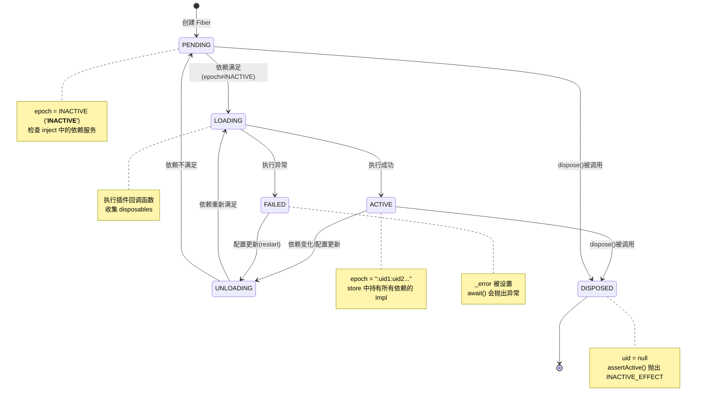

# Fiber 生命周期

Fiber 是 Cordis 中**插件实例的运行时抽象**。每个插件的每次激活都对应一个 Fiber 实例，它管理着插件的完整生命周期：依赖解析 → 配置验证 → 执行入口 → 效果收集 → 清理释放。Fiber 通过 **epoch 机制** 实现响应式的依赖驱动状态机——当依赖服务上线/下线时，Fiber 自动重载或进入等待状态。

Fiber 的概念类比于操作系统的纤程（轻量级线程），但它不涉及 CPU 调度，而是专注于**插件的时空生命周期管理**。

## 设计原理

传统插件框架的生命周期管理通常采用简单的"安装/启动/停止"线性模型。Cordis 的 Fiber 引入了两个关键创新：

1. **epoch 依赖驱动**：Fiber 的激活状态不是手动控制的，而是由其注入的依赖集合的状态自动计算。epoch 是一个字符串，由所有依赖服务所在 fiber 的 uid 拼接而成（如 `:1:3:5`），当任何依赖变化时 epoch 变化，触发自动重载。
2. **声明式效果管理**：插件代码通过 `ctx.effect()` 声明副作用（定时器、事件监听、资源分配），Fiber 销毁时自动逆序清理，无需手动管理。

## FiberState 六状态机

[fiber.ts:L78-L85](file:///d:/spaces/SpecWeave/external/libs/models/ai/cordis/packages/core/src/fiber.ts#L78-L85)

```typescript
export const enum FiberState {
  PENDING,    // 0 - 等待中（依赖未满足）
  LOADING,    // 1 - 加载中（执行插件回调）
  ACTIVE,     // 2 - 已激活（正常运行）
  FAILED,     // 3 - 失败（执行出错）
  DISPOSED,   // 4 - 已销毁（uid=null）
  UNLOADING,  // 5 - 卸载中（清理 disposables）
}
```



### 状态判定逻辑

[fiber.ts:L348-L353](file:///d:/spaces/SpecWeave/external/libs/models/ai/cordis/packages/core/src/fiber.ts#L348-L353)

```typescript
private _getState() {
  if (this.uid === null) return FiberState.DISPOSED
  if (this._error) return FiberState.FAILED
  if (this._runner.epoch !== INACTIVE) return FiberState.ACTIVE
  return FiberState.PENDING
}
```

状态判定优先级：DISPOSED → FAILED → ACTIVE → PENDING。LOADING 和 UNLOADING 是过渡状态，由 `_setEpoch` 显式设置。

## Fiber 类结构

[fiber.ts:L103-L213](file:///d:/spaces/SpecWeave/external/libs/models/ai/cordis/packages/core/src/fiber.ts#L103-L213)

```typescript
export class Fiber {
  // 公开属性
  public uid: number | null           // 唯一 ID，root=0，dispose 后=null
  public readonly ctx: Context        // Fiber 专属 Context（extend 自 parent，带 fiber: this）
  public config: any                  // 插件配置（已验证）
  public state = FiberState.PENDING   // 当前状态
  public readonly dispose: () => Promise<void>  // 异步销毁函数
  public store: Dict<Impl> | undefined          // 激活时的服务实现快照
  public inertia: Promise<void> | undefined     // 加载/卸载惯性操作 Promise

  // 内部属性
  public readonly _hooks: Dict<DisposableList<Function>> = Object.create(null)
  public readonly _disposables = new DisposableList<Disposable>()
  protected context: Context          // 同 this.ctx，更具体的类型
  private _error: any                 // 加载失败时的错误
  private _runner: EffectRunner<string>  // 执行器（含 epoch 和 execute 函数）
  private _store: Dict<Impl> = Object.create(null)  // 内部服务实现存储

  // 构造参数
  constructor(
    public parent: Context,           // 父 Context
    config: any,                      // 原始配置
    public inject: Dict<any>,         // 规范化后的依赖注入映射
    public runtime: Plugin.Runtime | null,  // 插件运行时信息（root fiber 为 null）
    getOuterStack: () => string[],    // 外部栈追踪函数
  ) { ... }
}
```

### EffectRunner 接口

```typescript
interface EffectRunner<T> {
  epoch: T                           // 当前 epoch 值（INACTIVE 或 ":uid1:uid2..."）
  execute: () => any                 // 执行插件回调的函数
  collect: (dispose: Disposable) => void  // 收集清理函数
  getOuterStack: () => string[]      // 获取外部调用栈（用于长栈追踪）
}
```

## 构造函数：两种模式

Fiber 构造函数区分 **root fiber** 和 **plugin fiber** 两种模式：

### Root Fiber（runtime = null）

[fiber.ts:L200-L212](file:///d:/spaces/SpecWeave/external/libs/models/ai/cordis/packages/core/src/fiber.ts#L200-L212)

```typescript
// root fiber 初始化
this.uid = 0
this.ctx = this.context = parent
this.state = FiberState.ACTIVE
this.store = Object.create(null)
this._runner = {
  epoch: '',           // root fiber 始终激活，epoch 为空字符串
  getOuterStack,
  execute: () => {},   // root fiber 无执行逻辑
  collect,
}
this.dispose = () => this.restart()  // root fiber 的 dispose 是 restart
```

Root fiber 是 Context 创建时自动创建的根纤程，uid=0，状态始终为 ACTIVE。它的 dispose 不是销毁而是重启（用于 HMR 等场景）。

### Plugin Fiber（runtime 存在）

[fiber.ts:L133-L199](file:///d:/spaces/SpecWeave/external/libs/models/ai/cordis/packages/core/src/fiber.ts#L133-L199)

```typescript
if (runtime) {
  this.uid = parent.registry.counter
  this.ctx = this.context = parent.extend({ fiber: this })

  // 设置 inject 配置拦截
  const injectEntries = Object.entries(this.inject)
  if (injectEntries.length) {
    this.ctx[Context.intercept] = Object.create(parent[Context.intercept])
    for (const [name, config] of injectEntries) {
      if (isNullable(config)) continue
      this.ctx[Context.intercept][name] = config
    }
  }

  this._runner = {
    epoch: INACTIVE,    // 初始为未激活
    getOuterStack,
    execute: function () {
      if (isConstructor(runtime.callback)) {
        // 类式插件：new 实例 → 执行 initHooks → 调用 [symbols.init]()
        const instance = new runtime.callback(this.ctx, this.config)
        for (const hook of instance?.[symbols.initHooks] ?? []) {
          hook()
        }
        return instance?.[symbols.init]?.()
      } else {
        // 函数式/对象式插件：直接调用
        return runtime.callback(this.ctx, this.config)
      }
    },
    collect,
  }

  // 触发 internal/plugin 事件（fiber 创建）
  this.context.emit('internal/plugin', this)

  // 检查所有注入的依赖
  for (const name of Object.keys(this.inject)) {
    this._checkImpl(name)
  }

  // 注册到父 fiber 的 effect 中
  this.dispose = parent.fiber.effect(() => {
    const remove = runtime.fibers.push(this)
    try {
      this.config = resolveConfig(runtime, config)
      this._refresh()
    } catch (error) {
      this.ctx.logger.error(error)
      this._error = error
    }
    // 返回异步清理函数
    return async () => {
      this.uid = null
      this.context.emit('internal/plugin', this)  // fiber 销毁事件
      if (this.ctx.registry.has(runtime.callback)) {
        remove()
        if (!runtime.fibers.length) {
          this.ctx.registry.delete(runtime.callback)
        }
      }
      this._setEpoch(INACTIVE)
      while (this.inertia) {
        await this.inertia
      }
    }
  }, 'ctx.plugin()')
}
```

插件 fiber 的关键步骤：
1. 分配 uid（从 registry.counter 自增）
2. 创建专属 Context（通过 `parent.extend({ fiber: this })`）
3. 设置 inject 的 intercept 配置
4. 配置 runner（区分类式/函数式插件的执行逻辑）
5. 发出 `internal/plugin` 事件
6. 检查注入依赖是否已满足
7. 注册到父 fiber 的 effect 中（确保父销毁时子也销毁）
8. 调用 `_refresh()` 尝试激活

## Epoch 状态机

Epoch 机制是 Fiber 自动生命周期管理的核心：

```mermaid
graph TD
    A["epoch = INACTIVE<br/>(__INACTIVE__)"] -->|所有依赖满足| B["epoch = ':1:3'<br/>(依赖 fiber uid 拼接)"]
    B -->|依赖1下线| A
    B -->|依赖3 uid 变化| C["epoch = ':1:5'<br/>(依赖变化)"]
    C -->|重载| B
    B -->|dispose()| D["uid = null<br/>(DISPOSED)"]
```

### _refresh() — 计算 epoch

[fiber.ts:L385-L397](file:///d:/spaces/SpecWeave/external/libs/models/ai/cordis/packages/core/src/fiber.ts#L385-L397)

```typescript
_refresh() {
  let epoch: string | boolean = false
  epoch = ''
  for (const name of Object.keys(this.inject)) {
    const impl = this._store[name]
    if (!impl) {
      epoch = INACTIVE     // 有一个依赖不满足 → INACTIVE
      break
    }
    epoch += ':' + impl.fiber.uid  // 拼接依赖 fiber 的 uid
  }
  this._setEpoch(epoch)
}
```

epoch 的构成：
- `INACTIVE`（`'__INACTIVE__'`）：至少一个依赖未满足，fiber 不可激活
- `''`（空字符串）：root fiber 的 epoch，始终激活
- `':1:3:5'`：所有依赖满足，数字是各依赖服务所在 fiber 的 uid

### _setEpoch() — 状态转换

[fiber.ts:L399-L413](file:///d:/spaces/SpecWeave/external/libs/models/ai/cordis/packages/core/src/fiber.ts#L399-L413)

```typescript
private _setEpoch(epoch: string) {
  const oldEpoch = this._runner.epoch
  if (epoch === oldEpoch) return       // epoch 未变，无操作
  this._runner.epoch = epoch
  if (this.inertia) return             // 正在加载/卸载中，等惯性完成
  this._updateState(() => {
    if (epoch !== INACTIVE && oldEpoch === INACTIVE) {
      this.inertia = this._reload()    // 从 INACTIVE → ACTIVE：加载
      return FiberState.LOADING
    } else {
      this.inertia = this._unload()    // 其他变化：先卸载
      return FiberState.UNLOADING
    }
  })
}
```

转换规则：
- INACTIVE → 有效 epoch：触发 `_reload()`（进入 LOADING）
- 有效 epoch → INACTIVE：触发 `_unload()`（进入 UNLOADING）
- 有效 epoch → 不同有效 epoch（依赖变化）：触发 `_unload()` 后再 `_reload()`
- 有 inertia 时不重复触发，惯性完成后自动检查

### _reload() — 加载流程

[fiber.ts:L415-L435](file:///d:/spaces/SpecWeave/external/libs/models/ai/cordis/packages/core/src/fiber.ts#L415-L435)

```typescript
private async _reload() {
  this.store = { ...this._store }     // 快照当前依赖实现
  const oldEpoch = this._runner.epoch
  try {
    await Promise.resolve()            // 强制异步，确保同步错误也被捕获
    await this._execute(this._runner) // 执行插件回调，收集 disposables
  } catch (reason) {
    this.ctx.logger.error(reason)
    this._error = reason
    this._runner.epoch = INACTIVE     // 执行失败 → 回到 INACTIVE
  }
  this._updateState(() => {
    if (this._runner.epoch === oldEpoch) {
      this.inertia = undefined        // epoch 未变 → 加载完成
    } else {
      this.inertia = this._unload()   // epoch 已变 → 需要卸载
      return FiberState.UNLOADING
    }
  })
}
```

### _unload() — 卸载流程

[fiber.ts:L437-L458](file:///d:/spaces/SpecWeave/external/libs/models/ai/cordis/packages/core/src/fiber.ts#L437-L458)

```typescript
private async _unload() {
  // clear() 返回逆序的值数组，按注册逆序串行清理
  await Promise.all(this._disposables.clear().map(async (dispose) => {
    try {
      await composeError(async (info) => {
        await Promise.resolve()
        info.error = new Error()
        await dispose()               // 执行每个清理函数
      }, this._runner.getOuterStack)
    } catch (reason) {
      this.ctx.logger.error(reason)   // 清理错误不阻断流程
    }
  }))
  this.store = undefined
  this._updateState(() => {
    if (this._runner.epoch === INACTIVE) {
      this.inertia = undefined        // 目标是 INACTIVE → 卸载完成
    } else {
      this.inertia = this._reload()   // 需要重新加载
      return FiberState.LOADING
    }
  })
}
```

卸载流程确保所有 disposables 被逆序执行，且单个清理函数的异常不会影响其他清理函数的执行。

## Effect 执行模型

[fiber.ts:L229-L273](file:///d:/spaces/SpecWeave/external/libs/models/ai/cordis/packages/core/src/fiber.ts#L229-L273)

`_execute()` 方法处理插件回调的返回值，支持 4 种 Effect 形式：

```typescript
private _execute<T>(runner: EffectRunner<T>) {
  const oldEpoch = runner.epoch
  return composeError((info) => {
    const safeCollect = (dispose: void | Disposable) => {
      if (typeof dispose === 'function') {
        runner.collect(dispose)
      } else if (!isNullable(dispose)) {
        throw new TypeError('Invalid effect')
      }
    }
    const effect: Effect = runner.execute.call(this)
    if (typeof effect === 'function') {
      // 1. 同步/异步 dispose 函数
      return runner.collect(effect)
    } else if (isNullable(effect)) {
      // 2. 无返回值（无清理）
    } else if (!isObject(effect)) {
      throw new TypeError('Invalid effect')
    } else if ('then' in effect) {
      // 3. Promise<Disposable>
      return effect.then(safeCollect)
    } else if (Symbol.iterator in effect) {
      // 4. Iterable<Disposable>（Generator）
      info.error = new Error()
      const iter = effect[Symbol.iterator]()
      while (true) {
        const result = iter.next()
        safeCollect(result.value)
        if (result.done) return
      }
    } else if (Symbol.asyncIterator in effect) {
      // 5. AsyncIterable<Disposable>（AsyncGenerator）
      const iter = effect[Symbol.asyncIterator]()
      return (async () => {
        await Promise.resolve()
        info.error = new Error()
        while (true) {
          if (runner.epoch !== oldEpoch) return  // epoch 变化则中止
          const result = await iter.next()
          safeCollect(result.value)
          if (result.done) return
        }
      })()
    } else {
      throw new TypeError('Invalid effect')
    }
  }, runner.getOuterStack)
}
```

Effect 返回值处理：

| 返回类型 | 处理方式 |
|---------|---------|
| `function` | 直接作为 dispose 函数收集 |
| `null/undefined` | 无清理操作 |
| `Promise` | await 后收集 resolve 值（应为 function） |
| `Iterable` | 迭代产出多个 dispose 函数 |
| `AsyncIterable` | 异步迭代产出多个 dispose 函数，epoch 变化时中止 |

### effect() 公共 API

[fiber.ts:L275-L340](file:///d:/spaces/SpecWeave/external/libs/models/ai/cordis/packages/core/src/fiber.ts#L275-L340)

`ctx.effect()` 是用户和插件代码中最常用的 API，返回一个同时是函数和 PromiseLike 的 **AsyncDisposable**：

```typescript
effect(execute: () => Effect, label = 'anonymous'): AsyncDisposable {
  this.assertActive()

  const disposables: Disposable[] = []
  const dispose = () => {
    let task: void | Promise<void>
    // 逆序串行执行清理
    for (const dispose of disposables.splice(0).reverse()) {
      if (task) {
        task = task.then(dispose)
      } else {
        const result = dispose()
        if (isObject(result) && 'then' in result) {
          task = result as any
        }
      }
    }
    return task
  }

  const meta: EffectMeta = { label, children: [] }
  const runner = { execute, epoch: true, collect: ..., getOuterStack: ... }

  let task: void | Promise<void>
  try {
    task = this._execute(runner)
  } catch (reason) {
    dispose()
    throw reason
  }

  task?.catch(dispose).catch((error) => this.ctx.logger.error(error))

  // wrapper 既是函数（调用即 dispose）又是 PromiseLike
  const wrapper = defineProperty(() => {
    if (!runner.epoch) return
    runner.epoch = false
    return task ? task.then(dispose) : dispose()
  }, symbols.effect, meta) as AsyncDisposable

  wrapper.then = async (onFulfilled, onRejected) => {
    return Promise.resolve(task).then(() => disposeAsync).then(onFulfilled, onRejected)
  }
  disposables.push(this._disposables.push(wrapper))
  return wrapper
}
```

使用示例：

```typescript
// 注册事件监听，fiber 销毁时自动取消
ctx.on('message', callback)

// 定时器，fiber 销毁时自动清理
ctx.setInterval(() => {
  console.log('tick')
}, 1000)

// 手动 effect 管理
const dispose = ctx.effect(() => {
  const resource = acquireResource()
  return () => resource.release()  // 返回清理函数
})
// 手动清理
dispose()
```

## 依赖检查与服务实现

### _checkImpl() — 检查服务可用性

[fiber.ts:L371-L383](file:///d:/spaces/SpecWeave/external/libs/models/ai/cordis/packages/core/src/fiber.ts#L371-L383)

```typescript
_checkImpl(name: string) {
  const impl = this.ctx.reflect._getImpl(name, true)
  if (!impl) return delete this._store[name]
  try {
    // check 函数返回 false 或抛错 → 服务不可用
    if (impl.check && !impl.check.call(getTraceable(this.ctx, impl.value))) {
      return delete this._store[name]
    }
  } catch (error) {
    impl.fiber.ctx.logger.error(error)
    return delete this._store[name]
  }
  this._store[name] = impl
}
```

服务的 `check` 函数由 Service 构造时传入（`ctx.reflect.provide(name, self, this[symbols.check])`），默认为 Service 子类上的 `[symbols.check]` 方法。

## 公开操作方法

### restart() — 重启

[fiber.ts:L468-L474](file:///d:/spaces/SpecWeave/external/libs/models/ai/cordis/packages/core/src/fiber.ts#L468-L474)

```typescript
async restart() {
  const fiber = this.ctx.fiber
  fiber.assertActive()
  fiber._setEpoch(INACTIVE)  // 强制设为 INACTIVE → 触发 unload
  fiber._refresh()           // 重新检查依赖 → 触发 reload
  await fiber.await()
}
```

### update() — 配置更新

[fiber.ts:L476-L485](file:///d:/spaces/SpecWeave/external/libs/models/ai/cordis/packages/core/src/fiber.ts#L476-L485)

```typescript
update(config: any, noSave = false) {
  const fiber = this.ctx.fiber
  fiber.assertActive()
  config = resolveConfig(fiber.runtime!, config)  // 验证配置
  fiber.context.waterfall(fiber, 'internal/update', config, noSave, () => {
    fiber.config = config
    fiber._error = undefined
    return fiber.restart()
  })
}
```

配置更新通过 `waterfall` 模式的 `internal/update` 事件形成中间件链，允许其他插件拦截配置更新。

### await() — 等待稳定

[fiber.ts:L460-L466](file:///d:/spaces/SpecWeave/external/libs/models/ai/cordis/packages/core/src/fiber.ts#L460-L466)

```typescript
async await() {
  while (this.inertia) {
    await this.inertia        // 等待所有惯性操作完成
  }
  if (this._error) throw this._error  // 有错误则抛出
  return this
}
```

`ctx.plugin()` 返回的 Fiber & PromiseLike 对象的 `then` 方法就是 `fiber.await().then(...)`，因此可以 `await ctx.plugin(myPlugin)` 等待插件激活完成。

### assertActive() — 活跃性断言

[fiber.ts:L224-L227](file:///d:/spaces/SpecWeave/external/libs/models/ai/cordis/packages/core/src/fiber.ts#L224-L227)

```typescript
assertActive() {
  if (this.uid !== null) return
  throw new CordisError('INACTIVE_EFFECT')
}
```

在已销毁的 fiber 上调用 `effect()` 会抛出 `CordisError('INACTIVE_EFFECT')`，错误消息为 "cannot create effect on inactive context"。

## 状态变更通知

[fiber.ts:L355-L369](file:///d:/spaces/SpecWeave/external/libs/models/ai/cordis/packages/core/src/fiber.ts#L355-L369)

```typescript
private _updateState(callback: () => void | FiberState) {
  const oldState = this.state
  this.state = callback() ?? this._getState()
  if (oldState === this.state) return
  this.context.emit('internal/status', this, oldState)

  // 仅在 ACTIVE ↔ NON-ACTIVE 转换时通知服务变更
  if (oldState !== FiberState.ACTIVE && this.state !== FiberState.ACTIVE) return
  for (const key of Reflect.ownKeys(this.ctx.reflect.store)) {
    const impl = this.ctx.reflect.store[key as symbol]
    if (impl.fiber !== this) continue
    this.ctx.reflect.notify([impl.name])
  }
}
```

每次状态变更时：
1. 发出 `internal/status` 事件
2. 如果变更涉及 ACTIVE 状态的进出，通知所有依赖该 fiber 所提供服务的其他 fiber

## 错误处理

### CordisError

[fiber.ts:L87-L99](file:///d:/spaces/SpecWeave/external/libs/models/ai/cordis/packages/core/src/fiber.ts#L87-L99)

```typescript
export class CordisError extends Error {
  constructor(public code: CordisError.Code, message?: string) {
    super(message ?? CordisError.Code[code])
  }
}

export namespace CordisError {
  export type Code = keyof typeof Code
  export const Code = {
    INACTIVE_EFFECT: 'cannot create effect on inactive context',
  } as const
}
```

### ValidationError

[fiber.ts:L16-L32](file:///d:/spaces/SpecWeave/external/libs/models/ai/cordis/packages/core/src/fiber.ts#L16-L32)

```typescript
export class ValidationError extends TypeError {
  name = 'ValidationError'
  constructor(issues: readonly StandardSchemaV1.Issue[]) {
    super(`invalid config:\n` + issues.map(issue => {
      if (issue.path) {
        return `  - ${issue.message} (at ${issue.path.join('.')})`
      } else {
        return `  - ${issue.message}`
      }
    }).join('\n'))
  }
}
```

配置验证通过 `@standard-schema/spec` 进行，仅支持同步验证（异步验证会抛出 TypeError）。

### 长栈追踪

Cordis 通过 `composeError` 实现跨异步边界的长栈追踪，将内部错误栈与外部调用栈拼接：

[utils.ts:L233-L273](file:///d:/spaces/SpecWeave/external/libs/models/ai/cordis/packages/core/src/utils.ts#L233-L273)

```typescript
export function composeError<T>(callback: (info: StackInfo) => T, getOuterStack = buildOuterStack()): T {
  const info: StackInfo = { offset: 1, error: new Error() }
  try {
    const result: any = callback(info)
    if (isObject(result) && 'then' in result) {
      return result.then(undefined, (reason) => handleError(info, reason, getOuterStack)) as T
    }
    return result
  } catch (reason: any) {
    handleError(info, reason, getOuterStack)
  }
}
```

## 类型签名汇总

```typescript
const enum FiberState {
  PENDING = 0, LOADING = 1, ACTIVE = 2,
  FAILED = 3, DISPOSED = 4, UNLOADING = 5,
}

type Effect = SyncEffect | AsyncEffect
type SyncEffect = Disposable | Iterable<Disposable>
type AsyncEffect = Promise<Disposable> | AsyncIterable<Disposable>
type Disposable<T = any> = () => T

interface AsyncDisposable extends PromiseLike<() => Promise<void>> {
  (): Promise<void>
}

interface EffectMeta {
  label: string
  children: EffectMeta[]
}

class Fiber {
  readonly uid: number | null
  readonly ctx: Context
  config: any
  state: FiberState
  readonly dispose: () => Promise<void>
  store: Dict<Impl> | undefined
  inertia: Promise<void> | undefined
  readonly parent: Context
  readonly inject: Dict<any>
  readonly runtime: Plugin.Runtime | null
  readonly name: string

  effect(execute: () => Effect, label?: string): AsyncDisposable
  restart(): Promise<void>
  update(config: any, noSave?: boolean): void
  await(): Promise<this>
  assertActive(): void
  getEffects(): EffectMeta[]
}
```

## 源码引用

| 文件 | 内容 |
|------|------|
| [fiber.ts](file:///d:/spaces/SpecWeave/external/libs/models/ai/cordis/packages/core/src/fiber.ts) | Fiber 类完整实现、FiberState 枚举、effect 管理、epoch 状态机 |
| [context.ts](file:///d:/spaces/SpecWeave/external/libs/models/ai/cordis/packages/core/src/context.ts) | Context 构造函数中 root fiber 的创建 |
| [registry.ts](file:///d:/spaces/SpecWeave/external/libs/models/ai/cordis/packages/core/src/registry.ts) | RegistryService.plugin() 创建 Fiber 的入口 |
| [utils.ts](file:///d:/spaces/SpecWeave/external/libs/models/ai/cordis/packages/core/src/utils.ts) | DisposableList、composeError 长栈追踪、buildOuterStack |
