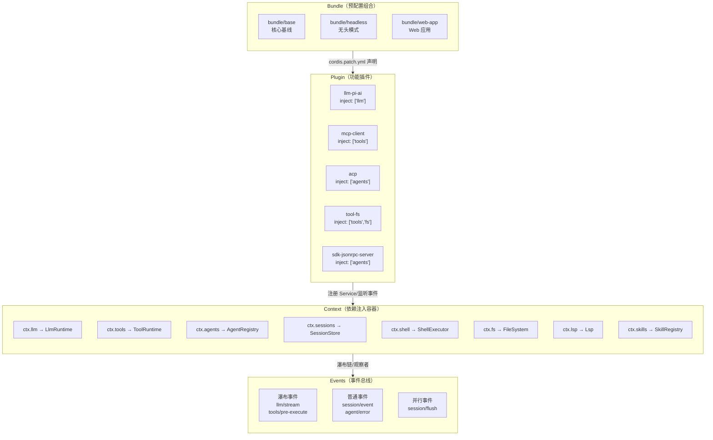
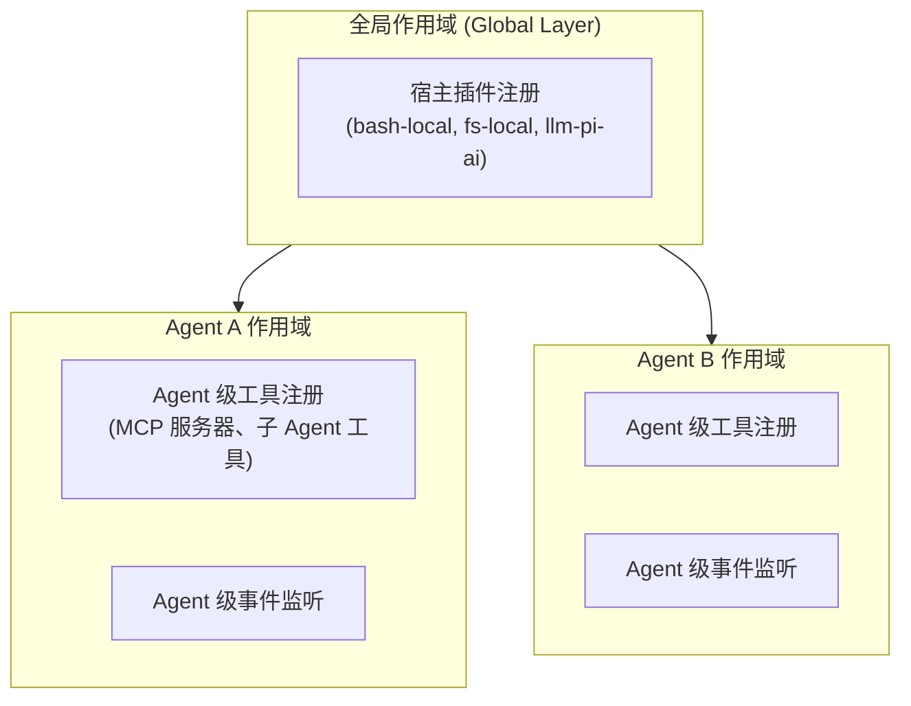
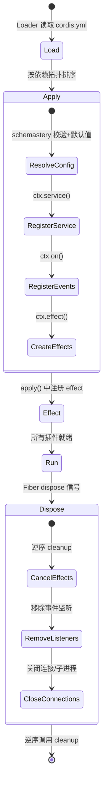

# Cordis 插件核心架构

deepseek-harness 是一个高度模块化的 TypeScript monorepo，其整个系统骨架建立在 **Cordis** 插件框架之上。Cordis 提供了 Context（依赖注入容器）、Service（挂载能力）、Plugin（功能模块）、Fiber（生命周期作用域）四大核心抽象，配合 TypeScript 的声明合并（declaration merging）实现了**编译期类型安全**与**运行期动态装配**的统一。理解 Cordis 架构是理解 deepseek-harness 一切能力的前提。

## 架构全景

Cordis 架构的核心思想是**能力缝（capability seam）**：每个功能包声明"我提供什么"和"我依赖什么"，容器负责按需装配。系统不做中心化编排，而是通过 Service 接口和事件总线让插件之间松耦合协作。



## 核心概念

### Context：依赖注入容器

`Context` 是 Cordis 的核心，它是一个持有 Service 注册表、事件总线和 Fiber 生命周期的容器。每个插件在 `apply(ctx, config)` 中接收一个 Context 实例，通过它访问已注册的 Service、注册新 Service、监听事件、创建子 Fiber。

deepseek-harness 中，所有核心能力都通过 Context 上的属性访问：

```typescript
// 声明合并：在 @deepseek-ai/cordis 模块上扩展 Context 类型
declare module '@deepseek-ai/cordis' {
  interface Context {
    llm: LlmRuntime       // LLM 运行时
    tools: ToolRuntime    // 工具运行时
    agents: AgentRegistry // Agent 注册中心
    sessions: SessionStore // 会话存储
    shell: ShellExecutor  // Shell 执行器
    fs: FileSystem        // 文件系统
    lsp: LspService       // LSP 语言服务
    skills: SkillRegistry // 技能注册中心
  }
}
```

这种声明合并模式让 `ctx.llm`、`ctx.tools` 等属性获得完整的 TypeScript 类型检查，同时运行时由 Cordis 容器负责注入具体实现。

### Service：挂载在 Context 上的单例能力

Service 是继承自 `cordis/Service` 的类，通过构造函数中的 `super(ctx, 'serviceName')` 注册到 Context 上。deepseek-harness 中有两种 Service 定义模式：

**具体 Service**：直接提供实现，如 `LlmRuntime`、`ToolRuntime`、`AgentRegistry`。

```typescript
// packages/llm/llm/src/index.ts
export class LlmRuntime extends Service {
  constructor(ctx: Context) {
    super(ctx, 'llm')  // 注册为 ctx.llm
  }
  // ...
}

// packages/core/tools/src/index.ts
export class ToolRuntime extends Service {
  // 通过声明合并，可作为 Scoped<ToolRuntime> 使用（Agent 作用域过滤）
}
```

**抽象 Service**：定义接口契约，由具体实现插件注册，如 `ShellExecutor`、`FileSystem`。

```typescript
// packages/shell/shell/src/index.ts
export abstract class ShellExecutor extends Service {
  constructor(ctx: Context) {
    super(ctx, 'shell')
  }
  abstract resolve(request: ShellExecRequest): ShellExecSpec
  abstract run(spec: ShellExecSpec): Promise<ShellRunResult>
  abstract start(spec: ShellExecSpec): ShellProcess
}
```

抽象 Service 的设计使得同一能力缝可以有多种后端实现：`ShellExecutor` 有 `bash-local`、`pwsh-local`、`bash-sandbox`、`pwsh-sandbox` 等实现，宿主根据平台选择其中一个注册为 `ctx.shell`。加载第二个实现会抛出重复注册错误。

### Plugin：功能模块

每个功能包遵循统一的**命名导出契约**（不使用 default export），导出四个固定成员：

```typescript
// 1. 插件名（用于加载器诊断和 HMR）
export const name = 'mcp-client'

// 2. 依赖声明（该插件运行需要的 Context Service）
export const inject = ['tools']

// 3. 配置 Schema（可选，使用 @deepseek-ai/schemastery 定义）
export interface Config {
  transport: 'stdio' | 'streamable-http'
  serverName: string
  // ...
}
export const Config = z.union([...])

// 4. 插件入口函数（同步或异步）
export async function apply(ctx: Context, config: Config): Promise<void> {
  // 在这里执行：注册 Service、注册工具、监听事件、创建子 Fiber
  ctx.effect(() => {
    // setup: 注册监听器、启动连接等
    const connection = startConnection(ctx, config)
    return () => {
      // cleanup: Fiber dispose 时自动调用
      connection.dispose()
    }
  }, 'mcp-client.connection')
}
```

**插件入口的关键约束**：
- `apply` 可以是同步或异步函数。异步 `apply` 在 Fiber 激活前必须 resolve，确保消费者在 Fiber 激活后立即可见所有注册。
- `failOnStartupError: true` 时，初始连接失败会 reject Fiber，Cordis 回滚该插件的所有注册。
- 插件必须通过命名导出（`export const name`、`export const inject`、`export function apply`），不能使用 default export。

deepseek-harness 中所有主要插件的注册模式：

| 插件 name | inject | 所在包 | 职责 |
|-----------|--------|--------|------|
| `llm-pi-ai` | `['llm']` | llm/llm-pi-ai | 注册 PI-AI Provider 适配器 |
| `mcp-client` | `['tools']` | mcp/mcp-client | 连接 MCP 服务器并桥接工具 |
| `acp` | `['agents']` | acp/acp | 启动 ACP JSON-RPC stdio 服务端 |
| `sdk-jsonrpc-server` | `['agents']` | sdk/server | 启动 SDK JSON-RPC stdio 服务端 |
| `tool-fs` | `['tools','fs','systemPrompt']` | fs/tool-fs | 注册 read/write/edit/read_image 工具 |

### Fiber：生命周期作用域

Fiber 是插件的生命周期作用域。每个插件的 `apply` 调用都运行在一个 Fiber 中，Fiber 提供：

- **`ctx.effect(setup, label)`**：注册资源清理函数。setup 返回的 cleanup 函数在 Fiber dispose 时逆序调用。
- **`ctx.inject(services, callback)`**：条件注入，仅在可选依赖可用时执行回调。
- **子 Fiber**：通过 `ctx.isolate()` 创建隔离的子作用域，子 Fiber dispose 不影响父 Fiber。

```typescript
// packages/mcp/mcp-client/src/index.ts —— effect 生命周期管理
export async function apply(ctx: Context, config: Config): Promise<void> {
  // effect 1: 保留 serverName 命名空间
  ctx.effect(() => {
    let names = activeServerNames.get(ctx.root)
    if (!names) {
      names = new Set()
      activeServerNames.set(ctx.root, names)
    }
    if (names.has(config.serverName)) {
      throw new Error(`mcp-client: serverName "${config.serverName}" is already in use`)
    }
    names.add(config.serverName)
    return () => void names.delete(config.serverName)  // cleanup
  }, 'mcp-client.serverName')

  // effect 2: 管理连接生命周期
  const connection = startConnection(ctx, config, reconnect)
  ctx.effect(() => {
    return () => connection.dispose()  // cleanup: Fiber dispose 时断开连接
  }, 'mcp-client.connection')
}
```

LSP 服务的 `registerProvider` 展示了原子注册模式——所有验证通过后，通过单个 `ctx.effect` 原子性地注册 id 和扩展名映射，失败则全部不注册：

```typescript
// packages/lsp/lsp/src/index.ts
registerProvider(provider: LspProvider): () => void {
  // 1. 先做所有验证（id 非空、不重复、扩展名合法、无跨 provider 冲突）
  // ... 验证逻辑 ...

  // 2. 所有检查通过后，通过 ctx.effect 原子注册
  const dispose = this.ctx.effect(function* (this: Lsp) {
    this.providerIds.add(id)
    for (const [ext, route] of pending) this.routes.set(ext, route)
    yield () => {  // cleanup: 原子释放
      this.providerIds.delete(id)
      for (const ext of pending.keys()) this.routes.delete(ext)
    }
  }.bind(this), 'lsp.registerProvider()')
  return () => void dispose()
}
```

### 声明合并：类型安全的扩展机制

Cordis 的声明合并是 deepseek-harness 类型系统的基石。每个 Service 包在 `@deepseek-ai/cordis` 模块上扩展 `Context` 和 `Events` 接口，使得跨包访问获得类型安全：

```typescript
// packages/llm/llm/src/index.ts
declare module '@deepseek-ai/cordis' {
  interface Context {
    llm: LlmRuntime
  }
  interface Events {
    /**
     * Waterfall around every streaming model call.
     * Bound to the LlmRuntime; call next() to reach the resolved adapter's stream.
     * @mode waterfall
     */
    'llm/stream'(
      this: LlmRuntime,
      options: GenerateOptions,
      next: () => AsyncIterable<StreamChunk>
    ): AsyncIterable<StreamChunk>
  }
}

// packages/core/session/src/index.ts
declare module '@deepseek-ai/cordis' {
  interface Context {
    sessions: SessionStore
  }
  interface Events {
    /** @mode emit */
    'session/created'(this: Scoped<Session>, session: Session): void
    /** @mode emit */
    'session/event'(this: Scoped<Session>, session: Session, event: SessionEvent): void
    /** @mode parallel */
    'session/flush'(this: Scoped<Session>, session: Session): Promise<void> | void
  }
}
```

声明合并有两个扩展面：

1. **Context 接口**：添加 Service 属性（`ctx.llm`、`ctx.tools`），确保访问不存在的 Service 时编译报错。
2. **Events 接口**：添加事件签名，包括 `this` 绑定类型、参数类型和返回类型，确保事件监听和触发类型匹配。

### 瀑布事件与事件模式

Cordis 事件系统支持三种模式，在 deepseek-harness 中均有广泛使用：

| 模式 | JSDoc 标记 | 语义 | 典型用例 |
|------|-----------|------|---------|
| **Waterfall（瀑布）** | `@mode waterfall` | 通过 `next()` 调用链传递控制，可短路、包装、替换下游结果 | `llm/stream`、`tools/pre-execute`、`tools/execute`、`tools/post-execute` |
| **Emit（发射）** | `@mode emit` | 多播观察者，监听器失败被隔离，不能 veto | `session/event`、`session/created`、`agent/error`、`tools/result` |
| **Parallel（并行）** | `@mode parallel` | 并行等待所有监听器，无 veto | `session/flush` |

瀑布事件是 Cordis 最强大的特性，它允许插件以 AOP（面向切面编程）方式拦截和包装核心流程：

```typescript
// 瀑布事件的使用模式：工具执行管道
// packages/core/tools/src/index.ts 声明了四级瀑布：
// 1. tools/pre-execute: 允许/拒绝/询问 → PreToolDecision
// 2. tools/execute: 实际执行包装（超时、重试、指标）→ ToolExecutionResult
// 3. tools/post-execute: 接受/替换/阻止结果 → PostToolDecision
// 4. tools/result: 最终结果的冻结快照通知（emit）
```

Agent 作用域事件过滤通过 `Scoped<T>` 实现：Agent 级别的监听器只接收该 Agent 作用域内的事件，避免全局污染。核心是 `@deepseek-ai/dsh-scope` 包提供的作用域系统。

## 作用域系统（Scope）

deepseek-harness 通过 `@deepseek-ai/dsh-scope` 包实现了分层作用域，这是 Agent 隔离的基础。



作用域核心类型：

```typescript
// packages/core/scope/src/index.ts
export type ScopeKey = { readonly __scope: unique symbol }
export interface Scoped<T> {
  readonly [scopeTarget]: ScopeKey
}

// packages/core/scope/src/store.ts
export class ScopedLayers<T> {
  readonly global: T  // 全局层
  peek(scope: ScopeKey): T | undefined
  chainLayers(scope?: ScopeKey): T[]  // 从全局到当前作用域的链
  effect(ctx: Context, fn: (layer: T) => () => void, opts?: { label?: string }): () => void
}

export class NamedEntries<T> {
  insert(name: string, value: T): () => void  // 原子插入，重复则抛错
  get(name: string): T | undefined
  isEmpty(): boolean
  values(): Iterable<T>
}
```

作用域的读操作合并全局层和作用域链（farthest ancestor first, exact scope last），近层同名条目遮蔽远层。这就是 Agent 可以拥有私有工具集而不影响其他 Agent 的机制。

`SkillRegistry` 展示了分层注册的典型用法：

```typescript
// packages/skill/skill/src/index.ts
export class SkillRegistry extends Service {
  private readonly layers = new ScopedLayers<SkillLayer>(
    scope => new SkillLayer(scope),
    () => { this.invalidateCache() },
  )

  registerProvider(create: (control: SkillProviderControl) => SkillProvider): () => void {
    // 根据当前 ctx 的 scope 决定注册到全局层还是 Agent 层
    return this.layers.effect(this.ctx, (layer) => {
      const undo = layer.providers.insert(name, { provider, order })
      return () => { undo() }
    }, { label: 'skills.registerProvider()' })
  }
}
```

## Bundle：预配置插件组合

Bundle 是预打包的插件组合配置，通过 `cordis.patch.yml` 声明一组插件及其配置。Bundle 包本身的 `src/index.ts` 仅做 `export {}` 占位，实际组合逻辑由 Cordis Loader 读取 YAML 配置完成。

```yaml
# bundle/base/cordis.patch.yml 示例
plugins:
  - name: @deepseek-ai/dsh-agent
  - name: @deepseek-ai/dsh-session
  - name: @deepseek-ai/dsh-scope
  - name: @deepseek-ai/dsh-tools
  - name: @deepseek-ai/dsh-llm
  # ... 更多核心插件
```

deepseek-harness 提供三个标准 Bundle：

| Bundle | 用途 |
|--------|------|
| `bundle/base` | 核心能力基线，提供所有运行时必需的 Service |
| `bundle/headless` | 无头模式，在 base 基础上添加 SDK/ACP 服务端，面向自动化 |
| `bundle/web-app` | Web 应用模式，在 base 基础上添加 Web 客户端、HTTP 服务等 |

## 生命周期

Cordis 插件的生命周期分为五个阶段：



1. **加载（Load）**：Cordis Loader 读取 `cordis.yml`，解析插件依赖拓扑。
2. **应用（Apply）**：按拓扑顺序调用各插件的 `apply(ctx, config)`，config 经过 schemastery 默认值填充和校验。
3. **Effect 注册**：`apply` 中通过 `ctx.effect()` 注册资源清理函数。
4. **运行（Run）**：所有插件就绪后触发就绪事件，应用开始服务。
5. **销毁（Dispose）**：Fiber dispose 时逆序调用所有 effect 清理函数（连接关闭、监听器移除、子进程终止）。

ACP 服务端的 `quiesce` 函数展示了关闭时的精细编排：先 cancel 所有 agent、drain continuable subagents，再 Promise.allSettled dispose 所有 session。SDK 服务端则是 shutdown → flush → rootFiber.dispose() → exit(0) 的优雅关闭阶梯。

## 命名规范

deepseek-harness 建立了统一的命名约定，贯穿整个代码库：

| 元素 | 规范 | 示例 |
|------|------|------|
| npm 包名 | `@deepseek-ai/dsh-<kebab-case>` | `@deepseek-ai/dsh-mcp-client` |
| 插件 name | kebab-case，与包名对应 | `mcp-client` |
| Service 名 | camelCase | `ctx.llm`, `ctx.tools`, `ctx.shell` |
| 事件名 | `<domain>/<action>` | `llm/stream`, `tool/code-dispatch`, `agent/error` |
| 工具名 | 下划线或命名空间前缀 | `mcp__<server>__<tool>`, `read`, `run_code` |
| 设置命名空间 | `settingsNamespace('name')` | `SHELL_SETTINGS_NAMESPACE` |
| 错误码 | UPPER_SNAKE_CASE | `CONTEXT_WINDOW_EXCEEDED`, `LSP_INVALID_PROVIDER` |

## 源码链接

| 文件 | 核心内容 |
|------|---------|
| [packages/llm/llm/src/index.ts](file:///d:/spaces/SpecWeave/external/libs/models/ai/deepseek-harness/packages/llm/llm/src/index.ts) | `LlmRuntime` Service、`LlmError`、`llm/stream` 瀑布事件声明 |
| [packages/core/tools/src/index.ts](file:///d:/spaces/SpecWeave/external/libs/models/ai/deepseek-harness/packages/core/tools/src/index.ts) | `ToolRuntime` Service、四级工具执行瀑布事件 |
| [packages/core/agent/src/index.ts](file:///d:/spaces/SpecWeave/external/libs/models/ai/deepseek-harness/packages/core/agent/src/index.ts) | `AgentRegistry` Service、`CreateAgentOptions`、Agent 作用域 |
| [packages/core/session/src/index.ts](file:///d:/spaces/SpecWeave/external/libs/models/ai/deepseek-harness/packages/core/session/src/index.ts) | `SessionStore` Service、session 生命周期事件 |
| [packages/core/scope/src/index.ts](file:///d:/spaces/SpecWeave/external/libs/models/ai/deepseek-harness/packages/core/scope/src/index.ts) | `ScopeKey`、`Scoped` 接口、scoped context 创建 |
| [packages/core/scope/src/store.ts](file:///d:/spaces/SpecWeave/external/libs/models/ai/deepseek-harness/packages/core/scope/src/store.ts) | `ScopedLayers`、`NamedEntries`、`AnonymousEntries` 分层存储 |
| [packages/shell/shell/src/index.ts](file:///d:/spaces/SpecWeave/external/libs/models/ai/deepseek-harness/packages/shell/shell/src/index.ts) | `ShellExecutor` 抽象 Service 定义 |
| [packages/fs/fs/src/index.ts](file:///d:/spaces/SpecWeave/external/libs/models/ai/deepseek-harness/packages/fs/fs/src/index.ts) | `FileSystem` 抽象 Service、fs/write-intent 瀑布事件 |
| [packages/lsp/lsp/src/index.ts](file:///d:/spaces/SpecWeave/external/libs/models/ai/deepseek-harness/packages/lsp/lsp/src/index.ts) | `Lsp` Service、原子 provider 注册 |
| [packages/mcp/mcp-client/src/index.ts](file:///d:/spaces/SpecWeave/external/libs/models/ai/deepseek-harness/packages/mcp/mcp-client/src/index.ts) | MCP 客户端插件完整示例（name+inject+Config+apply+effect） |
| [packages/skill/skill/src/index.ts](file:///d:/spaces/SpecWeave/external/libs/models/ai/deepseek-harness/packages/skill/skill/src/index.ts) | `SkillRegistry` Service、分层 skill 注册 |
