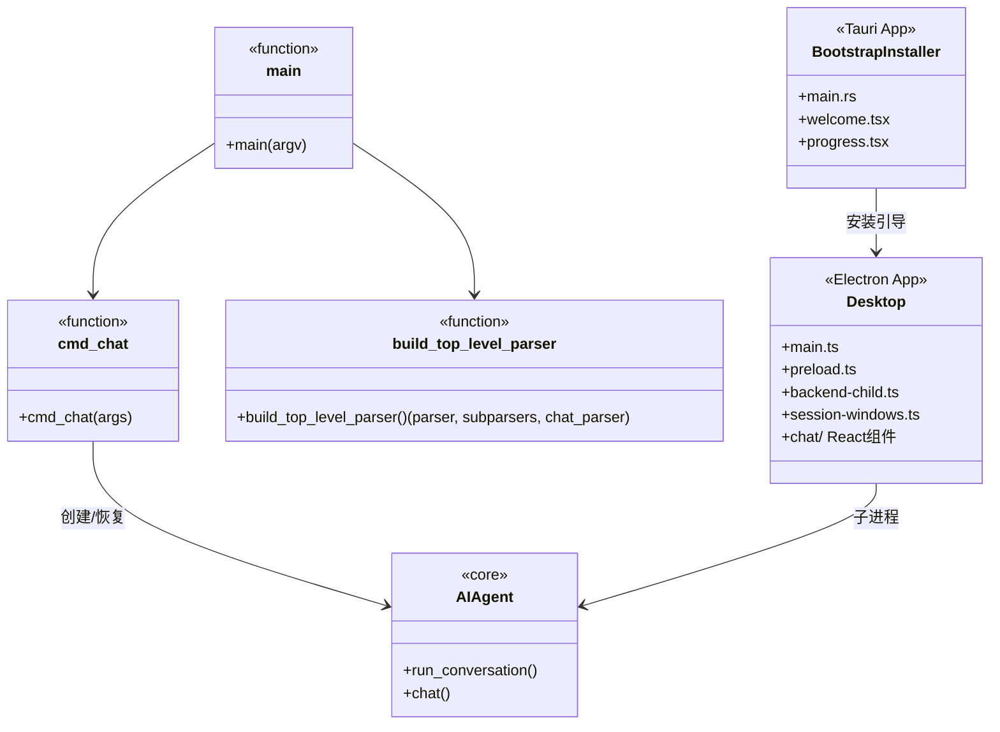
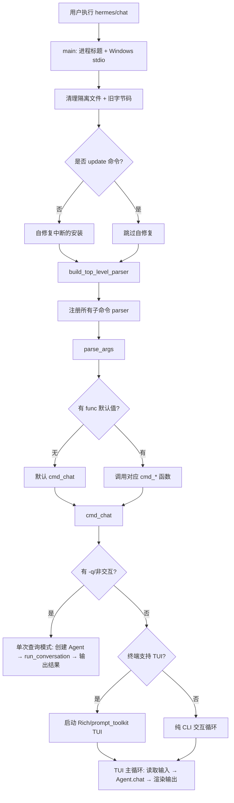
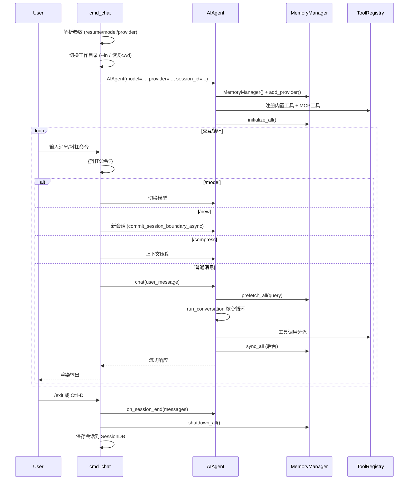

# CLI 入口与应用管理 (CLI Entry & Application Management)

## 概述

hermes-agent 通过统一的命令行入口 `hermes` 提供所有用户交互功能。CLI 基于 argparse 构建子命令体系，默认子命令是 `chat`（交互式聊天），同时支持网关模式（`--gateway`）、ACP 模式（`acp`）、cron 管理、模型配置、会话管理、记忆配置、MCP 服务器管理等众多子命令。

主入口位于 [hermes_cli/main.py](file:///d:/spaces/SpecWeave/external/libs/models/ai/hermes-agent/hermes_cli/main.py) 的 `main()` 函数（L11234），它负责进程标题设置、Windows UTF-8 stdio 配置、陈旧字节码清理、中断安装自恢复，然后构建 argparse 解析器并分派到对应子命令处理函数。

除 CLI 外，hermes-agent 还提供两个打包应用：
- **Desktop**（[apps/desktop/](file:///d:/spaces/SpecWeave/external/libs/models/ai/hermes-agent/apps/desktop/)）：基于 Electron 的桌面 GUI 应用
- **Bootstrap Installer**（[apps/bootstrap-installer/](file:///d:/spaces/SpecWeave/external/libs/models/ai/hermes-agent/apps/bootstrap-installer/)）：基于 Tauri 的初始安装引导程序

### 解决的核心问题

1. **统一入口**：一个 `hermes` 命令覆盖聊天、网关、ACP、cron、配置等全部功能
2. **交互式体验**：支持 TUI（基于 prompt_toolkit/Rich）和纯 CLI 两种交互模式
3. **会话持久化**：`--resume`/`-c` 恢复历史会话，`sessions` 子命令管理会话
4. **配置管理**：通过 `model`、`fallback`、`memory setup` 等子命令管理配置
5. **进程健壮性**：启动时自动修复中断的安装、清理陈旧缓存、设置进程标题
6. **多模式运行**：同一进程可在 CLI 聊天、网关、ACP stdio 服务器等模式间切换

## 核心设计原理

### 1. 启动自修复序列

`main()` 函数在解析参数前执行一系列防御性操作：

```python
# hermes_cli/main.py L11234-L11275
def main():
    _set_process_title()                    # ps/top 中显示为 'hermes'
    configure_windows_stdio()               # Windows UTF-8 stdio
    _cleanup_quarantined_exes()             # 清理 hermes.exe.old.* 隔离文件
    _sweep_stale_bytecode_if_checkout_changed()  # git checkout 变更后清 __pycache__
    if "update" not in sys.argv[1:]:
        _recover_from_interrupted_install() # 自修复被中断的 venv 安装
    # ... 构建 parser 并分派
```

每个步骤都被 try/except 包裹，确保单点失败不会阻止 CLI 启动。

### 2. argparse 子命令体系

```python
# hermes_cli/main.py L11282-L11285
parser, subparsers, chat_parser = build_top_level_parser()
chat_parser.set_defaults(func=cmd_chat)
```

Parser 构建分三层：
1. **顶层 parser**：全局参数（`--model`、`--provider`、`--profile` 等）
2. **chat 子 parser**：默认交互模式，支持 `-q` 单次查询、`--resume` 恢复、`--image` 附图等
3. **其他子命令**：`model`、`moa`、`fallback`、`gateway`、`acp`、`cron`、`sessions`、`memory`、`skills`、`mcp`、`config`、`setup` 等

### 3. 会话恢复与工作目录绑定

```python
# hermes_cli/main.py L2531-L2610 (cmd_chat 核心逻辑)
def cmd_chat(args):
    use_tui = _resolve_use_tui(args)
    _apply_safe_mode(args)

    # --in DIR: 在指定目录运行，绑定会话到该工作区
    in_dir = getattr(args, "in_dir", None)
    if in_dir:
        os.chdir(os.path.abspath(os.path.expanduser(in_dir)))

    # --resume latest: 自动解析最近会话
    # -c/--continue: 按名称/ID 恢复，或最近会话
    # 恢复时自动 cd 回会话记录的工作目录
```

会话恢复支持三种方式：
- `--resume <session_id>`：按 UUID 恢复
- `--resume latest`：恢复最近会话（按工作区隔离）
- `-c [name]`：`-c` 无参数恢复最近；`-c "name"` 按标题/ID 搜索

### 4. TUI 与 CLI 双模式

`_resolve_use_tui(args)` 根据环境判断使用 TUI 还是纯 CLI：
- 交互终端 + 未指定 `-q` → TUI（Rich/prompt_toolkit 界面）
- 非交互终端（管道/重定向）或 `-q` 单次查询 → 纯 CLI 输出
- `--quiet`/`-Q` 模式：抑制 banner/spinner/工具预览，仅输出最终结果

### 5. 配置加载链路

配置加载采用多级回退链：
1. 命令行参数（最高优先级）
2. 环境变量（`HERMES_*` 前缀）
3. `~/.hermes/config.yaml`（用户配置）
4. 项目级 `.hermes/config.yaml`（如存在）
5. 内置默认值

通过 `hermes_cli.config.load_config()` 和 `get_fallback_chain()` 实现。

## 数据结构与命令体系

### CLI 子命令全景

```mermaid
graph TB
    HERMES["hermes 命令"] --> CHAT["chat (默认)<br/>交互式聊天"]
    HERMES --> MODEL["model<br/>模型选择/配置"]
    HERMES --> MOA["moa<br/>Mixture of Agents"]
    HERMES --> FALLBACK["fallback<br/>降级链管理"]
    HERMES --> GATEWAY["gateway<br/>多平台网关"]
    HERMES --> ACP["acp<br/>编辑器协议"]
    HERMES --> CRON["cron<br/>定时任务"]
    HERMES --> SESSIONS["sessions<br/>会话管理"]
    HERMES --> MEMORY["memory<br/>记忆配置"]
    HERMES --> SKILLS["skills<br/>技能管理"]
    HERMES --> MCP["mcp<br/>MCP服务器"]
    HERMES --> CONFIG["config<br/>配置查看/编辑"]
    HERMES --> SETUP["setup<br/>初始设置向导"]
    HERMES --> UPDATE["update<br/>更新"]
    HERMES --> PROFILES["profiles<br/>配置档案"]

    CHAT --> CHAT_Q["-q 单次查询"]
    CHAT --> CHAT_RESUME["-r/--resume 恢复"]
    CHAT --> CHAT_IMAGE["--image 附图"]
    CHAT --> CHAT_TUI["TUI/CLI 自动切换"]

    GATEWAY --> GW_START["start 启动"]
    GATEWAY --> GW_STOP["stop 停止"]
    GATEWAY --> GW_STATUS["status 状态"]
    GATEWAY --> GW_INSTALL["install 系统服务"]

    CRON --> CRON_LIST["list 列出"]
    CRON --> CRON_ADD["add 添加"]
    CRON --> CRON_REMOVE["remove 删除"]
    CRON --> CRON_ENABLE["enable/disable"]
```



### chat 子命令参数

| 参数 | 短选项 | 说明 |
|------|--------|------|
| `--query` | `-q` | 单次查询模式（非交互） |
| `--image` | | 附加本地图片路径 |
| `--model` | `-m` | 指定模型（覆盖配置） |
| `--provider` | | 指定推理提供者 |
| `--toolsets` | `-t` | 逗号分隔的工具集列表 |
| `--reasoning` | | 推理力度：none/minimal/low/medium/high/xhigh/max/ultra |
| `--skills` | `-s` | 预加载技能 |
| `--resume` | `-r` | 恢复会话（ID 或 'latest'） |
| `--continue` | `-c` | 继续最近或指定会话 |
| `--in` | | 在指定目录启动/恢复 |
| `--no-restore-cwd` | | 恢复时不切换工作目录 |
| `--verbose` | `-v` | 详细输出 |
| `--quiet` | `-Q` | 安静模式（仅输出最终结果） |
| `--yolo` | | 跳过所有审批（自动接受编辑） |

### 应用层结构



### apps/ 目录应用

| 应用 | 技术栈 | 入口 | 说明 |
|------|--------|------|------|
| Desktop | Electron + React + TypeScript | [apps/desktop/electron/main.ts](file:///d:/spaces/SpecWeave/external/libs/models/ai/hermes-agent/apps/desktop/electron/main.ts) | 全功能桌面 GUI，多窗口会话，内置终端 |
| Bootstrap Installer | Tauri (Rust + React/TS) | [apps/bootstrap-installer/src-tauri/src/main.rs](file:///d:/spaces/SpecWeave/external/libs/models/ai/hermes-agent/apps/bootstrap-installer/src-tauri/src/main.rs) | 首次安装向导，下载运行时，环境检测 |

Desktop 应用通过子进程运行 hermes-core，使用 IPC 通信：
- `backend-child.ts`：管理 hermes 子进程生命周期
- `backend-command.ts`：发送命令/接收流式响应
- `session-windows.ts`：多会话窗口管理

## 工作流程/生命周期

### CLI 启动流程



### 聊天会话生命周期



## 关键 API / 方法列表

### 入口函数

| 函数 | 文件位置 | 说明 |
|------|----------|------|
| `main()` | [hermes_cli/main.py#L11234](file:///d:/spaces/SpecWeave/external/libs/models/ai/hermes-agent/hermes_cli/main.py#L11234) | CLI 主入口 |
| `cmd_chat(args)` | [hermes_cli/main.py#L2531](file:///d:/spaces/SpecWeave/external/libs/models/ai/hermes-agent/hermes_cli/main.py#L2531) | 交互式聊天处理函数 |
| `build_top_level_parser()` | [hermes_cli/_parser.py#L90](file:///d:/spaces/SpecWeave/external/libs/models/ai/hermes-agent/hermes_cli/_parser.py#L90) | 构建 argparse 解析器 |

### 主要子命令处理函数（注册到 subparsers）

| 子命令 | 处理函数 | 说明 |
|--------|----------|------|
| `chat` | `cmd_chat(args)` | 交互式聊天（默认） |
| `model` | `cmd_model(args)` | 模型选择与配置 |
| `moa` | `cmd_moa(args)` | Mixture of Agents 配置 |
| `fallback` | `cmd_fallback(args)` | 降级提供者链管理 |
| `gateway` | Gateway CLI 命令 | 网关启停/状态/安装 |
| `acp` | `acp_adapter.entry.main()` | ACP stdio 服务器 |
| `cron` | Cron CLI 命令 | 定时任务 CRUD |
| `sessions` | Sessions CLI 命令 | 会话列表/搜索/删除 |
| `memory` | Memory setup 命令 | 记忆提供者配置向导 |
| `skills` | Skills hub 命令 | 技能安装/管理 |
| `mcp` | MCP CLI 命令 | MCP 服务器配置 |
| `config` | Config 命令 | 配置查看/编辑 |
| `setup` | Setup wizard | 初始设置向导 |
| `update` | Update 命令 | 版本更新 |
| `profiles` | Profiles 命令 | 配置档案管理 |

### cmd_chat 核心步骤

```python
# hermes_cli/main.py cmd_chat 关键逻辑（精简）
def cmd_chat(args):
    use_tui = _resolve_use_tui(args)
    _apply_safe_mode(args)

    # 1. 工作目录处理
    if args.in_dir:
        os.chdir(os.path.abspath(os.path.expanduser(args.in_dir)))

    # 2. 会话恢复解析
    if args.resume == "latest":
        args.resume = _resolve_last_session(source="tui" if use_tui else "cli")
    if args.continue_last and not args.resume:
        args.resume = _resolve_last_session(...)

    # 3. 恢复会话的工作目录
    if args.resume and not args.no_restore_cwd:
        _cd_to_resumed_session_cwd(args.resume)

    # 4. 创建或恢复 AIAgent
    agent = AIAgent(
        model=args.model, provider=args.provider,
        session_id=args.resume,  # None 表示新会话
        toolsets=args.toolsets,
        ...
    )

    # 5. 进入交互循环（TUI 或 CLI）
    if use_tui:
        _run_tui(agent, args)
    else:
        _run_cli(agent, args)
```

## 源码位置指引

| 文件 | 内容 |
|------|------|
| [hermes_cli/main.py#L11234-L11340](file:///d:/spaces/SpecWeave/external/libs/models/ai/hermes-agent/hermes_cli/main.py#L11234-L11340) | `main()` 入口函数 |
| [hermes_cli/main.py#L2531-](file:///d:/spaces/SpecWeave/external/libs/models/ai/hermes-agent/hermes_cli/main.py#L2531) | `cmd_chat()` 聊天处理 |
| [hermes_cli/_parser.py#L298-](file:///d:/spaces/SpecWeave/external/libs/models/ai/hermes-agent/hermes_cli/_parser.py#L298) | chat 子命令参数定义 |
| [hermes_cli/config.py](file:///d:/spaces/SpecWeave/external/libs/models/ai/hermes-agent/hermes_cli/config.py) | 配置加载/保存/访问 |
| [hermes_cli/fallback_config.py](file:///d:/spaces/SpecWeave/external/libs/models/ai/hermes-agent/hermes_cli/fallback_config.py) | 多路径配置回退链 |
| [hermes_cli/profiles.py](file:///d:/spaces/SpecWeave/external/libs/models/ai/hermes-agent/hermes_cli/profiles.py) | 配置档案管理 |
| [run_agent.py#L412-](file:///d:/spaces/SpecWeave/external/libs/models/ai/hermes-agent/run_agent.py#L412) | AIAgent 类（CLI 实例化的核心对象） |
| [apps/desktop/electron/main.ts](file:///d:/spaces/SpecWeave/external/libs/models/ai/hermes-agent/apps/desktop/electron/main.ts) | Electron 主进程入口 |
| [apps/desktop/electron/backend-child.ts](file:///d:/spaces/SpecWeave/external/libs/models/ai/hermes-agent/apps/desktop/electron/backend-child.ts) | 子进程管理（spawn hermes-core） |
| [apps/bootstrap-installer/src-tauri/src/main.rs](file:///d:/spaces/SpecWeave/external/libs/models/ai/hermes-agent/apps/bootstrap-installer/src-tauri/src/main.rs) | Tauri 安装器入口 |

## 相关 Concepts

- [agent-core-loop.md](agent-core-loop.md) — CLI 中每个会话的 AIAgent 核心循环
- [gateway-multi-agent.md](gateway-multi-agent.md) — `hermes gateway` 子命令启动 GatewayRunner
- [acp-adapter.md](acp-adapter.md) — `hermes acp` 子命令启动 ACP stdio 服务器
- [cron-scheduler.md](cron-scheduler.md) — `hermes cron` 子命令管理定时任务
- [mcp-protocol.md](mcp-protocol.md) — `hermes mcp` 子命令管理 MCP 服务器配置
- [memory-subsystem.md](memory-subsystem.md) — `hermes memory setup` 配置记忆提供者
- [provider-abstraction.md](provider-abstraction.md) — CLI 的 `--model`/`--provider` 参数通过 Provider 抽象层解析
