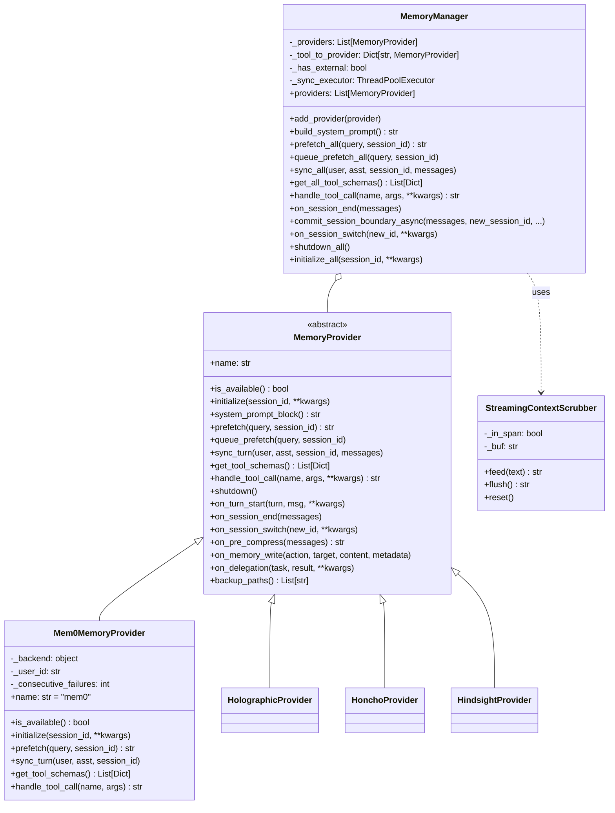
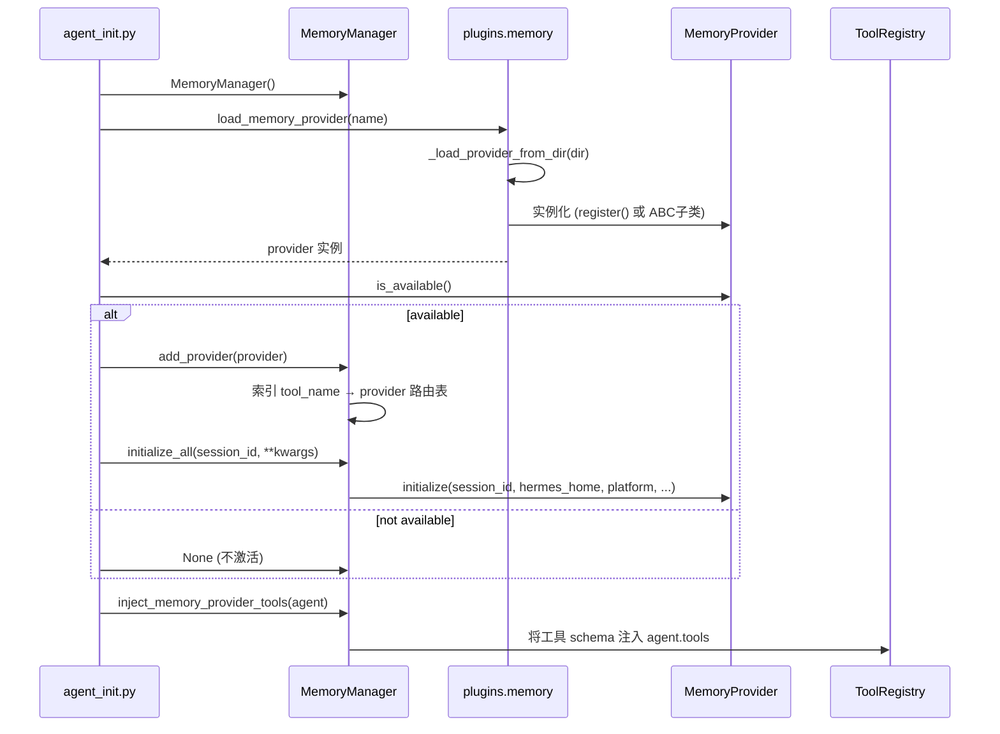
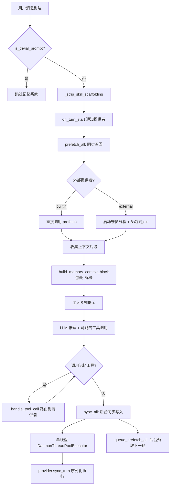

# 记忆子系统 (Memory Subsystem)

## 概述

记忆子系统是 hermes-agent 实现跨会话持久化回忆的核心架构。它解决了一个关键问题：LLM 本身无状态，每次对话从零开始——而记忆系统让 Agent 能够"记住"用户偏好、历史决策、事实信息，在后续会话中自动召回相关上下文。

系统采用 **Manager-Provider 双层架构**：

- **`MemoryManager`**（[memory_manager.py](file:///d:/spaces/SpecWeave/external/libs/models/ai/hermes-agent/agent/memory_manager.py)）：单一编排入口，负责提供者注册、生命周期管理、预取调度、异步同步、工具路由、上下文围栏。核心约束：**同一时间只允许一个外部记忆提供者**，防止工具 schema 膨胀和后端冲突。
- **`MemoryProvider`**（[memory_provider.py](file:///d:/spaces/SpecWeave/external/libs/models/ai/hermes-agent/agent/memory_provider.py)）：抽象基类，定义标准生命周期接口（`initialize`/`prefetch`/`sync_turn`/`shutdown`）和可选钩子（`on_session_end`/`on_memory_write`/`on_delegation` 等）。
- **8 个记忆插件**：byterover、hindsight、holographic、honcho、mem0、openviking、retaindb、supermemory，均位于 [plugins/memory/](file:///d:/spaces/SpecWeave/external/libs/models/ai/hermes-agent/plugins/memory/) 目录，通过配置 `memory.provider` 选择激活。

### 解决的核心问题

1. **跨会话持久化**：将对话中的事实/偏好写入后端存储（向量数据库、云API、本地文件等）
2. **自动召回**：每轮对话前自动预取相关记忆注入上下文
3. **非阻塞设计**：同步/预取在后台线程执行，慢后端不会卡住 Agent 响应
4. **插件化扩展**：统一 ABC 接口，用户可自行开发记忆后端
5. **上下文隔离**：`<memory-context>` 围栏标签 + StreamingContextScrubber 防止记忆内容泄露到 UI

## 核心设计原理

### 1. 单外部提供者约束

```python
# memory_manager.py L404-L426
def add_provider(self, provider: MemoryProvider) -> None:
    is_builtin = provider.name == "builtin"
    if not is_builtin:
        if self._has_external:
            existing = next(
                (p.name for p in self._providers if p.name != "builtin"), "unknown"
            )
            logger.warning(
                "Rejected memory provider '%s' — external provider '%s' is "
                "already registered. Only one external memory provider is "
                "allowed at a time.",
                provider.name, existing,
            )
            return
        self._has_external = True
    self._providers.append(provider)
```

设计理由：多个记忆后端同时注册会导致：(a) 工具数量膨胀（每个后端暴露 search/add/update/delete 工具），(b) 写入冲突（同一事实被多个后端重复存储），(c) 预取延迟叠加。因此强制单提供者策略。

### 2. 预取-同步双阶段

每个对话轮次中，记忆系统在两个时间点介入：

- **预取（Prefetch）**：轮次开始前，`prefetch_all()` 从所有提供者召回相关记忆，注入到 `<memory-context>` 围栏块中，作为系统提示的一部分发送给 LLM。外部提供者的预取在独立守护线程中执行，有 8 秒超时保护。
- **同步（Sync）**：轮次结束后，`sync_all()` 将用户消息+助手回复异步写入后端，在单线程 `DaemonThreadPoolExecutor` 上序列化执行，保证写入顺序（第 N 轮先于第 N+1 轮落地）。

### 3. 后台序列化执行器

```python
# memory_manager.py L698-L757
def _submit_background(self, fn, *, kind: str = "write") -> None:
    executor = self._get_sync_executor()
    if executor is None:
        if self._shutting_down:
            logger.warning("Memory manager is shutting down; rejecting late %s task", kind)
            return
        try:
            fn()  # 降级：同步执行
        except Exception as e:
            logger.debug("Inline memory background task failed: %s", e)
        return
    with self._sync_executor_lock:
        if self._shutting_down:
            return
        future = executor.submit(fn)
        self._background_futures[future] = kind
    future.add_done_callback(self._forget_background_future)
```

关键设计：
- **单工作线程**：序列化所有写入，保证顺序性，提供者无需自己实现锁
- **Daemon 线程**：阻塞的网络调用不会阻止进程退出
- **优雅关闭**：`shutdown_all()` 给予 5 秒排空窗口，超时后放弃剩余任务
- **降级策略**：执行器创建失败时同步执行，慢但不会丢数据

### 4. 琐碎提示过滤

```python
# memory_provider.py L52-L78
TRIVIAL_PROMPT_RE = re.compile(
    r'^(yes|no|ok|okay|sure|thanks|thank you|y|n|yep|nope|yeah|nah|'
    r'hi|hey|hello|yo|sup|'
    r'continue|go ahead|do it|proceed|got it|cool|nice|great|done|next|lgtm|k)'
    r'[\s!?.:;,"' + "'" + r'~\u2018\u2019\u201c\u201d\u2014\u2013\u2026()\[\]{}<>*&^%$#@!+=`\u00a0]*$',
    re.IGNORECASE,
)
```

`is_trivial_prompt()` 函数识别无语义信号的输入（问候、确认、斜杠命令），跳过预取和同步，避免：(a) 浪费网络往返，(b) 污染记忆存储（"hi"/"ok" 被当作事实存储）。

### 5. 技能脚手架剥离

```python
# memory_manager.py L507-L523
@staticmethod
def _strip_skill_scaffolding(text: str) -> Optional[str]:
    """Return memory-worthy user text, or None to skip the turn."""
    return extract_user_instruction_from_skill_message(text)
```

当用户通过 `/skill` 或 `/bundle` 调用技能时，Hermes 会将整个技能体展开为模型消息。直接送入记忆提供者会导致嵌入被脚手架提示词污染。此方法提取用户的真实指令部分。

## 数据结构与类图

### MemoryProvider 抽象基类

```python
# memory_provider.py L81-L188
class MemoryProvider(ABC):
    """Abstract base class for memory providers."""

    @property
    @abstractmethod
    def name(self) -> str:
        """Short identifier (e.g. 'builtin', 'honcho', 'hindsight')."""

    @abstractmethod
    def is_available(self) -> bool:
        """Return True if configured and ready (no network calls)."""

    @abstractmethod
    def initialize(self, session_id: str, **kwargs) -> None:
        """Connect, create resources, warm up. kwargs include hermes_home,
        platform, agent_context, agent_identity, user_id, etc."""

    def system_prompt_block(self) -> str:
        """Static text for system prompt (instructions/status)."""
        return ""

    def prefetch(self, query: str, *, session_id: str = "") -> str:
        """Recall relevant context. Return formatted text or empty string."""
        return ""

    def queue_prefetch(self, query: str, *, session_id: str = "") -> None:
        """Queue background recall for the NEXT turn."""

    def sync_turn(self, user_content: str, assistant_content: str, *,
                  session_id: str = "", messages=None) -> None:
        """Persist completed turn to backend (non-blocking)."""

    @abstractmethod
    def get_tool_schemas(self) -> List[Dict[str, Any]]:
        """Return OpenAI function-calling tool schemas."""

    def handle_tool_call(self, tool_name: str, args: Dict[str, Any], **kwargs) -> str:
        """Handle a tool call, return JSON string."""
        raise NotImplementedError(...)

    def shutdown(self) -> None:
        """Clean shutdown — flush queues, close connections."""
```

### MemoryManager 核心结构

```python
# memory_manager.py L364-L400
class MemoryManager:
    def __init__(self, *, external_prefetch_timeout: Optional[float] = None):
        self._providers: List[MemoryProvider] = []
        self._tool_to_provider: Dict[str, MemoryProvider] = {}
        self._has_external: bool = False
        self._external_prefetch_timeout = 8.0  # seconds
        self._external_prefetch_threads: Dict[str, threading.Thread] = {}
        self._external_prefetch_lock = threading.Lock()
        self._sync_executor: Optional[ThreadPoolExecutor] = None  # lazy, single-worker
        self._sync_executor_lock = threading.Lock()
        self._background_futures: Dict[Future, str] = {}
        self._shutting_down = False
        self._shutdown_drain_state: Dict[str, Any] = {...}
```

### 类关系图



### 记忆插件清单

| 插件名 | 类型 | 说明 |
|--------|------|------|
| mem0 | 云端/自托管 | Mem0 Platform API 或自托管 OSS，服务端事实提取+语义搜索 |
| honcho | 云端 | Honcho 用户建模 API，对话式 AI 记忆层 |
| hindsight | 本地守护进程 | Hindsight 长时记忆守护进程 |
| holographic | 本地向量存储 | 全息记忆，本地向量存储+检索（[holographic/store.py](file:///d:/spaces/SpecWeave/external/libs/models/ai/hermes-agent/plugins/memory/holographic/store.py)） |
| byterover | 云端 | ByteRover 记忆服务 |
| openviking | 本地 | OpenViking 本地记忆存储 |
| retaindb | 数据库 | RetainDB 持久化记忆 |
| supermemory | 云端 | Supermemory 云记忆 API |

## 工作流程/生命周期

### 记忆系统初始化流程



### 每轮对话记忆流程



### 上下文围栏机制

记忆召回的内容通过 `<memory-context>` XML 标签包裹，并附带系统注释：

```python
# memory_manager.py L347-L361
def build_memory_context_block(raw_context: str) -> str:
    if not raw_context or not raw_context.strip():
        return ""
    clean = sanitize_context(raw_context)
    return (
        "<memory-context>\n"
        "[System note: The following is recalled memory context, "
        "NOT new user input. Treat as authoritative reference data — "
        "this is the agent's persistent memory and should inform all responses.]\n\n"
        f"{clean}\n"
        "</memory-context>"
    )
```

`StreamingContextScrubber` 是一个有状态的流式清洗器，防止 LLM 在流式输出中"回声"记忆内容时泄露到 UI。它实现了一个小型状态机，在 delta 流中追踪 `<memory-context>` 标签的开/闭，丢弃标签内的所有内容。

### 会话边界提交

```python
# memory_manager.py L877-L924
def commit_session_boundary_async(
    self, messages, *, new_session_id, parent_session_id="", reason="new_session"
) -> None:
    """Queue old-session extraction + provider rebinding as ONE serialized task."""
    snapshot = list(messages or [])
    def _run():
        self.on_session_end(snapshot)  # 旧会话提取
        self.on_session_switch(        # 切换到新会话
            new_session_id, parent_session_id=parent_session_id,
            reset=True, reason=reason,
        )
    self._submit_background(_run)
```

会话轮换（`/new`、`/reset`、上下文压缩）时，`on_session_end`（端会话事实提取）必须在 `on_session_switch`（绑定新 session_id）**之前**完成。两者作为一个序列化任务提交到后台执行器，保证 FIFO 顺序——避免了之前内联执行阻塞 `/new` 命令、或 ad-hoc 线程导致竞态（旧会话内容被错误归入新会话）的问题。

### 内置记忆写入桥接

当用户通过内置 `memory` 工具显式写入记忆时（`add`/`replace`/`remove`），`notify_memory_tool_write()` 将写入操作镜像到外部提供者：

```python
# memory_manager.py L1073-L1128
def notify_memory_tool_write(self, tool_result, tool_args, *, build_metadata=None):
    if not self._memory_tool_result_succeeded(tool_result):
        return  # 失败/待审批的写入不镜像
    # 展开单操作和批量操作
    # 仅镜像 mutating actions (add/replace/remove)
    # 构建 provenance metadata，转发给外部提供者
```

## 关键 API / 方法列表

### MemoryManager 公开方法

| 方法 | 签名 | 说明 |
|------|------|------|
| `add_provider` | `(provider: MemoryProvider) -> None` | 注册记忆提供者；外部提供者仅允许一个 |
| `providers` | `property -> List[MemoryProvider]` | 所有已注册提供者（按顺序） |
| `get_provider` | `(name: str) -> Optional[MemoryProvider]` | 按名称查找提供者 |
| `build_system_prompt` | `() -> str` | 收集所有提供者的系统提示块 |
| `prefetch_all` | `(query: str, *, session_id="") -> str` | 同步预取所有提供者的记忆上下文 |
| `queue_prefetch_all` | `(query: str, *, session_id="") -> None` | 后台排队预取下一轮记忆 |
| `sync_all` | `(user, asst, *, session_id="", messages=None) -> None` | 后台同步已完成轮次到所有提供者 |
| `get_all_tool_schemas` | `() -> List[Dict[str, Any]]` | 收集所有提供者的工具 schema |
| `handle_tool_call` | `(tool_name, args, **kwargs) -> str` | 将工具调用路由到正确提供者 |
| `has_tool` | `(tool_name: str) -> bool` | 检查是否有提供者处理该工具 |
| `on_turn_start` | `(turn_number, message, **kwargs) -> None` | 通知所有提供者新轮次开始 |
| `on_session_end` | `(messages: List[Dict]) -> None` | 通知所有提供者会话结束 |
| `commit_session_boundary_async` | `(messages, *, new_session_id, ...) -> None` | 原子化提交会话边界（end+switch） |
| `on_session_switch` | `(new_session_id, *, parent_session_id="", reset=False, ...) -> None` | 通知 session_id 轮换 |
| `on_pre_compress` | `(messages) -> str` | 上下文压缩前提取洞察 |
| `on_memory_write` | `(action, target, content, metadata=None) -> None` | 镜像内置记忆写入到外部提供者 |
| `notify_memory_tool_write` | `(tool_result, tool_args, *, build_metadata=None) -> None` | 内置记忆工具写入后桥接到外部 |
| `on_delegation` | `(task, result, *, child_session_id="", **kwargs) -> None` | 通知子代理完成 |
| `flush_pending` | `(timeout=None) -> bool` | 阻塞等待后台工作排空 |
| `shutdown_all` | `() -> None` | 关闭所有提供者（逆序），排空后台任务 |
| `initialize_all` | `(session_id, **kwargs) -> None` | 初始化所有提供者 |

### MemoryProvider 抽象方法（必须实现）

| 方法 | 签名 | 说明 |
|------|------|------|
| `name` | `property -> str` | 提供者短标识 |
| `is_available` | `() -> bool` | 配置/凭证检查（无网络调用） |
| `initialize` | `(session_id: str, **kwargs) -> None` | 连接、建资源、启动后台线程 |
| `get_tool_schemas` | `() -> List[Dict[str, Any]]` | 返回 OpenAI 函数调用格式的工具列表 |

### MemoryProvider 可选钩子

| 钩子 | 说明 |
|------|------|
| `system_prompt_block()` | 静态系统提示文本 |
| `prefetch(query, session_id)` | 同步召回记忆（应快速返回） |
| `queue_prefetch(query, session_id)` | 后台预取下一轮 |
| `sync_turn(user, asst, session_id, messages)` | 持久化轮次（非阻塞） |
| `handle_tool_call(name, args)` | 处理工具调用，返回 JSON |
| `shutdown()` | 清理关闭 |
| `on_turn_start(turn, msg, **kwargs)` | 每轮开始通知 |
| `on_session_end(messages)` | 会话结束时提取 |
| `on_session_switch(new_id, **kwargs)` | session_id 轮换时刷新缓存 |
| `on_pre_compress(messages)` | 压缩前提取，返回文本加入压缩摘要 |
| `on_memory_write(action, target, content, metadata)` | 镜像内置写入 |
| `on_delegation(task, result, **kwargs)` | 子代理完成通知 |
| `backup_paths()` | HERMES_HOME 外的额外备份路径 |
| `get_config_schema()` | `hermes memory setup` 配置向导字段 |
| `save_config(values, hermes_home)` | 写入非敏感配置到原生位置 |

### 插件发现 API（plugins/memory/\_\_init\_\_.py）

| 函数 | 说明 |
|------|------|
| `discover_memory_providers()` | 扫描内置+用户目录，返回 `[(name, desc, is_available)]` |
| `load_memory_provider(name)` | 按名称加载并返回 MemoryProvider 实例 |
| `list_memory_provider_names()` | 轻量名称列表（目录扫描，不导入模块） |
| `find_provider_dir(name)` | 解析名称到目录路径 |
| `discover_plugin_cli_commands()` | 返回当前活跃提供者的 CLI 命令 |

## 源码位置指引

| 文件 | 内容 |
|------|------|
| [agent/memory_manager.py](file:///d:/spaces/SpecWeave/external/libs/models/ai/hermes-agent/agent/memory_manager.py) | MemoryManager 编排器、StreamingContextScrubber、工具 schema 规范化、上下文围栏 |
| [agent/memory_provider.py](file:///d:/spaces/SpecWeave/external/libs/models/ai/hermes-agent/agent/memory_provider.py) | MemoryProvider ABC、TRIVIAL_PROMPT_RE、is_trivial_prompt() |
| [plugins/memory/__init__.py](file:///d:/spaces/SpecWeave/external/libs/models/ai/hermes-agent/plugins/memory/__init__.py) | 插件发现与加载机制（目录扫描、动态导入、用户插件命名空间） |
| [plugins/memory/mem0/__init__.py](file:///d:/spaces/SpecWeave/external/libs/models/ai/hermes-agent/plugins/memory/mem0/__init__.py) | Mem0 提供者参考实现（熔断器、后台预取线程、多后端） |
| [plugins/memory/holographic/](file:///d:/spaces/SpecWeave/external/libs/models/ai/hermes-agent/plugins/memory/holographic/) | 本地向量存储全息记忆（store.py、retrieval.py） |
| [plugins/memory/honcho/](file:///d:/spaces/SpecWeave/external/libs/models/ai/hermes-agent/plugins/memory/honcho/) | Honcho 用户建模（client.py、session.py、oauth.py） |
| [agent/agent_init.py#L1726-L1795](file:///d:/spaces/SpecWeave/external/libs/models/ai/hermes-agent/agent/agent_init.py#L1726-L1795) | 初始化集成：读取配置、加载提供者、注入工具、传递上下文参数 |

### Mem0 提供者核心实现（参考）

```python
# plugins/memory/mem0/__init__.py L194-L225
class Mem0MemoryProvider(MemoryProvider):
    """Mem0 memory with server-side extraction and semantic search."""

    def __init__(self):
        self._backend = None
        self._mode = "platform"  # platform / oss / self-hosted
        self._user_id = _DEFAULT_USER_ID
        self._sync_thread = None
        self._prefetch_thread = None
        self._consecutive_failures = 0  # 熔断器计数
        self._breaker_open_until = 0.0

    @property
    def name(self) -> str:
        return "mem0"

    def is_available(self) -> bool:
        cfg = _load_config()
        return bool(cfg.get("api_key") or cfg.get("host"))

    def prefetch(self, query: str, *, session_id: str = "") -> str:
        cached = self._consume_prefetch_result(query)
        if cached is not None:
            return cached
        self._start_prefetch(query)
        # 热路径等待3秒，慢后端放弃注入（mem0_search 工具仍可用作后备）
        thread.join(timeout=_PREFETCH_WAIT_SECS)
        return self._consume_prefetch_result(query) or ""

    def sync_turn(self, user_content, assistant_content, *, session_id=""):
        # 后台线程发送到 Mem0 进行服务端事实提取
        def _sync():
            self._backend.add(
                [{"role": "user", "content": user_content},
                 {"role": "assistant", "content": assistant_content}],
                user_id=self._user_id, infer=True, metadata=self._write_metadata(),
            )
        threading.Thread(target=_sync, daemon=True).start()
```

## 相关 Concepts

- [agent-core-loop.md](agent-core-loop.md) — Agent 核心循环中记忆系统的调用时机（prefetch → LLM → sync）
- [tool-registry.md](tool-registry.md) — 记忆工具通过 ToolRegistry 暴露给 LLM 调用
- [platform-plugin.md](platform-plugin.md) — 网关场景下记忆系统的 user_id/chat_id 作用域
- [provider-abstraction.md](provider-abstraction.md) — 记忆插件模式与 Provider 抽象层的设计对比
