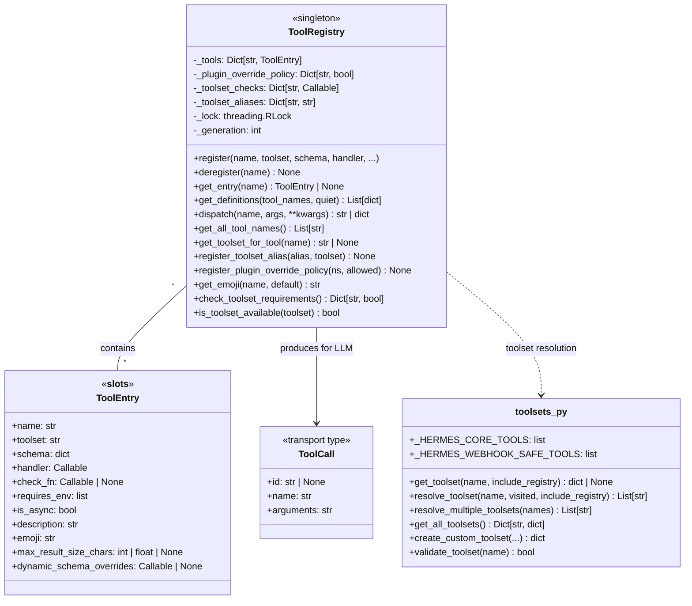
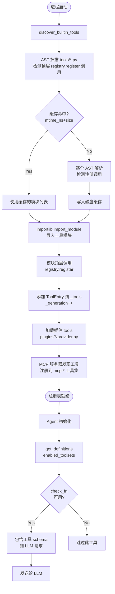

# 工具注册表与调用机制

## 概述

`ToolRegistry`（[tools/registry.py](file:///d:/spaces/SpecWeave/external/libs/models/ai/hermes-agent/tools/registry.py#L414-L900)）是 hermes-agent 的工具管理中枢，采用**单例模式**收集所有工具的 schema、handler 和可用性检查函数。每个工具模块在导入时通过 `registry.register()` 自注册，ToolRegistry 统一提供工具发现、schema 查询、可用性过滤、handler 调度和错误归一化能力。

hermes-agent 内置约 100 个工具模块，涵盖终端执行、文件操作、浏览器自动化、子 Agent 委托、MCP 集成、技能管理、记忆存取、图像/视频生成、TTS、视觉分析、Home Assistant、看板、Discord、飞书、定时任务等。工具按**工具集（toolset）**分组管理，通过 `toolsets.py` 中的 DAG 解析系统支持预定义组合工具集（如 `research`、`development`、`webhook_safe`）。

### 解决的核心问题

1. **工具自注册**：工具模块在导入时自动注册，无需中央维护工具列表
2. **可用性检查 TTL 缓存**：check_fn 探测外部状态（Docker、Modal SDK、Playwright），30 秒 TTL 缓存避免重复探测
3. **跨 toolset 覆盖保护**：插件覆盖内置工具需显式 `override=True` + 操作员授权，防止意外覆盖
4. **线程安全**：MCP 动态刷新和并发工具执行通过 `threading.RLock` 保护注册表变更
5. **生成计数器**：`_generation` 单调递增计数器支持外部 memoize 缓存失效
6. **结果大小预算**：每个工具可设置 `max_result_size_chars`，防止单个工具结果占满上下文窗口
7. **动态 schema 覆盖**：`dynamic_schema_overrides` 零参数可调用对象支持运行时 schema 更新（如 delegate_task 的并发限制）

## 核心设计原理

### 1. 模块级自注册模式

每个工具文件在模块顶层调用 `registry.register()` 声明自身。`discover_builtin_tools()` 使用 AST 扫描（`ast.parse`）检测哪些模块包含顶层 `registry.register(...)` 调用，仅导入这些模块，避免加载无工具的辅助模块。扫描结果通过 `(mtime_ns, size)` 磁盘缓存（`tool_discovery_cache.json`）避免重复扫描。

```python
# 典型工具注册模式（如 tools/terminal_tool.py）
from tools.registry import registry

registry.register(
    name="terminal",
    toolset="terminal",
    schema={
        "name": "terminal",
        "description": "Execute a terminal command...",
        "parameters": {
            "type": "object",
            "properties": {
                "command": {"type": "string", "description": "Command to execute"},
                "timeout": {"type": "integer", "description": "Timeout in seconds"},
            },
            "required": ["command"],
        },
    },
    handler=execute_terminal_command,
    check_fn=check_terminal_requirements,  # 可选：可用性检查
    requires_env=[],
    is_async=False,
    description="Execute terminal commands in the workspace",
    emoji="💻",
)
```

### 2. ToolEntry 数据类

每个注册的工具由 [ToolEntry](file:///d:/spaces/SpecWeave/external/libs/models/ai/hermes-agent/tools/registry.py#L201-L230) 表示，使用 `__slots__` 限定属性以减少内存开销：

```python
class ToolEntry:
    __slots__ = (
        "name", "toolset", "schema", "handler", "check_fn",
        "requires_env", "is_async", "description", "emoji",
        "max_result_size_chars", "dynamic_schema_overrides",
    )
```

### 3. check_fn TTL 缓存与瞬态故障抑制

check_fn（如 `check_terminal_requirements` 探测 Docker daemon）在长生命周期进程中频繁调用会造成性能浪费。ToolRegistry 实现了双层缓存机制：

- **TTL 缓存**：结果缓存 30 秒（`_CHECK_FN_TTL_SECONDS`）
- **瞬态故障抑制**：一次成功后 60 秒内（`_CHECK_FN_FAILURE_GRACE_SECONDS`），如果探测失败则返回上次成功的 True，吸收瞬时抖动（如 Docker daemon 暂时无响应），防止工具集被意外剥离

### 4. 插件覆盖授权机制

插件可以覆盖内置工具（如用 Chrome CDP 后端替换默认 browser 工具），但必须满足两个条件：
1. 调用 `register()` 时传入 `override=True`
2. 插件模块在 `_plugin_override_policy` 中被授权（`allow_tool_override: true`）

未经授权的覆盖尝试抛出 `PermissionError`。`deregister()` 同样受所有权检查约束，防止插件通过"先删除再注册"绕过覆盖门控。

### 5. 工具集 DAG 解析

`toolsets.py` 定义了核心工具列表 `_HERMES_CORE_TOOLS` 和工具集依赖 DAG。`resolve_toolset()` 递归展开工具集依赖，支持预定义组合：

- 基础工具集：`web`、`terminal`、`vision`、`creative`、`reasoning`
- 复合工具集：`research`（web+vision）、`development`（terminal+file+browser）、`full_stack` 等
- 安全工具集：`_HERMES_WEBHOOK_SAFE_TOOLS` 仅包含 web_search、web_extract、vision_analyze、clarify 四个工具，防止 webhook 来源的 prompt injection 执行本地命令

## 数据结构/类图



## 工作流程/生命周期

### 工具发现与注册流程



### 工具调用调度流程

```mermaid
sequenceDiagram
    participant Loop as Agent 主循环
    participant NR as NormalizedResponse
    participant Exec as tool_executor
    participant Reg as ToolRegistry
    participant Handler as Tool Handler

    Loop->>NR: 调用 LLM 获取响应
    NR-->>Loop: NormalizedResponse(tool_calls=[...])
    Loop->>Exec: 执行工具调用
    Exec->>Reg: dispatch(name, args)

    Reg->>Reg: get_entry(name) 查找 ToolEntry
    alt 工具不存在
        Reg-->>Exec: tool_error("Unknown tool")
    else 工具存在
        alt is_async=True
            Reg->>Reg: _run_async() 桥接协程
        end
        Reg->>Handler: handler(args, **kwargs)
        Handler-->>Reg: result (str / multimodal dict)
        Reg->>Reg: _normalize_handler_result()
        alt 异常
            Reg->>Reg: 捕获异常 → tool_error()
        end
        Reg-->>Exec: 结果字符串
    end

    Exec->>Exec: 结果预算截断
    Exec-->>Loop: tool 消息
    Loop->>Loop: 追加到 messages → 继续循环
```

### 核心注册代码片段

以下是 [ToolRegistry.register()](file:///d:/spaces/SpecWeave/external/libs/models/ai/hermes-agent/tools/registry.py#L562-L644) 的核心逻辑：

```python
def register(
    self,
    name: str,
    toolset: str,
    schema: dict,
    handler: Callable,
    check_fn: Callable = None,
    requires_env: list = None,
    is_async: bool = False,
    description: str = "",
    emoji: str = "",
    max_result_size_chars: int | float | None = None,
    dynamic_schema_overrides: Callable = None,
    override: bool = False,
):
    with self._lock:
        existing = self._tools.get(name)
        # 跨 toolset 覆盖需要授权
        if existing and existing.toolset != toolset:
            if override:
                _owner = self._plugin_owner_of(handler)
                if _owner is not None and not self._plugin_override_policy.get(_owner, False):
                    raise PermissionError(
                        f"Plugin module {_owner!r} cannot override built-in "
                        f"tool {name!r} without operator opt-in (allow_tool_override)."
                    )
                logger.info("Tool '%s': overriding toolset '%s' → '%s'",
                            name, existing.toolset, toolset)
            else:
                logger.error("Tool registration REJECTED: '%s' would shadow existing tool", name)
                return

        self._tools[name] = ToolEntry(
            name=name, toolset=toolset, schema=schema, handler=handler,
            check_fn=check_fn, requires_env=requires_env or [],
            is_async=is_async,
            description=description or schema.get("description", ""),
            emoji=emoji, max_result_size_chars=max_result_size_chars,
            dynamic_schema_overrides=dynamic_schema_overrides,
        )
        self._generation += 1
```

### dispatch 方法代码片段

```python
def dispatch(self, name: str, args: dict, **kwargs) -> str | dict:
    entry = self.get_entry(name)
    if not entry:
        return tool_error(f"Unknown tool: {name}")
    try:
        if entry.is_async:
            from model_tools import _run_async
            result = _run_async(entry.handler(args, **kwargs))
        else:
            result = entry.handler(args, **kwargs)
        return self._normalize_handler_result(name, result)
    except Exception as e:
        logger.exception("Tool %s dispatch error: %s", name, _bound_error_text(str(e)))
        raw = f"Tool execution failed: {type(e).__name__}: {e}"
        try:
            from model_tools import _sanitize_tool_error
            sanitized = _sanitize_tool_error(raw)
        except Exception:
            sanitized = raw
        return tool_error(sanitized)
```

## 关键 API/方法列表

### ToolRegistry 类

| 方法 | 签名 | 说明 |
|------|------|------|
| `__init__` | `__init__(self)` | 初始化内部数据结构：`_tools` 字典、`_lock` 可重入锁、`_generation` 计数器 |
| `register` | `register(self, name: str, toolset: str, schema: dict, handler: Callable, check_fn: Callable = None, requires_env: list = None, is_async: bool = False, description: str = "", emoji: str = "", max_result_size_chars: int/float/None = None, dynamic_schema_overrides: Callable = None, override: bool = False)` | 注册一个工具，模块导入时调用 |
| `deregister` | `deregister(self, name: str) -> None` | 移除一个工具（MCP 动态刷新使用），受所有权门控 |
| `get_entry` | `get_entry(self, name: str) -> Optional[ToolEntry]` | 按名称查找工具条目 |
| `get_definitions` | `get_definitions(self, tool_names: Set[str], quiet: bool = False) -> List[dict]` | 返回 OpenAI 格式的工具 schema 列表，过滤 check_fn 不可用的工具 |
| `dispatch` | `dispatch(self, name: str, args: dict, **kwargs) -> str \| dict` | 执行工具 handler，自动桥接 async 函数，归一化结果，捕获异常 |
| `get_all_tool_names` | `get_all_tool_names(self) -> List[str]` | 返回所有已注册工具名的排序列表 |
| `get_schema` | `get_schema(self, name: str) -> Optional[dict]` | 返回工具原始 schema（不经过 check_fn 过滤） |
| `get_toolset_for_tool` | `get_toolset_for_tool(self, name: str) -> Optional[str]` | 返回工具所属的 toolset 名称 |
| `get_emoji` | `get_emoji(self, name: str, default: str = "⚡") -> str` | 返回工具的 emoji 图标 |
| `get_max_result_size` | `get_max_result_size(self, name: str, default=None) -> int/float` | 返回工具的结果大小限制 |
| `register_toolset_alias` | `register_toolset_alias(self, alias: str, toolset: str) -> None` | 注册工具集别名 |
| `register_plugin_override_policy` | `register_plugin_override_policy(self, module_namespace: str, allowed: bool) -> None` | 绑定插件模块的覆盖授权策略 |
| `check_toolset_requirements` | `check_toolset_requirements(self) -> Dict[str, bool]` | 返回所有工具集的可用性状态 `{toolset: available}` |
| `is_toolset_available` | `is_toolset_available(self, toolset: str) -> bool` | 检查工具集是否至少有一个可暴露的工具 |
| `get_tool_to_toolset_map` | `get_tool_to_toolset_map(self) -> Dict[str, str]` | 返回 `{tool_name: toolset_name}` 映射 |

### ToolEntry 类

| 属性 | 类型 | 说明 |
|------|------|------|
| `name` | `str` | 工具唯一名称 |
| `toolset` | `str` | 所属工具集 |
| `schema` | `dict` | JSON Schema 定义（OpenAI function 格式） |
| `handler` | `Callable` | 工具执行函数，接收 `(args: dict, **kwargs)` |
| `check_fn` | `Callable \| None` | 可选可用性检查函数，返回 bool |
| `requires_env` | `list` | 所需环境变量列表 |
| `is_async` | `bool` | handler 是否为 async 函数 |
| `description` | `str` | 工具描述文本 |
| `emoji` | `str` | 工具图标（用于 UI 显示） |
| `max_result_size_chars` | `int \| float \| None` | 结果最大字符数限制 |
| `dynamic_schema_overrides` | `Callable \| None` | 零参数可调用对象，运行时返回 schema 覆盖 dict |

### toolsets.py 公开函数

| 函数 | 签名 | 说明 |
|------|------|------|
| `get_toolset` | `get_toolset(name, *, include_registry=True) -> Optional[Dict]` | 获取指定工具集定义（含工具列表和元数据） |
| `resolve_toolset` | `resolve_toolset(name, visited=None, *, include_registry=True) -> List[str]` | 递归解析工具集 DAG，返回展开后的工具名列表（含循环检测） |
| `resolve_multiple_toolsets` | `resolve_multiple_toolsets(toolset_names) -> List[str]` | 解析多个工具集并合并去重 |
| `get_all_toolsets` | `get_all_toolsets() -> Dict[str, Dict]` | 返回所有工具集定义 |
| `get_toolset_names` | `get_toolset_names() -> List[str]` | 返回所有工具集名称 |
| `validate_toolset` | `validate_toolset(name) -> bool` | 验证工具集名称是否有效 |
| `create_custom_toolset` | `create_custom_toolset(...)` | 创建自定义工具集 |
| `bundle_non_core_tools` | `bundle_non_core_tools(toolset_name) -> Set[str]` | 捆绑非核心工具到指定工具集 |

### 核心工具集列表

| 工具集 | 包含核心工具 |
|--------|------------|
| `web` | web_search、web_extract |
| `terminal` | terminal、process |
| `files` | read_file、write_file、patch、search_files |
| `browser` | browser_navigate、snapshot、click、type、scroll 等 |
| `vision` | vision_analyze |
| `delegate` | delegate_task（子 Agent 委托） |
| `memory` | memory、session_search |
| `skills` | skills_list、skill_view、skill_manage |
| `cron` | cronjob |
| `mcp-*` | 动态注册的 MCP 服务器工具 |
| `computer_use` | 屏幕截图、键鼠操作 |
| `homeassistant` | ha_list_entities、get_state、call_service 等 |

### 全局单例

```python
# tools/registry.py 末尾
registry = ToolRegistry()
```

所有工具模块通过 `from tools.registry import registry` 导入同一个单例实例。

### discover_builtin_tools 函数

| 函数 | 签名 | 说明 |
|------|------|------|
| `discover_builtin_tools` | `discover_builtin_tools(tools_dir: Optional[Path] = None) -> List[str]` | AST 扫描发现并导入内置工具模块，使用 `(mtime_ns, size)` 磁盘缓存 |

## 源码位置指引

| 文件 | 内容 |
|------|------|
| [tools/registry.py](file:///d:/spaces/SpecWeave/external/libs/models/ai/hermes-agent/tools/registry.py) | `ToolEntry`、`ToolRegistry` 类定义，check_fn 缓存机制，工具发现函数 |
| [toolsets.py](file:///d:/spaces/SpecWeave/external/libs/models/ai/hermes-agent/toolsets.py) | 核心工具列表 `_HERMES_CORE_TOOLS`、webhook 安全工具集、工具集 DAG 解析函数 |
| [model_tools.py](file:///d:/spaces/SpecWeave/external/libs/models/ai/hermes-agent/model_tools.py) | 工具定义获取、handler 调度桥接层（async 桥接、错误清理） |
| [agent/tool_executor.py](file:///d:/spaces/SpecWeave/external/libs/models/ai/hermes-agent/agent/tool_executor.py) | 顺序/并发工具执行引擎、授权门控、结果持久化 |
| [tools/terminal_tool.py](file:///d:/spaces/SpecWeave/external/libs/models/ai/hermes-agent/tools/terminal_tool.py) | 终端命令执行工具示例 |
| [tools/browser_tool.py](file:///d:/spaces/SpecWeave/external/libs/models/ai/hermes-agent/tools/browser_tool.py) | 浏览器自动化工具 |
| [tools/delegate_tool.py](file:///d:/spaces/SpecWeave/external/libs/models/ai/hermes-agent/tools/delegate_tool.py) | 子 Agent 委托工具 |
| [tools/mcp_tool.py](file:///d:/spaces/SpecWeave/external/libs/models/ai/hermes-agent/tools/mcp_tool.py) | MCP 工具集成 |
| [tools/memory_tool.py](file:///d:/spaces/SpecWeave/external/libs/models/ai/hermes-agent/tools/memory_tool.py) | 记忆存取工具 |
| [tools/file_operations.py](file:///d:/spaces/SpecWeave/external/libs/models/ai/hermes-agent/tools/file_operations.py) | 文件读写操作工具 |
| [tools/environments/](file:///d:/spaces/SpecWeave/external/libs/models/ai/hermes-agent/tools/environments/) | 代码执行环境后端（local/docker/ssh/modal/daytona 等） |
| [tools/computer_use/](file:///d:/spaces/SpecWeave/external/libs/models/ai/hermes-agent/tools/computer_use/) | 计算机使用工具（屏幕/键鼠/CUA 后端） |

## 相关概念交叉引用

- [Agent 核心循环](agent-core-loop.md) — 工具调用如何嵌入 Think-Act-Observe 循环
- [MCP 协议集成](mcp-protocol.md) — MCP 工具如何动态注册到 ToolRegistry
- [Provider 抽象层](provider-abstraction.md) — 工具 schema 如何通过 Transport 传递给 LLM
- [平台插件系统](platform-plugin.md) — 平台适配器如何影响工具集可用性
- [记忆子系统](memory-subsystem.md) — 记忆工具与 MemoryManager 的集成
