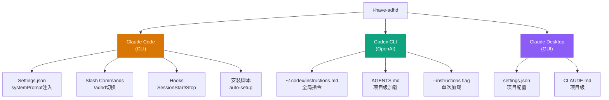
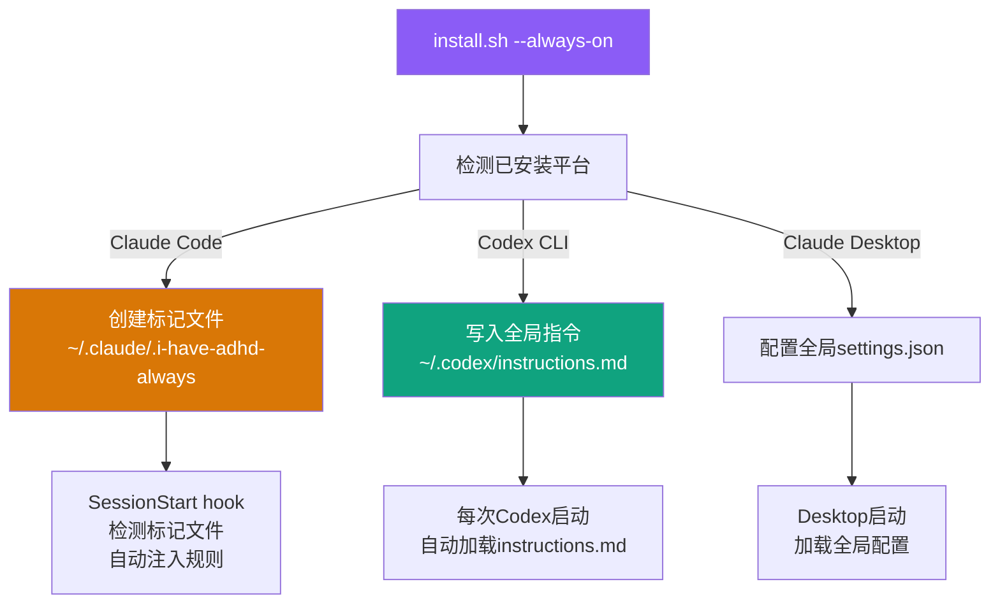

# 多平台集成机制

i-have-adhd 不是绑定单一平台的 Skill，而是通过各 AI 编码工具的配置机制实现跨平台部署。支持三大平台：Claude Code（CLI）、Codex CLI、Claude Desktop。每个平台有不同的配置入口和能力边界，i-have-adhd 通过平台检测自动适配规则输出格式。还提供跨应用 Always-On 模式，一次安装在所有支持的工具中自动启用。

## 设计原理

1. **平台原生配置**：不修改工具源码，通过各平台的官方配置机制（settings.json/hooks/instructions.md）注入规则
2. **自动检测适配**：Skill 启动时检测当前运行平台，调整规则呈现方式
3. **一键安装**：install.sh 脚本自动检测可用平台并配置
4. **Always-On 可选**：用户可以选择跨应用全局启用，也可以按项目启用
5. **评估隔离兼容**：Always-On 模式下的标记文件会导致评估框架的 baseline 条件失效，需特别注意

## 支持平台矩阵



## Claude Code 集成

Claude Code 是 i-have-adhd 的主要目标平台，集成度最高。

### Settings.json 系统提示注入

通过 `~/.claude/settings.json`（全局）或项目级 `.claude/settings.json` 注入系统提示：

```json
{
  "systemPrompt": "You are an ADHD-friendly coding assistant. Follow these rules:\n\n[10条输出规则全文]",
  "permissions": {
    "allow": ["Bash(git:*)", "Read", "Write", "Edit"]
  }
}
```

系统提示注入方式：
- **全局**：`~/.claude/settings.json` → 所有项目生效
- **项目级**：`<project>/.claude/settings.json` → 仅当前项目
- **优先级**：项目级覆盖全局

### Slash Commands（斜杠命令）

注册 `/adhd` 斜杠命令用于快速切换模式：

```
# ~/.claude/commands/adhd.md
---
description: Toggle ADHD-friendly output mode
---
Toggle ADHD-friendly output mode.

When enabled: follow all 10 i-have-adhd output rules.
When disabled: revert to default output style.

Current state: {{ADHD_MODE}}
```

斜杠命令位置：
- 全局：`~/.claude/commands/adhd.md`
- 项目级：`<project>/.claude/commands/adhd.md`

### Session Hooks

Claude Code 支持会话生命周期 hooks，i-have-adhd 利用这些 hooks 实现偏好记忆和进度持久化：

```json
// ~/.claude/settings.json
{
  "hooks": {
    "SessionStart": [
      {
        "command": "~/.claude/hooks/i-have-adhd/session-start.sh"
      }
    ],
    "SessionStop": [
      {
        "command": "~/.claude/hooks/i-have-adhd/session-stop.sh"
      }
    ],
    "PostToolUse": [
      {
        "command": "~/.claude/hooks/i-have-adhd/post-tool.sh"
      }
    ]
  }
}
```

详见 [Session Hooks 机制](session-hooks-mechanism.md)。

### 安装脚本（install.sh）

一键安装脚本自动完成 Claude Code 配置：

```bash
# install.sh 核心流程
1. 检测 Claude Code 是否安装（which claude）
2. 创建 ~/.claude/commands/ 目录（如不存在）
3. 复制 SKILL.md 内容到合适位置
4. 生成 adhd.md 斜杠命令
5. 配置 settings.json systemPrompt
6. 安装 hooks 脚本
7. 询问是否启用 Always-On 模式
```

## Codex CLI 集成

Codex CLI（OpenAI 的编码代理）有不同的配置机制：

### instructions.md 全局指令

Codex CLI 读取 `~/.codex/instructions.md` 作为全局指令文件：

```markdown
# ~/.codex/instructions.md
You are an ADHD-friendly coding assistant. Follow these output rules:

[10条规则的适配版本——针对Codex的输出格式调整]
```

Codex CLI 的指令加载优先级：
1. 命令行 `--instructions <file>` 标志（单次最高优先级）
2. 当前目录 `AGENTS.md`（项目级）
3. `~/.codex/instructions.md`（全局）

### 平台适配差异

Codex CLI 与 Claude Code 的输出能力有差异，规则需要适配：

| 特性 | Claude Code | Codex CLI | 适配策略 |
|------|------------|-----------|---------|
| Markdown 格式 | ✅ 完整支持 | ⚠️ 基本支持 | 减少嵌套格式 |
| 粗体/斜体 | ✅ | ✅ | 保持一致 |
| 折叠/详情 | ✅ | ❌ | Codex 中展开所有内容 |
| Emoji 支持 | ✅ | ✅ | 同样限制使用 |
| Slash Commands | ✅ | ❌ | Codex 中通过自然语言切换 |
| Hooks | ✅ SessionStart/Stop | ⚠️ 有限 | Codex 中仅使用 instructions.md |
| 工具调用确认 | ✅ 交互式 | ⚠️ 沙盒模式 | R10 确认措辞调整 |

### AGENTS.md 项目级加载

对于项目级启用，在项目根目录放置 AGENTS.md（Codex 和 Claude Code 都能识别）：

```markdown
# Project ADHD Mode

This project uses ADHD-friendly output rules.
See: ~/.claude/skills/i-have-adhd/SKILL.md (or inline rules below)

[简化版规则——因为AGENTS.md会常驻上下文，需要精简]
```

## Claude Desktop 集成

Claude Desktop（GUI 应用）通过项目配置加载：

### 项目级 settings.json

```
<project>/
├── .claude/
│   └── settings.json    # Desktop和CLI共用配置
└── CLAUDE.md            # 项目指令
```

### CLAUDE.md

CLAUDE.md 是 Claude 自动加载的项目指令文件，将 i-have-adhd 规则放入其中：

```markdown
# ADHD-Friendly Mode

This project uses ADHD-friendly communication. Key rules:
1. Lead with action, explain after
2. Use numbered steps for multi-step tasks
3. Keep paragraphs ≤ 3 sentences
4. Bold key actions and decisions
5. One task at a time
6. Confirm before destructive operations
```

## Always-On 跨应用模式

Always-On 模式让 i-have-adhd 在所有支持的 AI 工具中全局生效，无需每个项目单独配置。



### 标记文件机制

Claude Code 的 Always-On 通过标记文件 + SessionStart hook 实现：

1. **标记文件**：`~/.claude/.i-have-adhd-always`（空文件，存在即表示启用）
2. **SessionStart hook**：每次会话启动时检查标记文件
3. **自动注入**：如果标记存在，将规则注入系统提示

```bash
# session-start.sh 简化逻辑
if [ -f ~/.claude/.i-have-adhd-always ]; then
    echo "ADHD Always-On mode active"
    # 注入规则到会话上下文
fi
```

### ⚠️ Always-On 与评估框架的冲突

如果使用 anthropics-skills 的 skill-creator 评估框架运行基准测试，Always-On 标记文件会导致规则泄漏到 baseline 条件（无 Skill 对照组），使得对比评估无效——Skill 实际上在和自己比较。

**解决方案**：运行评估前临时禁用 Always-On：

```bash
# 临时禁用
mv ~/.claude/.i-have-adhd-always ~/.claude/.i-have-adhd-always.bak

# 运行评估...

# 评估完成后恢复
mv ~/.claude/.i-have-adhd-always.bak ~/.claude/.i-have-adhd-always
```

## 平台自动检测

Skill 加载时通过环境信号检测当前平台：

```python
def detect_platform() -> str:
    """检测运行平台"""
    # 信号1: 环境变量
    if os.environ.get('CLAUDE_CODE') == '1':
        return 'claude-code'
    if os.environ.get('CODEX_CLI') == '1':
        return 'codex'
    if os.environ.get('CLAUDE_DESKTOP'):
        return 'claude-desktop'

    # 信号2: 进程名
    import psutil
    parent = psutil.Process().parent()
    if parent and 'claude' in parent.name().lower():
        return 'claude-code'
    if parent and 'codex' in parent.name().lower():
        return 'codex'

    # 信号3: 配置文件存在性
    if os.path.exists(os.path.expanduser('~/.claude/settings.json')):
        return 'claude-code'  # 默认假设

    return 'generic'
```

检测结果影响输出格式适配：

| 平台 | R4 短块限制 | 代码块 | 折叠区域 | 确认格式 |
|------|-----------|--------|---------|---------|
| claude-code | ≤3句/段 | 支持 | 支持 | 交互式确认 |
| codex | ≤2句/段 | 支持 | 不支持（展开） | 文本确认 |
| claude-desktop | ≤3句/段 | 支持 | 支持 | GUI确认 |
| generic | ≤3句/段 | 基础 | 不支持 | 通用确认 |

## 安装与启用方式汇总

| 方式 | 范围 | 持久化 | 卸载 |
|------|------|--------|------|
| `/adhd` 斜杠命令 | 当前会话 | 临时 | 再次 `/adhd` 切换 |
| 项目级 settings.json | 当前项目 | 持久 | 删除配置 |
| 项目级 CLAUDE.md/AGENTS.md | 当前项目 | 持久 | 删除文件 |
| Always-On 全局 | 所有项目/所有平台 | 持久 | 运行 uninstall 脚本 |
| `--instructions` flag | 单次运行 | 临时 | 不使用 flag |

## 相关概念

- [十条输出规则](ten-output-rules.md) — 被注入各平台的核心规则内容
- [Session Hooks 机制](session-hooks-mechanism.md) — Claude Code hooks 的详细实现（偏好记忆、进度持久化）
