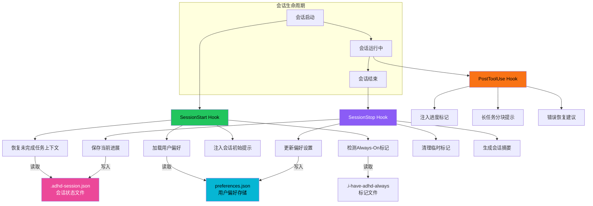
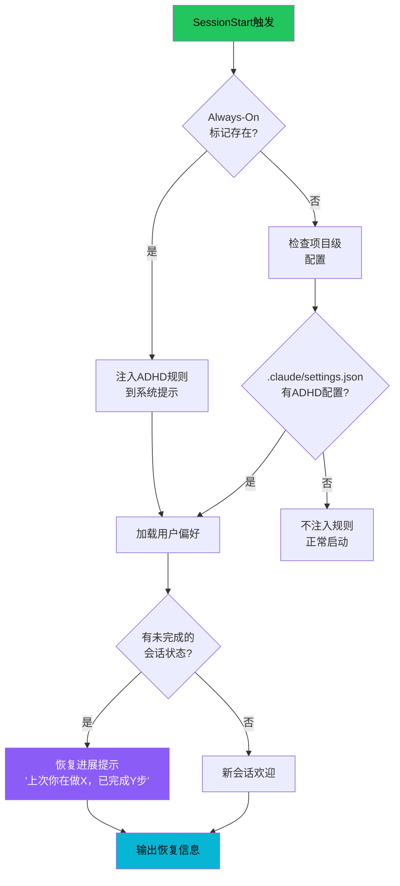
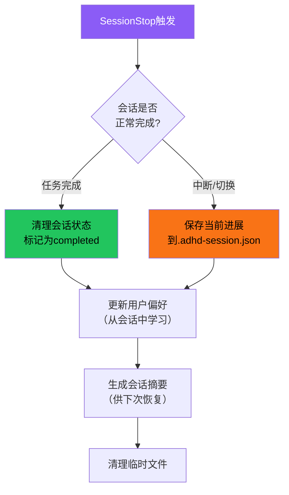

# Session Hooks 机制

i-have-adhd 利用 Claude Code 的 Session Lifecycle Hooks 实现跨会话的状态持久化和偏好记忆。这对于 ADHD 用户尤其重要——他们经常在任务中途被打断、需要在多个会话间恢复上下文、或者对输出风格有个人偏好（如"我需要更详细的解释"或"我喜欢更短的回复"）。Hooks 在会话启动时恢复状态，在会话结束时保存进展，在工具调用后注入进度提示。

## 设计原理

1. **上下文恢复**：ADHD 用户频繁在任务间切换，会话中断后需要快速恢复"我做到哪了"
2. **偏好记忆**：用户对规则的偏好调整（如"代码块可以长一点"）应该跨会话持久化，不用每次重新设置
3. **中断恢复**：意外中断（Ctrl+C、网络断开、IDE 崩溃）后不应丢失进展
4. **轻量存储**：偏好和状态用 JSON 文件存储，不依赖数据库或外部服务
5. **非侵入式**：Hooks 不修改 Claude Code 的核心行为，只在生命周期节点注入额外信息

## Hooks 架构总览



## Hook 配置

在 `~/.claude/settings.json` 中注册 hooks：

```json
{
  "hooks": {
    "SessionStart": [
      {
        "command": "~/.claude/hooks/i-have-adhd/session-start.sh",
        "timeout": 5000
      }
    ],
    "SessionStop": [
      {
        "command": "~/.claude/hooks/i-have-adhd/session-stop.sh",
        "timeout": 5000
      }
    ],
    "PostToolUse": [
      {
        "matcher": "*",
        "command": "~/.claude/hooks/i-have-adhd/post-tool.sh",
        "timeout": 3000
      }
    ]
  }
}
```

| Hook | 触发时机 | 超时 | 用途 |
|------|---------|------|------|
| SessionStart | 会话创建后、第一条用户消息前 | 5s | 状态恢复、偏好加载 |
| SessionStop | 会话正常结束前 | 5s | 进展保存、偏好持久化 |
| PostToolUse | 每次工具调用完成后 | 3s | 进度提示、分块检查 |

## SessionStart Hook

会话启动时执行，负责恢复之前的状态和设置。

### 执行流程



### Always-On 检测

```bash
# session-start.sh 核心逻辑
ALWAYS_MARKER="$HOME/.claude/.i-have-adhd-always"
PROJECT_CONFIG=".claude/settings.json"

if [ -f "$ALWAYS_MARKER" ]; then
    # 全局 Always-On 启用
    echo "HOOK:ADHD_ALWAYS_ON=true"
    # 注入规则路径
    echo "HOOK:ADHD_RULES_PATH=$HOME/.claude/skills/i-have-adhd/SKILL.md"
elif grep -q "adhd" "$PROJECT_CONFIG" 2>/dev/null; then
    # 项目级配置启用
    echo "HOOK:ADHD_PROJECT_MODE=true"
fi
```

Hook 通过 stdout 向 Claude Code 传递信息，Claude Code 将 hook 输出注入到会话上下文中。

### 偏好加载

从 `~/.claude/i-have-adhd-preferences.json` 加载用户偏好：

```json
{
  "version": 1,
  "preferences": {
    "detail_level": "balanced",
    "max_paragraph_sentences": 3,
    "max_list_items": 5,
    "emoji_level": "minimal",
    "code_block_max_lines": 30,
    "confirm_destructive": true,
    "auto_progress_markers": true,
    "explanation_mode": "after_action",
    "language": "zh"
  },
  "custom_overrides": {
    "code_block_max_lines": 50,
    "explanation_mode": "before_action"
  }
}
```

### 会话上下文恢复

如果存在 `.adhd-session.json` 且标记为未完成，注入恢复提示：

```json
{
  "session_id": "2026-08-22T14-30-00",
  "project_path": "/home/user/projects/my-app",
  "task": "修复用户登录bug",
  "status": "in_progress",
  "current_step": 3,
  "total_steps": 5,
  "completed_steps": [
    "1. 复现了登录失败问题",
    "2. 定位到auth.ts第87行token过期检查逻辑"
  ],
  "current_focus": "修复refresh token的过期时间判断",
  "next_actions": [
    "修改expiry比较逻辑（应该用<而非<=）",
    "添加单元测试",
    "验证修复"
  ],
  "open_files": ["src/auth.ts", "src/__tests__/auth.test.ts"],
  "interrupted_at": "2026-08-22T15:45:00Z",
  "interrupt_reason": "user_requested_switch"
}
```

恢复时注入的提示格式：

```
📋 **恢复上次会话**
你之前在修复"用户登录bug"（步骤 3/5）
- ✅ 已完成：复现问题、定位到auth.ts
- ⏳ 当前：修复refresh token过期时间判断
- ⬜ 下一步：修改比较逻辑 → 添加测试 → 验证

要继续吗？还是开始新任务？
```

## PostToolUse Hook

每次工具调用完成后触发，主要用于进度跟踪和长任务分块。

### 进度标记注入

在连续多步工具调用后，自动注入进度提醒：

```bash
# post-tool.sh 核心逻辑
# 追踪连续工具调用次数
TOOL_COUNT_FILE="/tmp/adhd-tool-count-$$"
count=$(cat "$TOOL_COUNT_FILE" 2>/dev/null || echo 0)
count=$((count + 1))
echo "$count" > "$TOOL_COUNT_FILE"

if [ $count -ge 3 ]; then
    # 连续3+次工具调用后注入进度提醒
    echo "HOOK:PROGRESS_CHECK — You've been running $count tools in sequence."
    echo "Consider summarizing progress and confirming next step with the user."
    echo 0 > "$TOOL_COUNT_FILE"  # 重置计数
fi
```

### 长任务分块检查

检测是否在执行超过一定步数的连续任务，提醒拆分：

```bash
# 如果Edit/Write操作涉及大文件修改（>50行变更），注入提醒
if echo "$TOOL_OUTPUT" | grep -q "replaced.*lines"; then
    lines_changed=$(echo "$TOOL_OUTPUT" | grep -oP 'replaced \K\d+')
    if [ "$lines_changed" -gt 50 ]; then
        echo "HOOK:LARGE_EDIT — Changed $lines_changed lines."
        echo "Consider summarizing what changed for the user (R1: action first)."
    fi
fi
```

### 错误恢复提示

工具调用失败时注入 ADHD 友好的错误提示建议：

```bash
if [ "$TOOL_EXIT_CODE" != "0" ]; then
    echo "HOOK:ERROR_OCCURRED"
    echo "Remember: state the problem plainly (R3), suggest 1-2 fixes (R9),"
    echo "don't lecture the user."
fi
```

## SessionStop Hook

会话结束时执行，保存进展和更新偏好。

### 执行流程



### 进展保存

会话被中断（非任务完成）时，自动保存当前状态到 `.adhd-session.json`：

```bash
# session-stop.sh 核心逻辑
SESSION_FILE=".adhd-session.json"

# 如果任务未完成，保存状态
if [ "$TASK_COMPLETED" != "true" ]; then
    cat > "$SESSION_FILE" << EOF
{
  "session_id": "$SESSION_ID",
  "project_path": "$PWD",
  "task": "$CURRENT_TASK",
  "status": "in_progress",
  "current_step": $CURRENT_STEP,
  "total_steps": $TOTAL_STEPS,
  "completed_steps": $COMPLETED_STEPS_JSON,
  "current_focus": "$CURRENT_FOCUS",
  "next_actions": $NEXT_ACTIONS_JSON,
  "interrupted_at": "$(date -u +%Y-%m-%dT%H:%M:%SZ)",
  "interrupt_reason": "session_end"
}
EOF
fi
```

### 偏好持久化

会话中用户通过自然语言表达的偏好调整被自动提取并保存：

```
用户说："代码块可以长一点，50行没问题"
→ PostToolUse 或 SessionStop 检测到偏好信号
→ 更新 custom_overrides: {"code_block_max_lines": 50}

用户说："不用每次都解释为什么，直接告诉我怎么做"
→ 更新 custom_overrides: {"explanation_mode": "minimal"}
```

偏好更新遵循显式确认原则：只有用户明确表达的偏好才被持久化，不基于单次行为推断。

### 会话摘要生成

会话结束时自动生成简短摘要，供下次恢复时使用：

```markdown
# Session Summary: 2026-08-22T14-30-00

## Task
修复用户登录时 refresh token 过期导致的 401 错误

## Progress
- Steps 1-2/5 completed
- Root cause identified: auth.ts line 87 uses <= instead of < for expiry check
- Fix drafted but not tested

## Files Modified
- src/auth.ts (partial edit)

## Open Questions
- None

## Next Steps
1. Fix the comparison operator
2. Add unit test for edge case (token exactly at expiry)
3. Run test suite
4. Verify with manual login test
```

## 存储文件清单

| 文件 | 位置 | 用途 | 生命周期 |
|------|------|------|---------|
| Always-On 标记 | `~/.claude/.i-have-adhd-always` | 全局启用标志 | 安装时创建，卸载时删除 |
| 用户偏好 | `~/.claude/i-have-adhd-preferences.json` | 持久化用户偏好设置 | 长期，跨项目 |
| 会话状态 | `<project>/.adhd-session.json` | 当前项目的未完成任务状态 | 任务完成后清理 |
| 会话摘要 | `<project>/.adhd-session-summary.md` | 上次会话的可读摘要 | 新会话启动后保留7天 |
| Hook 脚本 | `~/.claude/hooks/i-have-adhd/*.sh` | 生命周期钩子脚本 | 安装时部署 |
| Tool 计数 | `/tmp/adhd-tool-count-$$` | PostToolUse 连续调用计数 | 会话结束时清理 |

## 偏好设置的完整结构

```typescript
interface ADHDPreferences {
  version: number;
  preferences: {
    /** 解释详细度：minimal/balanced/detailed */
    detail_level: 'minimal' | 'balanced' | 'detailed';
    /** 每段最大句子数（R4） */
    max_paragraph_sentences: number;
    /** 每个列表最大项数（R4） */
    max_list_items: number;
    /** Emoji使用：none/minimal/normal */
    emoji_level: 'none' | 'minimal' | 'normal';
    /** 代码块最大行数（R4） */
    code_block_max_lines: number;
    /** 破坏性操作确认（R10） */
    confirm_destructive: boolean;
    /** 自动进度标记（R7） */
    auto_progress_markers: boolean;
    /** 解释位置：before_action/after_action/minimal */
    explanation_mode: 'before_action' | 'after_action' | 'minimal';
    /** 输出语言 */
    language: string;
  };
  /** 用户覆盖的偏好（优先级高于preferences） */
  custom_overrides: Partial<ADHDPreferences['preferences']>;
  /** 更新时间 */
  updated_at: string;
}
```

## 相关概念

- [十条输出规则](ten-output-rules.md) — Hooks 帮助执行和记忆的规则集
- [多平台集成机制](multi-platform-integration.md) — Hooks 是 Claude Code 平台特有的集成方式
