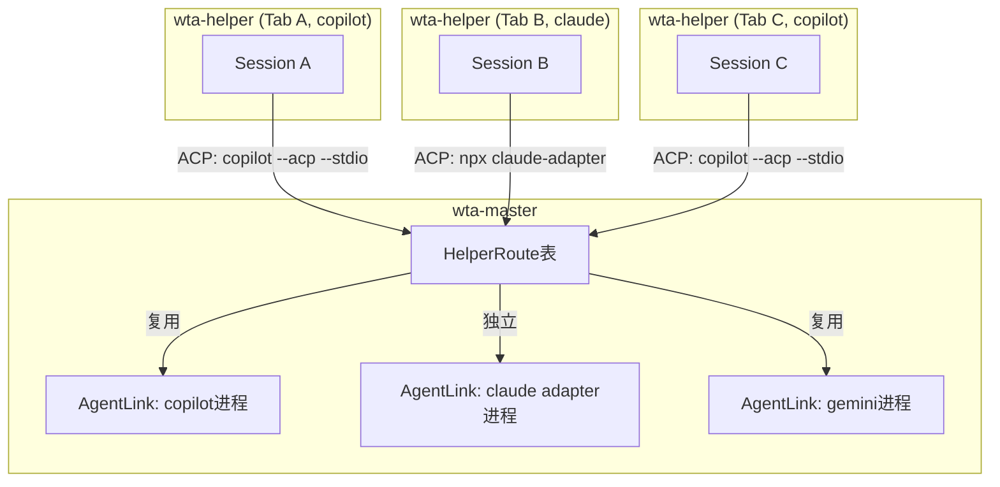

## 概述

Agent 注册表是 wta（Rust 端）维护的**单一事实来源**，统一管理所有支持的 Agent CLI 的可执行文件解析、ACP 服务标志、delegate 模式 prompt 传递方式、显示名称、模型选择和认证流程。添加新 Agent 只需在 `KNOWN_AGENTS` 表中添加一个条目，无需修改其他代码。

注册表位于 `tools/wta/src/agent_registry.rs`，是 wta-master 和 wta-helper 共用的核心模块。

## AgentProfile 结构

`AgentProfile` 结构体包含一个 Agent 的完整配置：

```rust
// tools/wta/src/agent_registry.rs:29-81
#[derive(Debug, Clone)]
pub struct AgentProfile {
    // 标识
    pub id: &'static str,                          // 短小写标识符，如 "copilot"
    pub display_name: &'static str,                // 人类可读显示名，如 "GitHub Copilot"

    // CLI 解析
    pub exe_search_order: &'static [&'static str], // PATH 搜索时的扩展名优先级

    // ACP 服务模式
    pub acp_flags: &'static [&'static str],        // 进入 ACP 模式的 flags，如 ["--acp", "--stdio"]
    pub acp_launch_command: &'static str,          // 覆盖命令（adapter 模式），如 "npx -y @agentclientprotocol/claude-agent-acp"
    pub acp_model_flags: &'static [&'static str],  // ACP 模式下的模型选择 flags
    pub acp_auth_flow: AcpAuthFlow,                // ACP 认证方式

    // Delegate 模式
    pub delegate_prompt_flag: PromptFlag,          // delegate 模式下如何传递初始 prompt

    // 模型选择
    pub model_flags: &'static [&'static str],      // 交互式模型 flags，如 ["--model", "-m"]

    // 安装/认证提示
    pub install_hint: &'static str,                // 未安装时的安装提示
    pub install_url: &'static str,                 // 安装文档 URL
    pub auth_check_command: &'static str,          // 认证检查命令（exit 0 = 已认证）
    pub auth_hint: &'static str,                   // 未登录时的认证提示

    // 会话管理
    pub resume_flag: &'static str,                 // 恢复会话的 flag，如 "--resume"
    pub new_session_id_flag: Option<&'static str>, // 新会话指定 ID 的 flag，如 "--session-id"
}
```

### 枚举类型

```rust
// tools/wta/src/agent_registry.rs:10-27

/// Delegate 模式下 prompt 的传递方式
pub enum PromptFlag {
    Flag(&'static str),  // Flag + prompt 字符串，如 `-i "prompt"` (copilot)
    Positional,          // 裸位置参数，如 `codex "prompt"` (claude/codex/gemini)
}

/// ACP 认证流程
pub enum AcpAuthFlow {
    None,       // 不支持 ACP（仅 delegate 模式）
    External,   // ACP 支持，外部认证（如 gh auth login、copilot /login）
    InProtocol, // ACP 支持，协议内 OAuth/API-key 认证（如 gemini）
}
```

## 内置 Agent 配置

`KNOWN_AGENTS` 静态数组定义了 5 个内置 Agent：

### 1. GitHub Copilot（默认）

```rust
AgentProfile {
    id: "copilot",
    display_name: "GitHub Copilot",
    exe_search_order: &[".exe", ".cmd"],
    acp_flags: &["--acp", "--stdio"],
    acp_launch_command: "",                       // 原生 ACP 支持
    acp_model_flags: &["--model", "-m"],
    acp_auth_flow: AcpAuthFlow::External,
    delegate_prompt_flag: PromptFlag::Flag("-i"), // `copilot -i "prompt"`
    model_flags: &["--model", "-m"],
    install_hint: "npm install -g @github/copilot",
    install_url: "https://github.com/github/copilot-cli",
    auth_check_command: "",
    auth_hint: "Run 'copilot' to launch the CLI, then type /login to sign in.",
    resume_flag: "--resume",
    new_session_id_flag: Some("--session-id"),
}
```

- **原生 ACP 支持**：`copilot --acp --stdio` 直接启动 ACP 服务
- **Delegate 模式**：使用 `-i` flag 传递 prompt
- **认证**：外部认证（运行 copilot 后 /login）
- **默认 Agent**：`acpAgent` 和 `delegateAgent` 设置默认值均为 `"copilot"`
- **默认 ACP 命令**：`const DEFAULT_ACP_COMMAND = "copilot --acp --stdio"`

### 2. Claude（via ACP Adapter）

```rust
AgentProfile {
    id: "claude",
    display_name: "Claude",
    acp_flags: &[],                               // Claude CLI 本身不支持 ACP
    acp_launch_command: "npx -y @agentclientprotocol/claude-agent-acp",
    acp_model_flags: &[],
    acp_auth_flow: AcpAuthFlow::External,
    delegate_prompt_flag: PromptFlag::Positional, // `claude "prompt"`
    resume_flag: "--resume",
    new_session_id_flag: Some("--session-id"),
    install_hint: "npm install -g @anthropic-ai/claude-code",
    auth_hint: "Run: claude login",
}
```

- **Adapter 模式**：Claude CLI 原生不支持 ACP，通过 npx 启动 `@agentclientprotocol/claude-agent-acp` 适配器包
- **模型选择**：Adapter 不接受命令行 `--model`，模型通过 ACP `setSessionModel` 方法在握手后发送
- **认证**：`claude login` 外部认证

### 3. Codex（via ACP Adapter，版本锁定）

```rust
AgentProfile {
    id: "codex",
    display_name: "Codex",
    acp_flags: &[],
    acp_launch_command: "npx -y @agentclientprotocol/codex-acp@1.1.4",  // 版本锁定
    acp_model_flags: &[],
    acp_auth_flow: AcpAuthFlow::External,
    delegate_prompt_flag: PromptFlag::Positional,
    resume_flag: "resume",                        // 子命令形式：codex resume <uuid>
    new_session_id_flag: None,
    install_hint: "npm install -g @openai/codex",
    auth_hint: "Run: codex auth (or set OPENAI_API_KEY)",
}
```

- **版本锁定**：`@1.1.4` 确保 npm 新发布版本不会破坏启动
- **Resume 是子命令**：`codex resume <session-id>` 而非 `--resume <id>`，命令合成模板 `format!("{cli} {flag} {key}")` 直接产出正确命令
- **不支持 new_session_id**：Codex 没有 caller 选择 session ID 的机制
- **认证**：`codex auth` 或 `OPENAI_API_KEY` 环境变量

### 4. Gemini（实验性 ACP）

```rust
AgentProfile {
    id: "gemini",
    display_name: "Gemini",
    acp_flags: &["--experimental-acp"],
    acp_launch_command: "",
    acp_model_flags: &["--model", "-m"],
    acp_auth_flow: AcpAuthFlow::InProtocol,       // 协议内认证
    delegate_prompt_flag: PromptFlag::Positional,
    resume_flag: "--resume",
    new_session_id_flag: Some("--session-id"),
    install_hint: "npm install -g @google/gemini-cli",
    auth_hint: "Authentication is handled in-protocol during connection.",
}
```

- **实验性 ACP**：使用 `--experimental-acp` flag
- **协议内认证**：ACP 握手过程中完成 OAuth/API-key 认证，无需外部 auth 命令

### 5. OpenCode

```rust
AgentProfile {
    id: "opencode",
    display_name: "OpenCode",
    acp_flags: &["acp"],                          // `opencode acp` 子命令
    acp_launch_command: "",
    acp_model_flags: &[],                         // ACP 模式通过协议设置模型
    acp_auth_flow: AcpAuthFlow::External,
    delegate_prompt_flag: PromptFlag::Flag("--prompt"), // `opencode --prompt "prompt"`
    model_flags: &["--model", "-m"],
    resume_flag: "--session",
    new_session_id_flag: None,
    install_hint: "npm install -g opencode-ai",
    auth_hint: "Run: opencode auth login",
}
```

- **ACP 通过子命令**：`opencode acp`（非 flag 形式）
- **Delegate prompt**：`--prompt` flag
- **Resume flag**：`--session`（不同于其他 Agent 的 `--resume`）

### 配置对比表

| Agent | ID | ACP 方式 | Delegate prompt | 认证 | Resume | new_session_id |
|-------|----|---------|----------------|------|--------|----------------|
| Copilot | `copilot` | `--acp --stdio`（原生） | `-i` flag | External | `--resume` | `--session-id` |
| Claude | `claude` | npx adapter | Positional | External | `--resume` | `--session-id` |
| Codex | `codex` | npx adapter @1.1.4 | Positional | External | `resume`（子命令） | ❌ |
| Gemini | `gemini` | `--experimental-acp`（原生） | Positional | InProtocol | `--resume` | `--session-id` |
| OpenCode | `opencode` | `acp`（子命令） | `--prompt` flag | External | `--session` | ❌ |

## DEFAULT_PROFILE

未知/自定义 Agent 使用 `DEFAULT_PROFILE` 作为兜底：

```rust
pub const DEFAULT_PROFILE: AgentProfile = AgentProfile {
    id: "unknown",
    display_name: "Agent",
    exe_search_order: &[".exe", ".cmd"],
    acp_flags: &[],
    acp_launch_command: "",
    acp_model_flags: &[],
    acp_auth_flow: AcpAuthFlow::None,              // 不支持 ACP
    delegate_prompt_flag: PromptFlag::Flag("-i"),
    model_flags: &["--model", "-m"],
    install_hint: "",
    install_url: "",
    auth_check_command: "",
    auth_hint: "",
    resume_flag: "",
    new_session_id_flag: None,
};
```

## 查找函数

### lookup_profile

按可执行文件名查找 AgentProfile，自动剥离路径分隔符和扩展名：

```rust
pub fn lookup_profile(executable: &str) -> &'static AgentProfile {
    let basename = executable
        .rsplit(|ch: char| ch == '\\' || ch == '/')
        .next()
        .unwrap_or(executable);
    let lower = basename.to_ascii_lowercase();
    let normalized = lower
        .strip_suffix(".exe")
        .or_else(|| lower.strip_suffix(".cmd"))
        .or_else(|| lower.strip_suffix(".bat"))
        .unwrap_or(&lower);
    KNOWN_AGENTS.iter().find(|p| p.id == normalized).unwrap_or(&DEFAULT_PROFILE)
}
```

输入示例：`"C:\\Tools\\copilot.exe"` → 规范化为 `"copilot"` → 匹配 Copilot profile。

### lookup_profile_by_id

按 id 直接查找：

```rust
pub fn lookup_profile_by_id(id: &str) -> &'static AgentProfile {
    KNOWN_AGENTS.iter().find(|p| p.id == id).unwrap_or(&DEFAULT_PROFILE)
}
```

### is_known_id

判断 id 是否为已知 Agent（区分于 DEFAULT_PROFILE）：

```rust
pub fn is_known_id(id: &str) -> bool {
    KNOWN_AGENTS.iter().any(|p| p.id == id)
}
```

> 优先使用 `is_known_id` 而非 `lookup_profile_by_id(id).id != DEFAULT_PROFILE.id`，因为前者直接检查成员资格，与 DEFAULT_PROFILE 解耦。

### resolve_agent_id_from_cmd

从完整命令行推断规范 Agent ID，处理三种输入形式：

```rust
pub fn resolve_agent_id_from_cmd(agent_cmd: &str) -> &'static str {
    // 1. 裸名+flags: "copilot --acp --stdio" → "copilot"
    // 2. Adapter 启动: "npx -y @agentclientprotocol/claude-agent-acp" → "claude"
    // 3. 完整路径: "C:\\Tools\\copilot.exe --acp --stdio" → "copilot"
    // 空/空白返回 "unknown"
}
```

## ACP 命令构建

### build_acp_command

从 agent id 和可选模型构建完整的 ACP 启动命令：

```rust
// tools/wta/src/agent_registry.rs:321-343
pub fn build_acp_command(agent_id: &str, model: Option<&str>) -> String {
    let profile = lookup_profile_by_id(agent_id);

    // Adapter 模式：返回 acp_launch_command，忽略 model（adapter 通过 ACP 协议设置模型）
    if !profile.acp_launch_command.is_empty() {
        return profile.acp_launch_command.to_string();
    }

    // 原生模式：id + acp_flags + [acp_model_flags[0] + model]
    let mut parts = vec![agent_id.to_string()];
    for flag in profile.acp_flags {
        parts.push(flag.to_string());
    }
    if let Some(model) = model {
        if let Some(flag) = profile.acp_model_flags.first() {
            parts.push(flag.to_string());
            parts.push(model.to_string());
        }
    }
    parts.join(" ")
}
```

示例：
- `build_acp_command("copilot", Some("gpt-5"))` → `"copilot --acp --stdio --model gpt-5"`
- `build_acp_command("copilot", None)` → `"copilot --acp --stdio"`
- `build_acp_command("claude", None)` → `"npx -y @agentclientprotocol/claude-agent-acp"`（忽略 model）
- `build_acp_command("gemini", Some("gemini-2.5-pro"))` → `"gemini --experimental-acp --model gemini-2.5-pro"`

### ACP 启动命令别名（向后兼容）

```rust
const ACP_LAUNCH_COMMAND_ALIASES: &[(&str, &str)] = &[
    ("npx -y @agentclientprotocol/codex-acp", "codex"),          // 无版本号
    ("npx -y @zed-industries/codex-acp", "codex"),                // 旧包名（已弃用）
];
```

这些别名用于 `resolve_agent_id_from_cmd` 识别旧命令行为 Codex，保持运行时兼容性。

## 多 Agent CLI 支持

master 通过 `AgentCmdKey`（即完整 ACP 命令行字符串）区分不同的 Agent CLI 进程。每个 helper 在 `initialize` 握手的 `_meta.wta.agent_id` 中声明自己的 agent id，master 首次需要时通过 `build_acp_command` 构建命令并 spawn 对应 CLI，后续使用相同 agent 的 helper 复用同一 CLI 进程。



这允许同一窗口中不同 Tab 使用不同 Agent：Tab A 用 Copilot、Tab B 用 Claude、Tab C 复用 Copilot 进程。

## GPO 过滤（企业策略）

C++ 宿主端通过 Group Policy (GPO) 控制可用 Agent 列表。GPO 可以：
- 限制允许的 Agent 列表（白名单）
- 禁用特定 Agent
- 设置默认 Agent

设置系统中 `acpAgent` 和 `delegateAgent` 字段在 GPO 覆盖下会被替换为策略允许的值。当 GPO 策略禁止某个 Agent 时，即使设置文件中配置了该 Agent，UI 和 wta 都将其视为不可用。

## Delegate 命令构建

Delegate 模式（命令面板 `?<prompt>`、自动 autofix 委托）使用 `delegate_prompt_flag` 构建启动命令：

```rust
// 伪代码：构建 delegate 命令
fn build_delegate_command(profile: &AgentProfile, prompt: &str) -> String {
    match profile.delegate_prompt_flag {
        PromptFlag::Flag(f) => format!("{} {} {}", profile.id, f, shell_quote(prompt)),
        PromptFlag::Positional => format!("{} {}", profile.id, shell_quote(prompt)),
    }
}
```

示例：
- Copilot: `copilot -i "explain this error"`
- Claude: `claude "explain this error"`
- Codex: `codex "explain this error"`
- Gemini: `gemini "explain this error"`
- OpenCode: `opencode --prompt "explain this error"`

## PATH 刷新

spawn master 前调用 `WtaProcess::RefreshProcessPath()` 从注册表刷新系统+用户 PATH，确保新安装的 CLI（如 WinGet Links 目录下的 `copilot.exe`）可被子进程发现。这解决了 WT 启动时 PATH 中没有新安装 CLI 的问题。

## 源码链接

| 文件 | 关键内容 |
|------|---------|
| [agent_registry.rs](file:///d:/spaces/SpecWeave/external/libs/models/ai/intelligent-terminal/tools/wta/src/agent_registry.rs) | AgentProfile、KNOWN_AGENTS、build_acp_command、resolve_agent_id_from_cmd |
| [session_watcher/](file:///d:/spaces/SpecWeave/external/libs/models/ai/intelligent-terminal/tools/wta/src/session_watcher/) | CLI 会话分类器（classify_claude/codex/copilot/gemini） |
| [wt-agent-hooks/](file:///d:/spaces/SpecWeave/external/libs/models/ai/intelligent-terminal/tools/wta/wt-agent-hooks/) | 各 Agent 的 hooks 配置 |
