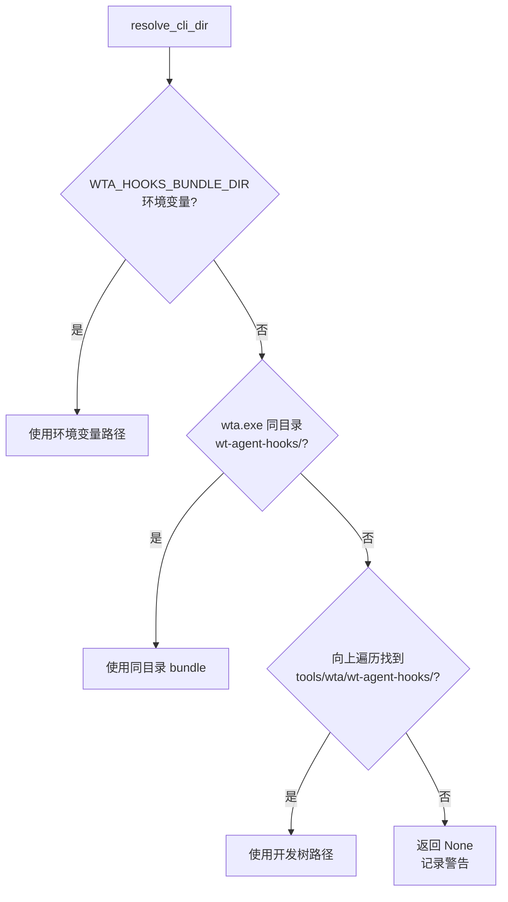
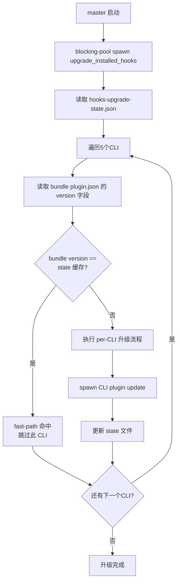
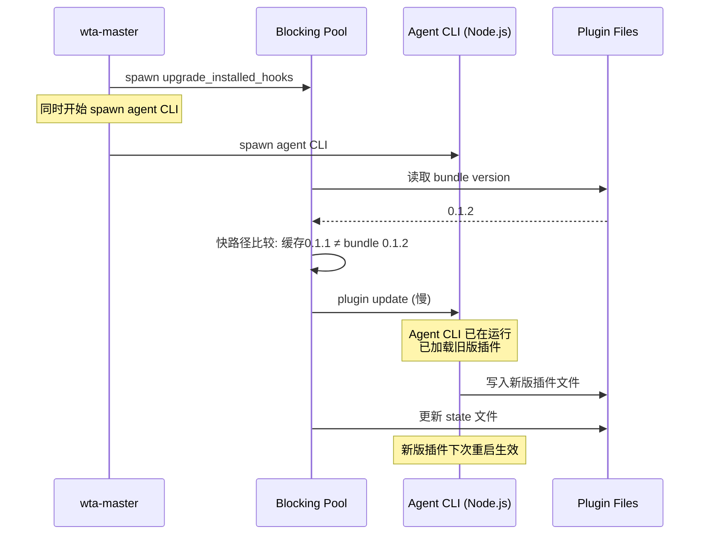

## 概述

**wt-agent-hooks** 是捆绑在 Intelligent Terminal 中的 Agent CLI 插件系统。它为每个支持的 Agent CLI（copilot/claude/codex/gemini/opencode）安装一个轻量 PowerShell 桥接脚本（`send-event.ps1`），通过 CLI 的 hook 系统将 Agent 的生命周期事件（session 启动、prompt 提交、响应接收、tool 调用等）回传给 wta-helper，进而驱动 Terminal 中的 session 管理 UI、autofix 状态和 agent 状态栏更新。

自动升级机制确保 IT（Intelligent Terminal）安装/升级后，已安装 hooks 的 CLI 自动获得最新版本的插件，无需用户手动操作。

## 为什么需要 Hooks

wta 的 pane 注册表仅在收到 COM 服务器广播的 `agent_event` 时才将会话从 IDLE 状态转移出来。这些事件源自一个小型 PowerShell 桥接脚本（`send-event.ps1`），由 CLI 通过其 hook 系统调用。如果用户未安装插件，CLI 永远不会调用桥接脚本，注册表保持为空，session 管理列表看起来像是冻结的——UI 无法知道 agent 在做什么。

```
Agent CLI → hook → send-event.ps1 → wtcli send-event → COM → wta-helper → UI 更新
```

## wt-agent-hooks 插件结构

插件捆绑在 `tools/wta/wt-agent-hooks/` 下，每个 CLI 有独立子目录。MSIX 包将此目录放置在 `wta.exe` 旁边，运行时安装器直接将 per-CLI 子目录交给对应 CLI 的 marketplace 命令。

### 目录结构

```
tools/wta/wt-agent-hooks/
├── claude/                                    # claude plugin marketplace add 的源目录
│   ├── .claude-plugin/marketplace.json
│   └── wt-agent-hooks/                        # Claude 复制的插件文件夹
│       ├── .claude-plugin/plugin.json
│       └── hooks/
│           ├── hooks.json                     # hook 注册（哪些事件触发 send-event.ps1）
│           └── send-event.ps1                 # PowerShell 桥接脚本
├── copilot/                                   # copilot plugin marketplace add 的源目录
│   └── (结构同 claude/，仅 hooks.json 的 CliSource 不同: -CliSource copilot)
├── codex/                                     # codex plugin marketplace add 的源目录
│   ├── .agents/plugins/marketplace.json       # Codex 强制要求的 sentinel 位置
│   └── wt-agent-hooks/
│       ├── .codex-plugin/plugin.json
│       └── hooks/{hooks.json,send-event.ps1}
├── gemini-extension/                          # gemini extensions install 的源目录
│   ├── gemini-extension.json
│   └── hooks/{hooks.json,send-event.ps1}
└── opencode/                                  # opencode 插件
    ├── plugin.json
    └── wt-agent-hooks.js                      # JS 桥接（opencode 使用 JS 插件）
```

### 关键常量

```rust
// tools/wta/src/agent_hooks_installer.rs:115-141
const WTA_TAG: &str = "wt-agent-hooks";                    // 所有 hook 条目的标签
const PLUGIN_NAME: &str = "wt-agent-hooks";                // 插件名（必须匹配 plugin.json 的 name）
const MARKETPLACE_NAME: &str = "wt-local";                 // Marketplace 标识（kebab-case）
const GEMINI_EXTENSION_DIR_NAME: &str = "wt-agent-hooks";  // Gemini ~/.gemini/extensions/ 下的目录名
```

> **注意**：`MARKETPLACE_NAME` 使用 `wt-local`（kebab-case）而非旧版的 `_direct`，因为 Copilot CLI 的 marketplace 名称验证器只接受字母、数字和连字符，下划线会导致插件加载失败。

### Bundle 路径解析

`bundle::resolve_cli_dir` 在启动时按以下优先级查找 bundle 目录：



1. **`WTA_HOOKS_BUNDLE_DIR` 环境变量**：显式覆盖（最高优先级，用于分销商在不重建 wta 的情况下修补 bundle）
2. **`<wta.exe 目录>/wt-agent-hooks/`**：MSIX 部署场景
3. **开发树回退**：向上遍历 `current_exe()` 的父目录查找 `tools/wta/wt-agent-hooks/`，用于 `cargo build` 直接运行

> **设计决策**：没有内嵌 fallback。打包版本中如果 `wta.exe` 旁边缺少 bundle 目录，这是构建/部署 bug，应该大声暴露而不是用过期的内置副本掩盖。

### send-event.ps1 桥接脚本

每个 CLI 的 hooks 目录包含 `send-event.ps1`，这是 PowerShell 脚本，职责是：
1. 接收 CLI hook 传入的事件数据（session ID、事件类型、上下文等）
2. 调用 `wtcli send-event` 将事件作为 JSON 通过 COM 发送到 Windows Terminal
3. 不做复杂处理，保持最小依赖（纯 PowerShell，无额外模块）

`hooks.json` 声明哪些 hook 事件触发 `send-event.ps1`，每个 CLI 的 hooks.json 内容不同（因为不同 CLI 的 hook 系统暴露的事件不同）。

## CLI 安装命令

每个 CLI 通过自己的 plugin marketplace/extension 命令注册，**绝不直接编辑 CLI 的配置文件**（直接编辑需要重新序列化 JSONC 文件，会静默剥离头部注释和未知字段）。

| CLI | 安装命令 |
|-----|---------|
| Claude | `claude plugin marketplace add <bundle>/claude` + `claude plugin install wt-agent-hooks@wt-local` |
| Copilot | `copilot plugin marketplace add <bundle>/copilot` + `copilot plugin install wt-agent-hooks@wt-local` |
| Codex | `codex plugin marketplace add <bundle>/codex` + `codex plugin install wt-agent-hooks@wt-local` |
| Gemini | `gemini extensions install <bundle>/gemini-extension` |
| OpenCode | `opencode plugin install <bundle>/opencode` |

### Claude 遗留清理

早期 wta 版本直接在 `~/.claude/settings.json` 中写入 wta 标记的 `hooks` 块。每次启动时，在调用 `claude plugin install` 之前先清除该遗留块，防止重复 hook 条目触发多次事件。

## 自动升级机制

`upgrade_installed_hooks()` 在每次 `wta-master` 启动时在 blocking-pool 线程上运行。它将更新后的 `wt-agent-hooks` bundle 重新交付给用户已 opt-in 的 CLI。

### 核心原则

- **仅 opt-in**：只对已安装了 `wt-agent-hooks` 的 CLI 执行升级，**从不**对未接受的 CLI 自动安装
- **Disabled 跳过**：如果用户在 CLI 中显式禁用了插件，升级时跳过（尊重用户选择）
- **版本比较**：installed_version >= bundle_version 时跳过
- **Best-effort**：所有 spawn 都是 best-effort，失败（如 CLI 不在 PATH、"marketplace already added"）只记录 warn/info 日志，**不崩溃启动**

### Bundle 版本快路径

升级的主要开销是 spawn `claude plugin list --json` 等 CLI 命令（Node.js 冷启动约 1-2 秒）。为了让常见的"无升级"场景几乎零成本，使用状态文件缓存每个 CLI 的 bundle 版本号。

```
%LOCALAPPDATA%\Packages\<PFN>\LocalCache\Local\IntelligentTerminal\hooks-upgrade-state.json
{
  "copilot": "0.1.1",
  "claude": "0.1.1",
  "gemini": "0.1.1"
}
```



快路径开销：仅文件 IO（读取 bundle 的 plugin.json + state 文件），<5ms。
慢路径开销：spawn Node.js CLI 执行 plugin update，1-2 秒（仅在 bundle 版本变化时触发）。

### Version 解析

使用严格的 SemVer `MAJOR.MINOR.PATCH` 解析：

```rust
// tools/wta/src/agent_hooks_installer.rs:3301-3330
#[derive(Debug, Clone, Copy, PartialEq, Eq, PartialOrd, Ord)]
struct Version { major: u64, minor: u64, patch: u64 }

impl std::str::FromStr for Version {
    fn from_str(s: &str) -> Result<Self, ()> {
        let mut parts = s.split('.');
        let major = parts.next().ok_or(())?.parse::<u64>().map_err(|_| ())?;
        let minor = parts.next().ok_or(())?.parse::<u64>().map_err(|_| ())?;
        let patch = parts.next().ok_or(())?.parse::<u64>().map_err(|_| ())?;
        if parts.next().is_some() { return Err(()); }  // 拒绝4段版本
        Ok(Version { major, minor, patch })
    }
}
```

bundle 必须使用纯 semver（拒绝 prerelease、build metadata、缺失字段）。非标准版本导致静默跳过升级（保守但正确）。

### Per-CLI 升级流程

每个 CLI 提供原生的 `update` 子命令：

| CLI | 更新命令 | 说明 |
|-----|---------|------|
| Copilot | `copilot plugin update wt-agent-hooks@wt-local` | 先清理陈旧 marketplace，再调用 update |
| Claude | `claude plugin update wt-agent-hooks` | 先清理遗留 settings.json hooks 块和陈旧 marketplace，再调用 update |
| Codex | `codex plugin update wt-agent-hooks@wt-local` | 类似 Copilot |
| Gemini | `gemini extensions update wt-agent-hooks` | 检查安装源是否仍在当前 bundle 目录下；如果不在（MSIX 版本目录变更后），回退为 uninstall + install |

### Gemini 特殊处理

Gemini 的 `checkForExtensionUpdate` 在安装源路径不存在时静默返回 `NOT_UPDATABLE`（MSIX 版本目录 bump 后的典型症状）。因此：

1. 读取 `~/.gemini/extensions/wt-agent-hooks/.gemini-extension-install.json` 获取记录的 `{type, source}`
2. 如果 `source` 在当前 bundle 目录下且仍然是目录 → `gemini extensions update` 可正常工作
3. 否则 → 回退到 uninstall + install。为保留用户意图，先从 `gemini extensions list -o json` 捕获 `isActive`，重装后按需 `extensions disable`
4. 仅自动更新 `type: "local"` 安装；`git`/`link` 类型是用户的选择，不猜测

### 升级时序注意事项

升级在 master 启动时触发，但 agent CLI master 可能在 `plugin update` 写入文件完成之前已经加载了插件。新升级的 hooks 可能在下次 agent 重启后才生效。这是可接受的，因为阻塞等待（在 agent spawn 之前 await update）会在每次 IT 升级启动时增加 1-30 秒延迟。



## wta hooks CLI 子命令

`wta hooks <action>` 提供用户可手动触发的 hooks 管理：

| 子命令 | 功能 |
|--------|------|
| `wta hooks install` | 为指定 CLI 安装 hooks（用户 opt-in） |
| `wta hooks status` | 查询 per-CLI 安装状态（JSON 输出，只读） |
| `wta hooks uninstall` | 卸载指定 CLI 或所有 CLI 的 hooks |

`status` 和 `uninstall` 返回带 `schema_version` 字段的 JSON 报告，下游消费者（设置 UI、`Verify-AgentHooks.ps1`）可以拒绝解析不兼容的格式。

v3 schema（当前版本）增加了 `marketplace_path` 和 `marketplace_path_valid` per-CLI 字段。`marketplace_registered: true` 不再意味着注册的 `source.path` 实际存在于磁盘上，消费者应检查 `marketplace_path_valid`。

## 日志

hooks 安装/升级过程写入专用日志文件：

| 日志文件 | 内容 |
|---------|------|
| `logs\<pkgver>\wta-install-hooks.log` | hooks 安装/卸载/升级全过程 |
| `logs\<pkgver>\hook-trace.log` | PowerShell hooks 运行时追踪 |

日志目录按 MSIX 包版本号分目录（如 `0.8.0.2`），三个写入者共享同一版本目录：Rust wta 进程、C++ `AgentPaneLog`、PowerShell hooks。

## 本地缓存目录

hooks 相关的临时/可重新生成文件存储在 IT 本地缓存根目录：

```
%LOCALAPPDATA%\Packages\<PFN>\LocalCache\Local\IntelligentTerminal\
├── logs\<pkgver>\
│   ├── wta-install-hooks.log
│   └── hook-trace.log
├── hook-bundle-staging/       # 临时 staging 目录
└── hooks-upgrade-state.json   # 快路径版本缓存
```

## 源码链接

| 文件 | 关键内容 |
|------|---------|
| [agent_hooks_installer.rs](file:///d:/spaces/SpecWeave/external/libs/models/ai/intelligent-terminal/tools/wta/src/agent_hooks_installer.rs) | hooks 安装/升级/状态/卸载完整实现 |
| [wt-agent-hooks/](file:///d:/spaces/SpecWeave/external/libs/models/ai/intelligent-terminal/tools/wta/wt-agent-hooks/) | 捆绑的 hooks 插件源文件（每个 CLI 的 hooks.json + send-event.ps1） |
| [AGENTS.md](file:///d:/spaces/SpecWeave/external/libs/models/ai/intelligent-terminal/AGENTS.md#L132-L176) | hooks 设计文档 |
