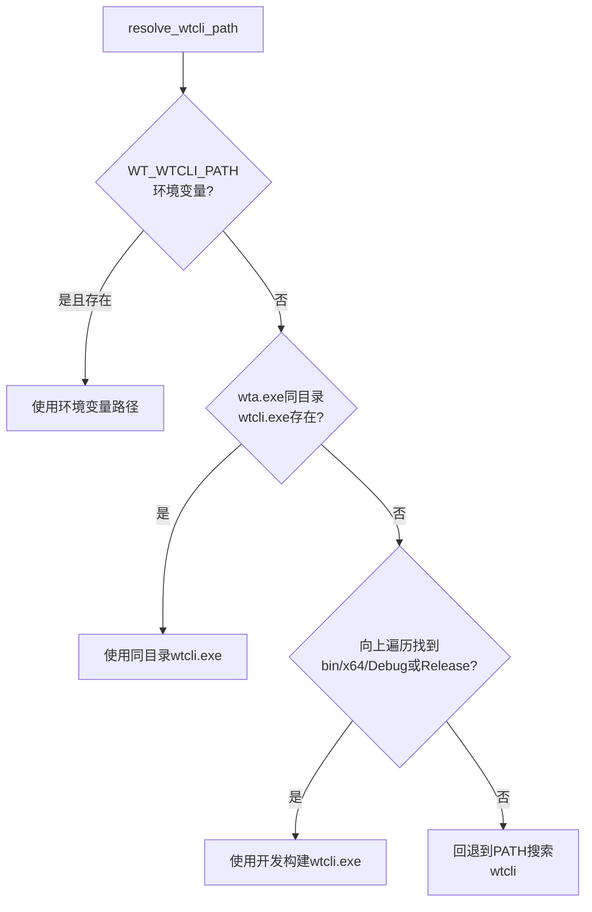
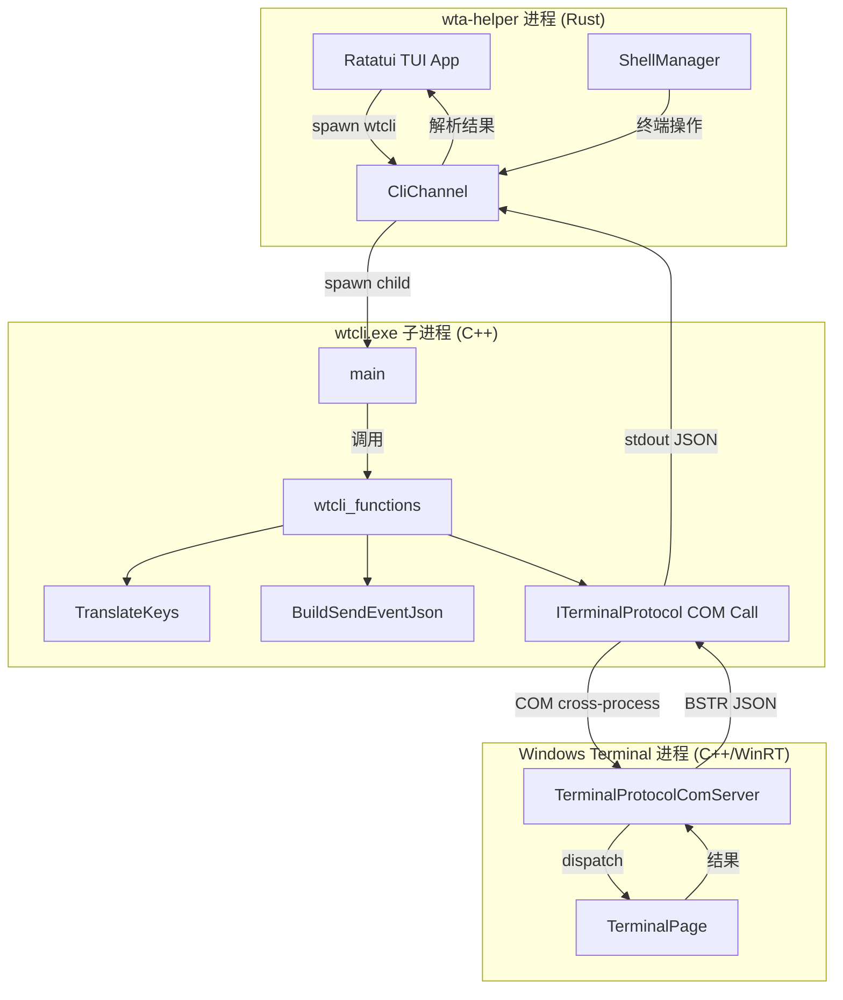

## 概述

**wtcli.exe** 是 C++ 编写的命令行工具，作为 wta-helper/wta-master 与 Windows Terminal 之间的**操作桥梁**。wta 本身不直接调用 COM，而是通过 spawn wtcli.exe 子进程来执行所有 WT 控制操作（列窗口/标签/面板、发送输入、创建标签、监听事件等）。

架构角色：

```
Agent CLI → wta-helper → wtcli.exe → COM ITerminalProtocol → Windows Terminal
                                                          (TerminalPage/UI)
```

为什么通过子进程而非直接 COM 调用：
1. **包身份隔离**：wta.exe 在 MSIX 包内运行，直接 COM 调用需要包身份；wtcli 与 wta 一同打包在 MSIX 中
2. **进程隔离**：wtcli 是短期进程，执行完即退出，COM 调用崩溃不影响 wta
3. **简单的 stdout 协议**：wtcli 将 COM 结果序列化为 JSON 输出到 stdout，wta 解析即可

## CLI 命令列表

wtcli 提供以下命令（括号内为常用别名）：

| 命令 | 别名 | 功能 | COM 方法 |
|------|------|------|---------|
| `list-windows` | `lsw` | 列出所有窗口 | `ListWindows()` |
| `list-tabs` | `lst` | 列出指定窗口的标签 | `ListTabs(windowId)` |
| `list-panes` | `lsp` | 列出指定窗口/标签的面板 | `ListPanes(windowId, tabId)` |
| `new-tab` | `neww` | 创建新标签 | `CreateTab(...)` |
| `split-pane` | `splitw` | 拆分面板 | `SplitPane(...)` |
| `capture-pane` | `capturep` | 捕获面板输出 | `ReadPaneOutput(sessionId, source, maxLines)` |
| `kill-pane` | `killp` | 关闭面板 | `ClosePane(sessionId)` |
| `active-pane` | — | 获取活动面板 | `GetActivePane()` |
| `wait-for` | — | 等待进程退出 | `GetProcessStatus` 轮询 |
| `pane-status` | — | 获取面板进程状态 | `GetProcessStatus(sessionId)` |
| `listen` | `mon` | 监听事件流 | `Subscribe(sink)` + 事件循环 |
| `focus-pane` | — | 聚焦指定面板 | `FocusPane(sessionId)` |
| `send-keys` | — | 向面板发送按键 | `SendInput(sessionId, text)` |
| `resolve-command` | — | 解析命令路径 | — |
| `sessions` | — | 会话管理 | ext method |

wta 也直接暴露同名 CLI 子命令（`wta list-windows`、`wta list-panes` 等），这些命令在内部调用 wtcli 完成实际 COM 操作。

```rust
// tools/wta/src/cli/args.rs:207-300 (wta CLI 子命令)
#[derive(Subcommand, Debug)]
pub(crate) enum Command {
    Info,
    TestPipe,
    #[command(alias = "lsw")]
    ListWindows,
    #[command(alias = "lst")]
    ListTabs { /* window_id */ },
    #[command(alias = "lsp")]
    ListPanes { /* window_id, tab_id */ },
    ResolveCommand { /* command */ },
    #[command(alias = "neww")]
    NewTab { /* profile, commandline, ... */ },
    #[command(alias = "splitw")]
    SplitPane { /* session_id, direction, ... */ },
    #[command(alias = "capturep")]
    CapturePane { /* session_id, source, max_lines */ },
    #[command(alias = "killp")]
    KillPane { /* session_id */ },
    ActivePane,
    Listen { /* json, session_id, event */ },
    Delegate { /* agent, delegate_agent, cwd, prompt */ },
    Hooks { /* install/status/uninstall */ },
    Sessions,
    ProbeModels,
    // ...
}
```

## 键名翻译（TranslateKeys）

`send-keys` 命令使用 tmux 风格的键名表示特殊按键。`TranslateKeys` 函数将键名 token 翻译为实际的字节序列：

```cpp
// src/tools/wtcli/wtcli_functions.h:58-95
inline std::wstring TranslateKeys(const std::vector<std::string>& keys)
{
    std::wstring result;
    for (const auto& key : keys)
    {
        if (key == "Enter" || key == "enter")
            result += L"\r";
        else if (key == "Space" || key == "space")
            result += L" ";
        else if (key == "Tab" || key == "tab")
            result += L"\t";
        else if (key == "Escape" || key == "escape" || key == "Esc" || key == "esc")
            result += L"\x1b";
        else if (key == "BSpace" || key == "bspace")
            result += L"\b";
        else if (key == "C-c")
            result += L"\x03";
        else if (key == "C-d")
            result += L"\x04";
        else if (key == "C-z")
            result += L"\x1a";
        else if (key == "C-l")
            result += L"\x0c";
        else if (key.size() == 3 && key[0] == 'C' && key[1] == '-' && key[2] >= 'a' && key[2] <= 'z')
            result += static_cast<wchar_t>(key[2] - 'a' + 1);
        else if (!key.empty())
        {
            // Unrecognized tokens → UTF-8 → UTF-16 literal text
            const int wlen = MultiByteToWideChar(CP_UTF8, 0, key.data(),
                static_cast<int>(key.size()), nullptr, 0);
            if (wlen > 0) {
                const size_t prev = result.size();
                result.resize(prev + static_cast<size_t>(wlen));
                MultiByteToWideChar(CP_UTF8, 0, key.data(),
                    static_cast<int>(key.size()), result.data() + prev, wlen);
            }
        }
    }
    return result;
}
```

### 键名映射表

| 键名 | 映射 | ASCII/Unicode |
|------|------|---------------|
| `Enter` / `enter` | CR | `\r` (0x0D) |
| `Space` / `space` | 空格 | ` ` (0x20) |
| `Tab` / `tab` | 水平制表符 | `\t` (0x09) |
| `Escape` / `Esc` | ESC | `\x1b` (0x1B) |
| `BSpace` / `bspace` | 退格 | `\b` (0x08) |
| `C-c` | Ctrl+C | `\x03` (ETX) |
| `C-d` | Ctrl+D | `\x04` (EOT) |
| `C-z` | Ctrl+Z | `\x1a` (SUB) |
| `C-l` | Ctrl+L | `\x0c` (FF) |
| `C-a`..`C-z` | Ctrl+字母 | 1-26 (控制字符) |
| 其他 | 原样 UTF-8→UTF-16 | 字面对应字符 |

> **注意**：`Enter` 映射为单个 CR（`\r`），而非 CRLF。下游的 `SendProtocolInput` 会将 LF 翻译为 CR，若此处发 CRLF 会导致两个 Enter 按键。

### JoinAsUtf16：原始文本发送

wta 转发 agent 提供的文本时使用 `JoinAsUtf16` 而非 `TranslateKeys`，避免将字面的 "Enter"、"Tab" 等词误翻译为控制字符：

```cpp
// src/tools/wtcli/wtcli_functions.h:24-50
inline std::wstring JoinAsUtf16(const std::vector<std::string>& parts)
{
    // 按空格连接，直接 UTF-8→UTF-16 转换，不做键名翻译
    // 用于 agent 直接发送文本内容的场景
}
```

## BuildSendEventJson：SendEvent JSON 封装

wtcli 向 COM 服务器发送事件时，使用 `BuildSendEventJson` 构造标准 JSON envelope：

```cpp
// src/tools/wtcli/wtcli_functions.h:116-141
inline bool BuildSendEventJson(
    const std::string& eventType,
    const std::string& paramsJson,
    const std::string& sessionId,
    Json::Value& outEvt)
{
    Json::Value params;
    if (!paramsJson.empty())
    {
        Json::CharReaderBuilder rb;
        std::string errs;
        std::istringstream ss(paramsJson);
        if (!Json::parseFromStream(rb, ss, &params, &errs) || !params.isObject())
        {
            return false;
        }
    }
    params["event"] = eventType;
    params["pane_id"] = sessionId;

    outEvt["type"] = "event";
    outEvt["method"] = "agent_event";
    outEvt["params"] = params;
    return true;
}
```

输出格式：

```json
{
  "type": "event",
  "method": "agent_event",
  "params": {
    "event": "<eventType>",
    "pane_id": "<sessionId>",
    ...(paramsJson 中的额外字段)
  }
}
```

这个 envelope 被 COM 服务器的 `ClassifySendEvent` 识别为 Broadcast 路由（除非 method 字段匹配直送路由），然后广播给所有订阅者。

### MatchesEventFilter：事件过滤

`listen` 命令使用 `MatchesEventFilter` 进行事件过滤：

```cpp
// src/tools/wtcli/wtcli_functions.h:152-214
inline bool MatchesEventFilter(
    const std::string& eventJson,
    const std::string& sessionIdFilter,
    const std::string& eventTypeFilter)
```

支持：
- **pane_id/session_id 过滤**：优先使用 `pane_id`，回退到 `session_id`（兼容旧版）
- **事件类型过滤**：支持尾部通配符，如 `"agent.*"` 匹配所有 `agent.` 前缀事件
- **空过滤器**：不过滤，传递所有事件
- **解析失败**：默认传递（不丢弃）

## CliChannel：wta 中的 wtcli 调用通道

wta Rust 端通过 `CliChannel` 封装 wtcli.exe 的调用。wtcli 路径解析遵循以下优先级顺序：

```rust
// tools/wta/src/shell/wt_channel/cli_channel.rs:20-60
pub(crate) fn resolve_wtcli_path() -> String {
    // 1. 环境变量 WT_WTCLI_PATH 显式覆盖
    if let Ok(p) = std::env::var("WT_WTCLI_PATH") {
        if std::path::Path::new(&p).exists() { return p; }
    }

    if let Ok(exe) = std::env::current_exe() {
        // 2. wta.exe 同目录（MSIX 打包场景：wta.exe 和 wtcli.exe 并列）
        if let Some(dir) = exe.parent() {
            let sibling = dir.join("wtcli.exe");
            if sibling.exists() { return sibling.to_string_lossy().to_string(); }
        }

        // 3. 开发构建：向上遍历查找 bin/x64/{Debug,Release}/wtcli/wtcli.exe
        let mut cursor = exe.parent().map(|p| p.to_path_buf());
        while let Some(dir) = cursor {
            for sub in &[
                "bin/x64/Debug/wtcli/wtcli.exe",
                "bin/x64/Release/wtcli/wtcli.exe",
            ] {
                let candidate = dir.join(sub);
                if candidate.exists() { return candidate.to_string_lossy().to_string(); }
            }
            let parent = dir.parent().map(|p| p.to_path_buf());
            if parent.as_deref() == Some(dir.as_path()) { break; }
            cursor = parent;
        }
    }

    // 4. PATH 搜索
    "wtcli".to_string()
}
```

### CliChannel 路径解析优先级



### wtcli 调用模式

CliChannel 支持两种调用模式：

1. **同步调用**：spawn wtcli 子进程，捕获 stdout，等待退出。用于查询类命令（`list-panes`、`capture-pane`、`active-pane`）。
2. **异步调用**：spawn wtcli 子进程，在后台线程运行。用于事件驱动命令（`focus-pane` 即发即弃）。

```rust
// tools/wta/src/shell/wt_channel/cli_channel.rs:89-100
pub fn spawn_wtcli_focus_pane(pane_session_id: &str) {
    spawn_wtcli_focus_pane_with_callback(pane_session_id, None);
}
```

`spawn_wtcli_focus_pane` 还区分两种失败模式：
- `FocusPaneFailureReason::NotFound`（0x80070490）：pane GUID 已不存在，可安全降级
- `FocusPaneFailureReason::Other`：通用错误（RPC 失败、wtcli 损坏），仅日志记录

## listen 命令：事件监听

`wtcli listen --json` 是 wta 接收 WT 事件的核心通道。wta-helper 通过此命令订阅 COM 事件，接收 OSC 133 标记、agent 状态变更、配置热重载等通知。

listen 命令工作流程：
1. 通过 `WT_COM_CLSID` 环境变量获取 CLSID
2. `CoCreateInstance(CLSCTX_LOCAL_SERVER)` 获取 `ITerminalProtocol`
3. `Authenticate("")` 握手（protocol_version = "2.2"）
4. 创建 `ITerminalProtocolEventSink` 实现
5. `Subscribe(sink)` 注册事件回调
6. 进入消息循环，将 `OnEvent` 收到的 JSON 输出到 stdout
7. wta 解析 stdout 中的 JSON 事件流

## wtcli 与 COM 的关系图



## 源码链接

| 文件 | 关键内容 |
|------|---------|
| [wtcli_functions.h](file:///d:/spaces/SpecWeave/external/libs/models/ai/intelligent-terminal/src/tools/wtcli/wtcli_functions.h) | TranslateKeys、BuildSendEventJson、MatchesEventFilter、JoinAsUtf16 |
| [wtcli/main.cpp](file:///d:/spaces/SpecWeave/external/libs/models/ai/intelligent-terminal/src/tools/wtcli/main.cpp) | wtcli 入口、命令分发、COM 激活 |
| [cli_channel.rs](file:///d:/spaces/SpecWeave/external/libs/models/ai/intelligent-terminal/tools/wta/src/shell/wt_channel/cli_channel.rs) | CliChannel、wtcli 路径解析、异步spawn |
| [cli/args.rs](file:///d:/spaces/SpecWeave/external/libs/models/ai/intelligent-terminal/tools/wta/src/cli/args.rs) | wta CLI 子命令定义（clap） |
| [wt_channel/mod.rs](file:///d:/spaces/SpecWeave/external/libs/models/ai/intelligent-terminal/tools/wta/src/shell/wt_channel/mod.rs) | WtChannel trait 定义 |
