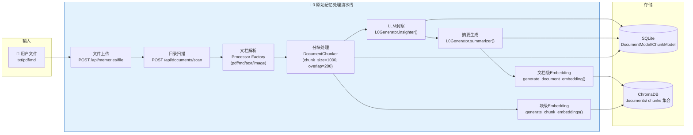

# L0原始记忆层

L0 层是 Second-Me 三层记忆架构的**感知入口**，负责将用户的原始资料（文本、PDF、Markdown、图片、音频）转化为机器可检索、可理解的结构化记忆。它对应认知科学中的"感觉记忆"和"工作记忆"阶段——高保真地摄入外部信息，进行初步编码，但尚未进行深度语义抽象。

## L0层的核心职责

L0 层完成五项核心任务：

1. **文件摄入与解析**：支持 txt/pdf/md 三种格式上传，通过工厂模式选择对应处理器提取文本
2. **文档分块（Chunking）**：将长文档切分为适合向量化和LLM处理的语义块
3. **LLM洞察生成（Insighter）**：利用大模型对每个文档生成标题（title）和深度洞察（insight）
4. **摘要与关键词生成（Summarizer）**：生成文档摘要（summary）和关键词（keywords）
5. **向量化存储**：对文档和块分别生成embedding向量，存入ChromaDB向量数据库

## L0处理流水线



## 数据模型

### L0内部数据模型（dataclass）

L0 层使用 Python `@dataclass` 定义了5个轻量数据模型，用于在 L0Generator 的各方法间传递数据：

```python
# lpm_kernel/L0/models.py
from dataclasses import dataclass
from enum import Enum
from typing import Any, Optional

@dataclass
class FileInfo:
    """文件信息封装"""
    data_type: str       # 数据类型（DOCUMENT/IMAGE/AUDIO）
    filename: str        # 文件名
    content: str         # 文本内容
    file_content: Optional[Any]  # 文件原始内容（如图片base64）

class DocumentType(str, Enum):
    """文档类型枚举"""
    DOCUMENT = "DOCUMENT"
    TEXT = "TEXT"

    @classmethod
    def from_mime_type(cls, mime_type: str) -> "DocumentType":
        """从MIME类型映射到DocumentType"""
        if mime_type == "text":
            return cls.TEXT
        elif mime_type in ("pdf", "md"):
            return cls.DOCUMENT
        else:
            return cls.DOCUMENT

@dataclass
class BioInfo:
    """用户传记信息（用于prompt中的身份上下文）"""
    global_bio: str     # 全局传记
    status_bio: str     # 近期状态传记
    about_me: str       # 自我介绍

@dataclass
class InsighterInput:
    """洞察生成器输入"""
    file_info: FileInfo
    bio_info: BioInfo

    @classmethod
    def from_dict(cls, inputs: dict) -> "InsighterInput":
        """从字典工厂方法构建"""
        return cls(
            file_info=FileInfo(
                data_type=inputs.get("dataType", "DOCUMENT"),
                filename=inputs.get("filename", ""),
                content=inputs.get("content", "").strip(),
                file_content=inputs.get("fileContent", ""),
            ),
            bio_info=BioInfo(
                global_bio=inputs.get("globalBio", ""),
                status_bio=inputs.get("statusBio", ""),
                about_me=inputs.get("aboutMe", ""),
            ),
        )

@dataclass
class SummarizerInput:
    """摘要生成器输入"""
    file_info: FileInfo
    insight: str        # L0Generator.insighter()的输出

    @classmethod
    def from_dict(cls, inputs: dict) -> "SummarizerInput":
        return cls(
            file_info=FileInfo(
                data_type=inputs.get("dataType", "DOCUMENT"),
                filename=inputs.get("filename", ""),
                content=inputs.get("content", "").strip(),
                file_content=inputs.get("fileContent", ""),
            ),
            insight=inputs.get("insight", ""),
        )
```

### ORM持久化模型

处理结果通过 SQLAlchemy ORM 模型持久化到 SQLite 数据库：

```python
# lpm_kernel/file_data/models.py (简化)
class DocumentModel(Base):
    """文档表"""
    __tablename__ = "document"
    id = Column(Integer, primary_key=True, autoincrement=True)
    name = Column(String(255), nullable=False)
    title = Column(String(255))
    mime_type = Column(String(100))
    raw_content = Column(Text)
    insight = Column(JSON)           # LLM洞察结果
    summary = Column(JSON)           # 摘要结果
    keywords = Column(JSON)          # 关键词列表
    extract_status = Column(SQLAlchemyEnum(ProcessStatus), default=INITIALIZED)
    embedding_status = Column(SQLAlchemyEnum(ProcessStatus), default=INITIALIZED)
    create_time = Column(DateTime, default=datetime.now)

class ChunkModel(Base):
    """分块表"""
    __tablename__ = "chunk"
    id = Column(BigInteger, primary_key=True)
    document_id = Column(BigInteger, ForeignKey("document.id"), nullable=False)
    content = Column(Text, nullable=False)
    has_embedding = Column(Boolean, default=False)
    tags = Column(JSON)
    topic = Column(String(255))
```

### 处理状态机

文档和块的处理状态由 `ProcessStatus` 枚举管理，前端 `MemoryFile` 接口对应为四状态枚举：

```python
class ProcessStatus(Enum):
    INITIALIZED = "INITIALIZED"   # 初始态
    PROCESSING = "PROCESSING"     # 处理中
    SUCCESS = "SUCCESS"           # 处理成功
    FAILED = "FAILED"             # 处理失败
```

## L0Generator：核心生成器

`L0Generator` 是 L0 层的核心引擎，负责驱动洞察和摘要生成。它初始化时配置 LLM 客户端、tokenizer 和多组 prompt 模板。

### 类初始化

```python
# lpm_kernel/L0/l0_generator.py
class L0Generator:
    def __init__(self, preferred_language="English"):
        self.preferred_language = preferred_language
        # 使用 OpenAI cl100k_base tokenizer（与GPT-4相同编码）
        self._tokenizer = tiktoken.get_encoding("cl100k_base")

        # 加载三组prompt模板（image/audio/document的parser/overview/breakdown）
        self.lf_prompt_image_parser = insight_image_parser
        self.lf_prompt_image_overview = insight_image_overview
        self.lf_prompt_image_breakdown = insight_image_breakdown
        self.lf_prompt_audio_parser = insight_audio_parser
        self.lf_prompt_doc_overview = insight_doc_overview
        self.lf_prompt_doc_breakdown = insight_doc_breakdown

        # 初始化 LLM 客户端（通过UserLLMConfigService获取配置）
        self.user_llm_config_service = UserLLMConfigService()
        self.user_llm_config = self.user_llm_config_service.get_available_llm()
        self.client = OpenAI(
            api_key=self.user_llm_config.chat_api_key,
            base_url=self.user_llm_config.chat_endpoint,
        )
        self.model_name = self.user_llm_config.chat_model_name
```

### insighter()：洞察入口

`insighter()` 是公共入口方法，按数据类型分派到三个私有处理方法：

```python
def insighter(self, inputs: InsighterInput) -> Dict[str, str]:
    """生成文档洞察，返回 {"title": str, "insight": str}"""
    datatype = DataType(inputs.file_info.data_type)

    bio = {
        "global_bio": inputs.bio_info.global_bio.split("### Conclusion ###")[-1].strip()
                      if inputs.bio_info.global_bio else "User has no biography right now",
        "status_bio": inputs.bio_info.status_bio,
        "about_me": inputs.bio_info.about_me.strip() if inputs.bio_info.about_me else "",
    }

    text_len = len(self._tokenizer.encode(inputs.file_info.content))

    # 文本少于20 tokens时直接用文件名作为标题（快速路径）
    if text_len > 20 or inputs.file_info.file_content:
        if datatype == DataType.IMAGE:
            insight, title = self._insighter_image(bio=bio, ...)
        elif datatype == DataType.AUDIO:
            insight, title = self._insighter_audio(bio=bio, ...)
        else:  # DOCUMENT
            insight, title = self._insighter_doc(bio=bio, ...)
    else:
        title = inputs.file_info.filename or inputs.file_info.content
        insight = inputs.file_info.content

    return {"title": title, "insight": insight}
```

### 三种媒体类型的洞察处理

| 方法 | 处理类型 | 策略 |
|------|---------|------|
| `_insighter_image()` | 图片 | 3段prompt调用链（parser→overview→breakdown），支持多模态输入（图片URL/base64+文本hint） |
| `_insighter_audio()` | 音频 | 超过1200秒自动分段，先解析再概述再深度分析 |
| `_insighter_doc()` | 文档 | 使用 `TokenTextSplitter` 分块 + `chunk_filter` 采样策略，逐块分析后汇总洞察 |

文档洞察是最复杂的处理路径。对于长文档，`_insighter_doc()` 采用分块+采样策略避免超出LLM上下文窗口：

```python
def _insighter_doc(self, bio, content, max_retries, request_timeout, file_content=None):
    """文档洞察处理（简化逻辑）"""
    # 1. 使用 TokenTextSplitter 分块
    chunks = TokenTextSplitter(
        chunk_size=2000, chunk_overlap=200, tokenizer=self._tokenizer
    ).split_text(content)

    # 2. 使用 chunk_filter 采样代表性块（避免全量送入LLM）
    sampled_chunks = chunk_filter(chunks, self._tokenizer)

    # 3. 逐块调用LLM生成洞察
    # ... 多轮prompt调用，汇总生成最终的 (insight, title)
```

### summarizer()：摘要入口

`summarizer()` 支持两种摘要策略，由文档长度和配置决定：

```python
def summarizer(self, inputs: SummarizerInput) -> Dict[str, str]:
    """生成摘要，返回 {"title": str, "summary": str, "keywords": list}"""

    # 策略1：串行细粒度摘要（适用于长文档）
    # __serial_summary_filter: 逐块摘要→过滤合并→生成最终摘要

    # 策略2：采样式全文摘要（适用于中等长度文档）
    # equidistant_filter: 等距采样块→直接生成摘要
    summary, keywords = self._summarize_title_abstract_keywords(inputs)
    return {"title": ..., "summary": summary, "keywords": keywords}
```

## DocumentChunker：分块处理器

分块（Chunking）是L0层的关键步骤，决定了embedding的粒度和检索质量。Second-Me 使用 LangChain 的 `RecursiveCharacterTextSplitter`，配置支持中英文分隔符：

```python
# lpm_kernel/file_data/chunker.py
class DocumentChunker:
    def __init__(self, chunk_size: int = 1000, overlap: int = 200):
        self.chunk_size = chunk_size
        self.overlap = overlap
        self.text_splitter = RecursiveCharacterTextSplitter(
            chunk_size=self.chunk_size,
            chunk_overlap=self.overlap,
            length_function=len,
            # 中英文混合分隔符优先级
            separators=["\n\n", "\n", "。", "！", "？", ".", "!", "?", " ", ""],
        )

    def split(self, content: str) -> List[Chunk]:
        """将文档内容切分为Chunk列表"""
        texts = self.text_splitter.split_text(content)
        chunks = [
            Chunk(id=None, document_id=None, content=text,
                  embedding=None, tags=None, topic=None)
            for text in texts
        ]
        return chunks
```

**分块参数**：
- `chunk_size=1000`：每个块目标1000个字符
- `overlap=200`：相邻块重叠200个字符，避免语义断裂
- 分隔符优先级：段落→换行→中文句号/感叹号/问号→英文句号→空格→字符级

## EmbeddingService：向量化服务

`EmbeddingService` 封装了 ChromaDB 的所有操作，管理两个向量集合（documents 和 document_chunks），自动检测embedding维度并处理维度不匹配。

```python
# lpm_kernel/file_data/embedding_service.py
class EmbeddingService:
    def __init__(self):
        chroma_path = os.getenv("CHROMA_PERSIST_DIRECTORY", "./data/chroma_db")
        self.client = chromadb.PersistentClient(path=chroma_path)
        self.llm_client = LLMClient()

        # 自动检测embedding维度（默认1536，对应OpenAI text-embedding-ada-002）
        self.dimension = detect_embedding_model_dimension(embedding_model_name)

        # 两个向量集合，均使用余弦相似度
        self.document_collection = self.client.get_or_create_collection(
            name="documents",
            metadata={"hnsw:space": "cosine", "dimension": self.dimension}
        )
        self.chunk_collection = self.client.get_or_create_collection(
            name="document_chunks",
            metadata={"hnsw:space": "cosine", "dimension": self.dimension}
        )
```

### 文档级Embedding

文档级embedding对整个文档的 `raw_content` 生成单一向量，用于粗粒度文档检索：

```python
def generate_document_embedding(self, document: DocumentDTO) -> List[float]:
    """为文档生成embedding并存入ChromaDB"""
    embeddings = self.llm_client.get_embedding([document.raw_content])
    embedding = embeddings[0]

    # 存入ChromaDB，携带元数据
    self.document_collection.add(
        documents=[document.raw_content],
        ids=[str(document.id)],
        embeddings=[embedding.tolist()],
        metadatas=[{
            "title": document.title or document.name,
            "mime_type": document.mime_type,
            "create_time": document.create_time.isoformat(),
            "document_size": document.document_size,
        }],
    )
    return embedding
```

### 块级Embedding

块级embedding对每个chunk分别生成向量，用于细粒度语义检索：

```python
def generate_chunk_embeddings(self, chunks: List[ChunkDTO]) -> List[ChunkDTO]:
    """批量为chunks生成embedding"""
    unprocessed = [c for c in chunks if not c.has_embedding]
    embeddings = self.llm_client.get_embedding([c.content for c in unprocessed])

    self.chunk_collection.add(
        documents=[c.content for c in unprocessed],
        ids=[str(c.id) for c in unprocessed],
        embeddings=embeddings.tolist(),
        metadatas=[{
            "document_id": str(c.document_id),
            "topic": c.topic or "",
            "tags": ",".join(c.tags) if c.tags else "",
        } for c in unprocessed],
    )
```

### 语义检索

推理时通过 `search_similar_chunks()` 实现RAG检索：

```python
def search_similar_chunks(self, query: str, limit: int = 5) -> List[Tuple[ChunkDTO, float]]:
    """基于查询文本检索相似chunks"""
    query_embedding = self.llm_client.get_embedding([query])
    results = self.chunk_collection.query(
        query_embeddings=[query_embedding[0].tolist()],
        n_results=limit,
        include=["documents", "metadatas", "distances"],
    )
    # 将距离转换为相似度分数（1 - distance）
    # 返回 [(ChunkDTO, similarity_score), ...] 按相似度降序排列
```

## 文件处理工厂模式

不同文件类型通过 `process_factory` 工厂模式选择对应的处理器：

```python
# lpm_kernel/file_data/process_factory.py (简化逻辑)
PROCESSORS = {
    "pdf": PDFProcessor,
    "md": MarkdownProcessor,
    "txt": TextProcessor,
    "image": ImageProcessor,
}

def get_processor(mime_type: str) -> Processor:
    """根据MIME类型获取对应的文件处理器"""
    processor_class = PROCESSORS.get(mime_type)
    if not processor_class:
        raise ValueError(f"Unsupported file type: {mime_type}")
    return processor_class()
```

| 处理器 | 位置 | 功能 |
|--------|------|------|
| `PDFProcessor` | [processors/pdf/processor.py](file:///d:/spaces/SpecWeave/external/libs/models/ai/mindverse/Second-Me/lpm_kernel/file_data/processors/pdf/processor.py) | PDF文本提取 |
| `MarkdownProcessor` | [processors/markdown/processor.py](file:///d:/spaces/SpecWeave/external/libs/models/ai/mindverse/Second-Me/lpm_kernel/file_data/processors/markdown/processor.py) | Markdown解析 |
| `TextProcessor` | [processors/text/processor.py](file:///d:/spaces/SpecWeave/external/libs/models/ai/mindverse/Second-Me/lpm_kernel/file_data/processors/text/processor.py) | 纯文本处理 |
| `ImageProcessor` | [processors/image/processor.py](file:///d:/spaces/SpecWeave/external/libs/models/ai/mindverse/Second-Me/lpm_kernel/file_data/processors/image/processor.py) | 图片处理 |

## 文件上传API

记忆文件上传通过 `memories_bp` Blueprint 处理：

```python
# lpm_kernel/api/domains/memories/routes.py
ALLOWED_EXTENSIONS = {"txt", "pdf", "md"}

@memories_bp.route("/api/memories/file", methods=["POST"])
def upload_memory_file():
    """上传记忆文件（multipart/form-data）"""
    # 1. 验证文件扩展名
    # 2. 调用 StorageService.save_file() 保存到 USER_RAW_CONTENT_DIR
    # 3. 创建 DocumentModel 记录
    # 4. 返回文件信息

@memories_bp.route("/api/memories/file/<filename>", methods=["DELETE"])
def delete_memory_file(filename):
    """删除记忆文件及相关数据"""
    document_service.delete_file_by_name(filename)
```

## L0在训练流水线中的位置

在14步训练流水线中，L0相关步骤占5步（步骤2-6）：

| 步骤 | ProcessStep | 对应操作 | API端点 |
|------|------------|---------|---------|
| 2 | `LIST_DOCUMENTS` | 列出所有已上传文档 | `GET /api/documents/list` |
| 3 | `GENERATE_DOCUMENT_EMBEDDINGS` | 文档级embedding | `POST /api/documents/<id>/embedding` |
| 4 | `CHUNK_DOCUMENT` | 文档分块 | `POST /api/documents/chunks/process` |
| 5 | `CHUNK_EMBEDDING` | 块级embedding | `POST /api/documents/<id>/chunk/embedding` |
| 6 | `EXTRACT_DIMENSIONAL_TOPICS` | L0Generator.insighter()+summarizer() | `POST /api/documents/analyze` |

## 关键文件索引

| 文件 | 职责 |
|------|------|
| [lpm_kernel/L0/l0_generator.py](file:///d:/spaces/SpecWeave/external/libs/models/ai/mindverse/Second-Me/lpm_kernel/L0/l0_generator.py) | L0核心生成器：insighter() + summarizer()，857行 |
| [lpm_kernel/L0/models.py](file:///d:/spaces/SpecWeave/external/libs/models/ai/mindverse/Second-Me/lpm_kernel/L0/models.py) | 5个dataclass数据模型 |
| [lpm_kernel/L0/prompt.py](file:///d:/spaces/SpecWeave/external/libs/models/ai/mindverse/Second-Me/lpm_kernel/L0/prompt.py) | Image/audio/document的prompt模板集合 |
| [lpm_kernel/file_data/chunker.py](file:///d:/spaces/SpecWeave/external/libs/models/ai/mindverse/Second-Me/lpm_kernel/file_data/chunker.py) | DocumentChunker分块处理器 |
| [lpm_kernel/file_data/embedding_service.py](file:///d:/spaces/SpecWeave/external/libs/models/ai/mindverse/Second-Me/lpm_kernel/file_data/embedding_service.py) | EmbeddingService：ChromaDB操作+向量检索 |
| [lpm_kernel/file_data/document_service.py](file:///d:/spaces/SpecWeave/external/libs/models/ai/mindverse/Second-Me/lpm_kernel/file_data/document_service.py) | 文档CRUD+L0分析编排 |
| [lpm_kernel/file_data/models.py](file:///d:/spaces/SpecWeave/external/libs/models/ai/mindverse/Second-Me/lpm_kernel/file_data/models.py) | DocumentModel/ChunkModel ORM模型 |
| [lpm_kernel/file_data/process_factory.py](file:///d:/spaces/SpecWeave/external/libs/models/ai/mindverse/Second-Me/lpm_kernel/file_data/process_factory.py) | 文件处理器工厂 |

## 相关概念

- [三层记忆HMM架构](three-layer-memory-hmm.md) — L0/L1/L2三层架构总览，L0在HMM中的定位
- [L1语义网络层](l1-semantic-network.md) — L0输出作为L1输入，构建语义网络和身份认知
- [训练流水线](training-pipeline.md) — L0处理是训练流水线的前5步
- [Flask API服务](flask-api-server.md) — Documents/Memories相关API端点
