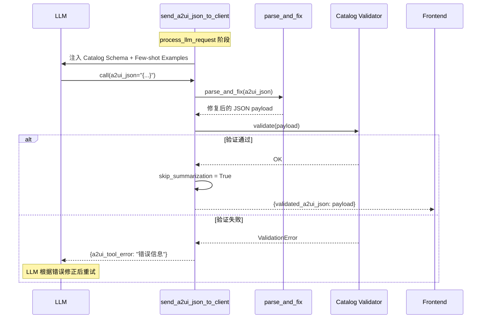

# Agent-to-UI 协议

A2UI（Agent-to-UI，[a2ui.org](https://a2ui.org)）是让 Agent 输出声明式富 UI 而非纯文本的开放协议。传统 Agent 只能输出 Markdown 文本，而 A2UI 允许 Agent 通过 JSON 描述按钮、表单、图表、卡片等交互组件，前端根据组件目录（Catalog）渲染为真实 UI。veadk-python 通过 `Agent(enable_a2ui=True)` 一键启用 A2UI，自动挂载工具集、注入组件 Schema 和示例，并提供企业级自定义组件扩展点。

## A2UI 架构总览

```
┌─────────────────────────────────────────────────────────────┐
│                    Agent (enable_a2ui=True)                  │
│                                                              │
│  ┌────────────────────────────────────────────────────────┐  │
│  │  LLM System Prompt 注入                               │  │
│  │  ├── Catalog JSON Schema（可用组件定义）               │  │
│  │  └── Few-shot Examples（组件使用示例）                 │  │
│  └─────────────────────┬──────────────────────────────────┘  │
│                        │ LLM 决定输出 UI                     │
│                        ▼                                     │
│  ┌────────────────────────────────────────────────────────┐  │
│  │  send_a2ui_json_to_client(a2ui_json)                   │  │
│  │  ├── parse_and_fix(a2ui_json)     # 容错修复          │  │
│  │  ├── catalog.validator.validate() # Schema 验证       │  │
│  │  └── skip_summarization = True    # 跳过文本总结       │  │
│  └─────────────────────┬──────────────────────────────────┘  │
│                        │ validated_a2ui_json                  │
└────────────────────────┼────────────────────────────────────┘
                         │ SSE 流 (/run_sse)
                         ▼
┌─────────────────────────────────────────────────────────────┐
│                    Client / Frontend                         │
│  ┌──────────────────────────────────────────────────────┐   │
│  │  A2UI JSON → 组件渲染                                │   │
│  │  ├── 基础组件（Basic Catalog）                       │   │
│  │  │   卡片、按钮、表单、列表、表格等                   │   │
│  │  └── 企业自定义组件                                  │   │
│  │      frontend/src/a2ui/components/<Name>/            │   │
│  └──────────────────────────────────────────────────────┘   │
└─────────────────────────────────────────────────────────────┘
```

## 启用 A2UI

在 Agent 上设置 `enable_a2ui=True` 即可启用 A2UI（F-025），框架自动挂载 `SendA2uiToClientToolset`。

```python
from veadk import Agent

agent = Agent(
    name="ui_agent",
    instruction="你是一个助手，需要展示数据时使用 A2UI 组件。",
    enable_a2ui=True,                    # 一键启用
    # a2ui_catalog=MyCustomCatalog(),   # 可选：自定义组件目录
)
```

## 核心模块

### `build_a2ui_toolset`：工具集工厂

[veadk/a2ui/toolset.py:L238-L265](file:///d:/spaces/SpecWeave/external/libs/models/ai/veadk-python/veadk/a2ui/toolset.py#L238-L265)

```python
def build_a2ui_toolset(
    catalog: A2UICatalogLike = None,
    examples: Optional[str] = None,
    enabled: bool = True,
    base_dir: Optional[str] = None,
) -> "SendA2uiToClientToolset":
```

该函数创建 Google ADK 的 `SendA2uiToClientToolset`，处理：
1. Catalog 解析与加载
2. 提示词注入（Schema + 示例）
3. `send_a2ui_json_to_client` 工具暴露
4. JSON 验证与容错

### Catalog 解析逻辑（`_resolve_catalog`）

[veadk/a2ui/toolset.py:L206-L235](file:///d:/spaces/SpecWeave/external/libs/models/ai/veadk-python/veadk/a2ui/toolset.py#L206-L235)

`A2UICatalogLike` 支持 5 种输入形式（F-060）：

| 类型 | 行为 |
|------|------|
| `None` | 自动发现 agent.py 同目录的 `catalog.json`，否则使用内置 Basic Catalog |
| `str`（路径） | 从 JSON 文件加载 Catalog，自动发现同目录的 `a2ui_examples/` 示例 |
| `BaseA2UICatalog` | 调用子类 `build()` 方法 |
| `(A2uiCatalog, str)` | 已构建的 (catalog, examples) 元组 |
| `A2uiCatalog` | 裸 Catalog 实例，配空示例 |

`caller_agent_dir()` 通过遍历调用栈，定位用户 `agent.py` 所在目录，用于解析相对路径和自动发现 `catalog.json`。

### `send_a2ui_json_to_client` 工具

核心工具方法，由 LLM 调用来发送 UI 组件。VeADK 提供了 Fallback 实现以兼容不同版本的 a2ui-agent-sdk：

[veadk/a2ui/toolset.py:L109-L172](file:///d:/spaces/SpecWeave/external/libs/models/ai/veadk-python/veadk/a2ui/toolset.py#L109-L172)

```python
class _SendA2uiJsonToClientTool(base_tool.BaseTool):
    TOOL_NAME = "send_a2ui_json_to_client"
    VALIDATED_A2UI_JSON_KEY = "validated_a2ui_json"
    A2UI_JSON_ARG_NAME = "a2ui_json"
    TOOL_ERROR_KEY = "a2ui_tool_error"
```

**工具执行流程：**



**关键设计：**
- **容错修复**：`parse_and_fix` 处理 LLM 输出中常见的 JSON 格式问题（如尾部逗号、单引号等）
- **Schema 验证**：Catalog validator 确保输出符合组件定义，非法 UI 不会发送到前端
- **跳过总结**：`skip_summarization = True` 告诉 ADK 不要将 UI JSON 再总结为文本，直接发送给客户端
- **错误反馈**：验证失败时返回 `a2ui_tool_error`，LLM 可读取错误信息并修正重试

## Catalog：组件目录系统

Catalog 是 A2UI 的核心概念，定义了 Agent 可用的 UI 组件集合（名称、属性、嵌套规则），同时作为 LLM 的指令和前端的验证器。

[veadk/a2ui/catalog.py:L48-L56](file:///d:/spaces/SpecWeave/external/libs/models/ai/veadk-python/veadk/a2ui/catalog.py#L48-L56)

```python
DEFAULT_A2UI_VERSION = "0.9"
DEFAULT_CATALOG_FILENAME = "catalog.json"
DEFAULT_EXAMPLES_DIRNAME = "a2ui_examples"
BuiltCatalog = Tuple["A2uiCatalog", str]  # (catalog, examples_str)
```

### Basic Catalog：内置基础组件

[veadk/a2ui/catalog.py:L107-L134](file:///d:/spaces/SpecWeave/external/libs/models/ai/veadk-python/veadk/a2ui/catalog.py#L107-L134)

```python
def get_basic_catalog(
    version: str = DEFAULT_A2UI_VERSION,
    examples_path: Optional[str] = None,
) -> BuiltCatalog:
```

默认使用 Google A2UI 基础组件目录（v0.9），包含卡片、按钮、表单、列表、表格等通用 UI 组件。自动加载配套的 few-shot 示例注入到 system prompt。

### load_catalog：从文件加载

[veadk/a2ui/catalog.py:L64-L94](file:///d:/spaces/SpecWeave/external/libs/models/ai/veadk-python/veadk/a2ui/catalog.py#L64-L94)

```python
def load_catalog(
    catalog_path: str,
    version: str = DEFAULT_A2UI_VERSION,
    examples_path: Optional[str] = None,
) -> BuiltCatalog:
```

从本地 JSON 文件（或 `file://` URI）加载自定义 Catalog。约定：
- Catalog 文件命名为 `catalog.json`，放在 agent.py 同目录
- Few-shot 示例放在同目录的 `a2ui_examples/` 子目录
- 通过 `A2uiSchemaManager` 管理多版本 Catalog 和示例加载

### BaseA2UICatalog：企业自定义扩展点

[veadk/a2ui/catalog.py:L137-L177](file:///d:/spaces/SpecWeave/external/libs/models/ai/veadk-python/veadk/a2ui/catalog.py#L137-L177)

企业可通过继承 `BaseA2UICatalog` 注册自有 UI 组件：

```python
class BaseA2UICatalog(abc.ABC):
    version: str = DEFAULT_A2UI_VERSION
    catalog_path: Optional[str] = None
    examples_path: Optional[str] = None

    def build(self) -> BuiltCatalog:
        if not self.catalog_path:
            return get_basic_catalog(self.version, self.examples_path)
        return load_catalog(self.catalog_path, self.version, self.examples_path)
```

**自定义组件需要两端配合：**

| 端 | 文件位置 | 职责 |
|----|---------|------|
| 后端（Python） | 继承 `BaseA2UICatalog`，提供 `catalog.json` | 定义组件 Schema、属性、验证规则 |
| 前端（React 等） | `frontend/src/a2ui/components/<ComponentName>/` | 实现组件渲染逻辑 |

```python
# 后端：自定义金融组件目录
class FinanceCatalog(BaseA2UICatalog):
    version = "0.9"
    catalog_path = "/opt/corp/a2ui/finance_catalog.json"
    examples_path = "/opt/corp/a2ui/finance_examples"

agent = Agent(
    name="finance_agent",
    instruction="你是金融助手。",
    enable_a2ui=True,
    a2ui_catalog=FinanceCatalog(),
)
```

## 依赖管理

A2UI 功能需要可选依赖 `a2ui-agent-sdk`（F-061）：

```bash
pip install veadk-python[a2ui]
```

未安装时，所有 `a2ui` 相关导入会延迟到实际使用时才触发，并给出友好的安装提示。VeADK 还提供了 `_FallbackSendA2uiToClientToolset` 兼容层，处理 a2ui-agent-sdk 某些版本中已知的 `NameError` 注解问题（`models.LlmRequest` 引用错误）。

## 关键文件索引

| 文件 | 职责 |
|------|------|
| [veadk/a2ui/\_\_init\_\_.py](file:///d:/spaces/SpecWeave/external/libs/models/ai/veadk-python/veadk/a2ui/__init__.py) | 模块导出：BaseA2UICatalog、get_basic_catalog、load_catalog、build_a2ui_toolset |
| [veadk/a2ui/toolset.py](file:///d:/spaces/SpecWeave/external/libs/models/ai/veadk-python/veadk/a2ui/toolset.py) | A2UI 工具集构建、send_a2ui_json_to_client 工具、Fallback 兼容层、Catalog 解析 |
| [veadk/a2ui/catalog.py](file:///d:/spaces/SpecWeave/external/libs/models/ai/veadk-python/veadk/a2ui/catalog.py) | Catalog 加载、Basic Catalog、BaseA2UICatalog 扩展点 |

## 相关概念

- [Agent 类与 Runner 执行引擎](agent-and-runner.md) — Agent.enable_a2ui 和 a2ui_catalog 字段
- [CLI 命令系统](cli-commands.md) — web/frontend 命令启动带 A2UI 支持的 Web 服务
- [Agent-to-Agent 协议](a2a-protocol.md) — A2A 用于 Agent 间通信，A2UI 用于 Agent 与前端 UI 通信
