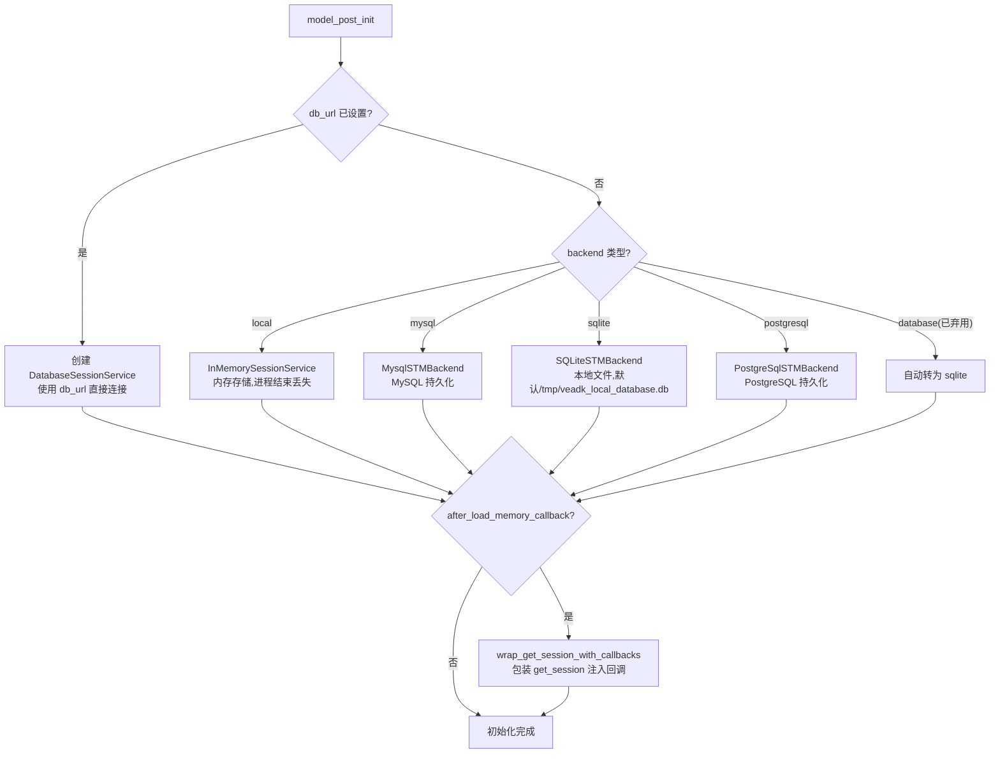
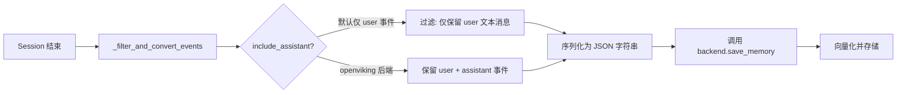

# 记忆系统

veadk-python 实现了双层记忆架构：**短期记忆（ShortTermMemory）** 管理当前会话的完整对话历史，所有内容直接发送给 LLM；**长期记忆（LongTermMemory）** 通过向量检索实现跨会话的持久化记忆，Agent 通过 `load_memory` 工具在需要时检索相关历史。两层记忆均可插拔多种后端存储。

## 双层记忆架构

```
┌─────────────────────────────────────────────────────────────────┐
│                         Agent                                    │
│                                                                  │
│  ┌──────────────────────────────────────────────────────────┐   │
│  │  ShortTermMemory (会话级)                                  │   │
│  │  ┌────────────────────────────────────────────────────┐  │   │
│  │  │ SessionService: 完整对话历史                        │  │   │
│  │  │ → 每轮自动发送给 LLM 作为上下文                     │  │   │
│  │  │ → 支持 local/mysql/sqlite/postgresql               │  │   │
│  │  └────────────────────────────────────────────────────┘  │   │
│  └──────────────────────────┬───────────────────────────────┘   │
│                             │ auto_save_session=True            │
│                             ▼                                   │
│  ┌──────────────────────────────────────────────────────────┐   │
│  │  LongTermMemory (跨会话级)                                 │   │
│  │  ┌────────────────────────────────────────────────────┐  │   │
│  │  │ Vector Backend: 语义向量存储                        │  │   │
│  │  │ → Agent 通过 load_memory 工具主动检索              │  │   │
│  │  │ → 支持 opensearch/redis/viking/mem0/local/...      │  │   │
│  │  └────────────────────────────────────────────────────┘  │   │
│  └──────────────────────────────────────────────────────────┘   │
└─────────────────────────────────────────────────────────────────┘
```

## ShortTermMemory：短期记忆

短期记忆封装了 ADK 的 `BaseSessionService`，负责会话的创建、检索和持久化。Runner 在每次 `run()` 调用时自动通过短期记忆创建或获取会话。

### 类定义

[veadk/memory/short_term_memory.py:L57-L91](file:///d:/spaces/SpecWeave/external/libs/models/ai/veadk-python/veadk/memory/short_term_memory.py#L57-L91)

```python
class ShortTermMemory(BaseModel):
    backend: Literal["local", "mysql", "sqlite", "postgresql", "database"] = "local"
    backend_configs: dict = Field(default_factory=dict)
    db_kwargs: dict = Field(default_factory=dict)
    db_url: str = ""
    local_database_path: str = "/tmp/veadk_local_database.db"
    after_load_memory_callback: Callable | None = None

    _session_service: BaseSessionService = PrivateAttr()
```

### 后端选择逻辑

[veadk/memory/short_term_memory.py:L93-L130](file:///d:/spaces/SpecWeave/external/libs/models/ai/veadk-python/veadk/memory/short_term_memory.py#L93-L130)



后端说明：

| backend 值 | SessionService 实现 | 适用场景 |
|------------|-------------------|---------|
| `"local"` | `InMemorySessionService` | 开发调试、无状态部署 |
| `"mysql"` | `MysqlSTMBackend` | 生产环境 MySQL 集群 |
| `"sqlite"` | `SQLiteSTMBackend` | 本地开发、轻量部署 |
| `"postgresql"` | `PostgreSqlSTMBackend` | 生产环境 PostgreSQL |
| `"database"`（弃用） | 自动转为 `"sqlite"` | 向后兼容 |
| `db_url`（优先级最高） | `DatabaseSessionService` | SQLAlchemy 连接字符串，如 `sqlite:///./test.db` |

当 `db_url` 包含多个 `@` 或 `:` 时，会发出警告提示用户对用户名/密码进行 URL 编码（如 `p@ssword` → `p%40ssword`）。

### create_session：会话管理

[veadk/memory/short_term_memory.py:L136-L179](file:///d:/spaces/SpecWeave/external/libs/models/ai/veadk-python/veadk/memory/short_term_memory.py#L136-L179)

```python
async def create_session(
    self, app_name: str, user_id: str, session_id: str
) -> Session | None:
```

Runner 在每次 `run()` 时调用此方法：

1. 若底层是 `DatabaseSessionService`，先列出已有 session 并记录数量
2. 尝试 `get_session` 获取已有会话
3. 若会话已存在，直接返回（实现多轮对话续接）
4. 若不存在，调用 `create_session` 创建新会话

### 历史压缩：compact_history_events

短期记忆还提供了历史事件压缩能力，当对话轮次过多时自动摘要早期内容：

[veadk/memory/short_term_memory.py:L242-L290](file:///d:/spaces/SpecWeave/external/libs/models/ai/veadk-python/veadk/memory/short_term_memory.py#L242-L290)

```python
async def compact_history_events(
    self, app_name, user_id, session_id, compact_limit, agent
):
    # 1. generate_profile: 用 LLM 对早期事件分组摘要
    # 2. 截断早期事件
    # 3. 追加指令和 load_history_events 工具
```

压缩流程：
1. 对超过 `compact_limit` 轮的早期事件调用 LLM 生成 `MemoryProfile`（分组摘要）
2. 将摘要结果写入 `./profiles/memory/{app_name}/{user_id}/{session_id}/` 目录
3. 截断 session.events，仅保留近期事件
4. 在 agent instruction 中追加提示，告知被压缩的分组名称
5. 追加 `load_history_events` 工具，Agent 可按需加载被压缩的历史

## LongTermMemory：长期记忆

长期记忆继承自 `google.adk.memory.base_memory_service.BaseMemoryService`，实现跨会话的语义检索。Agent 在配置了 `long_term_memory` 并启用 `auto_save_session=True` 时，会话结束后自动将对话内容存入长期记忆；新会话中 LLM 可通过 `load_memory` 工具检索相关历史。

### 类定义

[veadk/memory/long_term_memory.py:L98-L150](file:///d:/spaces/SpecWeave/external/libs/models/ai/veadk-python/veadk/memory/long_term_memory.py#L98-L150)

```python
class LongTermMemory(BaseMemoryService, BaseModel):
    backend: Union[
        Literal["local", "opensearch", "redis", "viking", "viking_mem",
                "mem0", "openviking", "tos_context"],
        BaseLongTermMemoryBackend,
    ] = "opensearch"
    backend_config: dict = Field(default_factory=dict)
    top_k: int = 5
    index: str = ""
    app_name: str = ""
    user_id: str = ""  # deprecated
```

### 后端架构

```mermaid
flowchart TD
    A[LongTermMemory] --> B{backend 类型?}
    B -->|BaseLongTermMemoryBackend 实例| C[直接使用,跳过初始化]
    B -->|字符串标识| D[_get_backend_cls 动态加载]
    D --> E{"local"}
    D --> F{"opensearch"}
    D --> G{"redis"}
    D --> H{"viking" / "viking_mem→viking"}
    D --> I{"mem0"}
    D --> J{"openviking"}
    D --> K{"tos_context"}
    E --> E1[InMemoryLTMBackend<br/>内存向量存储]
    F --> F1[OpensearchLTMBackend<br/>OpenSearch 向量检索]
    G --> G1[RedisLTMBackend<br/>Redis 向量搜索]
    H --> H1[VikingDBLTMBackend<br/>火山引擎 VikingDB]
    I --> I1[Mem0LTMBackend<br/>Mem0 记忆服务]
    J --> J1[OpenVikingLTMBackend<br/>OpenViking 资源检索]
    K --> K1[TosContextBucketLTMBackend<br/>TOS 上下文桶存储]
```

[veadk/memory/long_term_memory.py:L42-L95](file:///d:/spaces/SpecWeave/external/libs/models/ai/veadk-python/veadk/memory/long_term_memory.py#L42-L95)

各后端说明：

| 后端 | 存储引擎 | 特点 |
|------|---------|------|
| `"local"` | 内存 | 开发调试，进程结束数据丢失 |
| `"opensearch"` | OpenSearch | 生产级向量检索，默认后端 |
| `"redis"` | Redis + 向量搜索 | 低延迟，适合高频访问 |
| `"viking"` | 火山引擎 VikingDB | 火山云原生向量数据库 |
| `"mem0"` | Mem0 | 第三方记忆服务 |
| `"openviking"` | OpenViking | 火山开放资源检索，**包含 assistant 事件** |
| `"tos_context"` | TOS 上下文桶 | 基于对象存储的上下文持久化 |

向量后端（local/opensearch/redis/viking/mem0）需要配置 Embedding 模型相关环境变量。`openviking` 和 `context_search` 使用自身服务配置，不依赖 Embedding。

若导入后端时缺少 `llama_index` 依赖，会提示安装 `veadk-python[extensions]`。

### add_session_to_memory：会话持久化

[veadk/memory/long_term_memory.py:L229-L293](file:///d:/spaces/SpecWeave/external/libs/models/ai/veadk-python/veadk/memory/long_term_memory.py#L229-L293)

会话保存流程：



事件过滤规则（F-061）：
- 排除无 content/parts 的空事件
- 默认仅持久化 `author == "user"` 的事件（提升检索性能）
- **openviking 后端例外**：同时持久化 user 和 assistant 事件
- 排除 function call 和 function response 事件（无 text 内容）
- 将 event content 序列化为 JSON，附加 role 信息

### search_memory：语义检索

[veadk/memory/long_term_memory.py:L295-L345](file:///d:/spaces/SpecWeave/external/libs/models/ai/veadk-python/veadk/memory/long_term_memory.py#L295-L345)

```python
async def search_memory(
    self, *, app_name: str, user_id: str, query: str
) -> SearchMemoryResponse:
```

检索流程：
1. 使用 Embedding 模型将 query 向量化
2. 在后端存储中执行相似度搜索，返回 top_k 个结果
3. 将原始记忆块解析为 `MemoryEntry` 列表
4. openviking 后端通过 `asyncio.to_thread` 异步调用（避免阻塞事件循环）
5. 异常时返回空结果并记录错误日志，不中断主流程

### get_user_profile：用户画像

[veadk/memory/long_term_memory.py:L488-L496](file:///d:/spaces/SpecWeave/external/libs/models/ai/veadk-python/veadk/memory/long_term_memory.py#L488-L496)

仅 Viking 后端支持用户画像查询，其他后端返回空字符串并记录错误。

### Agent 集成：自动挂载

Agent 在 `model_post_init` 中自动完成记忆集成：

**长期记忆工具挂载**（F-022）：
```python
if self.long_term_memory is not None:
    from google.adk.tools import load_memory
    load_memory.custom_metadata["backend"] = self.long_term_memory.backend
    self.tools.append(load_memory)
```

**自动保存回调**（F-024）：
```python
if self.auto_save_session:
    if self.long_term_memory is None:
        logger.warning("auto_save_session is enabled, but long_term_memory is not initialized.")
    else:
        from veadk.memory.save_session_callback import save_session_to_long_term_memory
        self.after_agent_callback = save_session_to_long_term_memory
```

当同时设置 `long_term_memory` 和 `auto_save_session=True` 时，每次 Agent 执行完毕后自动调用 `save_session_to_long_term_memory` 回调，将当前 session 存入长期记忆。

### 长期记忆使用模式

来自 examples/09_long_term_memory 的标准模式（F-095）：

```python
from veadk import Agent, Runner
from veadk.memory import LongTermMemory

ltm = LongTermMemory(backend="local", app_name="my_app")

agent = Agent(
    name="my_agent",
    long_term_memory=ltm,
    auto_save_session=True,  # 自动保存到长期记忆
)

runner = Runner(agent=agent, app_name="my_app")

# 第一次对话：用户告知偏好
await runner.run(
    messages="我喜欢用Python编程",
    user_id="user_123",  # 固定 user_id 以关联记忆
    session_id="session_1",
)

# 后续对话：Agent 可通过 load_memory 工具检索历史偏好
await runner.run(
    messages="我应该学什么语言？",
    user_id="user_123",
    session_id="session_2",  # 新 session，但能检索到历史
)
```

## MemoryProfile：记忆画像

[veadk/memory/types.py:L18-L20](file:///d:/spaces/SpecWeave/external/libs/models/ai/veadk-python/veadk/memory/types.py#L18-L20)

```python
class MemoryProfile(BaseModel):
    name: str
    event_ids: list[str]
```

在短期记忆压缩和知识 Profile 生成中使用，通过 LLM 将历史事件分组，每组包含一个名称和相关的事件 ID 列表。

## 短期记忆后端实现

| 后端文件 | 说明 |
|---------|------|
| [short_term_memory_backends/base_backend.py](file:///d:/spaces/SpecWeave/external/libs/models/ai/veadk-python/veadk/memory/short_term_memory_backends/base_backend.py) | 后端抽象基类 |
| [short_term_memory_backends/mysql_backend.py](file:///d:/spaces/SpecWeave/external/libs/models/ai/veadk-python/veadk/memory/short_term_memory_backends/mysql_backend.py) | MySQL 后端，通过 SQLAlchemy 连接 |
| [short_term_memory_backends/sqlite_backend.py](file:///d:/spaces/SpecWeave/external/libs/models/ai/veadk-python/veadk/memory/short_term_memory_backends/sqlite_backend.py) | SQLite 后端，本地文件存储 |
| [short_term_memory_backends/postgresql_backend.py](file:///d:/spaces/SpecWeave/external/libs/models/ai/veadk-python/veadk/memory/short_term_memory_backends/postgresql_backend.py) | PostgreSQL 后端 |

## 长期记忆后端实现

| 后端文件 | 说明 |
|---------|------|
| [long_term_memory_backends/base_backend.py](file:///d:/spaces/SpecWeave/external/libs/models/ai/veadk-python/veadk/memory/long_term_memory_backends/base_backend.py) | 后端抽象基类 |
| [long_term_memory_backends/in_memory_backend.py](file:///d:/spaces/SpecWeave/external/libs/models/ai/veadk-python/veadk/memory/long_term_memory_backends/in_memory_backend.py) | 内存后端（开发调试） |
| [long_term_memory_backends/opensearch_backend.py](file:///d:/spaces/SpecWeave/external/libs/models/ai/veadk-python/veadk/memory/long_term_memory_backends/opensearch_backend.py) | OpenSearch 向量检索 |
| [long_term_memory_backends/redis_backend.py](file:///d:/spaces/SpecWeave/external/libs/models/ai/veadk-python/veadk/memory/long_term_memory_backends/redis_backend.py) | Redis 向量搜索 |
| [long_term_memory_backends/vikingdb_memory_backend.py](file:///d:/spaces/SpecWeave/external/libs/models/ai/veadk-python/veadk/memory/long_term_memory_backends/vikingdb_memory_backend.py) | 火山 VikingDB |
| [long_term_memory_backends/mem0_backend.py](file:///d:/spaces/SpecWeave/external/libs/models/ai/veadk-python/veadk/memory/long_term_memory_backends/mem0_backend.py) | Mem0 第三方记忆服务 |
| [long_term_memory_backends/openviking_backend.py](file:///d:/spaces/SpecWeave/external/libs/models/ai/veadk-python/veadk/memory/long_term_memory_backends/openviking_backend.py) | OpenViking 资源检索 |
| [long_term_memory_backends/tos_context_bucket_backend.py](file:///d:/spaces/SpecWeave/external/libs/models/ai/veadk-python/veadk/memory/long_term_memory_backends/tos_context_bucket_backend.py) | TOS 上下文桶 |

## 关键文件索引

| 文件 | 职责 |
|------|------|
| [veadk/memory/short_term_memory.py](file:///d:/spaces/SpecWeave/external/libs/models/ai/veadk-python/veadk/memory/short_term_memory.py) | ShortTermMemory 类、后端选择、会话管理、历史压缩 |
| [veadk/memory/long_term_memory.py](file:///d:/spaces/SpecWeave/external/libs/models/ai/veadk-python/veadk/memory/long_term_memory.py) | LongTermMemory 类、事件过滤、会话持久化、语义检索 |
| [veadk/memory/save_session_callback.py](file:///d:/spaces/SpecWeave/external/libs/models/ai/veadk-python/veadk/memory/save_session_callback.py) | auto_save_session 回调实现 |
| [veadk/memory/types.py](file:///d:/spaces/SpecWeave/external/libs/models/ai/veadk-python/veadk/memory/types.py) | MemoryProfile 数据模型 |

## 相关概念

- [Agent 类与 Runner 执行引擎](agent-and-runner.md) — Agent 在 model_post_init 中挂载记忆工具和回调，Runner 通过短期记忆管理会话
- [模型配置层](model-configuration.md) — 长期记忆的向量后端依赖 Embedding 模型进行文本向量化
- [知识库集成](knowledge-base.md) — 知识库是类似的向量检索系统，但面向文档 RAG 而非对话记忆
