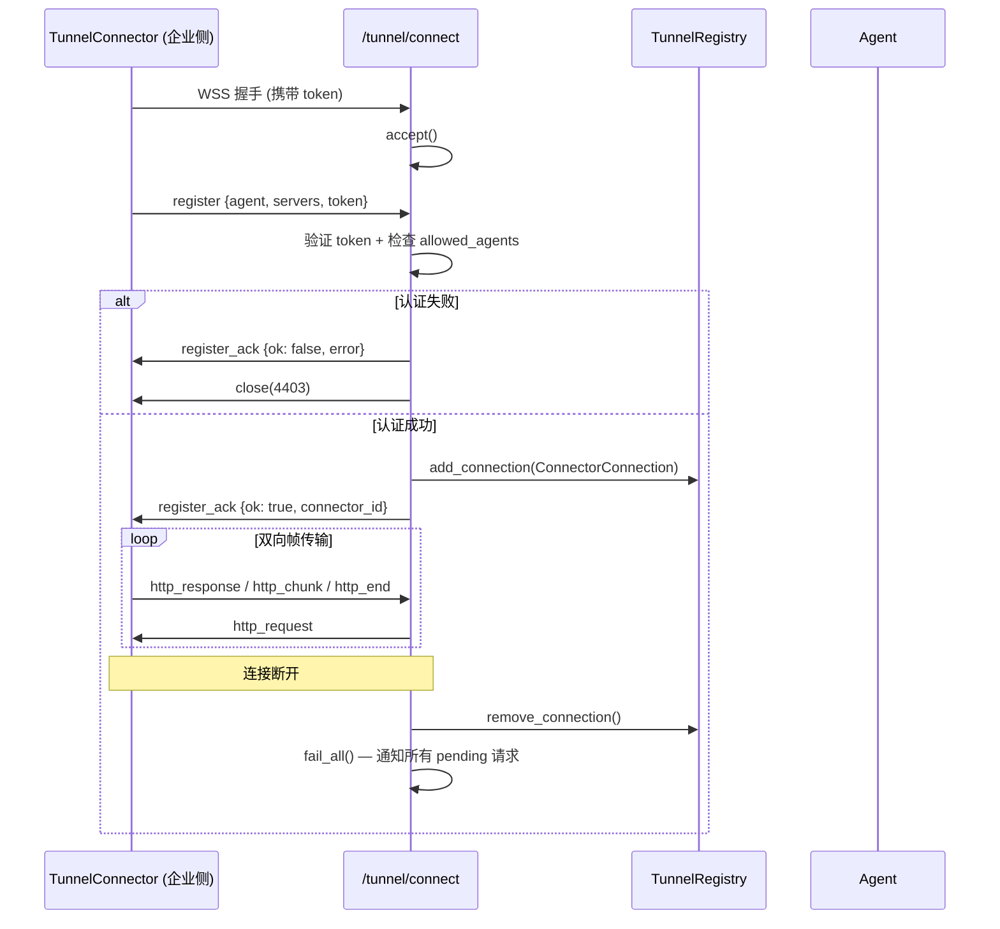
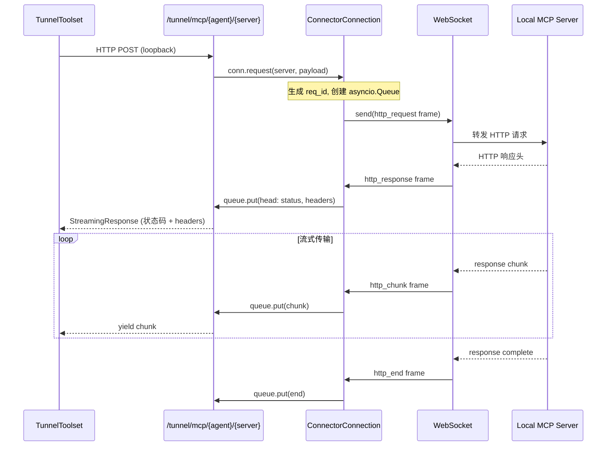

# 隧道与网络通信

Tunnel 是 veadk-python 的安全网络桥接系统，解决企业内网资源（数据库、内部 API、MCP 工具服务器）无法被云端 Agent 直接访问的问题。核心思路是：**企业内网主动发起出站 WebSocket 连接到云端 Agent**，通过这个长连接双向转发 HTTP 请求和流式响应，无需开放入站防火墙端口，认证凭据始终留在企业侧。

## 架构设计

```
┌─────────────────── 企业内网（防火墙内）───────────────────┐
│                                                           │
│  ┌─────────────┐    HTTP     ┌────────────────────────┐  │
│  │  本地 MCP    │◄──────────►│   TunnelConnector      │  │
│  │  服务器      │             │   (企业侧客户端)         │  │
│  │  :9000/mcp  │             │                        │  │
│  └─────────────┘             │   - 出站 WSS 连接       │  │
│                               │   - 注册 LocalServer   │  │
│                               │   - 转发请求/响应      │  │
│                               └───────────┬────────────┘  │
│                                           │ 出站 WSS      │
└───────────────────────────────────────────┼───────────────┘
                                            │ (防火墙允许出站)
                                            ▼
┌──────────────────── 云端（VeFaaS/公网）────────────────────┐
│                                           │                │
│  ┌────────────────────────────────────────┴───────────┐   │
│  │              /tunnel/connect (WebSocket)           │   │
│  │                                                    │   │
│  │  ┌─────────────────────────────────────────────┐   │   │
│  │  │         ConnectorConnection                 │   │   │
│  │  │  (认证、注册、pending 请求队列、帧分发)      │   │   │
│  │  └──────────────────┬──────────────────────────┘   │   │
│  │                     │                              │   │
│  │  ┌──────────────────▼──────────────────────────┐   │   │
│  │  │           TunnelRegistry (进程内)            │   │   │
│  │  │  agent_name → {online servers, connections}  │   │   │
│  │  └──────────────────┬──────────────────────────┘   │   │
│  │                     │                              │   │
│  │  ┌──────────────────▼──────────────────────────┐   │   │
│  │  │  /tunnel/mcp/{agent}/{server}[/{path}]       │   │   │
│  │  │  HTTP 代理端点（loopback 调用）               │   │   │
│  │  └──────────────────┬──────────────────────────┘   │   │
│  │                     │                              │   │
│  │  ┌──────────────────▼──────────────────────────┐   │   │
│  │  │         TunnelToolset                       │   │   │
│  │  │  动态发现在线服务器 → MCP 工具列表           │   │   │
│  │  │  每轮 get_tools() 从 Registry 读取           │   │   │
│  │  └──────────────────┬──────────────────────────┘   │   │
│  └─────────────────────┼──────────────────────────────┘   │
│                        │                                  │
│  ┌─────────────────────▼──────────────────────────────┐   │
│  │              Agent (enable_tunnel=True)             │   │
│  │   像使用普通工具一样调用隧道后的 MCP 工具            │   │
│  └────────────────────────────────────────────────────┘   │
└───────────────────────────────────────────────────────────┘
```

**安全设计要点：**
1. **仅出站连接**：企业侧不需要开放任何入站端口，只需允许出站 WSS 到云端
2. **Token 认证**：WebSocket 连接需携带共享 token，支持 Bearer header 或 query 参数
3. **凭据隔离**：本地服务器的认证 headers/query 只在企业侧 Connector 中附加，云端不可见
4. **Agent 级授权**：`allowed_agents` 限制哪些 Agent 可以接收隧道注册
5. **动态发现**：服务器上下线即时生效，无需重启 Agent

## 云端组件

### mount_tunnel：挂载隧道路由

[veadk/tunnel/server.py:L117-L275](file:///d:/spaces/SpecWeave/external/libs/models/ai/veadk-python/veadk/tunnel/server.py#L117-L275)

在 FastAPI 应用上挂载三个隧道端点：

```python
def mount_tunnel(
    app: FastAPI,
    *,
    token: Optional[str] = None,
    allowed_agents: Optional[list[str]] = None,
    auth: Optional[AuthFn] = None,
    registry: Optional[TunnelRegistry] = None,
) -> None:
```

| 端点 | 方法 | 用途 |
|------|------|------|
| `WS /tunnel/connect` | WebSocket | Connector 连接入口（认证、注册、双向帧传输） |
| `/tunnel/mcp/{agent}/{server}[/{path}]` | GET/POST/DELETE | MCP HTTP 代理（Agent 工具通过 loopback 调用） |
| `GET /tunnel/servers` | GET | 查询指定 Agent 在线的服务器列表 |

#### WebSocket 连接协议



#### HTTP 代理流程

当 Agent 的 MCPToolset 调用本地 MCP 端点时，请求实际走 `/tunnel/mcp/` 代理：



### mount_tunnel_if_enabled：按需挂载

[veadk/tunnel/server.py:L278-L293](file:///d:/spaces/SpecWeave/external/libs/models/ai/veadk-python/veadk/tunnel/server.py#L278-L293)

```python
def mount_tunnel_if_enabled(app: FastAPI, agents: list, **kwargs) -> bool:
```

自动检测 Agent 列表中是否有设置 `enable_tunnel=True` 的 Agent，有才挂载隧道路由。将这些 Agent 的名字自动加入 `allowed_agents`。

```python
enabled = [a.name for a in agents if getattr(a, "enable_tunnel", False)]
if not enabled:
    return False
mount_tunnel(app, allowed_agents=enabled, **kwargs)
```

### ConnectorConnection：连接器状态

[veadk/tunnel/server.py:L66-L109](file:///d:/spaces/SpecWeave/external/libs/models/ai/veadk-python/veadk/tunnel/server.py#L66-L109)

```python
@dataclass
class ConnectorConnection:
    connector_id: str
    websocket: WebSocket
    agent_name: str
    servers: list[ServerDescriptor]
    pending: dict[str, asyncio.Queue] = field(default_factory=dict)
```

每个企业侧连接对应一个 `ConnectorConnection`：
- `request(server, payload)`：发送 http_request 帧，创建等待队列
- `dispatch(msg)`：将入站帧分发到对应请求的队列
- `fail_all()`：连接断开时，所有 pending 请求收到 error

帧类型（type 字段）：

| 帧类型 | 方向 | 用途 |
|--------|------|------|
| `register` | C→W | 初始注册（agent 名、server 列表、token） |
| `register_ack` | W→C | 注册确认（ok/connector_id 或 error） |
| `http_request` | W→C | 转发 HTTP 请求到本地服务器 |
| `http_response` | C→W | HTTP 响应头（status、headers） |
| `http_chunk` | C→W | 响应体数据块（支持 SSE 流式） |
| `http_end` | C→W | 响应结束 |
| `http_error` | 双向 | 请求/连接错误 |

### TunnelRegistry：进程内注册表

[veadk/tunnel/registry.py:L67-L125](file:///d:/spaces/SpecWeave/external/libs/models/ai/veadk-python/veadk/tunnel/registry.py#L67-L125)

```python
class TunnelRegistry:
    def __init__(self) -> None:
        self._lock = threading.RLock()
        self._connections: dict[str, "ConnectorConnection"] = {}

    def add_connection(self, conn): ...
    def remove_connection(self, connector_id): ...
    def list_servers(self, agent_name) -> list[ServerDescriptor]: ...
    def find_connection(self, agent_name, server_name) -> Optional[ConnectorConnection]: ...
    def has_agent(self, agent_name) -> bool: ...
```

注册表维护 connector_id → ConnectorConnection 的映射，提供线程安全的增删查操作。`get_registry()` 返回进程全局单例。

> **多副本注意事项**：Connector 的 WebSocket 绑定到特定进程，Registry 是进程内的。多副本部署时需要粘性路由（sticky session）或共享 Registry，否则 Agent 运行可能找不到已连接的 Connector。

## 企业侧组件

### LocalServer：本地服务器描述

[veadk/tunnel/connector.py:L38-L65](file:///d:/spaces/SpecWeave/external/libs/models/ai/veadk-python/veadk/tunnel/connector.py#L38-L65)

```python
@dataclass
class LocalServer:
    name: str                              # 云端 Agent 看到的服务器名
    address: str                           # 本地 MCP Streamable-HTTP 端点
    protocol: str = "mcp"                  # 资源协议（目前仅支持 mcp）
    tool_filter: Optional[list[str]] = None # 可选：只暴露指定工具
    headers: dict[str, str] = field(default_factory=dict)  # 本地认证头（留在企业侧）
    query: dict[str, str] = field(default_factory=dict)    # 本地查询参数
```

`descriptor()` 方法返回发送给云端的信息（不包含 address、headers、query 等敏感信息）：

```python
def descriptor(self) -> dict:
    return {"name": self.name, "protocol": self.protocol, "tool_filter": self.tool_filter}
```

### TunnelConnector：企业侧连接器

[veadk/tunnel/connector.py:L77-L202](file:///d:/spaces/SpecWeave/external/libs/models/ai/veadk-python/veadk/tunnel/connector.py#L77-L202)

```python
class TunnelConnector:
    def __init__(
        self,
        cloud_url: str,
        agent: str,
        servers: list[LocalServer],
        token: Optional[str] = None,
        extra_headers: Optional[dict[str, str]] = None,
    ):
```

#### 启动流程（start 方法）

1. 构造 WSS URL：`https://` → `wss://`，追加 `/tunnel/connect?token=...`
2. 建立 WebSocket 连接（extra_headers 用于 API Gateway 认证）
3. 发送 register 帧（agent 名、server descriptor 列表）
4. 等待 register_ack，失败则抛出异常
5. 进入消息循环，收到 http_request 帧时**并发处理**（asyncio.create_task），确保 SSE 长连接不阻塞其他请求

#### 请求处理（_handle_request 方法）

1. 查找目标 LocalServer
2. 合并转发 headers 和本地认证 headers（本地 headers 覆盖）
3. 使用 httpx 流式请求本地 MCP 服务器
4. 先发送 http_response 帧（状态码 + headers）
5. 逐块发送 http_chunk 帧
6. 发送 http_end 帧结束；出错发送 http_error 帧

```python
async with http.stream(method, url=server.address, headers=fwd, ...) as resp:
    await ws.send({"type": "http_response", "id": req_id, "status": resp.status_code, ...})
    async for chunk in resp.aiter_bytes():
        await ws.send({"type": "http_chunk", "id": req_id, "data": chunk.decode(...)})
    await ws.send({"type": "http_end", "id": req_id})
```

## Agent 侧：TunnelToolset

[veadk/tunnel/toolset.py:L53-L104](file:///d:/spaces/SpecWeave/external/libs/models/ai/veadk-python/veadk/tunnel/toolset.py#L53-L104)

设置 `enable_tunnel=True` 的 Agent 会自动获得 `TunnelToolset`（F-026）。ADK 在每轮 LLM 调用前调用 `get_tools()`，Toolset 从 Registry 读取当前在线服务器列表：

```python
class TunnelToolset(BaseToolset):
    def __init__(self, agent_name: str, registry: Optional[TunnelRegistry] = None):
        self.agent_name = agent_name
        self._registry = registry or get_registry()
        self._handlers: dict[str, BaseProtocol] = {}

    async def get_tools(self, readonly_context=None) -> list[BaseTool]:
        servers = self._registry.list_servers(self.agent_name)
        online_names = {s.name for s in servers}

        # 清理已下线服务器的 handler
        for stale in [n for n in self._handlers if n not in online_names]:
            await self._safe_close(self._handlers.pop(stale))

        tools = []
        for server in servers:
            handler = self._handlers.get(server.name)
            if handler is None:
                proxy_url = f"{_self_base_url()}/tunnel/mcp/{self.agent_name}/{server.name}"
                handler = get_protocol(server.protocol)(server, proxy_url)
                self._handlers[server.name] = handler
            tools.extend(await handler.get_tools(readonly_context))
        return tools
```

**动态发现机制：**
- 每轮调用 `get_tools()` 时重新读取 Registry
- 新上线的服务器自动创建 Protocol handler 和 MCP 工具
- 已下线的服务器自动关闭 handler 并移除
- 无需重启 Agent，服务器上下线在下一轮对话立即生效

Loopback 代理地址通过 `TUNNEL_SELF_PORT` 或 `PORT` 环境变量确定（默认 8000），指向 `http://127.0.0.1:{port}/tunnel/mcp/{agent}/{server}`。

## 协议层

### BaseProtocol 抽象

[veadk/tunnel/protocol/base.py](file:///d:/spaces/SpecWeave/external/libs/models/ai/veadk-python/veadk/tunnel/protocol/base.py)

协议层封装了不同资源协议的适配逻辑，目前支持 MCP 协议。`get_protocol(name)` 工厂函数按协议名返回对应 handler 类。

### MCP 协议

[veadk/tunnel/protocol/mcp.py](file:///d:/spaces/SpecWeave/external/libs/models/ai/veadk-python/veadk/tunnel/protocol/mcp.py)

MCP 协议 handler 连接到代理 URL（loopback），获取远程 MCP 服务器的工具列表，将其包装为 ADK BaseTool 返回给 Agent。支持 tool_filter 过滤。

## 基本使用示例

### 云端 Agent 启用隧道

```python
from veadk import Agent, Runner
from veadk.tunnel import mount_tunnel_if_enabled
from fastapi import FastAPI
import uvicorn

# 创建启用隧道的 Agent
agent = Agent(
    name="ops",
    instruction="你是运维助手，可以查询内网数据库状态。",
    enable_tunnel=True,   # 启用隧道，自动挂载 TunnelToolset
)

# 创建 FastAPI 应用并挂载隧道
app = FastAPI()
mount_tunnel_if_enabled(
    app,
    agents=[agent],
    token="my-secret-tunnel-token",
)
# 将 ADK Runner 也挂载到 app...

uvicorn.run(app, host="0.0.0.0", port=8000)
```

### 企业内网启动 Connector

```python
import asyncio
from veadk.tunnel import TunnelConnector, LocalServer

async def main():
    connector = TunnelConnector(
        cloud_url="https://my-agent.apigateway-cn-beijing.volceapi.com",
        agent="ops",
        token="my-secret-tunnel-token",
        servers=[
            LocalServer(
                name="db",
                address="http://internal-db-mcp:9000/mcp",
                # 数据库认证凭据仅在企业侧使用
                headers={"Authorization": "Bearer internal-db-token"},
            ),
            LocalServer(
                name="monitor",
                address="http://monitoring.internal:8080/mcp",
                tool_filter=["get_metrics", "get_alerts"],  # 只暴露部分工具
            ),
        ],
    )
    await connector.start()  # 阻塞运行，保持长连接

asyncio.run(main())
```

启动后，云端 Agent `ops` 即可通过隧道调用内网数据库和监控系统的 MCP 工具，全程无需开放入站端口。

## 关键文件索引

| 文件 | 职责 |
|------|------|
| [veadk/tunnel/\_\_init\_\_.py](file:///d:/spaces/SpecWeave/external/libs/models/ai/veadk-python/veadk/tunnel/__init__.py) | 模块导出 |
| [veadk/tunnel/server.py](file:///d:/spaces/SpecWeave/external/libs/models/ai/veadk-python/veadk/tunnel/server.py) | 云端路由：mount_tunnel、ConnectorConnection、HTTP 代理、帧协议 |
| [veadk/tunnel/connector.py](file:///d:/spaces/SpecWeave/external/libs/models/ai/veadk-python/veadk/tunnel/connector.py) | 企业侧客户端：TunnelConnector、LocalServer、请求转发 |
| [veadk/tunnel/registry.py](file:///d:/spaces/SpecWeave/external/libs/models/ai/veadk-python/veadk/tunnel/registry.py) | 进程内注册表：TunnelRegistry、ServerDescriptor、get_registry |
| [veadk/tunnel/toolset.py](file:///d:/spaces/SpecWeave/external/libs/models/ai/veadk-python/veadk/tunnel/toolset.py) | Agent 工具集：TunnelToolset、动态发现、Protocol handler 缓存 |
| [veadk/tunnel/protocol/base.py](file:///d:/spaces/SpecWeave/external/libs/models/ai/veadk-python/veadk/tunnel/protocol/base.py) | 协议抽象基类 |
| [veadk/tunnel/protocol/mcp.py](file:///d:/spaces/SpecWeave/external/libs/models/ai/veadk-python/veadk/tunnel/protocol/mcp.py) | MCP 协议适配 |

## 相关概念

- [工具定义与调用](tool-definition.md) — Tunnel 将远程 MCP 工具动态挂载为 Agent 工具
- [Agent-to-Agent 协议](a2a-protocol.md) — A2A 处理 Agent 间通信，Tunnel 处理企业内网资源桥接
- [Agent 类与 Runner 执行引擎](agent-and-runner.md) — Agent.enable_tunnel 字段和 TunnelToolset 挂载
