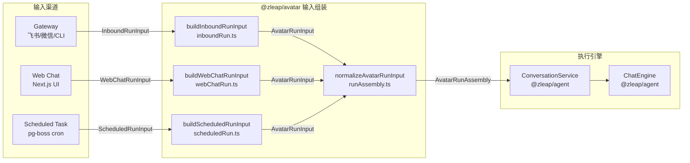
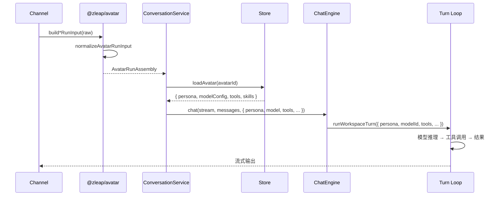
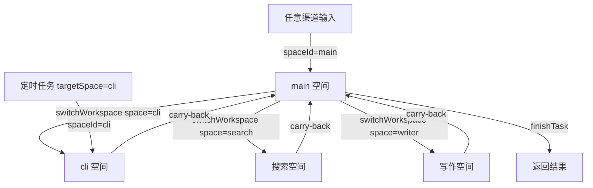

## 概述

`@zleap/avatar` 包是 Zleap-Agent 的 **输入组装层**（Input Assembly Layer），负责将来自不同渠道（Web 聊天、IM 网关、定时任务）的原始输入标准化为统一的 `AvatarRunAssembly` 结构，供下游 ConversationService 和 ChatEngine 消费。它本身不执行 Agent 逻辑，而是作为"人格入口"——通过 `avatarId` 绑定 Agent 人格配置，通过 `channel` 区分输入来源，通过 `permissionMode` 控制权限级别。

Avatar 的设计哲学是 **"渠道无关的统一入口"**：无论是飞书消息、Web UI 对话还是定时 cron 触发，都经过同一套规范化流程，下游执行引擎无需感知输入来源差异。



## 设计原理

### 渠道与权限的正交设计

Avatar 系统将输入来源（channel）与权限模式（permissionMode）解耦：

- **channel**：标识输入来自哪个渠道（`web`、`scheduled-task`、`gateway`），决定历史加载策略和消息路由
- **permissionMode**：决定工具执行的审批策略（`default`、`read-only`、`trusted`），不与渠道硬绑定

例如，定时任务默认使用 `trusted` 权限（无人值守自动执行），但 Web 渠道的管理员也可以手动设置 `trusted` 模式；网关渠道默认 `default`（需要 HITL 审批），但可以通过配置调整。

### 默认值填充与规范化

所有渠道的输入构建器最终调用 `normalizeAvatarRunInput`，该函数负责：

1. 填充默认 `avatarId`（`DEFAULT_AVATAR_ID`）
2. 验证必填字段（actorId、spaceId、prompt）
3. 清理空白字符串
4. 设置默认 `permissionMode`（`default`）

这种"各渠道构建器 + 统一规范化"的模式避免了重复校验逻辑，同时允许各渠道设置差异化默认值。

### 工作空间路由

每个 Avatar Run 携带 `spaceId`，决定 Agent 在哪个工作空间启动执行。默认值为 `CANONICAL_MAIN_SPACE_ID`（`main` 空间），即所有输入默认进入主空间，由主空间模型自主路由到子空间（参见 [subagent-delegation.md](subagent-delegation.md)）。

## 核心类型

### AvatarRunChannel

```typescript
export type AvatarRunChannel = 'web' | 'scheduled-task' | 'gateway';
```

| 渠道 | 来源 | 特征 |
|------|------|------|
| `web` | Web UI 聊天（Next.js） | 有 conversationId 进行多轮对话，支持 HITL |
| `scheduled-task` | pg-boss cron 触发 | 无历史（historySource: 'none'），无人值守 |
| `gateway` | IM 网关（飞书/微信/飞书CLI） | 有 eventId 作为消息标识，需审批 |

### AvatarRunPermissionMode

```typescript
export type AvatarRunPermissionMode = 'default' | 'read-only' | 'trusted';
```

| 模式 | 审批策略 | 典型场景 |
|------|---------|---------|
| `default` | 高风险工具需 HITL 审批，安全工具自动通过 | 普通用户对话 |
| `read-only` | 仅允许只读工具，所有写操作需审批 | 访客/公开演示 |
| `trusted` | 所有工具自动批准（仅非高风险白名单） | 定时任务、管理员操作 |

### AvatarRunAssembly（规范化输出）

```typescript
export type AvatarRunAssembly = {
  channel: AvatarRunChannel;
  avatarId: string;           // 默认 DEFAULT_AVATAR_ID
  actorId: string;            // 必填：触发者 ID
  spaceId: string;            // 必填：入口工作空间
  conversationId?: string;    // Web 多轮对话 ID
  messageId?: string;         // 消息/事件 ID
  prompt: string;             // 必填：用户输入文本
  permissionMode: AvatarRunPermissionMode;
};
```

## 统一规范化器

[normalizeAvatarRunInput](file:///d:/spaces/SpecWeave/external/libs/models/ai/Zleap-Agent/packages/avatar/src/runAssembly.ts#L36-L47) 是所有渠道的最终规范化入口：

```typescript
export class AvatarRunInputError extends Error {
  constructor(readonly code: string) {
    super(code);
    this.name = 'AvatarRunInputError';
  }
}

export function normalizeAvatarRunInput(input: AvatarRunInput): AvatarRunAssembly {
  return {
    channel: input.channel,
    avatarId: cleanOptionalString(input.avatarId) ?? DEFAULT_AVATAR_ID,
    actorId: cleanRequiredString('actor_id_required', input.actorId),
    spaceId: cleanRequiredString('space_id_required', input.spaceId),
    ...optionalStringField('conversationId', input.conversationId),
    ...optionalStringField('messageId', input.messageId),
    prompt: cleanRequiredString('prompt_required', input.prompt),
    permissionMode: input.permissionMode ?? 'default',
  };
}
```

### 校验规则

必填字段缺失时抛出带错误码的 `AvatarRunInputError`：

| 错误码 | 含义 |
|--------|------|
| `actor_id_required` | actorId 为空 |
| `space_id_required` | spaceId 为空 |
| `prompt_required` | prompt 为空 |

这种错误码设计使得上层可以精确处理用户输入错误，而非依赖字符串匹配。

## 渠道输入构建器

### Gateway 渠道（inboundRun）

[buildInboundRunInput](file:///d:/spaces/SpecWeave/external/libs/models/ai/Zleap-Agent/packages/avatar/src/inboundRun.ts#L12-L20) 处理来自 IM 网关的入站消息：

```typescript
export type InboundRunInput = {
  avatarId?: string;
  actorId: string;
  spaceId?: string;
  eventId: string;     // 平台事件 ID（如飞书 message_id）
  prompt: string;
};

export function buildInboundRunInput(input: InboundRunInput): AvatarRunAssembly {
  return normalizeAvatarRunInput({
    channel: 'gateway',
    avatarId: input.avatarId,
    actorId: input.actorId,
    spaceId: input.spaceId ?? CANONICAL_MAIN_SPACE_ID,
    messageId: input.eventId,  // eventId 映射为 messageId
    prompt: input.prompt,
  });
}
```

特征：
- `channel: 'gateway'`
- 默认 `spaceId` 为 `main`
- `eventId` 作为 `messageId` 传递，用于消息去重和回复引用
- `permissionMode` 默认 `default`（需 HITL 审批）

### Scheduled Task 渠道（scheduledRun）

[buildScheduledRunInput](file:///d:/spaces/SpecWeave/external/libs/models/ai/Zleap-Agent/packages/avatar/src/scheduledRun.ts#L12-L21) 处理定时任务触发：

```typescript
export type ScheduledRunInput = {
  avatarId?: string;
  actorId: string;
  spaceId?: string;
  taskId: string;      // 定时任务 ID
  prompt: string;
};

export function buildScheduledRunInput(input: ScheduledRunInput): AvatarRunAssembly {
  return normalizeAvatarRunInput({
    channel: 'scheduled-task',
    avatarId: input.avatarId,
    actorId: input.actorId,
    spaceId: input.spaceId ?? CANONICAL_MAIN_SPACE_ID,
    messageId: input.taskId,   // taskId 映射为 messageId
    prompt: input.prompt,
    permissionMode: 'trusted', // 无人值守，自动审批
  });
}
```

特征：
- `channel: 'scheduled-task'`
- `permissionMode: 'trusted'`——无人值守场景，所有工具自动执行（高风险工具仍通过 `shouldAutoApproveToolWithoutHitl` 白名单控制）
- `taskId` 作为 `messageId`，用于运行审计关联
- 执行时 `historySource: 'none'`，不加载对话历史

### Web Chat 渠道（webChatRun）

[buildWebChatRunInput](file:///d:/spaces/SpecWeave/external/libs/models/ai/Zleap-Agent/packages/avatar/src/webChatRun.ts#L13-L22) 处理 Web UI 聊天：

```typescript
export type WebChatRunInput = {
  avatarId?: string;
  actorId: string;
  spaceId?: string;
  conversationId?: string;  // 多轮对话 ID
  messageId?: string;       // 消息 ID
  prompt: string;
};

export function buildWebChatRunInput(input: WebChatRunInput): AvatarRunAssembly {
  return normalizeAvatarRunInput({
    channel: 'web',
    avatarId: input.avatarId,
    actorId: input.actorId,
    spaceId: input.spaceId ?? CANONICAL_MAIN_SPACE_ID,
    conversationId: input.conversationId,
    messageId: input.messageId,
    prompt: input.prompt,
    // permissionMode 默认 'default'
  });
}
```

特征：
- `channel: 'web'`
- 支持 `conversationId` 实现多轮对话上下文加载
- `permissionMode` 默认 `default`（Web UI 有交互界面支持审批弹窗）

## 渠道对比矩阵

| 维度 | gateway | web | scheduled-task |
|------|---------|-----|---------------|
| 构建器 | buildInboundRunInput | buildWebChatRunInput | buildScheduledRunInput |
| messageId 来源 | eventId | 自定义 messageId | taskId |
| conversationId | 无 | 有 | 无（独立） |
| 默认 permissionMode | default | default | **trusted** |
| 历史加载 | 按平台配置 | 按 conversationId | **none**（无状态） |
| HITL 审批 | 支持（CLI/IM交互） | 支持（Web弹窗） | 不支持（自动） |
| 入口空间 | main（可指定） | main（可指定） | main 或 targetSpace |

## 与下游的协作

### ConversationService 消费

Avatar 组装完成的 `AvatarRunAssembly` 被 ConversationService 消费时，channel 决定执行策略：

```typescript
// 在 AgentTaskHandler (worker.ts) 中的使用
const scheduledRun = buildScheduledRunInput({
  avatarId: task.avatarId,
  actorId: task.userId ?? 'task-worker',
  spaceId: targetSpace,
  taskId: task.id,
  prompt: task.prompt,
});

const { text, error } = await this.conversations.run({
  channel: 'web',
  conversationId: runtime.conversationId,
  kind: 'schedule',
  text: scheduledRun.prompt,
  actor: { userId: scheduledRun.actorId, role: 'user' },
}, {
  historySource: 'none',  // scheduled-task 不加载历史
  model,
  avatarId: scheduledRun.avatarId,
  systemPrompt: runtime.systemPrompt,
  workspaceRoot: runtime.workspaceRoot,
  confirm: async (request) => {
    if (task.permissionMode === 'full_access') return true;
    return shouldAutoApproveToolWithoutHitl(request.name);
  },
});
```

### Avatar 与 Persona

`avatarId` 是人格系统的外键。存储层（`@zleap/store`）中的 Avatar 记录包含：

- **Persona 文本**：注入 Turn Loop 的系统提示词基础（`persona` 参数）
- **模型配置**：绑定的 LLM 模型
- **工作空间配置**：可用工具集、技能列表
- **权限默认值**：默认 permissionMode

Avatar 包本身不加载人格数据——它只负责传递 `avatarId`，实际的人格文本和模型解析由 ConversationService 从 Store 加载后注入 ChatEngine。



## 工作空间入口路由

所有渠道的 `spaceId` 默认为 `CANONICAL_MAIN_SPACE_ID`（`main`），这是一个精心设计的默认值：

1. **统一路由入口**：不管输入从哪里来，都先进入 main 空间
2. **模型自主决策**：main 空间模型根据用户意图通过 `switchWorkspace` 路由到专业空间
3. **可覆盖**：定时任务可通过 `targetSpace` 配置直接进入指定空间（跳过 main 路由），适用于明确知道目标空间的场景（如每日报告直接进入 cli 空间执行脚本）



## 错误处理

输入校验失败时抛出 `AvatarRunInputError`，携带结构化错误码：

```typescript
function cleanRequiredString(code: string, value: string): string {
  const trimmed = value.trim();
  if (!trimmed) throw new AvatarRunInputError(code);
  return trimmed;
}
```

这使得调用方可以通过 `error instanceof AvatarRunInputError` 精确捕获输入错误，并根据 `error.code` 给出用户友好的提示（如"请输入消息内容"而非通用的 500 错误）。

## 包导出

```typescript
// packages/avatar/src/index.ts
export { buildInboundRunInput } from './inboundRun.js';
export { buildScheduledRunInput } from './scheduledRun.js';
export { buildWebChatRunInput } from './webChatRun.js';
export { normalizeAvatarRunInput, AvatarRunInputError } from './runAssembly.js';
export type {
  AvatarRunChannel,
  AvatarRunPermissionMode,
  AvatarRunInput,
  AvatarRunAssembly,
} from './runAssembly.js';
export type { InboundRunInput } from './inboundRun.js';
export type { ScheduledRunInput } from './scheduledRun.js';
export type { WebChatRunInput } from './webChatRun.js';
```

导出设计遵循"显式导出"原则：每个渠道的输入类型和构建器独立导出，同时导出统一的规范化器和基础类型。

## 源码参考

| 文件 | 关键内容 |
|------|---------|
| [runAssembly.ts](file:///d:/spaces/SpecWeave/external/libs/models/ai/Zleap-Agent/packages/avatar/src/runAssembly.ts) | 核心类型定义、normalizeAvatarRunInput、AvatarRunInputError、字段清理工具 |
| [inboundRun.ts](file:///d:/spaces/SpecWeave/external/libs/models/ai/Zleap-Agent/packages/avatar/src/inboundRun.ts) | Gateway 渠道构建器、eventId→messageId 映射 |
| [scheduledRun.ts](file:///d:/spaces/SpecWeave/external/libs/models/ai/Zleap-Agent/packages/avatar/src/scheduledRun.ts) | 定时任务构建器、permissionMode=trusted |
| [webChatRun.ts](file:///d:/spaces/SpecWeave/external/libs/models/ai/Zleap-Agent/packages/avatar/src/webChatRun.ts) | Web 聊天构建器、conversationId 支持 |
| [index.ts](file:///d:/spaces/SpecWeave/external/libs/models/ai/Zleap-Agent/packages/avatar/src/index.ts) | 包导出清单 |

## 小结

`@zleap/avatar` 包虽然代码量小（4个文件），但扮演着关键的架构角色：

1. **渠道归一化**：三种输入渠道统一为 AvatarRunAssembly，下游引擎无需感知来源差异
2. **权限分级**：permissionMode 与 channel 正交设计，支持灵活的审批策略配置
3. **人格入口**：avatarId 作为外键连接人格配置，实现"同引擎、多人格"
4. **空间路由**：默认 main 空间入口，配合 Workspace 委派模型实现统一路由
5. **防御式校验**：必填字段校验和错误码设计，防止空 prompt/actorId 进入执行引擎
6. **轻量无状态**：Avatar 包本身是纯函数集合，无 IO 操作，易于测试和组合
