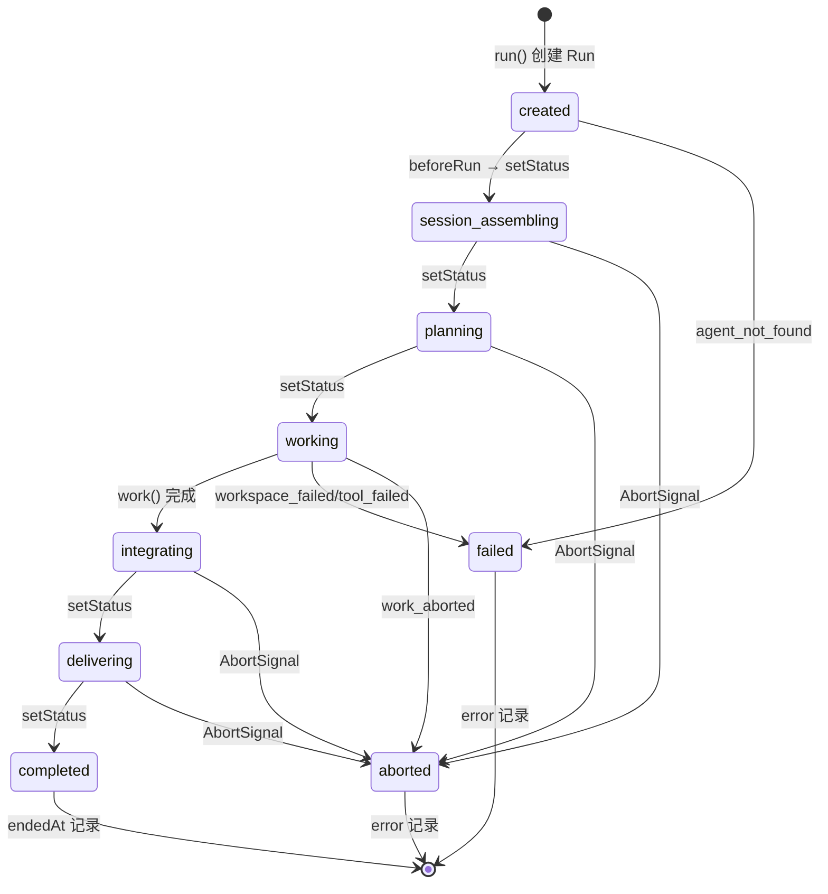
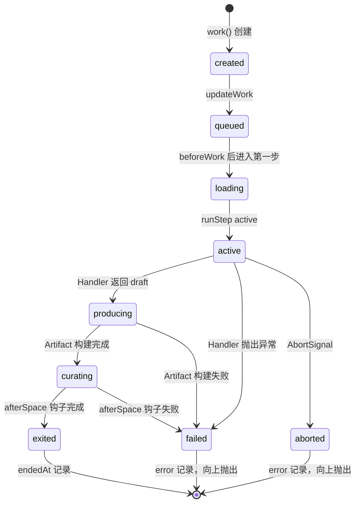
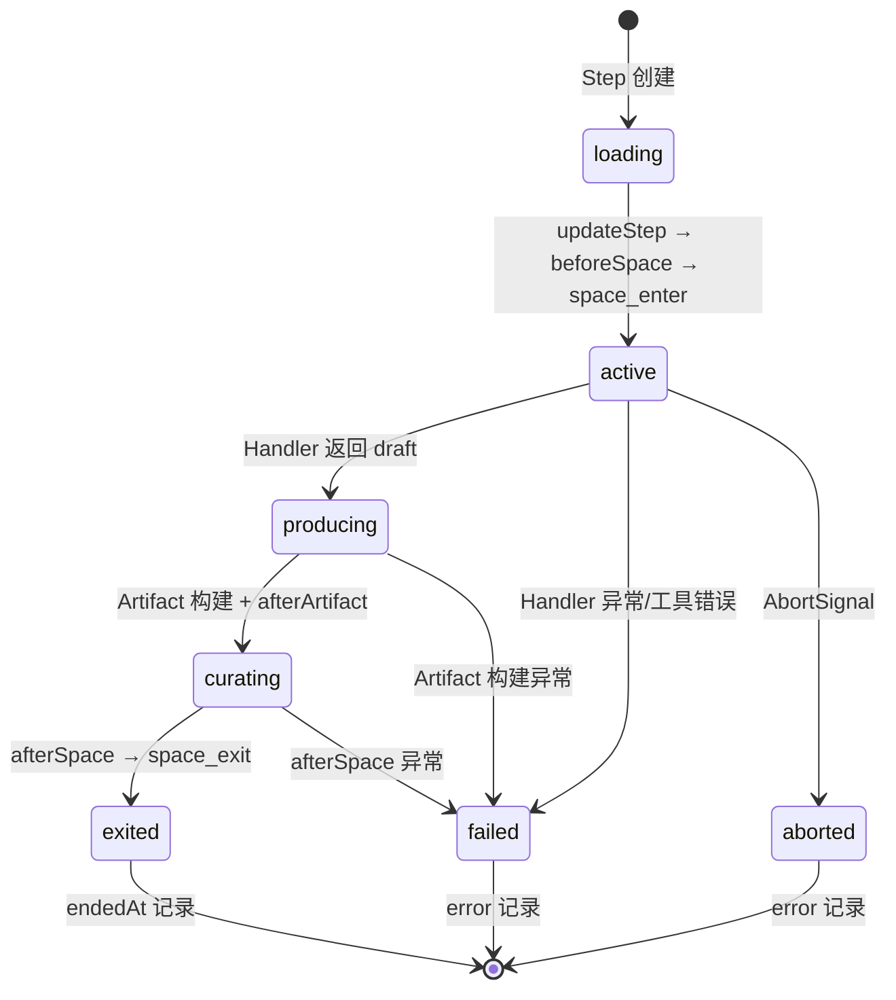

# Fiber 执行生命周期与状态机

Zleap-Agent 的执行模型采用 **三级 Fiber 架构**：Run（一次完整任务执行）→ Work（一次 Workspace 流水线遍历）→ WorkStep（单个 Workspace 处理步骤）。每一级都有独立的状态枚举、生命周期钩子和事件通知，形成一套可观测、可中断、可恢复的协程式执行模型。

## 整体架构

AgentRuntime 是整个执行模型的核心，聚合了 8 个注册中心成员，对外提供 `runAgent()`、`run()`、`work()`、`callTool()` 四个核心方法：

```
┌─────────────────────────────────────────────────────────────────────┐
│                          AgentRuntime                               │
│                                                                     │
│  ┌────────────┐ ┌────────────┐ ┌────────────┐ ┌────────────┐       │
│  │  agents    │ │   tools    │ │  skills    │ │ workspaces │       │
│  │ (Registry) │ │ (Registry) │ │ (Registry) │ │ (Registry) │       │
│  └────────────┘ └────────────┘ └────────────┘ └────────────┘       │
│  ┌────────────┐ ┌────────────┐ ┌────────────┐ ┌────────────┐       │
│  │  events    │ │   hooks    │ │ memories   │ │ sessions   │       │
│  │ (EventBus) │ │(HookRegistry)│(MemoryReg) │ │(SessionReg)│       │
│  └────────────┘ └────────────┘ └────────────┘ └────────────┘       │
│  ┌────────────┐                                                     │
│  │  traces    │  ← 运行追踪记录存储                                  │
│  │(TraceStore)│                                                     │
│  └────────────┘                                                     │
└─────────────────────────────────────────────────────────────────────┘
```

AgentRuntime 的构造函数自动注册了两个关键观察者：

```typescript
// runtime.ts L95-L104
this.hooks.register({
  afterRun: ({ run, request }) => {
    if (run.status === 'completed') {
      this.persistRunMemory(run, request.memory);
    }
  },
});
this.events.observe((event) => {
  this.recordTrace(event);
});
```

- `afterRun` 钩子在 Run 完成时自动持久化记忆到运行时缓存
- `events.observe` 将所有事件自动记录到 TraceStore

## 三级状态枚举

### RunStatus — 运行级状态（10 种）

Run 表示一次完整的 Agent 任务执行，从创建到最终交付经历线性状态流转：

```typescript
// types.ts L1-L11
export type RunStatus =
  | 'created'           // 已创建，尚未开始
  | 'session_assembling' // 会话组装中
  | 'planning'          // 规划阶段
  | 'working'           // 执行中（Workspace 流水线运行）
  | 'integrating'       // 结果整合中
  | 'delivering'        // 交付中
  | 'idle'              // 空闲（中间状态）
  | 'completed'         // 正常完成
  | 'aborted'           // 用户中止
  | 'failed';           // 执行失败
```

**正常流转路径**：`created → session_assembling → planning → working → integrating → delivering → completed`

**异常路径**：任意阶段可转入 `aborted`（AbortSignal 触发）或 `failed`（错误抛出）。

### WorkStatus — 工作级状态（10 种）

Work 表示一次 Workspace 流水线遍历，在 `working` 阶段被创建和执行：

```typescript
// types.ts L13-L23
export type WorkStatus =
  | 'created'     // 已创建
  | 'queued'      // 已入队，等待执行
  | 'loading'     // 加载上下文/技能/工具中
  | 'active'      // 正在执行 Workspace Handler
  | 'producing'   // 生成 Artifact 中
  | 'curating'    // 审校/后处理 Artifact 中
  | 'exited'      // 正常退出
  | 'suspended'   // 挂起（等待用户输入等）
  | 'failed'      // 执行失败
  | 'aborted';    // 被中止
```

### WorkStepStatus — 步骤级状态（7 种）

WorkStep 表示流水线中单个 Workspace 的执行：

```typescript
// types.ts L25-L32
export type WorkStepStatus =
  | 'loading'     // 加载中
  | 'active'      // Handler 执行中
  | 'producing'   // 产出 Artifact 中
  | 'curating'    // 审校中
  | 'exited'      // 正常退出
  | 'failed'      // 失败
  | 'aborted';    // 中止
```

注意 WorkStep 没有 `created`/`queued` 状态——它在创建时直接以 `loading` 状态开始。

## Run 状态机详解

`run()` 方法是 Run 状态机的驱动核心：

```typescript
// runtime.ts L181-L233（简化）
async run(request: WorkRequest, options: { signal?: AbortSignal } = {}): Promise<Run> {
  const run: Run = {
    id: this.idFactory(),
    agentId: request.agent?.id,
    session: request.session,
    status: 'created',        // ① 初始状态
    goal: request.goal,
    works: [],
    artifacts: [],
    startedAt: this.now(),
  };

  await this.events.emit({ type: 'agent_start', run });

  try {
    await this.hooks.beforeRun({ run, request });
    this.assertNotAborted(options.signal);
    await this.setRunStatus(run, 'session_assembling');  // ②
    await this.setRunStatus(run, 'planning');             // ③
    await this.setRunStatus(run, 'working');              // ④

    const work = await this.work(run, request, options.signal);  // Work 流水线
    run.artifacts = work.artifacts;

    this.assertNotAborted(options.signal);
    await this.setRunStatus(run, 'integrating');          // ⑤
    await this.setRunStatus(run, 'delivering');           // ⑥
    await this.setRunStatus(run, 'completed');            // ⑦ 成功终点
    run.endedAt = this.now();
  } catch (error) {
    run.error = toAgentError(error);
    run.endedAt = this.now();
    // ⑧ 异常终点：work_aborted → aborted，其他 → failed
    await this.setRunStatus(run, agentError.code === 'work_aborted' ? 'aborted' : 'failed');
    await this.events.emit({ type: 'error', runId: run.id, error: agentError });
  } finally {
    await this.hooks.afterRun({ run, request });
    // 会话更新与持久化
    if (session) {
      this.sessions.appendRun(session.id, run.id, updatedAt);
      this.firePersistence('touchSession', () => this.persistence?.touchSession?.(...));
      await this.hooks.afterSessionTouch({ run, request, session, updatedAt });
    }
    await this.events.emit({ type: 'agent_end', run });
  }
  return run;
}
```

### Run 状态流转图



关键设计：每个 `setRunStatus()` 调用都会通过事件总线发出 `run_status` 事件，使得 UI 层（CLI/Web/Gateway）可以实时感知状态变化。

## Work 状态机详解

`work()` 方法驱动 Work 状态机，按顺序遍历 `request.spaces` 数组中的每个 Workspace：

```typescript
// runtime.ts L235-L291（简化）
async work(run: Run, request: WorkRequest, signal?: AbortSignal): Promise<Work> {
  const work: Work = {
    id: this.idFactory(),
    /* ... */
    status: 'created',
    steps: [],
    artifacts: [],
    startedAt: this.now(),
  };
  run.works.push(work);

  await this.updateWork(run.id, work, 'queued');
  await this.events.emit({ type: 'before_work', runId: run.id, work });
  await this.hooks.beforeWork({ run, work, request });

  try {
    let input = request.context;
    for (const workspaceId of request.spaces) {
      // 串行执行每个 Workspace，前一个的 Artifact 作为后一个的 input
      const step = await this.runStep(run, request, work, workspace, input, signal);
      if (step.artifact) {
        work.artifacts.push(step.artifact);
        input = step.artifact;  // 流水线传递
      }
    }
    await this.updateWork(run.id, work, 'exited');
    work.endedAt = this.now();
  } catch (error) {
    work.error = toAgentError(error);
    await this.updateWork(run.id, work,
      agentError.code === 'work_aborted' ? 'aborted' : 'failed');
    throw agentError;
  } finally {
    await this.hooks.afterWork({ run, work, request });
    await this.events.emit({ type: 'after_work', runId: run.id, work });
  }
  return work;
}
```

### Work 流水线模型

Work 采用 **管道-过滤器（Pipeline）** 模式：多个 Workspace 按顺序执行，前一个 Workspace 产出的 Artifact 作为下一个 Workspace 的 `input`。

```
spases: ["planning", "coding", "review"]

  ┌──────────┐  Artifact  ┌──────────┐  Artifact  ┌──────────┐
  │ planning │───────────▶│  coding  │───────────▶│  review  │
  │ (Step 1) │  input→    │ (Step 2) │  input→    │ (Step 3) │
  └──────────┘            └──────────┘            └──────────┘
       │                       │                       │
       ▼                       ▼                       ▼
   Artifact[0]             Artifact[1]             Artifact[2]
```

### Work 状态流转图



## WorkStep 状态机详解

`runStep()` 是最细粒度的执行单元，负责调用单个 Workspace 的 Handler 函数并管理其完整生命周期：

```typescript
// runtime.ts L293-L409（简化）
private async runStep(run, request, work, workspace, input, signal): Promise<WorkStep> {
  const step: WorkStep = {
    id: this.idFactory(),
    workId: work.id,
    workspaceId: workspace.id,
    status: 'loading',      // ① 初始状态：loading
    toolCalls: [],
  };
  work.steps.push(step);

  await this.updateStep(run.id, work.id, step, 'loading');
  await this.updateStep(run.id, work.id, step, 'active');  // ②

  try {
    await this.hooks.beforeSpace({ run, work, step, request });
    await this.events.emit({ type: 'space_enter', runId, workId, step });
    this.assertNotAborted(signal);

    // ③ 调用 Workspace Handler（LLM 推理 + 工具调用循环发生在这里）
    const draft = await workspace.handler(
      {
        agent: request.agent,
        session: request.session,
        goal: work.goal,
        workspaceRoot: request.workspaceRoot,
        input,
        priorArtifacts: work.artifacts,
        skills: toolScope.skills,
        availableTools: toolScope.availableTools,
        searchSkills: request.searchSkills,
        queryMemory: (query) => this.queryMemoryForContext(...),
        emit: (delta) => { /* fire-and-forget workspace_delta 事件 */ },
        callTool: (toolId, toolInput) => this.callTool(...),
      },
      signal ?? new AbortController().signal,
    );

    this.assertNotAborted(signal);
    await this.updateStep(run.id, work.id, step, 'producing');  // ④

    const artifact: Artifact = {
      ...draft,
      id: this.idFactory(),
      workspaceId: workspace.id,
      createdAt: this.now(),
    };
    step.artifact = artifact;
    await this.events.emit({ type: 'artifact_produced', ... });
    await this.hooks.afterArtifact({ run, work, step, artifact, request });

    await this.updateStep(run.id, work.id, step, 'curating');  // ⑤
    await this.updateStep(run.id, work.id, step, 'exited');    // ⑥
    step.endedAt = this.now();
    await this.hooks.afterSpace({ run, work, step, request });
    await this.events.emit({ type: 'space_exit', ... });
    return step;
  } catch (error) {
    step.error = toAgentError(error);
    await this.updateStep(run.id, work.id, step,
      agentError.code === 'work_aborted' ? 'aborted' : 'failed');
    // ...错误处理
    throw error;
  }
}
```

### WorkContext 注入

每个 Workspace Handler 接收一个 `WorkContext` 对象，包含运行所需的全部上下文：

```typescript
// types.ts L502-L517
export type WorkContext = {
  agent?: AgentRunContext;           // 当前 Agent 信息（id/label/avatar/instructions）
  session?: SessionBinding;          // 会话绑定
  goal: string;                      // 执行目标
  workspaceRoot?: string;            // 文件系统根目录
  input?: unknown;                   // 上游 Artifact 输入
  priorArtifacts: Artifact[];        // 已有的全部 Artifact
  skills: SkillDefinition[];         // 可用技能列表
  availableTools: ToolDescriptor[];  // 可用工具描述
  searchSkills?: SkillManifestSearcher; // 技能搜索函数
  queryMemory: MemoryReader;         // 记忆查询函数
  callTool: ToolCaller;              // 工具调用函数
  emit: WorkspaceEmitter;            // 进度事件发射器（UI实时反馈）
};
```

### WorkStep 状态流转图



## 工具调用子流程

在 Workspace Handler 执行期间，模型通过 `callTool()` 发起工具调用。工具调用有自己的微状态机：

```typescript
// runtime.ts L416-L528（简化的工具调用流程）
private async callTool(context, run, work, step, toolId, input, toolScope, request, signal): Promise<unknown> {
  // 1. 权限校验
  if (!toolScope.allowedToolIds.has(toolId)) throw errorOf('tool_not_allowed', ...);
  const tool = this.tools.get(toolId);
  if (!tool) throw errorOf('tool_not_found', ...);

  const call: ToolCall = {
    id: this.idFactory(), toolId, input, reason: toolReason(input), startedAt: this.now(),
  };
  step.toolCalls.push(call);
  await this.events.emit({ type: 'tool_execution_start', ... });

  try {
    // 2. 参数恢复与校验
    if (looksLikeMalformedJsonArguments(call.input)) throw errorOf('tool_failed', ...);
    call.input = recoverToolArgumentShape(call.input, tool.parameters);
    // reason 自动填充（如果工具要求但模型未提供）
    if (tool.requiresReason && !call.reason && toolRecoveryCanAutofill(tool, 'reason')) {
      call.input = withToolReason(call.input, runtimeToolReason(...));
    }
    if (tool.prepareArguments) {
      call.input = await tool.prepareArguments(call.input, context, executionSignal);
    }
    const shapeIssues = validateToolArgumentShape(call.input, tool.parameters);
    if (shapeIssues.length > 0) throw errorOf('tool_failed', ...);

    // 3. beforeToolCall 钩子
    this.assertNotAborted(signal);
    await this.hooks.beforeToolCall(hookContext());
    if (tool.requiresReason && !call.reason) throw errorOf('tool_reason_required', ...);

    // 4. 执行 Handler
    handlerStarted = true;
    const result = await tool.handler(call.input, context, executionSignal);
    call.result = result;
    call.endedAt = this.now();

    // 5. afterToolCall 钩子（失败也记录）
    await this.hooks.afterToolCall(hookContext());
    await this.events.emit({ type: 'tool_execution_end', ... });
    return result;
  } catch (error) {
    call.error = toAgentError(error);
    call.endedAt = this.now();
    await this.hooks.afterToolCall(hookContext()); // best-effort
    await this.events.emit({ type: 'tool_execution_end', ... });
    throw call.error;
  }
}
```

### 工具调用阶段

```
权限校验 → 参数恢复(JSON修复/形状校验) → reason自动填充 → prepareArguments
→ 参数形状校验 → beforeToolCall钩子 → reason必填校验 → Handler执行
→ afterToolCall钩子 → tool_execution_end事件 → 返回结果
```

## 事件系统

AgentEventBus 是一个简单的同步观察者模式实现，支持 13 种事件类型：

```typescript
// types.ts L697-L713
export type AgentEvent =
  | { type: 'agent_start'; run: Run }
  | { type: 'agent_end'; run: Run }
  | { type: 'run_status'; runId: string; status: RunStatus }
  | { type: 'work_status'; runId: string; workId: string; status: WorkStatus }
  | { type: 'work_step_status'; runId: string; workId: string; stepId: string; workspaceId: string; status: WorkStepStatus }
  | { type: 'before_work'; runId: string; work: Work }
  | { type: 'after_work'; runId: string; work: Work }
  | { type: 'space_enter'; runId: string; workId: string; step: WorkStep }
  | { type: 'space_exit'; runId: string; workId: string; step: WorkStep }
  | { type: 'workspace_delta'; runId: string; workId: string; stepId: string; workspaceId: string; delta: WorkspaceDelta }
  | { type: 'artifact_produced'; runId: string; workId: string; stepId: string; artifact: Artifact }
  | { type: 'tool_execution_start'; runId: string; workId: string; stepId: string; call: ToolCall }
  | { type: 'tool_execution_end'; runId: string; workId: string; stepId: string; call: ToolCall }
  | { type: 'error'; runId: string; error: AgentError };
```

事件总线实现非常轻量：

```typescript
// events.ts L3-L17
export class AgentEventBus {
  private readonly handlers = new Set<AgentEventHandler>();

  observe(handler: AgentEventHandler): () => void {
    this.handlers.add(handler);
    return () => { this.handlers.delete(handler); };  // 返回取消订阅函数
  }

  async emit(event: AgentEvent): Promise<void> {
    for (const handler of this.handlers) {
      await handler(event);  // 串行await，保证事件顺序
    }
  }
}
```

### WorkspaceDelta 实时进度

`workspace_delta` 事件是 UI 实时反馈的关键通道，支持 5 种 Delta 类型：

```typescript
// types.ts L493-L498
export type WorkspaceDelta =
  | { kind: 'text'; text: string }                                    // 文本流输出
  | { kind: 'tool'; name: string; phase: 'start' | 'end'; detail: string; isError?: boolean; toolCallId?: string }
  | { kind: 'approval'; status: 'needs_approval' | 'approved'; ... }  // HITL 审批
  | ProviderLifecycleDelta                                            // Provider 请求/响应生命周期
  | TurnLifecycleDelta;                                               // Turn 开始/结束
```

## 生命周期钩子

AgentHookRegistry 提供 9 个生命周期钩子点，允许外部代码在不修改核心运行时的情况下注入横切关注点（日志、审批、指标等）：

```typescript
// types.ts L586-L597
export type AgentRuntimeHook = {
  beforeRun?: (context: RunHookContext) => void | Promise<void>;
  afterRun?: (context: RunHookContext) => void | Promise<void>;
  beforeWork?: (context: WorkHookContext) => void | Promise<void>;
  afterWork?: (context: WorkHookContext) => void | Promise<void>;
  beforeSpace?: (context: SpaceHookContext) => void | Promise<void>;
  afterSpace?: (context: SpaceHookContext) => void | Promise<void>;
  beforeToolCall?: (context: ToolHookContext) => void | Promise<void>;
  afterToolCall?: (context: ToolHookContext) => void | Promise<void>;
  afterArtifact?: (context: ArtifactHookContext) => void | Promise<void>;
  afterSessionTouch?: (context: SessionHookContext) => void | Promise<void>;
};
```

钩子注册同样是 Set-based 的观察者模式，支持通过返回的函数取消注册。钩子执行采用"fire and observe"模式——钩子失败不会中断主流程，但会被记录到对应的 `hookFailures` 数组中。

### 钩子执行位置映射

```
run()
  ├─ beforeRun
  ├─ setStatus(created→session_assembling→planning→working)
  ├─ work()
  │   ├─ beforeWork
  │   ├─ for each workspace:
  │   │   ├─ beforeSpace
  │   │   ├─ space_enter 事件
  │   │   ├─ handler() → callTool()
  │   │   │   ├─ beforeToolCall
  │   │   │   ├─ tool.handler()
  │   │   │   └─ afterToolCall
  │   │   ├─ artifact_produced 事件
  │   │   ├─ afterArtifact
  │   │   ├─ afterSpace
  │   │   └─ space_exit 事件
  │   └─ afterWork
  ├─ setStatus(integrating→delivering→completed)
  ├─ afterRun
  ├─ afterSessionTouch
  └─ agent_end 事件
```

## 持久化与容错

### Best-Effort 持久化

运行时通过 `RuntimePersistence` 接口提供写穿透持久化，所有持久化操作都是 best-effort 的——存储故障不会中断执行：

```typescript
// runtime.ts L695-L709
private firePersistence(operation: RuntimePersistenceOperation, write: () => void | Promise<void>): void {
  try {
    const task = write();
    if (task && typeof task.then === 'function') {
      void task.catch((error) => {
        this.reportPersistenceFailure(operation, error);
        // Persistence is best-effort: a storage outage must not break the run.
      });
    }
  } catch (error) {
    this.reportPersistenceFailure(operation, error);
  }
}
```

### AbortSignal 协作取消

整个执行树通过 AbortSignal 支持协作式取消。`assertNotAborted()` 在每个关键状态转换前检查信号：

```typescript
// runtime.ts L761-L765
private assertNotAborted(signal?: AbortSignal): void {
  if (signal?.aborted) {
    throw errorOf('work_aborted', 'Work aborted.');
  }
}
```

在 Run、Work、WorkStep、ToolCall 四个层级的关键节点都插入了 `assertNotAborted()` 检查，确保取消信号能及时传播。

### ID 生成与时间

运行时支持注入 `idFactory` 和 `now` 函数，便于测试确定性：

```typescript
type AgentRuntimeOptions = {
  idFactory?: () => string;    // 默认: `id_${randomUUID().replace(/-/g, '')}`
  now?: () => Date;            // 默认: () => new Date()
  persistence?: RuntimePersistence;
  onPersistenceFailure?: RuntimePersistenceFailureHandler;
};
```

## 错误码体系

AgentErrorCode 定义了 13 种结构化错误码：

```typescript
// types.ts L676-L689
export type AgentErrorCode =
  | 'agent_not_found'
  | 'gateway_not_found'
  | 'agent_not_configured'
  | 'schedule_not_found'
  | 'workspace_not_found'
  | 'skill_not_found'
  | 'tool_not_found'
  | 'tool_not_allowed'
  | 'tool_reason_required'
  | 'empty_work_spaces'
  | 'work_aborted'
  | 'tool_failed'
  | 'workspace_failed';
```

错误统一通过 `errorOf(code, message, cause?)` 工厂函数创建，支持链式 cause 追踪。

## 相关概念

- [Agent 编排引擎](agent-orchestration.md) — ConversationService 与 ChatEngine 如��驱动 AgentRuntime
- [AI 抽象层](ai-abstraction.md) — ProviderAdapter 接口与流式事件模型
- [状态持久化存储](store-persistence.md) — PgStore 与 Run/Session 的持久化
- [任务调度系统](tasks-scheduling.md) — 定时任务如何触发 Run
- [Gateway 网关服务](gateway-server.md) — IM 渠道如何发起 Run
