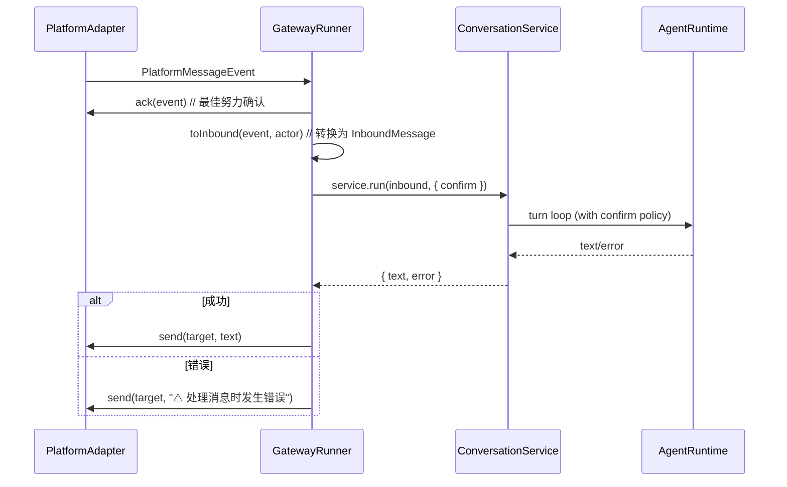
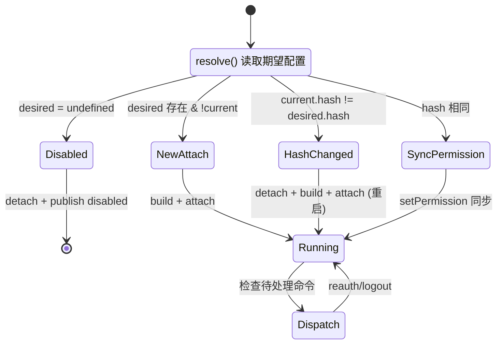
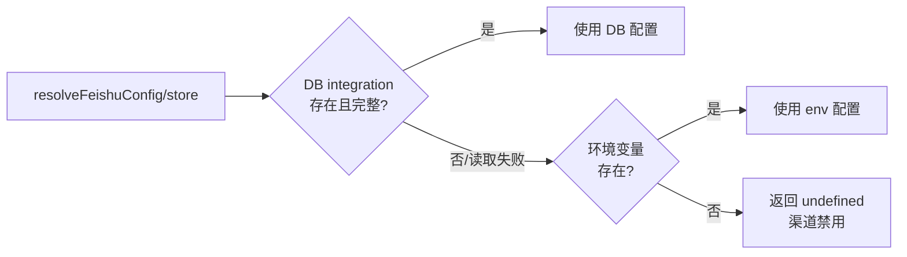

# Gateway 多平台网关与消息路由

`@zleap/gateway` 是 Zleap-Agent 的即时通讯网关层，将 Feishu（飞书）、WeChat（微信/iLink Bot）、Feishu CLI（官方 CLI 驱动）三个 IM 平台的入站消息统一路由到 `ConversationService`，并将 Agent 回复分发回对应平台。其核心设计采用**适配器模式 + 声明式控制平面**：`PlatformAdapter` 接口抽象平台差异，`GatewayRunner` 实现统一的入站→运行→回复循环，`ChannelSupervisor` 以 2.5 秒间隔 reconcile 各渠道状态，支持运行时动态启用/禁用/刷新渠道而无需重启进程。

## 整体架构

Gateway 作为独立 Node.js 子进程（由 host supervisor 的 `spawnGateway()` 启动），内部结构如下：

```mermaid
graph TB
    subgraph "Gateway Worker 进程"
        direction TB
        STORE[createSharedStore<br/>PG Pool]
        CS[ConversationService<br/>L2 对话服务]
        CONN[ConnectionsService<br/>命令分发]
        RUNNER[GatewayRunner<br/>入站→运行→回复循环]
        SUP[ChannelSupervisor<br/>2.5s reconcile]

        subgraph "Platform Adapters"
            direction LR
            FS[FeishuAdapter<br/>飞书开放平台]
            WC[WeChatAdapter<br/>iLink Bot 扫码]
            FCLI[FeishuCliAdapter<br/>@larksuite/cli]
        end

        subgraph "Support Stores"
            DEDUP[FileDedupStore<br/>消息去重]
            WSESSION[DbWeChatSessionStore<br/>微信扫码 Token]
        end
    end

    subgraph "外部平台"
        FEISHU[飞书开放平台<br/>WS/Event Callback]
        WECHAT[微信/iLink<br/>WebSocket]
        LARKCLI[lark-cli 子进程<br/>OAuth Device Flow]
    end

    subgraph "Agent Runtime"
        CONV[AgentRuntime<br/>Turn Loop]
    end

    STORE --> CS & CONN
    CS --> RUNNER
    CONN --> SUP
    SUP -->|attach/detach| RUNNER
    RUNNER --> FS & WC & FCLI
    FS & WC & FCLI -->|dispatch| RUNNER
    RUNNER -->|service.run| CS
    CS --> CONV

    FS -->|WebSocket/Event| FEISHU
    WC -->|WebSocket| WECHAT
    FCLI -->|spawn| LARKCLI

    FS --> DEDUP
    WC --> DEDUP & WSESSION
    FCLI --> DEDUP
```

### Worker 启动流程

Gateway Worker 是独立进程入口（`worker.ts`），启动时完成：加载 .env → 创建共享 Store → 实例化 ConversationService → 注册三个 ChannelDescriptor → 创建 GatewayRunner + ChannelSupervisor → 启动 reconcile 循环：

```typescript
// worker.ts L65-L145
async function main(): Promise<void> {
  loadDotEnv();  // 向上 8 层查找 .env/.env.local

  const store = await createSharedStore({ onWarn: (msg) => logger.warn(msg) });
  if (!store) throw new Error('ZLEAP_DATABASE_URL is required for the Zleap gateway.');

  const process_ = loadGatewayProcessConfig();
  const service = new ConversationService({ store, maxConcurrent: process_.maxConcurrent });
  const connections = new ConnectionsService(store.integrations);

  // 声明式渠道注册表：每个 descriptor 提供 resolve/hash/permissionMode/build
  const descriptors: ChannelDescriptor[] = [
    {
      channel: FEISHU_CHANNEL,
      resolve: () => resolveFeishuConfig(store),
      hash: (config) => stableHash(config),
      permissionMode: (config) => config.permissionMode,
      build: (config, publishState) => new FeishuAdapter(config, {
        dedup: new FileDedupStore(dedupPath(FEISHU_CHANNEL)), logger, publishState,
      }),
    },
    {
      channel: WECHAT_CHANNEL,
      resolve: () => resolveWeChatConfig(store),
      hash: (config) => stableHash(config),
      permissionMode: (config) => config.permissionMode,
      build: (config, publishState) => new WeChatAdapter(config, {
        sessionStore: new DbWeChatSessionStore(store.integrations),
        dedup: new FileDedupStore(dedupPath(WECHAT_CHANNEL)), logger, publishState,
      }),
    },
    {
      channel: FEISHU_CLI_CHANNEL,
      resolve: async () => {
        const cli = await resolveFeishuCliConfig(store);
        return cli ? { ...cli, cliHome: cli.cliHome ?? join(gatewayStateDir(), 'feishu-cli-home') } : undefined;
      },
      hash: (config) => stableHash(config),
      permissionMode: (config) => config.permissionMode,
      build: (config, publishState) => new FeishuCliAdapter(config, {
        dedup: new FileDedupStore(dedupPath(FEISHU_CLI_CHANNEL)), logger, publishState,
      }),
    },
  ];

  const runner = new GatewayRunner({ service, logger });
  const supervisor = new ChannelSupervisor({ runner, connections, descriptors, logger });
  await supervisor.start();

  // 优雅关闭
  process.once('SIGINT', () => void stop());
  process.once('SIGTERM', () => void stop());
}
```

## PlatformAdapter 统一接口

所有 IM 平台适配器实现 `PlatformAdapter` 接口，将平台特定的事件/API 转换为标准化契约：

```typescript
// types.ts L37-L53
export interface PlatformAdapter {
  readonly channel: string;
  setMessageHandler(handler: MessageHandler): void;
  connect(): Promise<void>;
  disconnect(): Promise<void>;
  send(target: OutboundTarget, content: string): Promise<SendResult>;
  /** 最佳努力入站确认（如表情反应） */
  ack?(event: PlatformMessageEvent): Promise<void>;
  /** 重新登录/刷新二维码（不 detach） */
  reauth?(): Promise<void>;
  /** 清除凭证回到未连接状态 */
  logout?(): Promise<void>;
}
```

### 标准化消息模型

入站消息统一为 `PlatformMessageEvent`：

```typescript
// types.ts L6-L25
export type PlatformMessageEvent = {
  channel: string;              // 渠道标识（feishu/wechat/feishu-cli）
  conversationId: string;       // 平台会话 ID（飞书 chat_id）
  chatType: ChatType;           // 'p2p' | 'group' | 'unknown'
  text: string;                 // 提取的纯文本
  userId?: string;              // 平台发送者 ID（飞书 open_id）
  tenantId?: string;            // 平台租户 ID（飞书 tenant_key）
  messageId?: string;           // 平台消息 ID（回复上下文+去重）
  eventId?: string;             // 平台事件 ID（首选去重键）
  mentionsBot?: boolean;        // 群聊中是否 @机器人
  raw?: unknown;                // 原始平台事件（调试用）
};
```

关键设计：**平台 ID 不是 Zleap owner ID**。`userId`/`tenantId` 仅作为 metadata 存储（格式为 `channel:id`），Zleap 内部使用统一的 `localDevActorContext` 作为 owner，确保记忆、线程、任务、审批在同一 owner 作用域内。

### 出站目标

```typescript
// types.ts L28-L32
export type OutboundTarget = {
  channel: string;
  conversationId: string;
  replyTo?: string;  // 平台消息 ID，用于引用回复
};
```

## GatewayRunner 消息循环

`GatewayRunner` 是网关的核心执行单元，负责将平台适配器连接到 L2 `ConversationService`，实现完整的入站→确认→运行→回复→发送循环：



```typescript
// runner.ts L77-L114
private async onEvent(adapter: PlatformAdapter, event: PlatformMessageEvent): Promise<void> {
  const inbound = toInbound(event, this.actor);
  try {
    await adapter.ack?.(event);
    const { text, error } = await this.service.run(inbound, {
      ...this.handleOptions,
      confirm: this.confirmFor(event.channel),  // 按渠道选择确认策略
    });
    const reply = error ? `⚠️ ${error}` : text;
    if (!reply) { this.logger?.warn('gateway produced empty reply', { channel: event.channel }); return; }
    const result = await adapter.send(
      { channel: event.channel, conversationId: event.conversationId,
        ...(event.messageId ? { replyTo: event.messageId } : {}) },
      reply,
    );
    if (!result.ok) this.logger?.warn('gateway reply send failed', { channel, error: result.error });
  } catch (error) {
    // Best-effort 错误回复
    await adapter.send({ channel, conversationId, replyTo: event.messageId },
      '⚠️ 处理消息时发生错误，请稍后重试。').catch(() => {});
  }
}
```

### 入站消息转换

`toInbound()` 将平台事件转换为 L2 标准 `InboundMessage`，平台身份仅作为 metadata 保留：

```typescript
// runner.ts L118-L142
export function toInbound(event: PlatformMessageEvent, actor: ActorContext = localDevActorContext()): InboundMessage {
  const inboundRun = buildInboundRunInput({
    actorId: actor.userId,
    eventId: event.eventId ?? event.messageId ?? event.conversationId,
    prompt: event.text,
  });
  return {
    channel: event.channel,
    conversationId: event.conversationId,
    kind: 'im',
    text: inboundRun.prompt,
    actor: { ...actor },
    ...(event.messageId ? { replyTo: event.messageId } : {}),
    metadata: {
      chatType: event.chatType,
      mentionsBot: event.mentionsBot ?? false,
      ...(event.userId ? { senderId: `${event.channel}:${event.userId}` } : {}),
      ...(event.tenantId ? { platformTenantId: `${event.channel}:${event.tenantId}` } : {}),
    },
  };
}
```

### 权限模式与工具审批

IM 渠道无交互式 HITL（Human-in-the-Loop）界面，因此默认采用安全策略——**Fail Closed**：

```typescript
// runner.ts L8-L17
const defaultGatewayConfirm: NonNullable<HandleOptions['confirm']> = async (request) =>
  shouldAutoApproveToolWithoutHitl(request.name);

const fullAccessConfirm: NonNullable<HandleOptions['confirm']> = async () => true;

private confirmFor(channel: string): NonNullable<HandleOptions['confirm']> {
  return this.permissions.get(channel) === 'full_access' ? fullAccessConfirm : defaultGatewayConfirm;
}
```

| 权限模式 | confirm 行为 | 适用场景 |
|----------|-------------|----------|
| `request_approval`（默认） | 仅自动批准无风险工具，其余拒绝 | 安全模式，IM 默认策略 |
| `full_access` | 自动批准所有工具 | 可信环境/私有部署 |

`shouldAutoApproveToolWithoutHitl()` 在 agent 引擎中定义，判断工具是否属于"无风险"类别（如只读文件查看、ls 等），写入类/命令执行类工具在 IM 渠道默认拒绝。

## ChannelSupervisor 控制平面

`ChannelSupervisor` 实现声明式渠道管理，以固定间隔（默认 2500ms）执行 reconcile 循环，将运行中的适配器状态与 DB 中的期望状态对齐：

```typescript
// supervisor.ts L40-L50
/**
 * Control plane for gateway channels. On an interval it reconciles each known
 * channel's running adapter against the desired state in the DB:
 * - enabled & not running        -> attach (adapter auto-connects/auto-logins)
 * - disabled & running           -> detach + publish disabled
 * - config changed (hash)        -> restart
 * - pending connect/refresh/logout command -> dispatch to the adapter
 */
export class ChannelSupervisor {
  private readonly running = new Map<string, RunningChannel>();
  private readonly lastNonce = new Map<string, string>();  // 命令幂等 nonce
  private timer: NodeJS.Timeout | undefined;
  // ...
}
```

### Reconcile 状态机



```typescript
// supervisor.ts L111-L143
private async reconcileChannel(descriptor: ChannelDescriptor): Promise<void> {
  const desired = await descriptor.resolve().catch(() => undefined);
  const current = this.running.get(descriptor.channel);

  // 期望禁用：detach
  if (!desired) {
    if (current) {
      await this.runner.detach(current.adapter);
      this.running.delete(descriptor.channel);
      await this.connections.publishState({ channel, enabled: false, phase: 'disabled', updatedAt: ... });
    }
    return;
  }

  const hash = descriptor.hash(desired);
  if (!current) {
    await this.attach(descriptor, desired, hash);  // 新渠道：attach
  } else if (current.hash !== hash) {
    // 配置指纹变化：重启
    await this.runner.detach(current.adapter);
    this.running.delete(descriptor.channel);
    await this.attach(descriptor, desired, hash);
  } else {
    // 配置未变：仅同步权限策略
    this.runner.setPermission(descriptor.channel, descriptor.permissionMode(desired));
  }

  await this.dispatchCommand(descriptor.channel);  // 分发待处理命令
}
```

### ChannelDescriptor 声明式描述

每个渠道通过 `ChannelDescriptor` 声明：

```typescript
// supervisor.ts L15-L25
export type ChannelDescriptor<C = unknown> = {
  channel: string;
  /** 读取期望配置（DB→env），undefined 表示禁用 */
  resolve(): Promise<C | undefined>;
  /** 配置指纹，变化触发重启 */
  hash(config: C): string;
  /** 工具审批策略 */
  permissionMode(config: C): GatewayPermissionMode;
  /** 构建适配器实例 */
  build(config: C, publishState: ChannelStatePublisher): PlatformAdapter;
};
```

### 动态命令分发

Web UI 可以通过 `ConnectionsService` 向渠道发送 `refresh`（重新登录/刷新二维码）或 `logout`（清除凭证）命令，supervisor 在 reconcile 时分发：

```typescript
// supervisor.ts L153-L169
private async dispatchCommand(channel: string): Promise<void> {
  const command = await this.connections.readCommand(channel);
  if (!command || this.lastNonce.get(channel) === command.nonce) return;  // 幂等
  this.lastNonce.set(channel, command.nonce);
  const adapter = this.running.get(channel)?.adapter;
  if (adapter) {
    if (command.type === 'logout') {
      await (adapter.logout?.() ?? adapter.reauth?.() ?? Promise.resolve());
    } else if (command.type === 'refresh') {
      await (adapter.reauth?.() ?? Promise.resolve());
    }
  }
  await this.connections.clearCommand(channel);
}
```

## 三平台适配

### Feishu（飞书）

飞书适配器支持国内飞书和国际 Lark 双域，使用 App ID/Secret 认证，通过 WebSocket 长连接接收事件：

```typescript
// config.ts L20-L36
export type FeishuConfig = {
  appId: string;
  appSecret: string;
  domain: 'feishu' | 'lark';
  encryptKey?: string;
  verificationToken?: string;
  groupPolicy: GroupPolicy;
  allowedUsers: string[];
  botOpenId?: string;
  botUserId?: string;
  botName?: string;
  permissionMode: GatewayPermissionMode;
};
```

**群消息准入策略（GroupPolicy）**：

| 策略 | 行为 |
|------|------|
| `open` | 所有群消息均可触发 |
| `allowlist` | 仅 `allowedUsers` 中的用户可触发 |
| `blacklist` | `allowedUsers` 中的用户被屏蔽 |
| `admin_only` | 仅管理员可触发 |
| `disabled` | 群聊完全禁用，仅响应私聊 |

配置优先级：**DB integration 行（Web UI 编辑）→ 环境变量**。DB 读取失败自动降级到 env。

### WeChat（微信/iLink Bot）

微信适配器通过 iLink Bot 协议接入，采用**扫码登录**（无 appId/secret），bot token 持久化到 DB：

```typescript
// config.ts L150-L158
export type WeChatConfig = {
  enabled: boolean;
  baseUrl: string;          // 默认 ILINK_BASE_URL
  botType: number;          // 默认 DEFAULT_BOT_TYPE
  channelVersion: string;   // 默认 DEFAULT_CHANNEL_VERSION
  groupPolicy: GroupPolicy;
  allowedUsers: string[];
  permissionMode: GatewayPermissionMode;
};
```

WeChat Session 存储有两种实现：
- `DbWeChatSessionStore`：持久化到 DB（生产模式）
- `MemoryWeChatSessionStore`：内存存储（开发/测试）

### Feishu CLI（飞书 CLI）

Feishu CLI 适配器驱动官方 `@larksuite/cli`（lark-cli）子进程，支持 OAuth Device Flow 认证（user 身份）或 bot 身份：

```typescript
// config.ts L229-L248
export type FeishuCliConfig = {
  enabled: boolean;
  identity: 'user' | 'bot';       // OAuth user 或 bot 身份
  domain: 'feishu' | 'lark';
  eventKey: string;               // 默认 DEFAULT_EVENT_KEY
  groupPolicy: GroupPolicy;
  allowedUsers: string[];
  permissionMode: GatewayPermissionMode;
  botOpenId?: string;
  botName?: string;
  appId?: string;                 // 可选：非交互 seed config init
  appSecret?: string;
  cliBin: string;                 // 默认 'lark-cli'
  cliHome?: string;               // 凭证隔离目录
};
```

CLI 凭证存储在独立的 `cliHome` 目录（默认 `~/.zleap/gateway/feishu-cli-home`），与其他 Feishu 渠道凭证隔离。

## BasePlatformAdapter 基类

`BasePlatformAdapter` 提供三个跨平台通用能力：消息 handler 派发、代码块感知的消息分片、指数退避重试：

```typescript
// platforms/base.ts L14-L67
export abstract class BasePlatformAdapter implements PlatformAdapter {
  abstract readonly channel: string;
  protected handler: MessageHandler | undefined;

  setMessageHandler(handler: MessageHandler): void { this.handler = handler; }

  abstract connect(): Promise<void>;
  abstract disconnect(): Promise<void>;
  abstract send(target: OutboundTarget, content: string): Promise<SendResult>;

  protected async dispatch(event: PlatformMessageEvent): Promise<void> {
    if (!this.handler) return;
    await this.handler(event);
  }

  // 代码块感知的长消息分片
  protected splitMessage(content: string, threshold = SPLIT_THRESHOLD): string[] { ... }

  // 指数退避重试（默认 3 次：200ms → 400ms）
  protected async withRetry<T>(fn: () => Promise<T>, attempts = SEND_ATTEMPTS): Promise<T> { ... }
}
```

### 消息分片常量与算法

```typescript
// platforms/base.ts L5-L7
export const MAX_MESSAGE_LENGTH = 8000;   // 单条消息最大长度
export const SPLIT_THRESHOLD = 4000;     // 超过此长度开始分片
export const SEND_ATTEMPTS = 3;          // 发送重试次数
```

**safeCut 分片算法**确保不破坏围栏代码块：

```typescript
// platforms/base.ts L74-L85
function safeCut(text: string, threshold: number): number {
  const window = text.slice(0, threshold);
  const fences = window.match(/```/g)?.length ?? 0;
  if (fences % 2 === 1) {
    // 前缀中 ``` 围栏数为奇数（代码块未闭合），回退到最后一个 ```
    const lastFence = window.lastIndexOf('```');
    if (lastFence > 0) return lastFence;
  }
  // 否则在最后一个换行符处切割（需 > threshold*0.5），否则硬切
  const lastNewline = window.lastIndexOf('\n');
  return lastNewline > threshold * 0.5 ? lastNewline + 1 : threshold;
}
```

分片逻辑：
1. 在 `threshold`（默认 4000）处尝试切割
2. 如果前缀中有奇数个 \`\`\`（代码块未闭合），回退到最后一个 \`\`\` 位置
3. 否则在最后一个换行符处切割（位置需超过 threshold 的 50%，避免产生过短片段）
4. 以上条件都不满足时硬切

### 指数退避重试

```typescript
// platforms/base.ts L53-L66
protected async withRetry<T>(fn: () => Promise<T>, attempts = SEND_ATTEMPTS): Promise<T> {
  let lastError: unknown;
  for (let i = 0; i < attempts; i += 1) {
    try { return await fn(); }
    catch (error) {
      lastError = error;
      if (i < attempts - 1) await delay(2 ** i * 200);  // 200ms, 400ms
    }
  }
  throw lastError;
}
```

## 去重与状态持久化

### 消息去重

`FileDedupStore` 基于文件系统实现消息去重，存储在 `~/.zleap/gateway/{channel}_seen.json`：

```typescript
// dedup.ts 提供 FileDedupStore
// worker.ts L61-L63
function dedupPath(channel: string): string {
  return join(gatewayStateDir(), `${channel}_seen.json`);
}
```

每个渠道独立维护已处理消息 ID 集合，防止平台重复投递导致重复执行。

### 并发控制

`ZLEAP_GATEWAY_MAX_CONCURRENT` 环境变量控制全局跨会话的 agent-run 并发上限：

```typescript
// config.ts L78-L81
export function loadGatewayProcessConfig(env: NodeJS.ProcessEnv = process.env): GatewayProcessConfig {
  const raw = Number(env.ZLEAP_GATEWAY_MAX_CONCURRENT ?? 0);
  return { maxConcurrent: Number.isFinite(raw) && raw > 0 ? Math.floor(raw) : 0 };
}
```

`0` 表示不限制。该值传递给 `ConversationService` 构造函数，在 L2 层实现全局并发限流。

### Gateway 状态目录

```
~/.zleap/gateway/
├── feishu_seen.json       # 飞书已处理消息 ID
├── wechat_seen.json       # 微信已处理消息 ID
├── feishu-cli_seen.json   # Feishu CLI 已处理消息 ID
└── feishu-cli-home/       # lark-cli 凭证隔离目录
```

## 配置解析优先级

每个渠道的配置解析遵循 **DB 优先 → env 回退** 策略：



```typescript
// config.ts L104-L118 — Feishu 配置解析示例
export async function resolveFeishuConfig(store, env): Promise<FeishuConfig | undefined> {
  try {
    const record = await store.integrations.getIntegration(FEISHU_INTEGRATION_CHANNEL);
    const fromDb = record ? feishuConfigFromRecord(record.config) : undefined;
    if (fromDb) return fromDb;
  } catch {
    // DB 读取失败——降级到 env，网关仍可启动
  }
  return loadFeishuConfig(env);
}
```

## 类型签名速查

```typescript
// 核心接口
interface PlatformAdapter {
  readonly channel: string;
  setMessageHandler(handler: MessageHandler): void;
  connect(): Promise<void>;
  disconnect(): Promise<void>;
  send(target: OutboundTarget, content: string): Promise<SendResult>;
  ack?(event: PlatformMessageEvent): Promise<void>;
  reauth?(): Promise<void>;
  logout?(): Promise<void>;
}

type PlatformMessageEvent = {
  channel: string; conversationId: string; chatType: 'p2p' | 'group' | 'unknown';
  text: string; userId?: string; tenantId?: string; messageId?: string; eventId?: string;
  mentionsBot?: boolean; raw?: unknown;
};

type OutboundTarget = { channel: string; conversationId: string; replyTo?: string; };
type MessageHandler = (event: PlatformMessageEvent) => Promise<void>;

// Runner
class GatewayRunner {
  constructor(deps: GatewayRunnerDeps);
  setPermission(channel: string, mode: GatewayPermissionMode): void;
  attach(adapter: PlatformAdapter): Promise<void>;
  detach(adapter: PlatformAdapter): Promise<void>;
}
type GatewayPermissionMode = 'request_approval' | 'full_access';

// Supervisor
class ChannelSupervisor {
  constructor(deps: ChannelSupervisorDeps);
  start(): Promise<void>;
  stop(): Promise<void>;
  reconcile(): Promise<void>;  // 手动触发单次 reconcile
}
type ChannelDescriptor<C = unknown> = {
  channel: string;
  resolve(): Promise<C | undefined>;
  hash(config: C): string;
  permissionMode(config: C): GatewayPermissionMode;
  build(config: C, publishState: ChannelStatePublisher): PlatformAdapter;
};

// 基类
abstract class BasePlatformAdapter implements PlatformAdapter {
  protected splitMessage(content: string, threshold?: number): string[];
  protected withRetry<T>(fn: () => Promise<T>, attempts?: number): Promise<T>;
  protected dispatch(event: PlatformMessageEvent): Promise<void>;
}

// 配置
type GroupPolicy = 'open' | 'allowlist' | 'blacklist' | 'admin_only' | 'disabled';
type FeishuConfig = { appId: string; appSecret: string; domain: 'feishu' | 'lark'; ... };
type WeChatConfig = { enabled: boolean; baseUrl: string; botType: number; ... };
type FeishuCliConfig = { enabled: boolean; identity: 'user' | 'bot'; cliBin: string; ... };
```

## 常量

| 常量 | 值 | 来源 |
|------|----|------|
| MAX_MESSAGE_LENGTH | 8000 | platforms/base.ts |
| SPLIT_THRESHOLD | 4000 | platforms/base.ts |
| SEND_ATTEMPTS | 3 | platforms/base.ts |
| 重试退避 | 200ms → 400ms（2^i × 200） | platforms/base.ts |
| Reconcile 间隔 | 2500ms | supervisor.ts |
| Gateway 状态目录 | `~/.zleap/gateway/` | worker.ts |
| 渠道标识 | `feishu` / `wechat` / `feishu-cli` | config.ts |
