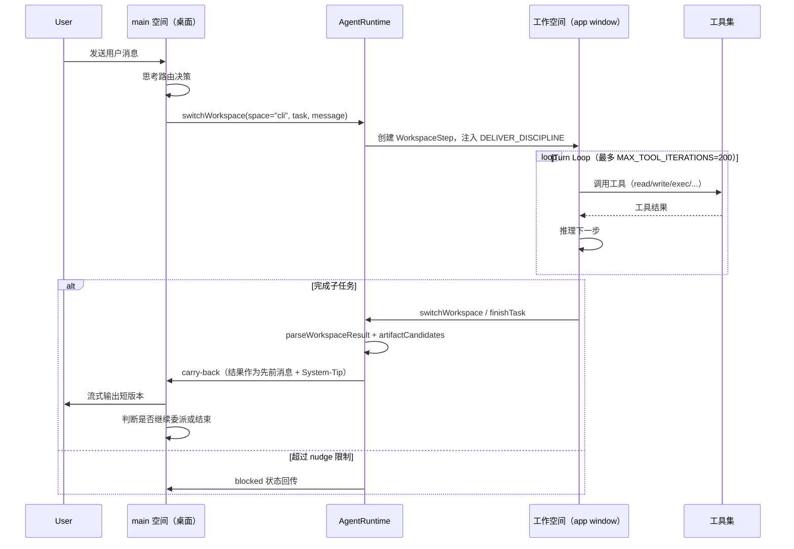

## 概述

Zleap-Agent 的"子 Agent 委派"并非传统意义上的多 Agent 进程架构，而是一种基于 **Workspace（工作空间）切换** 的 OS 隐喻委派模型。框架将 Agent 系统类比为操作系统：`main` 空间是"桌面"，负责与用户对话和路由；每个 workspace 是一个"应用窗口"，拥有独立的工具集、上下文、权限、记录和产出物。当当前空间无法完成某类任务时，通过 `switchWorkspace` 工具将任务委派给目标空间，目标空间完成后通过 carry-back 机制将结果回传。

这一模式的核心入口是 [Kernel](file:///d:/spaces/SpecWeave/external/libs/models/ai/Zleap-Agent/packages/agent/src/kernel/kernel.ts#L28-L81) 类。Kernel 是"空间入口内核"，每次对话首先进入常驻的 `main` 空间，由 main 空间的模型自主决定是否通过 `switchWorkspace(space, task, message)` 路由到工作空间。Kernel 不再预先选择工作空间——它只运行 main 空间，并携带身份、记忆策略和召回信息。

```typescript
// Kernel.dispatch — 所有回复先进入 main 空间
async dispatch(
  goal: string,
  messages: Message[],
  signal: AbortSignal,
  options: { confirm?: ToolConfirm; globalSystem?: string; ... },
): Promise<Run | undefined> {
  const spec = this.mainSpec;
  const recall = this.recallFn ? await this.recallFn(goal).catch(() => undefined) : undefined;
  const input: WorkspaceStepInput = {
    messages, confirm: options.confirm, globalSystem: options.globalSystem,
    recall, cacheBreakpoints: options.cacheBreakpoints,
    approvalPolicy: options.approvalPolicy,
  };
  return this.runtime.run({
    spaces: [spec.id], goal, toolIds: spec.toolIds,
    workspaceRoot: options.workspaceRoot, context: input,
    agent: this.agent, memory: this.memory,
  }, { signal });
}
```

## 设计原理

### OS 隐喻模型

框架将 Workspace 模型嵌入系统提示词，明确告知模型它运行在一个类 OS 环境中：

> Zleap works like an operating system. Main is the desktop: it talks to the user and opens workspace app windows. A workspace is an app window with its own tools, context, permissions, records, and artifacts for one kind of work.

这一隐喻使得模型无需额外的调度器指令，就能自主理解何时应该切换空间：当需要脚本执行、文件生成、代码运行等当前空间不具备的能力时，切换到 `cli` 空间；当需要搜索技能时，使用 `findSkill` 工具。

### 三个控制工具

委派模式由三个核心工具控制：

| 工具 | 作用 | 使用场景 |
|------|------|---------|
| `switchWorkspace` | 切换到另一个工作空间，携带交接上下文 | 当前空间完成部分工作，另一空间需继续 |
| `finishTask` | 完成整个用户目标 | 全部工作已完成或失败 |
| `enterWorkspace`（遗留） | 旧版进入工作空间 | 兼容，已被 switchWorkspace 替代 |

`switchWorkspace` 的参数定义严格约束了委派行为：

```typescript
const SWITCH_WORKSPACE_TOOL: ToolDescriptor = {
  id: SWITCH_WORKSPACE_TOOL_ID,
  description: 'Ask runtime to switch directly to another workspace with this workspace handoff context.',
  parameters: {
    type: 'object',
    properties: {
      space: { type: 'string', description: 'Target workspace id from the available workspace list.' },
      task: { type: 'string', description: 'Concrete task for the target workspace.' },
      message: { type: 'string', description: 'Short handoff context: what this workspace completed and what the next workspace must know.' },
    },
    required: ['space', 'task'],
    additionalProperties: false,
  },
};
```

### Deliver 纪律约束

工作空间（非 main 的 WORK 空间）被注入 `DELIVER_DISCIPLINE`，强制要求模型必须在本空间内完成任务，不能返回"接下来我将…"的半成品：

> Your responsibility is to finish this workspace task completely in this run, not to hand back a partial attempt or only a plan. A child workspace is not finished until it calls switchWorkspace or finishTask.

这解决了模型常见的"只描述计划不执行"问题——没有控制工具调用的自然语言回复被视为不完整，运行时会通过内部提示（最多两次）要求模型调用 `finishTask` 或 `switchWorkspace`，超过次数则标记为 `blocked`。

### Carry-Back 回传机制

当子空间完成任务后，结果通过 carry-back 机制回传到父空间（或 main）。关键设计点：

1. 子空间结果作为模型自己的先前消息注入对话，同时短版本流式输出给用户
2. 注入 `<System-Tip>` 包裹的指令，防止模型重复回答已传回的结果（"二次回复" bug）
3. carry-back 后消息以 `user` 角色结束，邀请父空间继续或关闭，而非 assistant→assistant 的重复

```typescript
const CARRYBACK_WRAPUP_NOTE =
  '<System-Tip>This is a system tip, not a user message: ' +
  'the previous work space has finished, and its result has already been handed to you. ' +
  'A short version was shown to the user. Treat it as content you have already answered with. ' +
  'Do not restate, rewrite, or reorganize it. Check whether the overall goal has a different next step; ' +
  'if so, continue with switchWorkspace. Do not enter the same workspace objective again. ' +
  'Otherwise, close briefly or end this turn without repeating the result. ' +
  '</System-Tip>';
```

### 深度限制

设计上 main→work 的切换深度始终保持为 **1**。运行时工具层不支持嵌套的 workspace→workspace 再切换（尽管子空间可以调用 `switchWorkspace`，但运行时在同一层处理，不递归创建新的执行上下文）。这避免了无限委派链和上下文爆炸。

## 委派生命周期



## Turn Loop 执行模型

工作空间的核心执行引擎是 [runWorkspaceTurn](file:///d:/spaces/SpecWeave/external/libs/models/ai/Zleap-Agent/packages/agent/src/workspaces/turnLoop.ts#L469-L1205) 函数，实现了完整的模型推理→工具调用→结果回传循环：

```typescript
export type TurnLoopOptions = {
  registries: AiRegistries;
  modelId: string;
  persona: string;           // 工作空间人格（系统提示词基础）
  global?: string;           // 全局指导（用户 --system）
  turnGoal?: string;         // 用户总体目标
  focus?: string;            // 当前空间的任务焦点
  recall?: string;           // 记忆召回块
  handoffContext?: string;   // 运行时构建的交接上下文
  skills?: SkillDefinition[];
  tools?: ToolDescriptor[];
  messages: Message[];
  confirm?: ToolConfirm;     // HITL 审批回调
  approvalPolicy?: ToolApprovalPolicy;
  lifecycle?: TurnLoopLifecyclePolicy;
  deliverFinal?: boolean;    // WORK 空间：必须交付最终结果
  workspaceId?: string;
  runtimeCache?: TurnLoopRuntimeCache;
};
```

执行流程如下：

1. **上下文组装**：通过 `assembleWorkTurnContext` 将 persona、global、turnGoal、focus、handoffContext、recall 组装为 ProviderRequest，半稳定消息边界（semi-stable breakpoints）与变量消息分离
2. **模型推理**：调用 LLM 获取一个 turn，解析文本和 tool calls
3. **控制工具检测**：如果是 `switchWorkspace`/`finishTask`（且 deliverFinal=true），解析为 WorkspaceResult
4. **缺失出口检测**：如果工作空间输出纯文本无工具调用（且 deliverFinal=true），注入提醒 nudge（最多2次），超出则 blocked
5. **工具执行**：顺序或并行执行工具调用，支持 HITL 审批门
6. **Artifact 收集**：文件类工具（write/append/edit）执行前后扫描 artifact 变化
7. **Cache 管理**：工具结果自动写入 RuntimeCache，模型通过 listCache/readCache 跨空间读取
8. **Carry-back 处理**：工具结果中包含 handoff 时，提取 carryBack 文本和 displayCarryBack
9. **循环或退出**：有 workspaceResult 或 autoClose 时退出，否则继续循环

### 并行工具执行

Turn Loop 支持可并行工具的批量执行：

```typescript
if (canRunInParallel(call, descriptorById, options.approvalPolicy) && !workspaceResult) {
  const batch: ModelTurn['toolCalls'] = [];
  while (callIndex < toolCalls.length && toolSteps < MAX_TOOL_ITERATIONS &&
         !workspaceResult && canRunInParallel(toolCalls[callIndex]!, ...)) {
    batch.push(toolCalls[callIndex]!);
    callIndex += 1; toolSteps += 1;
  }
  autoClosedAfterCarryBack = appendToolExecutions(
    await Promise.all(batch.map((batchCall) => executeToolCall(batchCall)))
  ) || autoClosedAfterCarryBack;
}
```

只读类工具（findSkill、readSkill、listCache、readCache 等）和不需要审批的工具可以并行执行，变异类工具（write、shell 命令等）按顺序执行并通过审批门。

## WorkspaceResult 结构

子空间的退出结果由 WorkspaceResult 类型定义：

```typescript
// 来自 @zleap/core
export type WorkspaceResultStatus =
  | 'completed' | 'failed' | 'blocked'
  | 'needs_user_input' | 'needs_approval';

export type WorkspaceResult = {
  status: WorkspaceResultStatus;
  summary: string;
  artifacts: WorkspaceResultArtifact[];
  observations: string[];
  errors: string[];
  suggestedNextSteps: string[];
};
```

状态别名映射支持模型输出多种同义状态（done/ok/success→completed, fail/error→failed 等），增强鲁棒性：

```typescript
const WORKSPACE_RESULT_STATUS_ALIASES: Record<string, WorkspaceResultStatus> = {
  complete: 'completed', completed: 'completed', done: 'completed',
  finish: 'completed', finished: 'completed', ok: 'completed',
  success: 'completed', succeeded: 'completed',
  fail: 'failed', failed: 'failed', error: 'failed', errored: 'failed',
  blocked: 'blocked',
  need_user_input: 'needs_user_input', needs_user_input: 'needs_user_input',
  // ...
};
```

## Cache 跨空间证据传递

RuntimeCache 是跨空间传递工作证据的机制。每个空间可以通过 `listCache`/`readCache` 读取先前空间留下的工作证据（搜索结果、提取笔记、生成文件摘要等），但不能写入 Cache——Cache 由运行时在工具成功后自动写入：

```typescript
// Cache 工具提示词指引
'Cache tools are runtime tools available in every workspace.',
'If the task may depend on evidence produced by a previous workspace, call listCache early instead of relying only on a short handoff summary.',
'You cannot write Cache. Runtime writes Cache automatically after cache-producing tools succeed.',
'Cache entries are temporary working evidence, not long-term memory.',
```

这解决了 handoff 摘要过短导致信息丢失的问题——模型可以主动检索详细证据，而非仅依赖 `switchWorkspace.message` 的简短描述。

## 安全边界

### 自切换禁止

运行时通过 `workspaceId` 参数拒绝空间向自己切换：

```typescript
promptGuidelines: [
  'Call switchWorkspace only after this workspace has finished the part it can do.',
  'Do not call switchWorkspace to the current workspace.',
  'Use finishTask instead when the whole user goal is complete or failed.',
  // ...
],
```

### 脚本空间隔离

非 CLI 空间注入 `SCRIPT_HANDOFF_DISCIPLINE`，明确告知模型不能执行脚本，必须切换到 `cli` 空间：

> This workspace cannot execute scripts or commands. For scripts, shell commands, Python/Node execution, or local file generation, switch to space=cli.

### 审批门控

高风险工具在执行前通过 HITL（Human-in-the-Loop）审批门：

```typescript
if (requiresApproval(call, options.approvalPolicy)) {
  const approval = { approvalId, name: call.name, args, preview };
  const approved = options.confirm ? await options.confirm(approval) : false;
  if (!approved) {
    workspaceResult = {
      status: 'needs_approval',
      summary: `Tool "${call.name}" requires approval before execution.`,
      // ...
    };
  }
}
```

如果 deliverFinal 空间内审批被拒，整个空间以 `needs_approval` 状态退出，carry-back 到 main 空间请求用户处理。

## 迭代安全边界

为防止无限循环，Turn Loop 设置了硬上限 `MAX_TOOL_ITERATIONS = 200`。达到上限后输出提示并标记 blocked：

```typescript
if (hitToolLimit && toolSteps >= MAX_TOOL_ITERATIONS) {
  const note = `Reached the ${MAX_TOOL_ITERATIONS}-step tool limit before finishing. Ask me to continue.`;
  context.emit({ kind: 'text', text: note });
  finalText = note;
}
```

## 与其他模块的协作

```mermaid
flowchart TB
    subgraph Entry["入口层"]
        K[Kernel\nkernel/kernel.ts]
    end
    subgraph Core["核心引擎"]
        RT[AgentRuntime\n@zleap/core]
        TL[Turn Loop\nworkspaces/turnLoop.ts]
        CE[ChatEngine\nengine/]
    end
    subgraph Control["控制工具"]
        SW[switchWorkspace]
        FT[finishTask]
        RC[RuntimeCache]
    end
    subgraph Spaces["工作空间"]
        Main[main 空间\n桌面/路由]
        CLI[cli 空间\n脚本/文件]
        Other[其他工作空间...]
    end

    K -->|dispatch| RT
    RT -->|run| TL
    TL -->|注入| SW
    TL -->|注入| FT
    TL -->|读写| RC
    Main -->|switchWorkspace| CLI
    CLI -->|carry-back| Main
    Main -->|finishTask| CE
    CE -->|输出| K
```

## 源码参考

| 文件 | 关键内容 |
|------|---------|
| [turnLoop.ts](file:///d:/spaces/SpecWeave/external/libs/models/ai/Zleap-Agent/packages/agent/src/workspaces/turnLoop.ts) | Turn Loop 引擎、控制工具定义、carry-back 机制、并行执行、Cache 工具 |
| [kernel.ts](file:///d:/spaces/SpecWeave/external/libs/models/ai/Zleap-Agent/packages/agent/src/kernel/kernel.ts#L28-L81) | Kernel 类、main 空间 dispatch、身份与记忆注入 |
| [core/types.ts](file:///d:/spaces/SpecWeave/external/libs/models/ai/Zleap-Agent/packages/core/src/types.ts) | WorkspaceHandoffRequest、WorkspaceResult、WorkspaceResultStatus 类型定义 |

## 小结

Zleap-Agent 的子 Agent 委派模式通过 **Workspace OS 隐喻** 实现了一种简洁但强大的任务委派架构：

1. **模型自主路由**：无需中央调度器，main 空间模型基于 OS 隐喻自主决定何时切换空间
2. **结构化交接**：switchWorkspace 的 space/task/message 三参数确保委派上下文完整
3. **结果回传**：carry-back + System-Tip 机制避免重复回答，保持对话连贯
4. **深度受控**：main→work 深度固定为1，避免递归委派
5. **证据桥接**：RuntimeCache 提供跨空间工作证据的可检索通道
6. **安全门控**：自切换禁止、脚本空间隔离、HITL 审批、迭代上限共同保障安全边界
