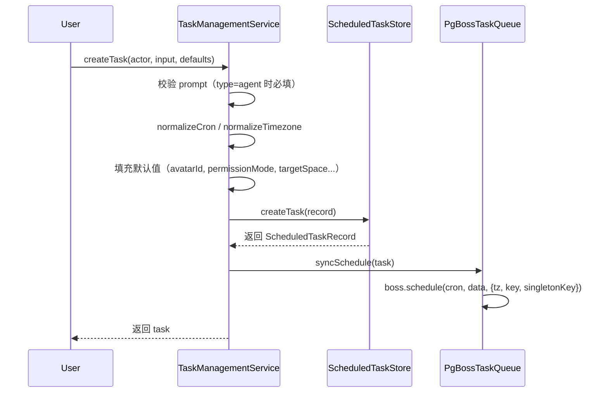
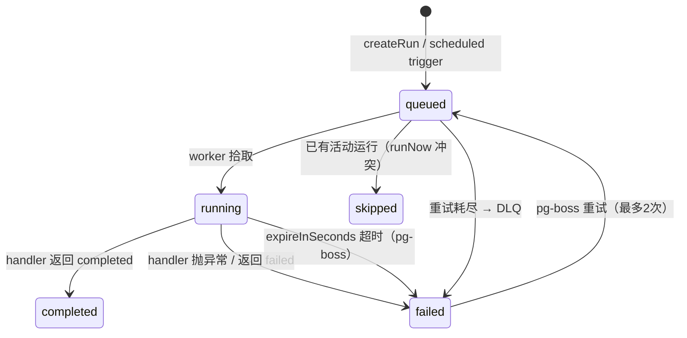

## 概述

Zleap-Agent 的任务调度系统由 `@zleap/tasks` 包实现，基于 **pg-boss**（PostgreSQL 之上的作业队列）提供 cron 定时调度、并发控制、失败重试、死信队列和处理器注册机制。系统采用"队列与处理器分离"的架构：pg-boss 负责调度、并发、重试、死信等基础设施；`TaskHandler` 接口定义具体任务类型的执行逻辑，新任务类型通过注册 Handler 添加，无需修改队列核心。

```mermaid
flowchart TB
    subgraph API["管理层"]
        TMS[TaskManagementService\nservice.ts]
    end
    subgraph Queue["队列层"]
        PQ[PgBossTaskQueue\nqueue.ts]
        PGB[(pg-boss\nPostgreSQL)]
    end
    subgraph Execution["执行层"]
        TES[TaskExecutionService\nexecution.ts]
        THR[TaskHandlerRegistry\nregistry.ts]
        AH[AgentTaskHandler\nworker.ts]
    end
    subgraph DLQ["死信处理"]
        DLQH[Dead Letter Handler\nworker.ts]
    end

    TMS -->|syncSchedule/enqueueRun| PQ
    PQ -->|schedule/send/work| PGB
    PGB -->|job delivery| TES
    TES -->|resolve handler| THR
    THR -->|type=agent| AH
    AH -->|run| CS[ConversationService\n@zleap/agent]
    PGB -->|retries exhausted| DLQH
    TMS -->|CRUD| Store[(ScheduledTaskStore\n@zleap/store)]
```

## 设计原理

### pg-boss 作为队列后端

选择 pg-boss 而非 Redis/RabbitMQ 的原因：

1. **零额外依赖**：Zleap 已依赖 PostgreSQL（用于 pgvector 记忆存储），pg-boss 复用同一数据库
2. **事务性**：任务状态变更与业务数据在同一事务中，避免分布式事务问题
3. **持久化保证**：PostgreSQL 的 ACID 特性确保任务不丢失
4. **内置 cron**：pg-boss 原生支持 cron 调度，无需额外调度器

### Client/Worker 双角色

`PgBossTaskQueue` 支持两种运行角色：

```typescript
export type TaskQueueRole = 'client' | 'worker';

export class PgBossTaskQueue implements TaskQueue {
  private readonly isWorker: boolean;

  constructor(options: PgBossTaskQueueOptions) {
    this.isWorker = (options.role ?? 'worker') === 'worker';
    this.boss = new PgBoss({
      connectionString: options.connectionString,
      application_name: this.isWorker ? 'zleap-task-worker' : 'zleap-task-client',
      schedule: this.isWorker,   // 仅 worker 执行 cron 调度
      supervise: this.isWorker,  // 仅 worker 执行维护
    });
  }
}
```

- **Worker 角色**：独立进程（`zleap-task-worker`），拥有 cron 调度、作业执行、队列维护权限
- **Client 角色**：Web 进程，仅负责创建/更新/删除任务和手动触发（enqueueRun），不执行作业

### 队列策略

运行队列 `zleap.task.run` 使用 `stately` 策略：

```typescript
await this.boss.createQueue(TASK_RUN_QUEUE, {
  policy: 'stately',                    // 有状态队列：保证单任务并发
  expireInSeconds: this.expireInSeconds, // 1小时超时
  heartbeatSeconds: this.heartbeatSeconds, // 60秒心跳
  retryLimit: 2,                         // 最多重试2次
  retryDelay: 30,                        // 首次重试延迟30秒
  retryBackoff: true,                    // 指数退避
  retryDelayMax: 600,                    // 最大重试间隔10分钟
  deadLetter: TASK_DLQ_QUEUE,            // 重试耗尽进入死信队列
  deleteAfterSeconds: 7 * 24 * 3600,     // 7天后自动清理
});
```

死信队列 `zleap.task.run.dlq` 使用 `standard` 策略，不重试（retryLimit=0），用于记录最终失败的任务。

### Singleton 保证

每个任务的调度使用 `singletonKey` 确保同一任务不会并发执行：

```typescript
async syncSchedule(task: ScheduledTaskRecord): Promise<void> {
  const scheduleKey = scheduleKeyForTask(task.id);
  if (task.enabled && !task.deletedAt) {
    await this.boss.schedule(TASK_RUN_QUEUE, task.cron,
      { taskId: task.id, trigger: 'scheduled' },
      { tz: task.timezone, key: scheduleKey, singletonKey: scheduleKey });
    return;
  }
  await this.unschedule(task.id);
}
```

手动触发同样使用 singletonKey，避免同一任务重复排队：

```typescript
async enqueueRun(request: TaskRunRequest): Promise<string | undefined> {
  return this.boss.send(TASK_RUN_QUEUE,
    { taskId: request.taskId, runId: request.runId, trigger: request.trigger },
    { singletonKey: scheduleKeyForTask(request.taskId) });
}
```

### 处理器注册模式

任务类型的执行逻辑通过 `TaskHandler` 接口扩展，核心队列无需感知具体任务类型：

```typescript
export interface TaskHandler {
  readonly type: string;
  validate?(input: CreateTaskInput): void;
  run(ctx: TaskRunContext, signal?: AbortSignal): Promise<TaskRunResult>;
}

export class TaskHandlerRegistry {
  private readonly handlers = new Map<string, TaskHandler>();

  register(handler: TaskHandler): this {
    if (this.handlers.has(handler.type)) {
      throw new Error(`task handler already registered for type "${handler.type}"`);
    }
    this.handlers.set(handler.type, handler);
    return this;
  }

  resolve(type: string | undefined): TaskHandler | undefined {
    return this.handlers.get(type?.trim() || DEFAULT_TASK_TYPE);
  }
}
```

默认任务类型为 `agent`，即通过 ChatEngine 运行 Agent 对话。内置任务类型 `memory_dream` 用于记忆整理，不可删除。

## 核心类型

### 任务定义

```typescript
export type CreateTaskInput = {
  name?: string;
  type?: string;               // Handler 类型，默认 'agent'
  prompt?: string;             // Agent 提示词（type=agent 时必需）
  payload?: Record<string, unknown> | null; // Handler 特定配置
  cron: string;                // 5字段 cron 表达式
  timezone?: string | null;    // IANA 时区
  enabled?: boolean;
  avatarId?: string | null;
  projectId?: string | null;
  conversationId?: string | null;
  modelConfigId?: string | null;
  permissionMode?: 'request_approval' | 'full_access';
  targetSpace?: string | null; // 目标工作空间
};
```

### 运行请求

```typescript
export type TaskRunRequest = {
  taskId: string;
  runId?: string;
  trigger: 'manual' | 'scheduled';
  scheduledFor?: Date;
};

export type TaskRunResult = {
  status: 'completed' | 'failed';
  agentRunId?: string;
  summary?: string;
  error?: string;
  metadata?: Record<string, unknown>;
};
```

## Cron 与时区

### Cron 验证

`normalizeCron` 强制 5 字段标准 cron（分 时 日 月 周），不支持 6 字段（含秒）或非标准扩展：

```typescript
export function normalizeCron(value: string): string {
  const parts = value.trim().split(/\s+/).filter(Boolean);
  if (parts.length !== 5) {
    throw new Error('cron_must_have_5_fields');
  }
  return parts.join(' ');
}
```

### 时区处理

`normalizeTimezone` 验证 IANA 时区标识符，通过 `Intl.DateTimeFormat` 实际测试时区有效性：

```typescript
export function normalizeTimezone(value: string | undefined, fallback = 'UTC'): string {
  const timezone = value?.trim() || fallback;
  if (!IANA_TIMEZONE_PATTERN.test(timezone)) throw new Error('invalid_timezone');
  try {
    new Intl.DateTimeFormat('en-US', { timeZone: timezone }).format(new Date());
  } catch {
    throw new Error('invalid_timezone');
  }
  return timezone;
}

export function systemTimezone(): string {
  return Intl.DateTimeFormat().resolvedOptions().timeZone || 'UTC';
}
```

pg-boss 的 `schedule` 方法接收 `tz` 参数，确保 cron 在正确时区触发。

## 任务管理服务

[TaskManagementService](file:///d:/spaces/SpecWeave/external/libs/models/ai/Zleap-Agent/packages/tasks/src/service.ts#L10-L151) 提供任务 CRUD 和手动触发：

```typescript
export class TaskManagementService {
  async listTasks(actor: TaskActor, options?): Promise<ScheduledTaskRecord[]>;
  async createTask(actor: TaskActor, input: CreateTaskInput, defaults: TaskRuntimeDefaults): Promise<ScheduledTaskRecord>;
  async updateTask(actor: TaskActor, id: string, input: UpdateTaskInput): Promise<ScheduledTaskRecord>;
  async deleteTask(actor: TaskActor, id: string): Promise<void>;
  async runNow(actor: TaskActor, id: string): Promise<{ task; run }>;
  async listRuns(actor: TaskActor, taskId: string, options?): Promise<ScheduledTaskRunRecord[]>;
}
```

### 创建流程



### 手动触发与冲突处理

`runNow` 实现了活动运行的回收逻辑，防止僵尸运行阻塞新触发：

```typescript
async runNow(actor: TaskActor, id: string) {
  // 1. 回收过期活动运行（默认1小时）
  await this.deps.store.reclaimStaleRuns(STALE_ACTIVE_RUN_SECONDS);
  await this.reclaimStaleActiveRuns(task.id);
  // 2. 创建 queued 状态的运行记录
  const run = await this.deps.store.createRun({ id, taskId, trigger: 'manual', ... });
  // 3. 入队（singletonKey 防止重复）
  const queueJobId = await this.deps.queue.enqueueRun({ taskId, runId: run.id, ... });
  if (!queueJobId) {
    // 已有活动运行，标记为 skipped
    return this.deps.store.updateRun(run.id, { status: 'skipped', ... });
  }
}
```

## 执行服务

[TaskExecutionService](file:///d:/spaces/SpecWeave/external/libs/models/ai/Zleap-Agent/packages/tasks/src/execution.ts#L16-L107) 负责单个任务运行的执行生命周期：

```typescript
export class TaskExecutionService {
  async handleRun(request: TaskRunRequest, signal?: AbortSignal): Promise<ScheduledTaskRunRecord | undefined> {
    // 1. 孤儿任务检测：任务不存在/已删除/已禁用
    const task = await this.store.getTask(request.taskId);
    if (!task || task.deletedAt) {
      await this.dropOrphanSchedule(request.taskId);
      return this.finalizeExistingRun(request, 'Task not found or deleted.');
    }
    // 2. 确保运行记录存在（scheduled 触发时没有预创建 run）
    let run = await this.ensureRun(request, task.id, task.conversationId);
    // 3. 解析处理器
    const handler = this.registry.resolve(task.type);
    if (!handler) return this.store.updateRun(run.id, { status: 'failed', error: 'unknown_task_type' });
    // 4. 标记 running
    run = await this.store.updateRun(run.id, { status: 'running', startedAt: this.now() });
    // 5. 执行处理器
    try {
      const result = await handler.run({ task, run }, signal);
      return this.store.updateRun(run.id, { status: result.status, finishedAt: this.now(), ... });
    } catch (error) {
      return this.store.updateRun(run.id, { status: 'failed', error: ... });
    }
  }
}
```

### 运行状态机

任务运行的状态转换：



## Worker 进程

[worker.ts](file:///d:/spaces/SpecWeave/external/libs/models/ai/Zleap-Agent/packages/tasks/src/worker.ts) 是独立的 Node.js 进程，负责初始化存储、队列、处理器并开始消费作业：

```typescript
async function main(): Promise<void> {
  loadDotEnv();
  const store = await createSharedStore({ databaseUrl, onWarn: ... });
  const queue = new PgBossTaskQueue({ connectionString: databaseUrl, role: 'worker' });
  await queue.start();

  const conversations = new ConversationService({ store });
  const registry = new TaskHandlerRegistry();
  registry.register(new AgentTaskHandler(store, conversations));

  const executor = new TaskExecutionService(store.tasks, registry, {
    unschedule: (taskId) => queue.unschedule(taskId),
  });

  // 双向调度同步 + 崩溃恢复
  await queue.reconcileAll(await store.tasks.listTasks({ enabled: true }));
  const reclaimed = await store.tasks.reclaimStaleRuns(EXPIRE_SECONDS);

  // 开始消费
  await queue.workRuns((request, signal) => executor.handleRun(request, signal));
  await queue.workDeadLetter((request) => recordDeadLetter(store, request));
  // ...
}
```

### Agent 任务处理器

`AgentTaskHandler` 是内置的 `type=agent` 处理器，通过 ConversationService 运行 Agent：

```typescript
class AgentTaskHandler implements TaskHandler {
  readonly type = 'agent';

  async run(ctx: TaskRunContext, signal?: AbortSignal): Promise<TaskRunResult> {
    const { task, run } = ctx;
    const targetSpace = normalizeTaskTargetSpace(task.targetSpace);
    const modelResolution = await this.resolveModel(task);
    const runtime = await this.runtimeContext(task, run, ...);
    const scheduledRun = buildScheduledRunInput({
      avatarId: task.avatarId, actorId: task.userId ?? 'task-worker',
      spaceId: targetSpace, taskId: task.id, prompt: task.prompt,
    });
    const { text, error } = await this.conversations.run({
      channel: 'web', conversationId: runtime.conversationId,
      kind: 'schedule', text: scheduledRun.prompt,
      actor: { userId: scheduledRun.actorId, role: 'user' },
    }, {
      historySource: 'none',  // 定时任务无历史，每次独立
      model, avatarId: scheduledRun.avatarId,
      systemPrompt: runtime.systemPrompt,
      workspaceRoot: runtime.workspaceRoot,
      confirm: async (request) => {
        if (task.permissionMode === 'full_access') return true;
        return shouldAutoApproveToolWithoutHitl(request.name);
      },
    });
    return { status: error ? 'failed' : 'completed', summary: summarize(text), ... };
  }
}
```

关键设计：
- **无状态执行**：`historySource: 'none'`，定时任务不加载对话历史，每次独立运行
- **自动审批**：`permissionMode=full_access` 时自动批准所有工具；否则仅自动批准安全工具（读文件等）
- **模型解析链**：task.modelConfigId → targetSpace 绑定模型 → 系统默认模型 → 环境变量模型
- **项目上下文**：projectId 时设置工作目录为项目路径，注入项目说明

### 死信处理

重试耗尽的任务进入死信队列，`recordDeadLetter` 将运行记录标记为 failed：

```typescript
async function recordDeadLetter(store: ZleapStore, request: TaskRunRequest): Promise<void> {
  const failOne = async (run: ScheduledTaskRunRecord) => {
    if (run.status === 'completed' || run.status === 'failed' || run.status === 'skipped') return;
    await store.tasks.updateRun(run.id, {
      status: 'failed', finishedAt: now,
      error: 'dead-lettered: retries exhausted',
    });
  };
  // ...
}
```

## 队列协调

### 双向同步（Reconciliation）

启动时 Worker 执行 `reconcileAll`，确保数据库中的任务状态与 pg-boss 调度一致：

```typescript
async reconcileAll(tasks: ScheduledTaskRecord[]): Promise<void> {
  const enabled = tasks.filter((task) => task.enabled && !task.deletedAt);
  const wanted = new Set(enabled.map((task) => scheduleKeyForTask(task.id)));
  // 添加/更新启用的任务调度
  for (const task of enabled) await this.syncSchedule(task);
  // 移除孤立调度（任务已删除/禁用但 pg-boss 仍有 schedule）
  const existing = await this.boss.getSchedules(TASK_RUN_QUEUE);
  for (const schedule of existing) {
    if (!wanted.has(schedule.key)) await this.boss.unschedule(TASK_RUN_QUEUE, schedule.key);
  }
}
```

### 崩溃恢复

启动时回收崩溃遗留的 running 状态运行：

```typescript
const reclaimed = await store.tasks.reclaimStaleRuns(EXPIRE_SECONDS);
if (reclaimed > 0) process.stdout.write(`zleap-task-worker reclaimed ${reclaimed} stale run(s).\n`);
```

过期阈值由 `ZLEAP_TASK_EXPIRE_SECONDS` 环境变量控制，默认 3600 秒（1小时）。

## Schedule Key 编码

由于 pg-boss 的 schedule key 有字符集限制，非安全字符的 taskId 通过 base64url 编码：

```typescript
const PGBOSS_KEY_SAFE = /^[A-Za-z0-9_.\-/]+$/;

export function scheduleKeyForTask(taskId: string): string {
  if (PGBOSS_KEY_SAFE.test(taskId)) return taskId;
  return `task/${Buffer.from(taskId, 'utf8').toString('base64url')}`;
}
```

## 源码参考

| 文件 | 关键内容 |
|------|---------|
| [queue.ts](file:///d:/spaces/SpecWeave/external/libs/models/ai/Zleap-Agent/packages/tasks/src/queue.ts) | PgBossTaskQueue、队列创建/策略、cron 调度、singleton 保证、双向同步 |
| [service.ts](file:///d:/spaces/SpecWeave/external/libs/models/ai/Zleap-Agent/packages/tasks/src/service.ts) | TaskManagementService、CRUD、手动触发、过期回收、权限控制 |
| [execution.ts](file:///d:/spaces/SpecWeave/external/libs/models/ai/Zleap-Agent/packages/tasks/src/execution.ts) | TaskExecutionService、运行生命周期、状态转换、孤儿清理 |
| [worker.ts](file:///d:/spaces/SpecWeave/external/libs/models/ai/Zleap-Agent/packages/tasks/src/worker.ts) | Worker 进程入口、AgentTaskHandler、模型解析链、项目上下文、死信处理 |
| [registry.ts](file:///d:/spaces/SpecWeave/external/libs/models/ai/Zleap-Agent/packages/tasks/src/registry.ts) | TaskHandlerRegistry、处理器注册/解析 |
| [cron.ts](file:///d:/spaces/SpecWeave/external/libs/models/ai/Zleap-Agent/packages/tasks/src/cron.ts) | Cron 验证（5字段）、时区验证（IANA + Intl 测试） |
| [types.ts](file:///d:/spaces/SpecWeave/external/libs/models/ai/Zleap-Agent/packages/tasks/src/types.ts) | 核心类型定义（CreateTaskInput、TaskRunRequest、TaskHandler、TaskQueue） |

## 小结

Zleap-Agent 的任务调度系统是一个基于 PostgreSQL/pg-boss 的轻量级但生产就绪的调度方案：

1. **零额外基础设施**：复用 PostgreSQL，无需 Redis/RabbitMQ
2. **Client/Worker 分离**：Web 进程仅管理，Worker 进程执行，支持水平扩展
3. **可扩展 Handler 模型**：通过 TaskHandler 接口添加新任务类型，队列核心无需修改
4. **可靠的执行保证**：stately 策略 + singletonKey 防止并发，指数退避重试 + 死信队列处理失败，心跳检测 + 过期回收处理崩溃
5. **Agent 原生集成**：内置 AgentTaskHandler 直接复用 ConversationService，支持定时运行 Agent 任务
6. **时区感知**：严格的 IANA 时区验证，cron 在指定时区触发
7. **双向协调**：启动时 reconcileAll 确保数据库与调度器状态一致，孤儿调度自动清理
