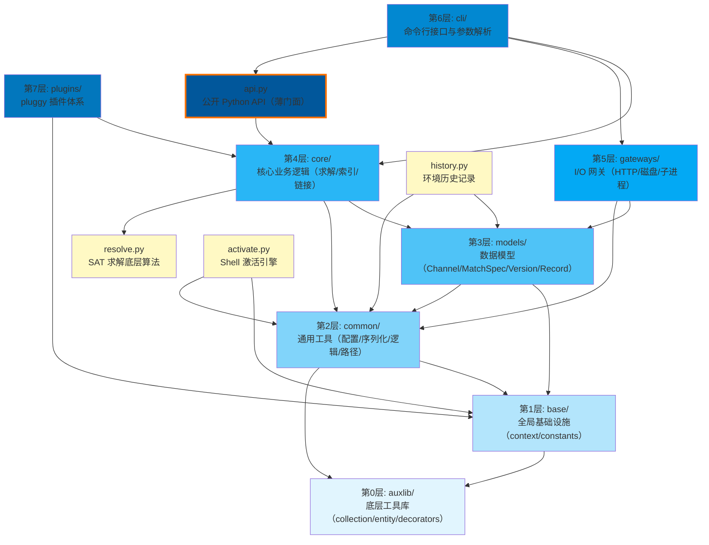

# 七层架构总览

conda 采用**严格分层架构**，依赖方向自底向上，上层可以依赖下层，下层不可反向依赖上层。整个代码库从底层基础设施到顶层用户交互共分为七层，此外在包根目录还有若干跨层支撑模块。

## 分层依赖关系图

> 注：黄色方块为包根目录的跨层模块，不属于严格分层但有明确的依赖位置。

## 各层职责详解

### 第0层：auxlib/ — 底层工具库

`auxlib/` 是 conda 内嵌的微型工具库，提供最基础的编程抽象，不依赖 conda 中任何其他模块：

- `auxlib/collection.py`：增强集合类型（如 `frozendict` 回退实现）
- `auxlib/entity.py`：Entity 字段系统，为 `models/records.py` 提供 `StringField`、`IntegerField`、`BooleanField` 等字段类型 [F-040]
- `auxlib/decorators.py`：装饰器工具，包括 `memoizedproperty` 缓存属性 [F-023]
- `auxlib/compat.py`：跨版本兼容工具（如 `Utf8NamedTemporaryFile`）
- `auxlib/ish.py`：字符串工具（`dals` 即 dedent-and-left-strip）
- `auxlib/exceptions.py`、`auxlib/logz.py`、`auxlib/type_coercion.py`：异常、日志、类型转换辅助

### 第1层：base/ — 全局基础设施

`base/` 是整个 conda 的"配置总线"层，提供全局单例和常量，几乎所有模块都会依赖它：

- **`base/context.py`**：定义全局单例 `context`，聚合所有配置文件（`~/.condarc`、系统级 `.condarc`）、环境变量和命令行参数 [F-022][F-024]。使用 `frozendict` 保证配置不可变性，通过 `cached_property`/`memoizedproperty` 实现缓存 [F-023]
- **`base/constants.py`**：定义核心常量和枚举：`APP_NAME = "conda"`、`DEFAULT_CHANNELS`、`REPODATA_FN = "repodata.json"`、`ROOT_ENV_NAME = "base"`、`KNOWN_SUBDIRS`，以及 `ChannelPriority`、`DepsModifier`、`UpdateModifier`、`SatSolverChoice` 等关键枚举 [F-028][F-029]
- 平台映射 `_platform_map` 统一操作系统标识 [F-025]

### 第2层：common/ — 通用工具

`common/` 提供不涉及业务逻辑的通用工具模块，依赖 `base/` 和 `auxlib/`：

- **`common/configuration.py`**：通用配置框架，提供 `Configuration` 类、`ParameterLoader`、`PrimitiveParameter`、`SequenceParameter`、`MapParameter`、`YamlRawParameter` 等参数类型 [F-026]，以及 `ConfigurationError`/`ValidationError` 等配置错误类 [F-027]
- **`common/logic.py`**：SAT 子句管理的 `Clauses` 类，封装 `add_clause()`、`Require()`、`Prevent()`、`And()`、`Or()`、`Not()`、`sat()` 等核心方法 [F-060]，通过 Tseitin 转换避免逻辑表达式指数膨胀 [F-061]。底层调用 C 扩展 `._logic` 模块 [F-062]
- **`common/serialize/`**：JSON 和 YAML 序列化封装
- **`common/path/`**：跨平台路径处理
- **`common/url.py`**：URL 解析和操作工具
- **`common/toposort.py`**：拓扑排序（用于包依赖排序）[F-063]
- **`common/io.py`**、`common/compat.py`、`common/iterators.py`、`common/constants.py`、`common/signals.py`：I/O、兼容性、迭代器、常量、信号处理

### 第3层：models/ — 纯数据模型

`models/` 定义 conda 所有核心数据结构，**不包含业务逻辑**，仅依赖 `base/` 和 `common/`：

- **`models/channel.py`**：`Channel` 类，将 URL 分解为 scheme、auth、location、token、name、platform、package_filename 七个组件 [F-030][F-032]。`Channel.__new__()` 实现缓存模式——相同字符串输入返回同一实例（`@cache` 装饰的 `from_value()` 方法）[F-031][F-033]
- **`models/match_spec.py`**：`MatchSpec` 类——conda 的包查询语言，支持 `name[version='>=3.6',build=py37_0]` 方括号语法 [F-034]，使用7组正则表达式解析 V3 语法和旧版语法 [F-035]
- **`models/version.py`**：`VersionOrder` 类实现版本字符串解析和比较 [F-036]，解析规则包括 epoch 分割（`!`）、local version 分割（`+`）、组件分割（`.`/`_`）等 [F-037]；`VersionSpec` 实现版本约束匹配 [F-038]
- **`models/records.py`**：三级记录继承链——`PackageRecord`（通道中的包）→ `PackageCacheRecord`（已下载缓存的包）→ `PrefixRecord`（已安装到环境的包）[F-039]，使用 `auxlib.entity` 的 Entity 字段系统 [F-040]；`Link` 实体定义链接类型（hardlink/softlink/copy）[F-041]
- **`models/enums.py`**：枚举定义——`LinkType`、`NoarchType`（python/generic）、`PackageType`、`Platform` 等 [F-042]
- **`models/prefix_graph.py`**：`PrefixGraph` 已安装包的依赖图拓扑排序 [F-043]

### 第4层：core/ — 核心业务逻辑

`core/` 是 conda 的"大脑"，实现所有核心业务流程，依赖 `models/` 和 `common/`：

- **`core/solve.py`**：`BaseSolver` 类，三个公开方法——`solve_final_state()`、`solve_for_diff()`、`solve_for_transaction()` [F-044]，接收 prefix、channels、subdirs、specs_to_add、specs_to_remove 等参数 [F-045]，负责协调整个求解流程
- **`core/index.py`**：`Index`（UserDict）聚合四类包信息源——远端通道（Channels）、已安装包（Prefix）、本地缓存（Package Cache）、虚拟包（Virtual Packages）[F-050]
- **`core/link.py`**：`UnlinkLinkTransaction` 和 `PrefixSetup` 实现包安装/卸载的事务机制 [F-051]；`determine_link_type()` 按 hardlink→softlink→copy 顺序选择链接方式 [F-052]；使用 `path_actions` 模块中的 Action 类执行具体文件操作 [F-053]
- **`core/subdir_data.py`**：`SubdirData` 类（元类缓存模式）管理单个 subdir 的 `repodata.json` [F-046]，缓存 key 为 `(channel.url, repodata_fn)`，file:// URL 通过 mtime 判断缓存有效性 [F-047]；pickle 缓存版本为 30 [F-048]；`PackageRecordList` 实现懒加载（dict 延迟转换为 PackageRecord）[F-049]
- **`core/package_cache_data.py`**：包缓存管理（pkgs_dirs），提供 `query()`、`first_writable()` 等方法 [F-054]
- **`core/prefix_data.py`**：环境前缀管理，读取 `conda-meta/` 目录下的 JSON 文件 [F-055]
- **`core/envs_manager.py`**：已知环境列表的注册/注销 [F-056]

### 第5层：gateways/ — I/O 网关

`gateways/` 是 conda 与外部世界交互的边界层，隔离所有 I/O 操作：

- **`gateways/connection/session.py`**：`CondaSession` 配置五种协议适配器——HTTPAdapter（http/https）、FTPAdapter（ftp）、LocalFSAdapter（file）、S3Adapter（s3）[F-074]；定义 `FORBIDDEN_HEADERS` 集合，禁止插件设置20个 HTTP 禁止头（Cookie、Host、Content-Length 等）[F-075]
- **`gateways/connection/download.py`**：并行下载实现 [F-077]
- **`gateways/repodata/`**：repodata 缓存管理，包括 `CACHE_STATE_SUFFIX`、`RepodataFetch`、`RepodataState`、`cache_fn_url` 等 [F-077]
- **`gateways/disk/`**：磁盘操作模块——create、delete、read、update、link、lock、permissions、test [F-076]
- **`gateways/subprocess.py`**：子进程调用封装 [F-078]
- **`gateways/logging.py`**：日志初始化（被 `cli/main.py` 的 `init_loggers()` 调用）[F-021]

### 第6层：cli/ — 命令行接口

`cli/` 是用户直接交互的入口层，负责命令行解析和命令分发：

- **`cli/main.py`**：三个入口函数 [F-015]：
  - `main()`：顶层入口，根据 `args[0]` 是否以 `"shell."` 开头分流到 `main_sourced` 或 `main_subshell`；`-V`/`--version` 有快速路径直接输出版本号 [F-016]
  - `main_subshell()`：普通子命令入口（install/create/list等），执行流程为：generate_pre_parser → parse_known_args → context 初始化 → 插件加载 → generate_parser → parse_args → 日志初始化 → do_call() [F-017]
  - `main_sourced()`：Shell 激活命令入口（activate/deactivate），调用 `activate._build_activator_cls(shell)` 获取激活器，输出 shell 脚本文本 [F-018]
- **`cli/conda_argparse.py`**：定义24个内置命令（activate、clean、create、install、list、remove、search、update 等）[F-019]，为每个命令导入对应的 `configure_parser` 函数 [F-020]
- **`cli/main_*.py`**：各命令的具体实现（main_create.py、main_install.py、main_list.py 等）

### 第7层：plugins/ — 插件体系

`plugins/` 基于 pluggy 框架实现可扩展架构，与 `cli/` 平行位于最上层：

- **`plugins/manager.py`**：`CondaPluginManager` 继承 `pluggy.PluginManager`，使用 `importlib.metadata.distributions()` 自动发现已安装插件 [F-068]
- **`plugins/hookspec.py`**：定义19种钩子类型（hookspec）——`conda_solvers`、`conda_subcommands`、`conda_virtual_packages`、`conda_reporter_backends`、`conda_auth_handlers`、`conda_post_commands`、`conda_pre_commands`、`conda_settings`、`conda_health_checks`、`conda_error_hints`、`conda_post_solves`、`conda_pre_solves`、`conda_package_extractors`、`conda_prefix_data_loaders`、`conda_environment_specifiers`、`conda_environment_exporters`、`conda_pre_transaction_actions`、`conda_post_transaction_actions`、`conda_exception_observers`、`conda_request_headers` [F-070]
- **内置插件实现**：`plugins/solvers/`（classic 求解器）、`plugins/subcommands/`（doctor/plugins/config 子命令）、`plugins/virtual_packages/`（archspec/CUDA/Linux/OSX/Windows/FreeBSD 虚拟包检测）、`plugins/reporter_backends/`（console/json 报告后端）、`plugins/environment_exporters/`、`plugins/environment_specifiers/`、`plugins/package_extractors/`、`plugins/prefix_data_loaders/`、`plugins/post_solves/` [F-071]
- **`plugins/config.py`**：`PluginConfig` 管理插件配置 [F-072]
- **`plugins/previews.py`**：预览功能（feature flags）管理 [F-073]

## 包根目录跨层模块

包根目录下有若干不属于严格七层但在架构中起重要作用的模块：

| 模块 | 位置 | 职责 |
|------|------|------|
| `resolve.py` | 包根 | SAT 求解器底层实现（`Resolve` 类），管理子句和包的 SAT 变量映射 [F-057]，支持 PycoSat/PyCryptoSat/PySat 三种后端 [F-058]。位于包根而非 core/ 是历史原因 |
| `activate.py` | 包根 | Shell 激活引擎，`_Activator` 抽象基类处理环境变量设置、activate.d/deactivate.d 脚本执行、PATH 和提示符更新 [F-079]；定义 activate/deactivate/hook/commands/reactivate 五个内置 shell 命令 [F-080] |
| `api.py` | 包根 | **薄门面**（thin facade），将 core 层内部类包装为公开 API：`Solver`、`SubdirData`、`PackageCacheData`、`PrefixData`，采用 `_internal` 委托模式，实际工作全部委托给内部实现 [F-064][F-067] |
| `history.py` | 包根 | 环境历史记录管理，追踪环境中包的变更历史 |
| `exceptions.py` | 包根 | 异常类定义（`CondaError` 在 `__init__.py` 中定义 [F-005]，子类在 exceptions.py 中） |
| `__init__.py` | 包根 | 包元数据（`__version__`、`__license__` 等）[F-001][F-002]、`CondaError`/`CondaMultiError`/`CondaExitZero` 基类定义 [F-005][F-007][F-008]、信号处理器 [F-009] |
| `__main__.py` | 包根 | `python -m conda` 入口，导入 `from .cli import main` 并 `sys.exit(main())` [F-010] |

## 单向依赖规则与启动性能

conda 的分层架构有明确的**单向依赖规则**：上层模块可以 import 下层模块，下层模块绝对不能 import 上层模块。这一规则通过代码审查和工具（ruff 的 `flake8-tidy-imports`）强制执行。在 `pyproject.toml` 中，`banned-module-level-imports = ["requests"]` 禁止在启动路径上导入 `requests` 这样的重型库 [F-013]，确保 CLI 启动速度。gateways 层是唯一允许直接 import `requests` 的层次，其他层如需网络访问必须通过 gateways。

缓存设计同样贯穿各层：Channel 使用 `@cache` 缓存字符串解析 [F-033]、SubdirData 使用元类缓存 repodata [F-046]、`_get_sat_solver_cls()` 使用 `@cache` 缓存求解器后端选择 [F-059]、`context` 使用 `cached_property` 缓存配置属性 [F-023]。

## 启动流程概览

用户执行 `conda install numpy` 时的调用链如下：

1. **入口**：`pyproject.toml` 声明 CLI 入口点 `conda = "conda.cli.main_pip:main"` [F-012]
2. **分流**：`cli/main.py:main()` 判断不是 `shell.` 前缀，进入 `main_subshell()` [F-016]
3. **初始化**：预解析参数 → `context.__init__()` 加载配置 → 加载插件 → 完整解析 → 初始化日志 [F-017]
4. **执行**：`do_call()` 路由到 `cli/main_install.py` 的执行函数
5. **求解**：`core/solve.py:BaseSolver` 调用 `resolve.py:Resolve` 执行 SAT 求解
6. **事务**：求解结果通过 `core/link.py:UnlinkLinkTransaction` 执行包链接/卸载操作
7. **I/O**：下载通过 `gateways/connection/`，磁盘操作通过 `gateways/disk/`，repodata 通过 `gateways/repodata/`

## 相关概念

- [conda 简介](00-introduction.md)
- [5分钟快速上手](01-getting-started.md)
