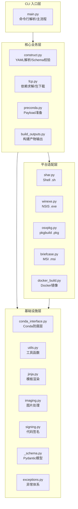
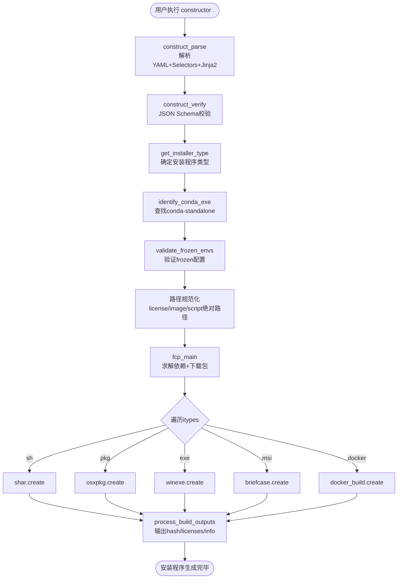

# 架构总览

constructor 采用**配置驱动+平台适配器**的分层架构。核心思想是：解析配置 → 求解下载 → 分发到平台模块生成安装程序。

## 模块分层

constructor 源码位于 `constructor/` 目录，可分为四层：



### 模块职责表

| 模块 | 职责 | 关键 API |
|------|------|---------|
| `main.py` | CLI 入口、参数解析、流程编排 | `main()`, `main_build()`, `get_installer_type()` |
| `construct.py` | YAML 文件解析、Selector 处理、Schema 校验 | `parse()`, `render()`, `verify()` |
| `fcp.py` | conda 包求解、下载、去重、大小估算 | `main()`, `_solve_precs()`, `_fetch_precs()`, `check_duplicates_files()` |
| `preconda.py` | 准备安装程序 payload 文件（urls/repodata/conda-meta等） | `write_files()`, `write_conda_meta()`, `copy_extra_files()`, `add_condarc()` |
| `build_outputs.py` | 生成额外构建产物（hash/licenses/info.json等） | `process_build_outputs()`, `write_hash_files()`, `get_repodata_record()` |
| `shar.py` | 创建 Linux/macOS .sh 自解压安装程序 | `create(info, verbose)` |
| `winexe.py` | 创建 Windows NSIS .exe GUI 安装程序 | `create(info, verbose)` |
| `osxpkg.py` | 创建 macOS .pkg GUI 安装程序 | `create(info, verbose)` |
| `briefcase.py` | 创建 Windows MSI 安装程序（实验性） | `create(info, verbose)` |
| `docker_build.py` | 创建 Docker 镜像和 Dockerfile | `create(info, verbose)` |
| `conda_interface.py` | 统一 conda 导入入口（防腐层） | `conda_context`, `Solver`, `ProgressiveFetchExtract` 等 |
| `utils.py` | 工具函数集合（conda_exe识别、yaml处理、版本检测等） | `identify_conda_exe()`, `check_version()`, `yaml` 实例 |
| `jinja.py` | Jinja2 模板渲染封装 | `render_template()`, `render_jinja_for_input_file()`, `FilteredLoader` |
| `imaging.py` | Windows/macOS 安装程序图片处理 | `mknsis()`, `mkosx()`, `img_round_edges()` |
| `signing.py` | 代码签名工具（Windows/macOS） | `SigningTool`, `WindowsSignTool`, `AzureSignTool` |
| `_schema.py` | Pydantic v2 模型，生成 JSON Schema | `ConstructorConfiguration`, `InstallerTypes` 等 |
| `exceptions.py` | 自定义异常体系 | `YamlParsingError`, `UnableToParse`, `InvalidInstallerTypeError` |

## 核心构建流程

`main_build()` 是整个构建流程的编排函数，数据流如下：



### info 字典：贯穿全局的数据载体

整个构建流程通过一个 Python 字典 `info` 在各模块间传递数据。初始从 construct.yaml 解析而来，在流程中逐步被各模块写入新的键值：

| 阶段 | 写入的键 | 模块 |
|------|---------|------|
| 解析阶段 | `name`, `version`, `channels`, `specs`, ...（所有YAML字段） | `construct.py` |
| CLI阶段 | `_platform`, `_installer_type`, `_outpath`, `_download_dir`, ... | `main.py` |
| 查找conda | `_conda_exe`, `_conda_exe_type`（CONDA/MAMBA） | `utils.py` |
| FCP阶段 | `_urls`, `_dists`, `_records`, `_all_pkg_records`, `_approx_pkgs_size`, `_max_relative_path_length`, `_extra_envs_info`, `_has_conda` | `fcp.py` |
| Payload阶段 | `_conda_meta`, `_repodir_content`, `_extra_files` | `preconda.py` |
| 平台模块 | 各平台特定键（如 `_nsis_dir`、`_pkgbuild_dir`） | `shar.py`/`winexe.py`等 |

## 设计模式

### 1. 策略模式（平台适配器）

每个平台安装器模块实现统一的 `create(info, verbose=False)` 接口。`main_build()` 根据 `installer_type` 延迟导入对应模块并调用 `create()`：

```python
# main.py 中的分发逻辑（伪代码）
installer_type_to_create = {
    "sh":  (shar_create,  (info, verbose), {}) if has_shar  else None,
    "pkg": (osxpkg_create, (info, verbose), {}) if has_pkg   else None,
    "exe": (winexe_create, (info, verbose), {}) if has_exe   else None,
    "msi": (briefcase_create, (info, verbose), {}) if has_msi else None,
}
for itype in itypes:
    func, args, kwargs = installer_type_to_create[itype]
    func(*args, **kwargs)
```

新增一种安装程序类型只需：(1) 创建 `xxx.py` 模块，(2) 实现 `create(info, verbose)`，(3) 在 `main.py` 中注册。

### 2. 防腐层（Anti-Corruption Layer）

`conda_interface.py` 是 constructor 与 conda 之间的防腐层。所有模块都**只能**从 `conda_interface` 导入 conda 的类和函数，不允许直接 `from conda.cli.python_api import ...`：

```python
# ✅ 正确
from .conda_interface import Solver, ProgressiveFetchExtract

# ❌ 禁止
from conda.core.solve import Solver
from conda.gateways.disk.create import ProgressiveFetchExtract
```

这使得当 conda 内部 API 变化时，只需修改 `conda_interface.py` 一个文件。

### 3. 模板方法（Template + Jinja2）

constructor 大量使用 Jinja2 模板来生成 shell 脚本、NSIS 脚本和 pkgbuild 文件。模板接收 `info` 字典作为变量上下文，将 Python 逻辑与脚本内容分离：

```
constructor/header.sh          → Shell 安装脚本头部模板
constructor/nsis/main.nsi.tmpl → NSIS 安装脚本模板
constructor/osxpkg/            → macOS pkgbuild 相关模板
```

### 4. 两阶段管线（Two-Phase Pipeline）

FCP 模块采用"求解→下载→校验"的两阶段管线设计：
- **求解阶段**：`_solve_precs()` 使用 conda 的 Solver API 计算完整依赖树（不下载任何文件）
- **下载阶段**：`_fetch_precs()` 使用 `ProgressiveFetchExtract` 并行下载求解结果
- **校验阶段**：`check_duplicates_files()` 跨包检测重复文件、大小写冲突、路径长度

这种分离使得 `--dry-run` 模式可以在不下载任何包的情况下验证配置正确性。

## 目录结构

```
constructor/
├── __init__.py             # 版本号 __version__
├── __main__.py             # python -m constructor 入口
├── main.py                 # CLI入口 + 主流程编排
├── construct.py            # YAML解析 + Selector处理 + Schema校验
├── _schema.py              # Pydantic v2 模型定义
├── fcp.py                  # FCP: 依赖求解+包下载+去重+大小估算
├── preconda.py             # Payload文件准备(urls/repodata/conda-meta)
├── build_outputs.py        # 额外构建产物(hash/licenses/info.json)
├── conda_interface.py      # conda导入防腐层
├── conda-standalone interface.py  # micromamba/conda-standalone兼容层
├── utils.py                # 工具函数(identify_conda_exe/yaml/版本检测)
├── jinja.py                # Jinja2模板渲染封装
├── imaging.py              # 图片处理(NSIS欢迎图/macOS背景图)
├── signing.py              # 代码签名(signtool/AzureSignTool/codesign)
├── exceptions.py           # 异常体系
├── shar.py                 # Shell .sh安装器
├── winexe.py               # Windows NSIS .exe安装器
├── osxpkg.py               # macOS .pkg安装器
├── briefcase.py            # Windows MSI安装器(实验性)
├── docker_build.py         # Docker镜像构建
├── header.sh               # Shell安装脚本Jinja2模板
├── nsis/                   # NSIS模板和辅助脚本
│   ├── main.nsi.tmpl
│   ├── Utils.nsh
│   ├── UAC.nsh
│   ├── _nsis.py
│   └── _system_path.py
├── osxpkg/                 # macOS pkgbuild模板
│   ├── postinstall
│   ├── preinstall
│   ├── Distribution
│   ├── Licenses.rtf
│   ├── Uninstall_commands
│   └── com.constructor.constructor.plist
└── data/                   # 默认数据(logo.schema.json/默认图片)
```

## 关键设计决策

1. **info 字典而非对象**：使用普通 dict 而非 dataclass/attrs 对象传递状态，便于 Jinja2 模板直接使用，也便于动态扩展字段。
2. **延迟导入**：平台模块（shar/winexe/osxpkg/briefcase/docker_build）在 `main_build()` 内按需导入，避免在不相关平台加载不必要的依赖。
3. **内置 conda-standalone**：构建时将 conda-standalone（或 micromamba）二进制复制到安装程序中，实现目标机器零依赖安装。
4. **离线优先**：所有 repodata 在构建时写入 payload，安装时完全不需要网络连接。
5. **JSON Schema + Pydantic 双重校验**：`_schema.py` 用 Pydantic 定义模型并自动生成 JSON Schema，运行时通过 Draft202012Validator 校验用户配置。

## 下一步

- [03-construct.yaml 配置规范](./03-construct-yaml-schema.md)：深入了解所有配置字段
- [06-FCP依赖求解与包下载](./06-fcp-fetch-and-solve.md)：理解核心求解下载管线
- [09-平台安装器实现](./09-platform-installers.md)：各平台安装器的具体实现细节
