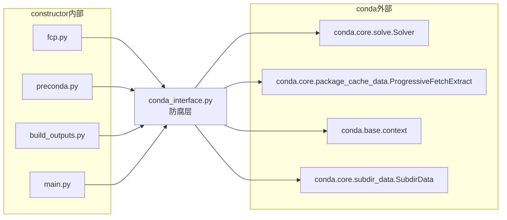

# conda_interface 防腐层

`conda_interface.py` 是 constructor 与 conda 之间的**防腐层（Anti-Corruption Layer）**。所有其他模块**只能**从这个模块导入 conda 的类和函数，不允许直接 `from conda.xxx import yyy`。

## 设计目的



当 conda 内部 API 发生变化时（如重命名、移动模块、更改签名），只需修改 `conda_interface.py` 这一个文件，其他模块不受影响。

## 导出的核心 API

### 供 fcp.py 使用

| 导出名称 | conda 源 | 用途 |
|---------|---------|------|
| `Solver` | `conda.base.context.context.plugin_manager.get_cached_solver_backend()` 或 `conda.core.solve.Solver` | 依赖求解器（优先使用插件solver如libmamba） |
| `ProgressiveFetchExtract` | `conda.core.package_cache_data.ProgressiveFetchExtract` | 并行下载+提取包 |
| `PackageCacheData` | `conda.core.package_cache_data.PackageCacheData` | 包缓存目录管理 |
| `PrefixGraph` | `conda.models.prefix_graph.PrefixGraph` | 包依赖图排序 |
| `read_paths_json` | `conda.gateways.disk.read.read_paths_json` | 读取包的 paths.json |
| `PackageCacheRecord` | `conda.models.records.PackageCacheRecord` 或 `conda.models.package_cache_record.PackageCacheRecord` | 缓存包记录 |
| `conda_context` | `conda.base.context.context` | conda 全局配置上下文 |
| `conda_replace_context_default` | `conda.base.context.replace_context_default` | 替换上下文默认值 |
| `env_vars` | `conda.common.io.env_vars` | 环境变量上下文管理器 |
| `download` | `conda.exports.download` | 单文件下载 |
| `all_channel_urls` | `conda.models.channel.all_channel_urls` | 解析所有通道 URL |
| `VersionOrder` | `conda.models.version.VersionOrder` | conda 版本比较 |

### 供 preconda.py 使用

| 导出名称 | conda 源 | 用途 |
|---------|---------|------|
| `Dist` | `conda.models.dist.Dist` | 分发标识 |
| `MatchSpec` | `conda.exports.MatchSpec` | 包规格解析 |
| `PrefixData` | `conda.core.prefix_data.PrefixData` | 前缀数据查询 |
| `default_prefix` | `conda.exports.default_prefix` | 默认环境路径 |
| `locate_prefix_by_name` | `conda.base.context.locate_prefix_by_name` | 根据环境名查找路径 |
| `get_repodata(url)` | 自定义封装 | 获取通道 repodata |
| `write_repodata(...)` | 自定义封装 | 写入精简后的 repodata 到缓存 |
| `write_cache_dir()` | 自定义封装 | 创建并返回缓存目录 |
| `distro` | `distro` 包（Linux） | Linux 发行版检测 |

### 常量

| 名称 | 值 | 说明 |
|------|---|------|
| `NAV_APPS` | `["glueviz", "jupyterlab", "notebook", "orange3", "qtconsole", "rstudio", "spyder", "vscode"]` | 导航器应用包名列表（repodata精简时保留其元数据） |
| `SUPPORTED_PLATFORMS` | `["linux-64", "linux-aarch64", "linux-ppc64le", "linux-s390x", "win-64", "win-arm64", "osx-64", "osx-arm64"]` | constructor 支持的目标平台 |

## 关键自定义函数

### get_repodata(url)

获取通道的 repodata.json，并处理几种边界情况：

```python
def get_repodata(url):
    subdir_data = SubdirData(Channel(url))
    raw_repodata_str, _ = subdir_data.repo_fetch.fetch_latest()

    # 空 repodata（noarch-only通道）填充最小有效结构
    if not raw_repodata_str or raw_repodata_str == r"{}":
        full_repodata = {
            "_url": url,
            "info": {"subdir": url.rstrip("/").split("/")[-1]},
            "packages": {}, "packages.conda": {}, "removed": [],
        }
    elif isinstance(raw_repodata_str, dict):
        full_repodata = raw_repodata_str  # conda 26.x+ 返回已解析的dict
    else:
        full_repodata = json.loads(raw_repodata_str)
    return full_repodata
```

### write_repodata(cache_dir, url, full_repodata, used_packages, info)

将完整的 repodata **精简**为只包含安装所需包的最小版本，写入安装程序的缓存目录。这是实现离线安装的关键：

```python
def write_repodata(cache_dir, url, full_repodata, used_packages, info):
    # 1. 复制元数据键（info等），但清空 packages/packages.conda/removed
    used_repodata = {k: v for k, v in full_repodata.items()
                     if k not in {"packages", "packages.conda", "removed"}}
    used_repodata["packages"] = {}
    used_repodata["packages.conda"] = {}
    used_repodata["removed"] = []

    # 2. 保留 NAV_APPS 的元数据（导航器需要）
    used_repodata["packages"] = {
        k: v for k, v in full_repodata["packages"].items() if v["name"] in NAV_APPS
    }

    # 3. 仅保留实际使用的包
    for package in used_packages:
        key = "packages.conda" if package.endswith(".conda") else "packages"
        if package in full_repodata.get(key, {}):
            used_repodata[key][package] = full_repodata[key][package]

    # 4. 如果包被转码（tar.bz2 ↔ .conda），修正元数据
    #    重新计算 size、sha256、md5
    ...
```

**为什么要精简 repodata？**
- 完整的 conda-forge repodata.json 有数十 MB
- 一个安装程序通常只包含几十个包
- 精简后 repodata 仅几十 KB，大幅减小安装程序体积
- 设置过期时间为 2019 年，强制 conda 在联网时立即更新（不依赖离线 repodata）

### write_cache_dir()

创建并返回 conda 缓存目录中的 `cache` 子目录：

```python
def write_cache_dir():
    cache_dir = join(PackageCacheData.first_writable().pkgs_dir, "cache")
    mkdir_p_sudo_safe(cache_dir)
    return cache_dir
```

这个目录用于存储精简后的 repodata 缓存文件。

## Solver 插件兼容性

Solver 导入有特殊的兼容性处理：

```python
try:
    from conda.base.context import context
    _Solver = context.plugin_manager.get_cached_solver_backend()
except (ImportError, AttributeError):
    from conda.core.solve import Solver as _Solver
```

优先使用 conda 插件系统注册的 solver backend（如 `libmamba-solver`），如果插件不可用则回退到经典 solver。这使得 constructor 可以通过设置 `CONDA_SOLVER` 环境变量来切换求解后端。

## PackageCacheRecord 兼容性

conda 不同版本对 `PackageCacheRecord` 的位置不同：

```python
try:
    from conda.models.records import PackageCacheRecord as _PackageCacheRecord
except ImportError:
    from conda.models.package_cache_record import PackageCacheRecord as _PackageCacheRecord
```

## Linux 发行版检测

```python
distro = None
if sys.platform.startswith("linux"):
    try:
        import distro
    except ImportError:
        pass
```

`distro` 包在 Linux 上可选导入，供 preconda.py 检测系统 glibc 版本等信息。

## 使用规则

constructor 所有模块必须遵循以下导入规则：

```python
# ✅ 正确：从 conda_interface 导入
from .conda_interface import Solver, ProgressiveFetchExtract, conda_context

# ❌ 禁止：直接从 conda 导入
from conda.core.solve import Solver
from conda.base.context import context
```

这个规则通过代码审查保障（CI检查），确保防腐层不被绕过。

## 下一步

- [06-FCP 依赖求解与包下载](./06-fcp-fetch-and-solve.md)：了解防腐层中的 Solver/Fetch API 如何在 FCP 中使用
- [08-Preconda Payload 准备](./08-preconda-payload.md)：了解 repodata 精简和缓存写入的用途
