# Crates 分层架构

Rattler 采用 Rust workspace 多 crate 架构，约 30 个 crate 按职责清晰分层。与 conda 的七层 Python 包结构不同，Rattler 将每个能力域拆分为独立 crate，使用者按需引入。

## 分层架构图

```mermaid
graph TB
    BIN["rattler-bin<br/>CLI 示例二进制"]
    RATTLER["rattler<br/>高层集成 crate（install/cli）"]
    PY["py-rattler<br/>Python 绑定（PyO3）"]
    JS["js-rattler<br/>WASM/JS 绑定"]

    subgraph 高层集成层
        RATTLER
    end

    subgraph 核心业务层
        SOLVE["rattler_solve<br/>依赖求解"]
        INSTALL["rattler/install<br/>包安装事务"]
        SHELL["rattler_shell<br/>环境激活"]
        VP["rattler_virtual_packages<br/>虚拟包检测"]
        GATEWAY["rattler_repodata_gateway<br/>Repodata 网关"]
        LOCK["rattler_lock<br/>锁文件"]
        UPLOAD["rattler_upload<br/>包上传"]
        IDX["rattler_index<br/>通道索引"]
    end

    subgraph 网络与IO层
        NET["rattler_networking<br/>网络中间件"]
        STREAM["rattler_package_streaming<br/>包流式处理"]
        CACHE["rattler_cache<br/>包缓存"]
        GIT["rattler_git<br/>Git 源处理"]
        S3["rattler_s3<br/>S3 支持"]
    end

    subgraph 基础类型层
        TYPES["rattler_conda_types<br/>核心数据模型"]
        DIGEST["rattler_digest<br/>哈希算法"]
        REDACT["rattler_redaction<br/>敏感信息脱敏"]
        CONFIG["rattler_config<br/>配置解析"]
        MACROS["rattler_macros<br/>过程宏"]
        TOOL["工具crates<br/>coalesced_map/file_url/path_resolver/simple_spawn_blocking"]
    end

    subgraph 系统层
        LIBSOLV["rattler_libsolv_c<br/>libsolv C FFI"]
        MENU["rattler_menuinst<br/>菜单/快捷方式"]
        PTY["rattler_pty<br/>伪终端"]
        SANDBOX["rattler_sandbox<br/>沙箱执行"]
        PREFIX_GUARD["rattler_prefix_guard<br/>前缀守卫"]
    end

    BIN --> RATTLER
    RATTLER --> SOLVE
    RATTLER --> STREAM
    RATTLER --> SHELL
    RATTLER --> VP
    RATTLER --> GATEWAY
    RATTLER --> CACHE
    RATTLER --> NET
    RATTLER --> TYPES
    RATTLER --> LOCK

    PY --> RATTLER
    PY --> TYPES
    PY --> SOLVE
    PY --> GATEWAY
    JS --> TYPES

    SOLVE --> TYPES
    SOLVE --> LIBSOLV
    SOLVE --> RESOLVO["resolvo<br/>(Rust 原生求解器，外部依赖)"]
    GATEWAY --> TYPES
    GATEWAY --> NET
    GATEWAY --> CACHE
    STREAM --> TYPES
    STREAM --> DIGEST
    STREAM --> NET
    SHELL --> TYPES
    VP --> TYPES
    LOCK --> TYPES
    NET --> REDACT
    CACHE --> DIGEST
    CACHE --> TYPES
    TYPES --> DIGEST
    TYPES --> CONFIG

    style TYPES fill:#e3f2fd
    style DIGEST fill:#e3f2fd
    style REDACT fill:#e3f2fd
    style CONFIG fill:#e3f2fd
    style MACROS fill:#e3f2fd
    style SOLVE fill:#fff3e0
    style GATEWAY fill:#fff3e0
    style STREAM fill:#fff3e0
    style SHELL fill:#fff3e0
    style VP fill:#fff3e0
    style NET fill:#f3e5f5
    style CACHE fill:#f3e5f5
    style RATTLER fill:#e8f5e9
    style BIN fill:#fce4ec
    style PY fill:#fce4ec
    style JS fill:#fce4ec
```

## 各层职责详解

### 基础类型层

基础类型层提供 conda 生态的纯数据模型和通用工具，**不包含业务逻辑**，不涉及网络或文件系统 I/O：

- **rattler_conda_types**：整个 Rattler 生态的基石，定义了所有核心数据结构——`Version`、`Platform`、`MatchSpec`、`NamelessMatchSpec`、`Channel`、`ChannelConfig`、`PackageRecord`、`RepoData`、`RepoDataRecord`、`PrefixRecord`、`GenericVirtualPackage`、`VersionSpec`、`BuildNumberSpec`、`PackageName`、`NormalizedPackageName`、`NoArchType`、`RunExportKind`、`EnvironmentYaml` 等 [F-006]。每个类型都支持 serde 序列化/反序列化和 FromStr 解析。
- **rattler_digest**：封装 MD5 和 SHA256 哈希计算，提供 serde 集成（`SerializableHash`）和 tokio 异步文件哈希（`tokio` 模块）[F-014]。
- **rattler_redaction**：URL 中敏感信息（token、密码）的脱敏处理，用于日志输出安全 [F-015]。
- **rattler_config**：兼容 `.condarc` 的配置系统，支持代理配置、S3 配置、TLS 配置、并发配置、构建配置等 [F-016]。
- **rattler_macros**：提供 `#[sorted_enum]` 等派生宏，确保枚举变体按名称排序 [F-017]。
- **工具 crates**：`coalesced_map`（合并映射）、`file_url`（file:// URL 处理）、`path_resolver`（路径解析）、`simple_spawn_blocking`（tokio 阻塞任务封装，支持取消）。

### 网络与 I/O 层

网络层负责所有外部通信和文件操作，依赖基础类型层：

- **rattler_networking**：基于 `reqwest-middleware` 构建的 HTTP 客户端栈，提供：OAuth2 令牌刷新（`oauth_refresh.rs`）、S3 中间件（签名请求）、GCS 中间件、OCI 中间件、重试策略（`retry_policies.rs`）、代理支持、`LazyClient` 懒加载客户端 [F-011]。
- **rattler_package_streaming**：处理 conda 包归档格式（.conda 新格式和 .tar.bz2 旧格式）的读写。提供：同步读取（`read.rs`/`seek.rs`/`fs.rs`）、异步 tokio 读取（`tokio/fs.rs`）、异步 HTTP 下载（`reqwest` 模块，支持 range 请求）、写入创建包（`write.rs`）、解压（`fs.rs`），以及 `ExtractError` 错误类型和 `DownloadReporter` 进度报告 trait [F-007]。
- **rattler_cache**：包缓存管理，定义缓存目录结构、包校验逻辑（`validation.rs`）和 `default_cache_dir()` 获取系统默认缓存路径 [F-018]。
- **rattler_git**：处理 git 源的包，包括 SHA 计算、LFS 支持、凭证管理 [F-019]。

### 核心业务层

核心业务层实现 conda 包管理的核心流程：

- **rattler_solve**：定义了求解器抽象 `SolverImpl` trait 和输入/输出类型 `SolverTask`/`SolverResult`。支持两种后端：`libsolv_c`（通过 FFI 调用 libsolv C 库，高性能）和 `resolvo`（Rust 原生求解器，支持取消令牌 `CancellationToken`）。还定义了 `ChannelPriority`（Strict/Disabled/Flexible）、`SolveStrategy`（Highest/LowestVersion/LowestVersionDirect）、`ExcludeNewer`（最小发布年龄安全策略）等求解配置 [F-005]。
- **rattler_repodata_gateway**：repodata.json 的获取和缓存层。基础 API 是 `fetch::fetch_repo_data()` 函数，高级 API 是 `Gateway`/`GatewayBuilder`，支持：多 channel 并发获取、缓存管理（`CacheClearMode`）、分片 repodata（sharded repodata，v3 格式）、子目录选择（`SubdirSelection`）、通道关系管理、进度报告（`Reporter`/`IndicatifReporter`）、run_exports 提取 [F-008]。
- **rattler_shell**：环境激活和命令执行。`activation` 模块生成不同 shell 的激活脚本（设置 PATH、环境变量、CONDA_PREFIX 等）；`shell` 模块包含各 shell 的抽象（Bash/Zsh/Fish/CmdExe/PowerShell/Xonsh等）；`run` 模块提供 `run_in_environment()` 和 `run_command_in_environment()` 在指定环境中执行命令 [F-009]。
- **rattler_virtual_packages**：检测宿主系统的虚拟包，包括：Linux 版本（`__linux`）、macOS 版本（`__osx`）、Windows 版本（`__win`）、iOS（`__ios`）、Android（`__android`）、glibc 版本（`__glibc`）、CUDA 版本（`__cuda`/`__cuda_arch`）、CPU 微架构（`__archspec`）。支持通过环境变量覆盖（`CONDA_OVERRIDE_CUDA` 等），支持交叉编译默认值，CUDA 检测支持磁盘缓存 [F-010]。
- **rattler_lock**：Conda 锁文件（conda-lock 格式）的解析和生成，支持 v3/v5/v6/v7 多个格式版本。锁文件包含 Conda 包和 PyPI 包记录、channel 信息、平台信息、源信息。提供 `LockFile::builder()` API 和多种反序列化格式 [F-012]。
- **rattler_index**：从本地包创建 conda 通道索引（生成 repodata.json），可用于创建本地私有通道。
- **rattler_upload**：上传包到 Anaconda.org、Cloudsmith、conda-forge、S3、OCI registry，支持 OCI attestation（供应链安全）。

### 系统集成层

- **rattler_libsolv_c**：libsolv C 库的 Rust FFI 绑定，`build.rs` 负责编译和链接 C 代码 [F-020]。
- **rattler_menuinst**：跨平台菜单/快捷方式安装（Windows 注册表、macOS .app、Linux .desktop 文件），支持 menuinst v1/v2 schema。
- **rattler_pty**：Unix 伪终端支持，用于在激活环境中运行交互式命令。
- **rattler_sandbox**：沙箱执行环境（用于包安装脚本等不可信代码的隔离执行）。
- **rattler_prefix_guard**：环境前缀的并发访问守卫，防止多个进程同时修改同一环境。

### 高层集成层

- **rattler** crate：整合上述所有 crate，提供"从零创建完整环境"的一站式 API。主要模块：
  - `install` 模块：安装事务的核心实现，包含 `Installer`（安装驱动）、`Transaction`（事务管理）、`link`（文件链接：hardlink/symlink/copy）、`unlink`（卸载删除）、`entry_point`（Python entry points 生成）、`python`（Python 环境配置）、`clobber_registry`（文件覆盖处理）、`apple_codesign`（macOS 签名）[F-013]
  - `cli` 模块（feature-gated）：CLI 工具的认证处理（含 OAuth 流程）
  - 重新导出 `rattler_cache` 的 `package_cache` 和 `validation` 模块

### 二进制和绑定层

- **rattler-bin**：示例 CLI 二进制，展示所有 crate 的组合使用。提供 `create`、`solve`、`run`、`install`、`list`、`search`、`shell-hook`、`auth`、`exec` 等子命令 [F-021]。
- **py-rattler/**：Python 绑定，使用 PyO3 构建，提供异步 API（基于 asyncio），包括 `solve()`、`install()`、`Gateway`、`VirtualPackage`、`Channel`、`MatchSpec`、`Version`、`Platform` 等类型。
- **js-rattler/**：JavaScript/WASM 绑定，使用 wasm-bindgen 构建，提供版本比较、平台检测、包名解析、求解能力，支持 ESM/CJS 双格式和浏览器使用。

## 依赖方向规则

Rattler 的 crate 遵循严格的**单向依赖规则**：

1. **基础类型层** 不依赖任何上层 crate
2. **网络/I/O 层** 只依赖基础类型层
3. **核心业务层** 依赖基础类型层和网络/I/O 层
4. **高层集成层** 依赖所有下层
5. **绑定层和二进制层** 依赖高层集成层

这一规则通过 Rust 的模块系统和 Cargo 依赖声明自然强制执行。每个 crate 的 `Cargo.toml` 只声明确实需要的依赖，避免不必要的耦合。

## 与 conda Python 包的架构对比

| 维度 | conda（Python） | Rattler（Rust） |
|------|----------------|-----------------|
| 组织方式 | 单包，内部分层目录 | Workspace 多 crate，每能力域独立 |
| 依赖管理 | Python import 系统（软性约束） | Cargo.toml 显式声明（编译期强制） |
| 用户引入方式 | `import conda`（全量） | `rattler_conda_types = "0.28"`（按需） |
| 异步支持 | 同步为主，部分线程池 | 原生 async/await（tokio） |
| 扩展机制 | pluggy 插件 hooks | Rust trait + feature flags |
| 绑定 | 仅 Python | Rust/Python/JS 三语言 |

## 相关概念

- [Rattler 简介](00-introduction.md)
- [5分钟快速上手](01-getting-started.md)
- [基础类型系统](03-conda-types-foundation.md)
